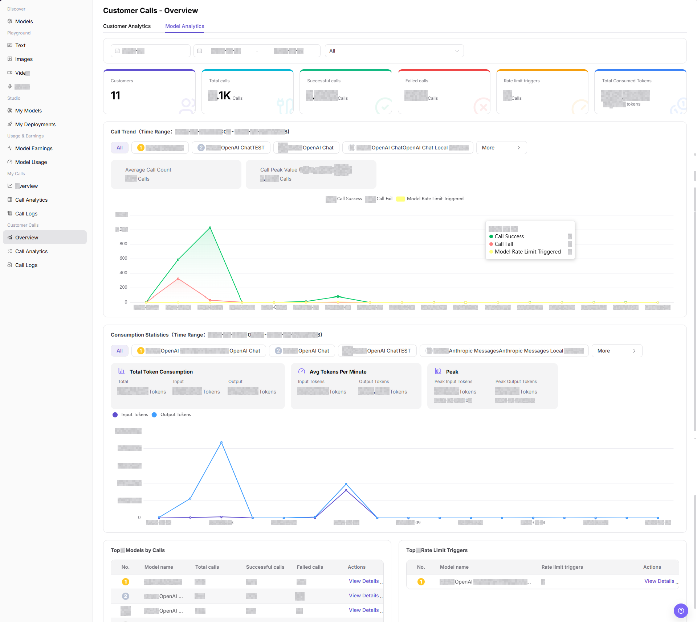
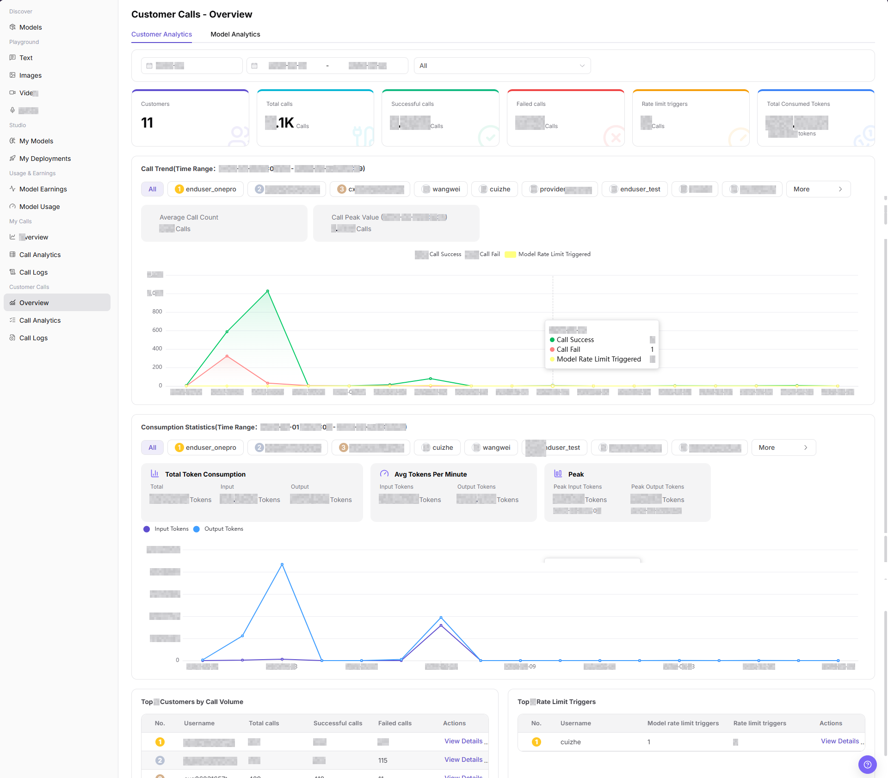
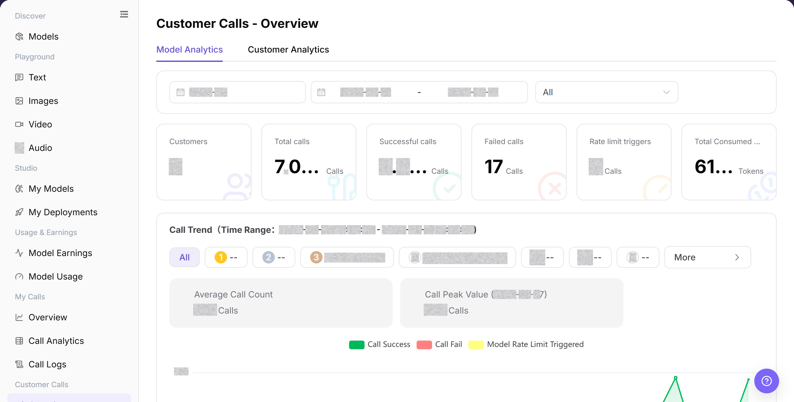
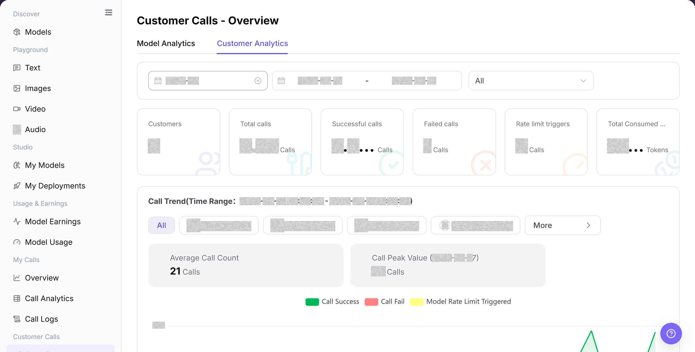

# Overview

## Feature Overview

| Item | Content |
| --- | --- |
| Applicable Roles | Model Provider |
| Navigation Path | Model Services > Customer Calls > Overview |
| Page Route | `/modelone/monitoring/monitor/overview/model` |
| Managed Objects | Model- and customer-dimension call indicators, trends, rankings, and details entry |

#### Beginner Explanation

Customer Calls Overview works like an operations dashboard for a Model Provider. Model Analytics answers which models are called, while Customer Analytics answers which customers are calling them. Use both views to assess impact.

#### Terminology

| Term | Description |
| --- | --- |
| Model Analytics | Aggregates customer calls, success, failure, and rate limits by model. |
| Customer Analytics | Aggregates called models and call indicators by customer. |
| Total Calls | Total customer calls in the selected scope. |
| Top Ranking | Models or customers ranked by call volume or another indicator. |

#### Recommended Operation Order

Review overall trends and abnormal models in Model Analytics, switch to Customer Analytics to identify affected customers, and then continue through details or logs.

#### Beginner Checklist

| Scenario | Do First | Do Not Do Directly |
| --- | --- | --- |
| Unsure which view to open | Start with Model Analytics | Conclude from one view only |
| Model failures increase | Use Customer Analytics to confirm impact | Change every model immediately |
| Customer data is empty | Expand the period and verify customer criteria | Conclude that the customer made no calls |
| Preparing to share the dashboard | Redact customer and business identifiers | Share raw data externally |

## Prerequisites

1. The current account has access to the `Overview` page.
2. The statistical month, date range, and dimension to view have been clarified.
3. The page shows only the customer names, model names, call volume, and cost-related fields that your account can access.

## Page Description

The page contains Model Analytics and Customer Analytics, with aggregate indicators, trends, consumption statistics, rankings, and details entries.

Page screenshots:

Use Model Analytics to review totals, success, failure, rate limits, and rankings.

Use Customer Analytics to review customer call trends and rankings.

## Main Operations

### View Model Call Overview

1. Go to `Model Services > Customer Calls > Overview`.
2. Click **"Model Analytics"** and select a time range and model criteria.
3. Verify total, successful, failed, and rate-limited calls, trends, and model rankings.
4. Open details for an abnormal model to continue investigation.

The image shows Model Analytics. Verify the time range, aggregate indicators, trends, and model list.

### View Customer Call Overview

1. Click **"Customer Analytics"**.
2. Select a time range and customer criteria.
3. Verify customer count, call trends, consumption statistics, and customer rankings.
4. Open details for an abnormal customer to continue investigation.

The image shows Customer Analytics. Verify customer scope, trends, and rankings.

## Parameter Reference

| Field Name | Required | Field Type | Example | Description |
| --- | --- | --- | --- | --- |
| Statistical Month | Yes | Month selector | `2026-07` | Controls the month of overview data. |
| Date Range | Yes | Date range | `2026-07-01 to 2026-07-17` | Controls the time range for trends, consumption statistics, and TOP rankings. |
| Analytics Tab | Yes | Tab | `Customer Analytics` / `Model Analytics` | Switches between customer aggregation and model aggregation. |
| Customer | No | Selector | `All` or target customer | Filters statistics by customer on Customer Analytics. |
| Model | No | Selector | `All` or target model | Filters statistics by model on Model Analytics. |
| Customers | System-generated | Number | `3` | Number of customers that generated calls in the selected range. |
| Total Calls | System-generated | Number | `42` | Total number of calls in the selected range. |
| Successful Calls | System-generated | Number | `40` | Number of successful calls in the selected range. |
| Failed Calls | System-generated | Number | `2` | Number of failed calls in the selected range. |
| Rate Limit Triggers | System-generated | Number | `1` | Number of calls that hit model rate limits in the selected range. |
| Token Usage | System-generated | Number | `1,280 Tokens` | Shows total consumed tokens, input tokens, output tokens, average tokens per minute, and peaks. |
| Actions | No | Action entry | `View Details` | Opens customer-level or model-level details. |

## Pitfalls

- Customer Calls Overview is for customer-level trends, not for locating a single failed request. Use call logs for single-request troubleshooting.
- Align time range, customer scope, model version, and aggregation granularity before comparing customer calls.
- Revenue, call count, and failure-rate data may have synchronization delay. Do not use overview numbers alone as final settlement evidence.

## Result Validation

| Check Item | Success Signal | If Abnormal |
| --- | --- | --- |
| Page is accessible | The `Customer Calls - Overview` page opens, and `Customer Calls > Overview` is highlighted in the sidebar. | Check account permissions, navigation path, and page loading status. |
| Customer analytics data displays | The `Customer Analytics` tab shows customers, call trend, consumption statistics, and Top 5 Customers by Call Volume. | Adjust the date range or customer filter and retry. |
| Model analytics data displays | The `Model Analytics` tab shows model-level trends, consumption statistics, and Top 5 Models by Calls. | Adjust the date range or model filter and retry. |
| Filter controls can be selected | After switching month, date range, customer, or model, charts and TOP tables change accordingly. | Check whether filters are too narrow, and switch back to `All` if needed. |
| Detail entry opens | Clicking `View Details` opens the corresponding customer or model details. | Confirm data permissions and whether the statistical object still exists. |
| Statistics are consistent | Call trends, consumption statistics, and TOP tables match the selected filters. | Refresh the page or expand the time range for cross-checking. |

## FAQ

#### Customer Calls Overview Shows No Data

**Symptom:**

Customer count, call totals, trend charts, and rankings all show an empty state.

**Possible Causes:**

- The selected time range contains no customer call.
- A customer, model, or other filter excludes the target record.

**Resolution:**

1. Click **"Reset"** to clear the filters.
2. Select a date range that contains a known customer call and search again.
3. Search **"Customer Calls > Call Logs"** with the same range. Contact the administrator if the log exists but Overview remains empty.

#### Model and Customer Totals Differ

**Symptom:**

Model Analytics and Customer Analytics show different totals.

**Possible Causes:**

- The tabs use different filters.
- One customer calls several models, or several customers call one model.

**Resolution:**

1. Use the same date range and filters on both tabs.
2. Review customer and model details separately. Do not compare row counts directly.
3. If the totals still differ, send the filters and a redacted screenshot to the administrator.

#### Customer Failure Count Increases

**Symptom:**

Failed customer calls increase in the target time range.

**Possible Causes:**

- One or more customers send invalid requests repeatedly.
- The target model or upstream service returns an error.

**Resolution:**

1. Open Customer Analytics and locate the affected customer.
2. Open **"Call Logs"** and review failed statuses and errors.
3. If the same error continues, contact the affected customer and Model Provider.

#### Customer Rate-Limit Count Increases

**Symptom:**

The rate-limit trigger count is greater than zero or continues to increase.

**Possible Causes:**

- Customer request frequency or concurrency exceeds the limit.
- Many requests occur in the same period.

**Resolution:**

1. Identify the customer and model that trigger the limit.
2. Use **"Call Logs"** to review the request times.
3. Reduce traffic and check again. Contact the administrator if rate limiting continues.

#### Customer or Model Details Does Not Open

**Symptom:**

Nothing opens after you click **"View Details"** for a customer or model.

**Possible Causes:**

- The current account lacks customer-call detail permission.
- The target record is outside the current filters.

**Resolution:**

1. Clear the filters and locate the row again.
2. Refresh the page and click **"View Details"** again.
3. If it still does not open, ask the administrator to verify Model Provider permissions and provide the page route.

## Notes

- Customer names, call volume, costs, model usage, and business identifiers are sensitive operational information.
- Before external communication or screenshots, redact customer names, Keys, request content, cost details, and internal test parameters.
- The overview page shows aggregated data. Use call logs when troubleshooting a single request.

## Next Steps

1. Go to `Customer Calls > Call Analytics` to view more detailed statistical distribution.
2. Go to `Customer Calls > Call Logs` to locate single failed requests.
3. Adjust operations follow-up strategy based on customer or model call trends.
