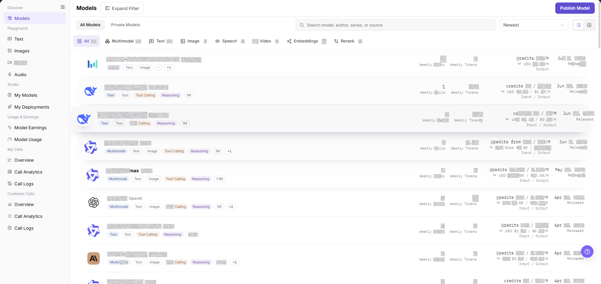
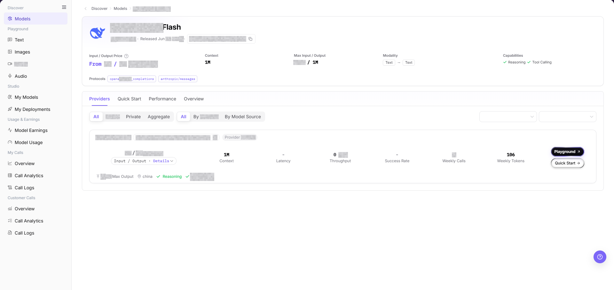
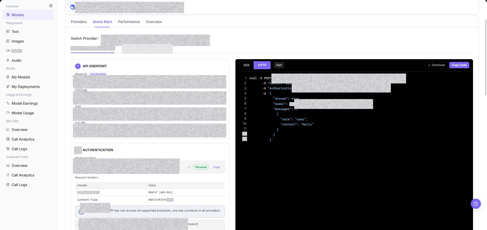
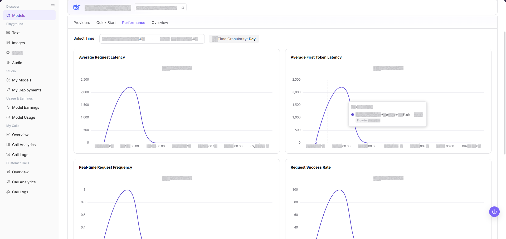
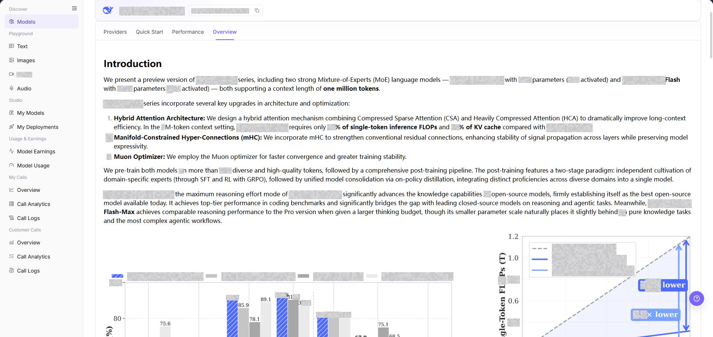

# Models

::: info Document Information
Version: v1.0
Updated: 2026-08-31
:::

## Feature Overview

| Item | Content |
| --- | --- |
| Applicable Roles | Model Provider, Model Consumer |
| Navigation Path | Model Services > Discover > Models |
| Page Route | `/modelone/store/model` |
| Managed Objects | Model listings, model details, provider instances, and quick-start information |

#### Beginner Explanation

Models works like a searchable model catalog. Find a model with the required input and output capabilities, review its provider, price, context, and status, and then decide whether to try it or integrate it from the quick-start information.

#### Terminology

| Term | Description |
| --- | --- |
| Model Author | The organization or brand associated with a model. |
| Model Source | The upstream service that provides a callable model instance. |
| Context Length | The total input and output capacity of one request. |
| Quick Start | The integration area that shows the URL, protocol, and authentication method. |
| Personal Key | A personal credential that a Model Consumer uses to call a model through the platform. |
| API Key | A general term for an API credential. Use a Personal Key for the examples on this page. A Model Provider can use a separate upstream API Key when publishing a model. |
| Request header | The fields sent with a request. A request header commonly carries authentication data. |
| Endpoint | The target URL that receives a request. It combines the Base URL and API path. |
| Model ID | The identifier that selects the target model instance for a call. |

#### First-Use Paths

| Role | First-Use Path | Completion Signal |
| --- | --- | --- |
| Model Consumer | Prepare a Personal Key → select a model and provider in **"Models"** → make one controlled call in **"Playground"** → find the request in **"My Calls"** → review consumption in **"Model Usage"** | The response area shows a response or error, Call Logs contains the request, and Model Usage contains the related record. |
| Model Provider | Create a model in **"My Models"** → publish it from **"My Deployments"** → review calls in **"Customer Calls"** → review revenue in **"Model Earnings"** | The model and deployment appear in their lists, and the customer-call and earnings pages show the related statistics. |

When a model has multiple providers, compare price, status, and context first. A model in the list is not proof of a successful call. Confirm the response, Call Logs record, and Model Usage record for the same request.

## Prerequisites

1. The current account can open **"Models"**.
2. The target model has been listed and is visible to the current account or customer.
3. Before calling, quota, pricing, context limits, and terms of use have been confirmed.

::: warning Call and Billing Risk
Trying a model, submitting a prompt, or calling an API creates call records and may consume credits or generate billing records. Before calling, verify the model, provider, price, quota, and usage scope.
:::

## Page Description

The page provides model search, capability filters, sorting, and listings. Open a model to use the `Providers`, `Quick Start`, `Performance`, and `Overview` tabs. Provider cards also provide `Try Now` and `Quick Start` entries.

Page screenshots:

Focus on the search field, capability filters, and model list. The active filters jointly determine the result set.

## Main Operations

### Query Models

1. Go to `Model Services > Discover > Models`.
2. Enter a model name, author, series, or source in the search field.
3. Narrow the results by input capability, output capability, context, billing, model author, model source, or scenario.
4. Verify the model name, capability labels, and status. Clear combined filters and query again if no result is returned.

The `Providers` tab shows provider instances, billing, context, latency, throughput, success rate, weekly usage, and the `Quick Start` entry. On the current details page, provider visibility uses the `All`, `Public`, `Private`, and `Aggregate` segmented control. Performance grouping uses `All`, `By Provider`, and `By Model Source`. Copy the provider-specific call identifier shown for the selected instance. Do not reuse an identifier from another provider.

### View Model Details

1. Open the target model from the list.
2. Verify the model name, author, type, input and output capabilities, context length, and billing method.
3. Confirm the model summary, capability labels, modalities, and protocol on the details page.
4. Based on the next task, open Providers, Quick Start, Performance, or Overview. Keep information from each tab in its own context.

The image shows the model details page. Verify the summary and capabilities before entering a provider card or tab.

### Compare Provider Instances

1. Select the **"Providers"** tab on the model details page.
2. Compare provider instance status, price, context, latency, throughput, and success rate.
3. Before trying or integrating the model, confirm the Model ID, protocol, and status on the target provider card.

Use the provider area to compare listed instances. Confirm the target card instead of selecting a provider by model name alone.

### Try a Model

1. Click **"Try Now"** on the target provider card.
2. The platform opens the Playground page for the model type, such as text chat, image generation, video generation, or speech generation.
3. In Playground, verify that the model and provider shown at the top match the selection on the details page.
4. Before trying the model, confirm the Personal Key, price, and quota. Submitting a prompt or generating content creates call records and consumes usage.

The provider card contains the Try Now entry. After it opens the corresponding Playground page, follow that page's configuration and submission instructions.

### View Quick Start

1. Select the **"Quick Start"** tab, or click **"Quick Start"** on the target provider card.
2. Confirm the selected provider and switch the code example between `SDK`, `HTTP`, and `Curl`.
3. Review the `Model ID`, `Base URL`, `Path`, `Full URL`, request headers, and authentication method.
4. Record integration information with placeholders such as `<BASE_URL>`, `<ENDPOINT_PATH>`, `<API_KEY>`, or `<PERSONAL_KEY>`. Do not store real credentials.

The Quick Start tab and provider-card entry are both visible from the details page. Keep addresses, keys, and request parameters redacted in documentation.

### View Performance

1. Select the **"Performance"** tab on the model details page.
2. Set the time range and data granularity to review.
3. Review average request latency, average first-token latency, real-time request frequency, and request success rate.
4. When comparing time ranges or providers, keep the filters consistent so that metrics use the same scope.

Use the Performance area to review request latency, first-token latency, request frequency, and success rate. If no data is shown, verify the time range, provider, and model.

### View Model Overview

1. Select the **"Overview"** tab on the model details page.
2. Review the model description, capability tags, input/output modalities, context, and usage boundaries.
3. Keep the overview consistent with the provider instance and the Model ID and protocol shown in Quick Start.

Use the Overview area to confirm the model description, capabilities, and usage boundaries before trying or integrating the model.

## Parameter Reference

| Field Name | Required | Field Type | Example | Description |
| --- | --- | --- | --- | --- |
| Model Name | Yes | Text | `Example Model` | Display name used to identify the model in the list and details page. |
| Provider | Yes | Text / Filter | `Example Provider` | Tenant or channel that provides the model instance. |
| Model Type | No | Filter / Tag | `Text` | Distinguishes multimodal, text, image, speech, video, embedding, reranking, and other model types. |
| View | No | Switch | `Table` / `Card` | Changes the presentation without changing model visibility. |
| Capability Tags | No | Tag | `Tool Calling` | Shows model capabilities such as tool calling or reasoning. |
| Input/Output Modalities | No | Tag | `Text / Image` | Shows supported input and output types. |
| Billing Method | No | Text | `Credits / 1M Tokens` | Shows the model billing unit for input, output, or per-request pricing. |
| Status | No | Tag | `Published` | Shows the status of the model or provider instance. |
| Actions | No | Button | `View`, `Try Now`, `Quick Start` | Used to open model details, enter Playground, or view integration information. |

## Pitfalls

- The same model may have multiple providers. Confirm the selected provider instance before calling.
- Copy the exact Model ID from the provider instance.
- Replace the API Key placeholder in each quick-start example with an authorized Personal Key.
- Trying a model or submitting a prompt creates call records and can consume credits or generate billing records. Before submission, verify the model, Personal Key, input, and expected usage.

## Result Validation

| Check Item | Success Signal | If Abnormal |
| --- | --- | --- |
| Model list is accessible | Model cards or list entries are displayed, and the filter area loads correctly. | Check account permissions, navigation path, and page loading status. |
| Filters can be selected | After changing model type, capability, provider, or scenario filters, list results update accordingly. | Clear filters and search again, or refresh the page. |
| Model details can be opened | Clicking `View` opens the details page with model introduction, providers, pricing, context, and modality information. | Return to the list and open the model again, or check whether the model is still visible to the current account. |
| Details match the list | Model name, author, status, and billing information in details are consistent with the list. | Use the details page as the source of truth and report synchronization issues if needed. |
| Try Now entry is visible | Clicking `Try Now` opens the Playground page for the corresponding modality, and the model and provider at the top match the details page. | Return to model details, select a listed provider, and verify model type and Playground permission. |
| Quick Start opens | The Quick Start tab or provider-card entry shows the protocol, Model ID, URL, and authentication method. | Verify provider instance status, then check call permission and visibility for the current account. |
| Performance data is visible | The Performance tab shows metrics for the selected time range and data granularity. | Adjust the time range and granularity, and verify that the selected provider has call data. |
| Overview tab opens | The Overview tab shows the model description, capabilities, modalities, and usage boundaries. | Refresh the model details page and ask the Model Provider to complete missing fields. |

## FAQ

#### Cannot Find the Target Model

**Symptom:**

The target model does not appear after a name or capability query.

**Possible Causes:**

- Combined filters are too narrow.
- The model is not visible to the current account.

**Resolution:**

1. Clear filters and query again.
2. Verify model visibility and provider status.

#### Model Details Are Incomplete

**Symptom:**

Capabilities, context, or billing information is missing.

**Possible Causes:**

- Model information is incomplete.
- Page data has not synchronized yet.

**Resolution:**

1. Refresh details and review the provider tab.
2. Do not integrate a model with missing usage boundaries.

#### No Provider Is Listed

**Symptom:**

No provider instance can be selected in model details.

**Possible Causes:**

- Provider instances are not listed or are disabled.
- The current account is outside the authorization scope.

**Resolution:**

1. Verify instance status and authorization.
2. Ask the Model Provider when an instance will be listed.

#### Billing or Context Is Unclear

**Symptom:**

Price or context differs across displayed records.

**Possible Causes:**

- The records use different provider instances.
- Billing units or model versions differ.

**Resolution:**

1. Compare the same provider and version.
2. Record the scope shown in current model details.

#### Quick Start Is Unavailable

**Symptom:**

Quick Start does not open or lacks integration information.

**Possible Causes:**

- The model instance is not ready for calls.
- The account lacks call permission.

**Resolution:**

1. Verify model and provider status.
2. Check call authorization and Personal Key.

## Notes

- Do not externally share screenshots containing call credentials or customer identifiers from details pages.
- Model capabilities, pricing, and context limits are subject to the details page.
- Replace the Endpoint and API Key placeholders in quick-start examples with values from your tenant.

## Next Steps

1. Compare provider instances in model details and review Model ID, context length, pricing, rate limits, and input/output modalities.
2. Click **"Try Now"** to enter the corresponding Playground page, or click **"Quick Start"** to obtain a redacted integration example.
3. Review Performance and Overview to confirm latency, success rate, capabilities, and usage boundaries.
4. Before production integration, confirm quota, call limits, and Model Source status.
