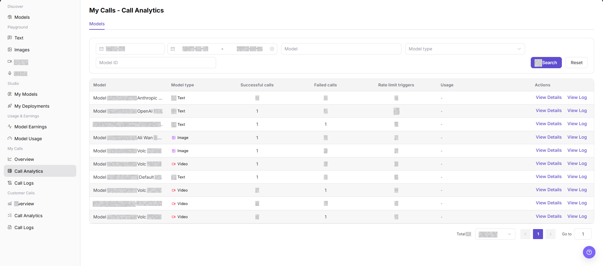
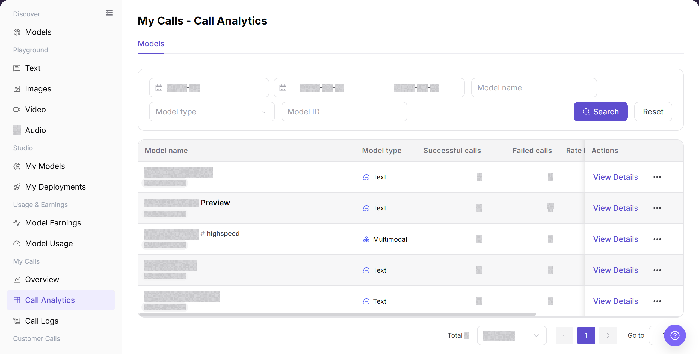
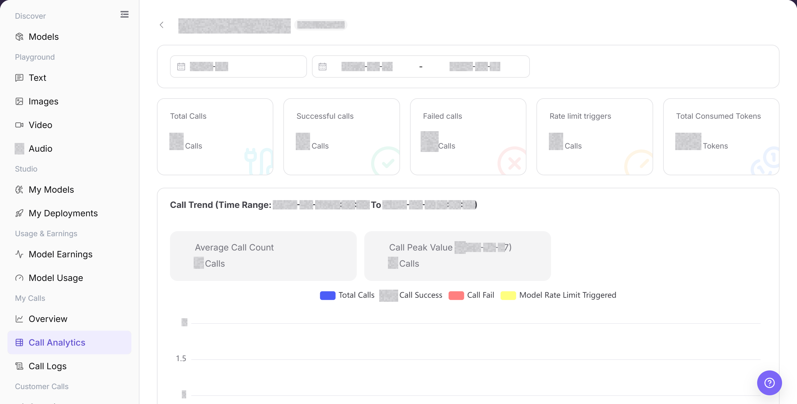

# Call Analytics

## Feature Overview

| Item | Content |
| --- | --- |
| Applicable Roles | Model Provider, Model Consumer |
| Navigation Path | Model Services > My Calls > Call Analytics |
| Page Route | `/modelone/monitoring/calls/list/model` |
| Managed Objects | Model call successes, failures, rate-limit triggers, usage, and analytics details |

#### Beginner Explanation

Call Analytics works like a model-by-model scorecard. The list shows successes, failures, rate-limit triggers, and usage, while details help identify when an anomaly occurred.

#### Terminology

| Term | Description |
| --- | --- |
| Successful Calls | Calls completed successfully in the selected scope. |
| Failed Calls | Calls that did not complete successfully in the selected scope. |
| Rate Limit Triggers | Calls that reached a rate-limit policy. |
| Usage | Aggregated token, call-count, or other consumption information. |

#### Recommended Operation Order

Query by model name, model ID, or type, compare success, failure, rate limits, and usage, and then open analytics details for an abnormal model.

#### Beginner Checklist

| Scenario | Do First | Do Not Do Directly |
| --- | --- | --- |
| Unsure which model to query | Query by name or ID first | Enter conflicting filters |
| Failures increase | Open analytics details | Review list totals only |
| Rate limits increase | Check period and rate-limit policy | Increase call volume immediately |
| No list data | Reset filters and expand the period | Repeat the same search |

## Prerequisites

1. The current account has access to the `Call Analytics` page.
2. The current account has call records in the statistical period, or the billing cycle and date range to view have been confirmed.
3. Before viewing or screenshots, confirm whether model names, Key names, fees, business applications, and call volume need to be redacted.

::: warning Sensitive Information Boundary
Call analytics may contain fees, call volume, Key names, business applications, model names, and abnormal calls. Follow your tenant's data-access policy when you view or share this data. Redact accounts, Keys, request content, fees, and business identifiers.
:::

## Page Description

The page lists successful calls, failed calls, rate-limit triggers, and usage by model. Open details to review analytics for a target model.

Page screenshots:

Focus on query criteria, model statistics, and the details entry.

## Main Operations

### View Model Call Analytics

1. Go to `Model Services > My Calls > Call Analytics`.
2. Enter a model name or model ID and select a model type if needed.
3. Click **"Search"** and verify successes, failures, rate limits, and usage. Click **"Reset"** if the filters are incorrect.

The image shows model call analytics. Compare success, failure, rate limits, and usage.

### View Model Analytics Details

1. Open the details entry for the target model.
2. Verify the model name, time range, and aggregate indicators.
3. Compare trends with list results. Open call logs when individual request information is required.

The image shows analytics details. Verify the model, time range, and metric scope.

## Parameter Reference

| Field Name | Required | Field Type | Example | Description |
| --- | --- | --- | --- | --- |
| Billing Cycle | Yes | Month selector | `2026-07` | Sets the billing cycle for Call Analytics. |
| Date Range | Yes | Date range | `2026-07-01 to 2026-07-31` | Sets the time range for the analytics list. |
| Model Name | No | Input | `Example Model` | Filters statistics by model name. |
| Model Type | No | Selector | `Text` | Narrows statistics by model type. |
| Model ID | No | Input | `example-model` | Locates a model by its call identifier. |
| Successful Calls | System-generated | Number | `0` | Successful calls in the selected range. |
| Failed Calls | System-generated | Number | `0` | Failed calls in the selected range. |
| Rate Limit Triggers | System-generated | Number | `0` | Rate-limit triggers in the selected range. |
| Action | System-generated | Link | `View Details` | Opens analytics details for the target model. |

## Pitfalls

- Call analytics is time-aggregated, so it may differ from real-time logs in a short window.
- When comparing models, align time range, call method, and model version.
- Higher latency does not always mean model failure. Network, queueing, input length, or rate-limit policy may also be involved.

## Result Validation

| Check Item | Success Signal | If Abnormal |
| --- | --- | --- |
| Page opens | The sidebar highlights `My Calls > Call Analytics`, and the statistics table appears. | Check account permissions, navigation path, and page loading status. |
| Statistics are visible | The table shows Model, Model type, Successful calls, Failed calls, Rate limit triggers, and action entries. | Expand the time range or confirm whether the current account has call records. |
| Model statistics are visible | The call analytics table shows one row for each model in the selected period. | Refresh the page, or switch the billing cycle and date range and retry. |
| Filters accept values | Billing Cycle, Date Range, Model Name, Model Type, and Model ID accept input or a selection. | Click **"Reset"** and set the filters again. |
| Search and Reset take effect | **"Search"** shows matching rows, and **"Reset"** clears the filters. | Check the date and Model ID formats one field at a time. |
| Statistics match filters | Model name, model type, and call counts in the table match the current filters. | Use the same filters in Call Logs and compare the records. |

## FAQ

#### Analytics List Is Empty

**Symptom:**

The model analytics list shows an empty state after a search.

**Possible Causes:**

- The time range contains no call record.
- The model name, model type, or Model ID filter is too narrow.

**Resolution:**

1. Click **"Reset"** to clear the filters.
2. Select a date range that contains a known call and search again.
3. Search **"Call Logs"** for the same Model ID. Contact the administrator if the log exists but analytics remains empty.

#### Failure Count Is Higher Than Expected

**Symptom:**

The failure count or failure ratio increases for the target model.

**Possible Causes:**

- Authentication, Model ID, or request parameters are incorrect.
- The target model or upstream service returns an error.

**Resolution:**

1. Record the affected model and time range.
2. Filter failed records in **"Call Logs"** and review the error.
3. Correct the request and check again. Contact the Model Provider if the same upstream error continues.

#### Rate-Limit Count Is Higher Than Expected

**Symptom:**

The rate-limit trigger count increases for the target model.

**Possible Causes:**

- Request frequency or concurrency exceeds the limit.
- Several applications share the same call quota.

**Resolution:**

1. Filter by Model ID and time range.
2. Use **"Call Logs"** to review the times of the rate-limited requests.
3. Reduce the request rate and check again. Contact the Model Provider if many requests remain rate limited.

#### Usage and Log Totals Differ

**Symptom:**

Token or usage totals in analytics differ from the Call Logs total.

**Possible Causes:**

- The pages use different date or model filters.
- The comparison uses different input, output, or total-token fields.

**Resolution:**

1. Use the same date range, model type, and Model ID.
2. Sum input and output tokens from the log details again.
3. If the difference remains, send the filters and redacted request IDs to the administrator.

#### Analytics Details Does Not Open

**Symptom:**

Nothing opens after you click **"View Details"** for the target row.

**Possible Causes:**

- The current account does not have detail permission.
- The target record is outside the current filters.

**Resolution:**

1. Clear the filters and locate the row again.
2. Refresh the page and click **"View Details"** again.
3. If it still does not open, ask the administrator to verify permissions and provide the Model ID and page route.

## Notes

- Do not write real accounts, Keys, request content, fee details, or internal test parameters in the document.
- Call analytics is aggregate data. Use Call Logs for single-request troubleshooting.
- Use only redacted statistics for external communication.

## Next Steps

1. Click **"View Details"** to view model-level statistics.
2. Click **"View Log"** or go to `Call Logs` to troubleshoot single requests.
3. Adjust call strategy based on failed calls, rate-limit triggers, and model type.
