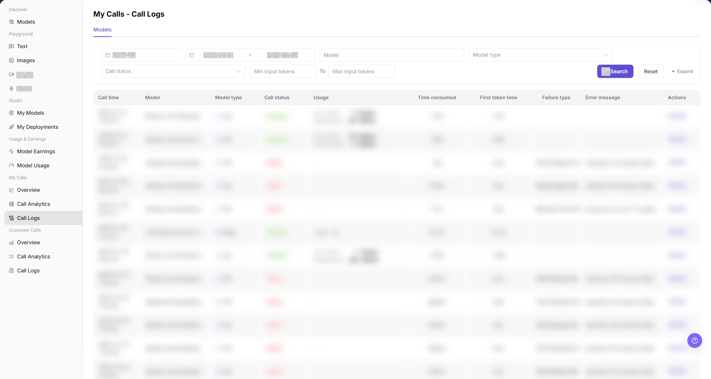
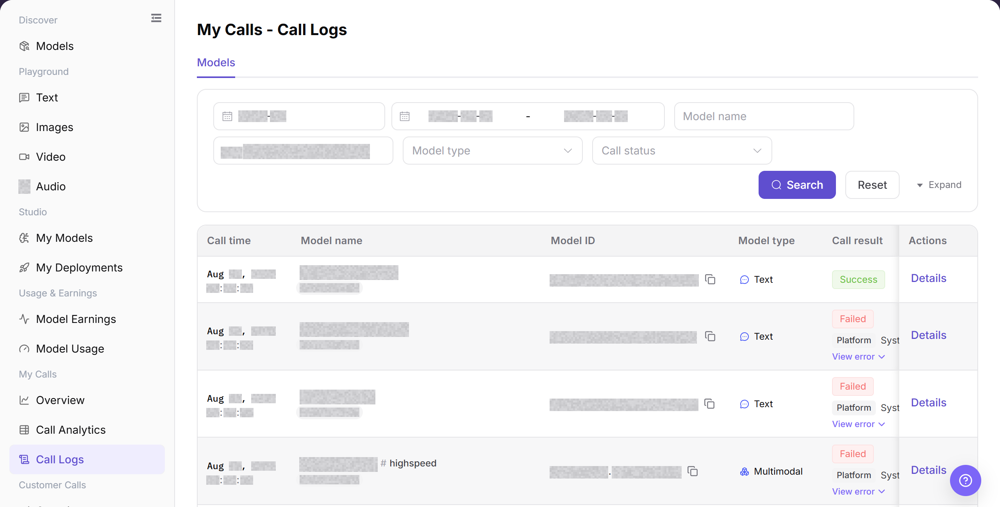
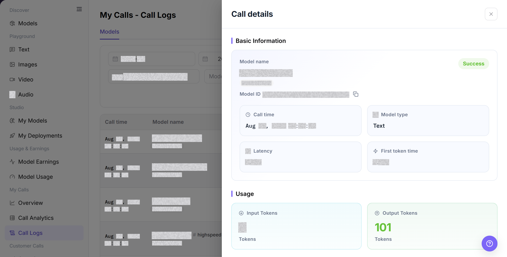

# Call Logs

## Feature Overview

| Item | Content |
| --- | --- |
| Applicable Roles | Model Provider, Model Consumer |
| Navigation Path | Model Services > My Calls > Call Logs |
| Page Route | `/modelone/monitoring/calls/log/model` |
| Managed Objects | Personal model-call records, results, usage, latency, and details |

#### Beginner Explanation

Call Logs works like an itemized record of model requests. Locate a record by model, status, and time, and open details to review result, usage, and latency for a single failure.

#### Terminology

| Term | Description |
| --- | --- |
| Call Time | The time when the request was made and recorded. |
| Call Result | The success or failure state of one call. |
| First Token Time | The time for a text model to return its first token. |
| Call Details | Model, status, usage, latency, and error summary for one call. |

#### Recommended Operation Order

Set time and model criteria, query logs, verify result, usage, and latency, and then open details for the target record.

#### Beginner Checklist

| Scenario | Do First | Do Not Do Directly |
| --- | --- | --- |
| Cannot find a record | Check time range and time zone first | Repeat a model-name query only |
| A call failed | Open details for the error summary | Repeat the call immediately |
| Latency is abnormal | Compare adjacent records for the model | Review one latency value only |
| Preparing to share details | Remove requests, responses, and credentials | Copy complete details |

## Prerequisites

1. The current account has access to the `Call Logs` page.
2. The time range, model, model type, or call status to view has been clarified.
3. Use only redacted log information for troubleshooting.

## Page Description

The page shows model-call records for the current account. Query by model name, model ID, type, status, and time range, and open details for individual call information.

Page screenshots:

Focus on query criteria, call result, usage, latency, and the details entry.

## Main Operations

### Query Call Logs

1. Go to `Model Services > My Calls > Call Logs`.
2. Set a time range, enter a model name or model ID, and select model type and call status if needed.
3. Click **"Search"** and verify call time, result, usage, and latency. Click **"Reset"** if the criteria are incorrect.

The image shows call logs. Verify the time range, call result, and target record.

### View Call Details

1. Click **"Details"** for the target record.
2. Verify model, call time, result, usage, latency, and error summary.
3. For troubleshooting, retain only a redacted request identifier and error summary. Do not copy complete requests, responses, or credentials.

The image shows one call's details. Remove request, response, and credential information before sharing.

## Parameter Reference

| Field Name | Required | Field Type | Example | Description |
| --- | --- | --- | --- | --- |
| Month | Yes | Month selector | `2026-07` | Controls the statistical month for call logs. |
| Date Range | Yes | Date range | `2026-07-01 to 2026-07-17` | Controls the query time range for call logs. |
| Model | No | Input | `Example Model` | Filters call logs by model name. |
| Model Type | No | Selector | `Text` / `Video` | Filters call logs by model capability type. |
| Call Status | No | Selector | `Success` / `Failed` | Filters logs by call processing result. |
| Minimum Input Tokens | No | Number input | `0` | Sets the lower input-token boundary for the query. |
| Maximum Input Tokens | No | Number input | `1000` | Sets the upper input-token boundary for the query. |
| Call Time | System-generated | Time | `2026-07-17 14:30` | Shows when a single call occurred. |
| Usage | System-generated | Text / tag | `Input 100 / Output 40 Tokens` | Shows token, free quota, or multimodal input/output usage. |
| Time Consumed | System-generated | Time | `1.2 s` | Shows the total time consumed by a single call. |
| First Token Time | System-generated | Time | `0.3 s` | Shows the time before the first token is returned. |
| Failure Type | System-generated | Text | `Authentication` | Shows the issue category for a failed request. |
| Error Message | System-generated | Text | `Redacted error message` | Shows the error summary for a failed request. Redact it before screenshots or external communication. |
| Actions | No | Action entry | `Details` | Opens single-call log details. |

## Pitfalls

- API Key, Token, Prompt, response content, and complete Endpoint may contain sensitive data. Record only sanitized snippets.
- For 429, check rate limits and quota first. For 401, check credentials and permissions. For 5xx, check model service and upstream status.
- Before retrying, verify request parameters, model version, and input size to avoid repeated invalid calls.

## Result Validation

| Check Item | Success Signal | If Abnormal |
| --- | --- | --- |
| Page is accessible | The `My Calls - Call Logs` page opens, and `My Calls > Call Logs` is highlighted in the sidebar. | Check account permissions, navigation path, and page loading status. |
| Call log list loads | The list shows columns such as call time, model, call status, usage, latency, and error message. | Refresh the page or retry after adjusting the month and date range. |
| Filter controls can be selected | After filtering by month, date range, model, model type, or call status, the list refreshes. | Check whether filters are too narrow, and click **"Reset"** if needed. |
| Search / Reset works | `Search` displays matching logs, and `Reset` clears the filters. | Check network status, page API responses, and account permissions. |
| Log details can be opened | Clicking `Details` opens more information about a single call. | Confirm that the record is still within the log retention period. |
| Field information is consistent | Call status, time consumed, usage, failure type, and error message are consistent with the details page. | Reopen details or expand the time range for cross-checking. |

## FAQ

#### Target Log Is Missing

**Symptom:**

The target request does not appear after you search by time or model.

**Possible Causes:**

- The time range, model, or status filter excludes the request.
- Another account or Personal Key created the request.

**Resolution:**

1. Click **"Reset"** and select the request date.
2. Narrow the list by Model ID and call status.
3. Verify the account that made the call. If the record is still missing, send the administrator the redacted request time and Model ID.

#### Call Status Is Failed

**Symptom:**

The target log shows a failed result or an error.

**Possible Causes:**

- The Personal Key is invalid or lacks call permission.
- The Model ID, request body, or model parameters are incorrect.
- The quota is insufficient or the target model returns an error.

**Resolution:**

1. Open **"Details"** and record the redacted error.
2. Verify the Personal Key, Model ID, request format, and quota.
3. Call again after correction. Contact the Model Provider or administrator if the same error continues.

#### Call Latency Increases

**Symptom:**

Total latency or first-token latency is much higher than for similar requests.

**Possible Causes:**

- The input is longer or the output limit is higher.
- The model or provider responds slowly during the selected period.

**Resolution:**

1. Compare requests with the same Model ID and a similar input size.
2. Review total latency and first-token latency separately.
3. If latency remains high, send the Model Provider the time range and redacted request IDs.

#### Token Usage Is Higher Than Expected

**Symptom:**

Input or output token usage is much higher than expected.

**Possible Causes:**

- The request contains a long message history or attachments.
- The output limit or generation parameters are too high.

**Resolution:**

1. Review input and output tokens in Details.
2. Shorten the input or reduce the output limit, and call again.
3. If similar requests still differ, send redacted request IDs to the administrator for metering review.

#### Log Details Contains Sensitive Data

**Symptom:**

Details shows credentials, a full Endpoint, customer input, or response content.

**Possible Causes:**

- The call itself contains sensitive data.
- A screenshot or support ticket was not redacted.

**Resolution:**

1. Stop copying or sharing the content.
2. Mask the Personal Key, authentication header, request body, response body, and full Endpoint.
3. If a credential was exposed, contact the administrator or security owner immediately and rotate it.

## Notes

- Do not expose complete requests, response bodies, Keys, accounts, or cost details in documentation, screenshots, or tickets.
- Call log data may be removed after the configured retention period. Confirm the time range first during troubleshooting.
- Error messages are only used for troubleshooting and must be redacted before public communication.

## Next Steps

1. Adjust request parameters or calling methods based on the failure type and error message.
2. To troubleshoot a single request, open `Details` and view redacted log information.
3. To determine whether the issue is a batch anomaly, go back to `My Calls > Call Analytics` and view aggregated data.
