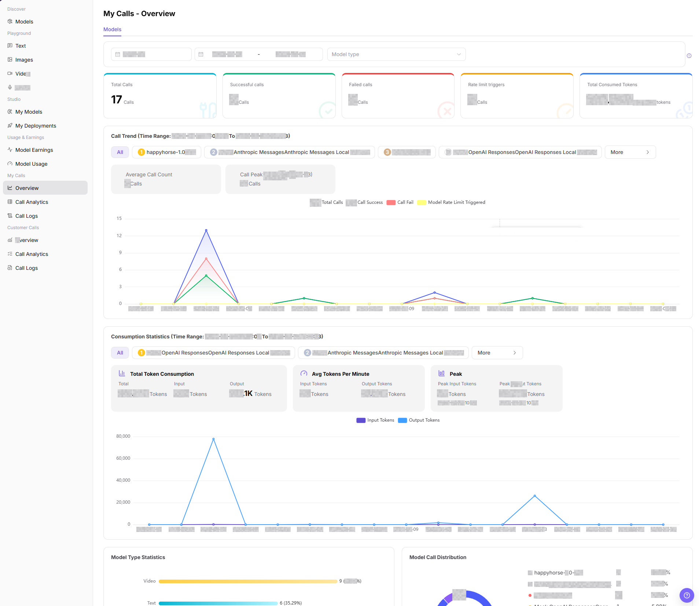
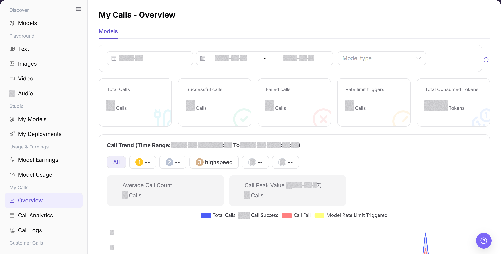

# Overview

## Feature Overview

| Item | Content |
| --- | --- |
| Applicable Roles | Model Provider, Model Consumer |
| Navigation Path | Model Services > My Calls > Overview |
| Page Route | `/modelone/monitoring/calls/overview/model` |
| Managed Objects | Personal call indicators, call trends, model rankings, and log entry |

#### Beginner Explanation

Overview works like a personal call dashboard. Review total, successful, and failed calls and usage trends, and then open logs from an abnormal model to locate individual requests.

#### Terminology

| Term | Description |
| --- | --- |
| Total Calls | The number of calls made in the selected period. |
| Failed Calls | Calls that did not complete successfully. |
| Rate Limit Trigger | The number of calls restricted by rate-limit policies. |
| Call Trend | Changes in calls, success, failure, or usage over time. |

#### Recommended Operation Order

Select a time range and review aggregate indicators, compare trends and model rankings, and use the log entry to investigate anomalies.

#### Beginner Checklist

| Scenario | Do First | Do Not Do Directly |
| --- | --- | --- |
| No overview data | Expand the time range | Conclude immediately that calls were not recorded |
| Success rate drops | Compare failure and rate-limit trends | Review total calls only |
| A model is abnormal | Open logs for individual requests | Infer the cause from charts alone |
| Preparing to share an image | Redact business identifiers and sensitive information | Share the original image |

## Prerequisites

1. The current account has access to the `Overview` page.
2. The current account has call records in the statistical period, or the time range to view has been confirmed.
3. Before viewing or screenshots, confirm whether model names, Key names, fees, and business identifiers need to be redacted.

::: warning Sensitive Information Boundary
The call overview may show fees, call volume, model names, Key names, token consumption, and abnormal trends. Follow your tenant's data-access policy when you view or share this data. Redact accounts, Keys, request content, fees, and business identifiers.
:::

## Page Description

The page shows call totals, trends, and model rankings for the current account and provides an entry to call logs. Changing the time range updates indicators and charts.

Page screenshots:

Focus on the time range, aggregate indicators, trend chart, and model list.

## Main Operations

### View Call Trends and Open Logs

1. Go to `Model Services > My Calls > Overview`.
2. Select a time range and model type, and verify total, successful, failed, and rate-limited calls and usage.
3. Compare trends and the model list to locate an abnormal model.
4. Click **"View Logs"** for the target model to continue in call logs.

The image shows call totals, trends, and the model list. Open logs from the target model when an anomaly is found.

## Parameter Reference

| Field Name | Required | Field Type | Example | Description |
| --- | --- | --- | --- | --- |
| Billing Cycle | Yes | Month selector | `2026-07` | Sets the billing cycle for Overview. |
| Date Range | Yes | Date range | `2026-07-01 to 2026-07-31` | Sets the time range for metric cards and charts. |
| Model Type | No | Selector | `Text` | Narrows statistics by model type. |
| Total Calls | System-generated | Number | `0` | Total calls in the selected range. |
| Successful Calls | System-generated | Number | `0` | Successful calls in the selected range. |
| Failed Calls | System-generated | Number | `0` | Failed calls in the selected range. |
| Rate Limit Triggers | System-generated | Number | `0` | Rate-limit triggers in the selected range. |
| Total Consumed Tokens | System-generated | Number | `0 Tokens` | Total token consumption in the selected range. |

## Pitfalls

- My Calls Overview shows only the current account's visible scope, not tenant-wide or customer-wide totals.
- When balance, Credits, or call count looks abnormal, check call logs, model usage, and billing pages together.
- Align model and time range before comparing data, otherwise different model versions may be mixed.

## Result Validation

| Check Item | Success Signal | If Abnormal |
| --- | --- | --- |
| Page opens | The sidebar highlights `My Calls > Overview`, and the overview cards appear. | Check account permissions, navigation path, and page loading status. |
| Overview metrics are visible | The cards show Total Calls, Successful calls, Failed calls, Rate limit triggers, and Total Consumed Tokens. | Expand the time range or confirm whether the current account has call records. |
| Trend charts are visible | The page shows Call Trend, Consumption Statistics, Model Type Statistics, and Model Call Distribution. | Refresh the page, or switch the billing cycle and date range and retry. |
| Filters can be selected | The Billing Cycle, Date Range, and Model Type controls accept a selection. | Reload the page. If the controls still do not respond, ask the administrator to verify page permission. |
| Data matches filters | Metric cards and charts show data for the selected billing cycle, date range, and model type. | Use the same filters in Call Analytics and Call Logs for comparison. |

## FAQ

#### Overview Shows No Data

**Symptom:**

The metric cards, trend chart, and model list all show an empty state.

**Possible Causes:**

- The selected time range contains no call record.
- A model-type or other filter excludes the target record.

**Resolution:**

1. Click **"Reset"** to clear the filters.
2. Select a date range that contains a known call, and click **"Search"**.
3. Search **"Call Logs"** with the same time range and model. If the log exists but Overview remains empty, send the administrator the redacted time range and Model ID.

#### Success Rate Drops

**Symptom:**

Successful calls decrease, or failed calls increase in the same time range.

**Possible Causes:**

- Requests to one model or provider fail repeatedly.
- The Personal Key, Model ID, or request parameters do not meet the call requirements.

**Resolution:**

1. Keep the same time range and model type in Overview.
2. Open **"Call Analytics"** and locate the model with more failures.
3. Open **"Call Logs"** and review the error. If the same error continues, send a redacted request ID to the Model Provider or administrator.

#### Rate-Limit Triggers Increase

**Symptom:**

The rate-limit count is greater than zero or continues to increase in the trend chart.

**Possible Causes:**

- Request frequency or concurrency exceeds the current model limit.
- Many calls occur in a short period.

**Resolution:**

1. Use **"Call Analytics"** to identify the model and time range.
2. Use **"Call Logs"** to confirm the status and request times.
3. Reduce request frequency or concurrency and check again. Contact the Model Provider if rate limiting continues.

#### Trend and List Totals Differ

**Symptom:**

The trend total differs from the list or metric-card total.

**Possible Causes:**

- The areas use different dates, billing cycles, or model types.
- The comparison includes different time boundaries.

**Resolution:**

1. Use the same billing cycle, date range, and model type.
2. Click **"Search"** to reload all areas.
3. Summarize **"Call Logs"** with the same filters. If the difference remains, send the filters and a redacted screenshot to the administrator.

#### Call Logs Does Not Open

**Symptom:**

The page does not change after you click the log entry, or an access message appears.

**Possible Causes:**

- The current role does not have Call Logs permission.
- The browser contains an outdated page state.

**Resolution:**

1. Open **"Call Logs"** from the left navigation.
2. Refresh the page and select the time range again.
3. If the page still does not open, ask the administrator to verify Model Consumer permissions and provide the page route.

## Notes

- Do not write real accounts, Keys, request content, fee details, or internal test parameters in the document.
- Overview statistics may have delays. Use Call Logs for single-request troubleshooting.
- Use only redacted aggregate information for external communication.

## Next Steps

1. Go to `Call Analytics` for more detailed trend and dimension analysis.
2. Go to `Call Logs` to view single requests, error codes, and request status.
3. Adjust call strategy based on failed records, rate-limit triggers, and token peaks.
