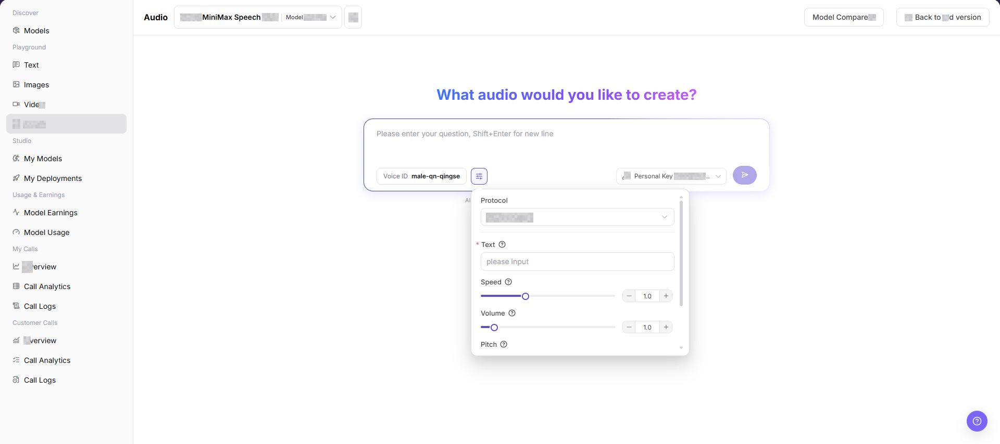
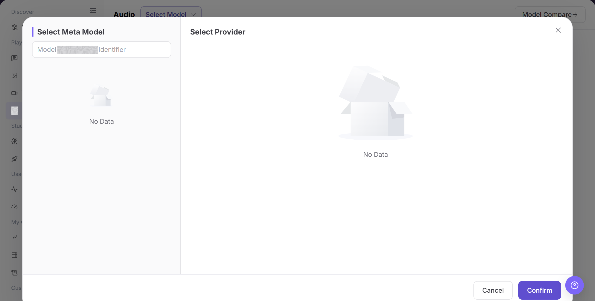
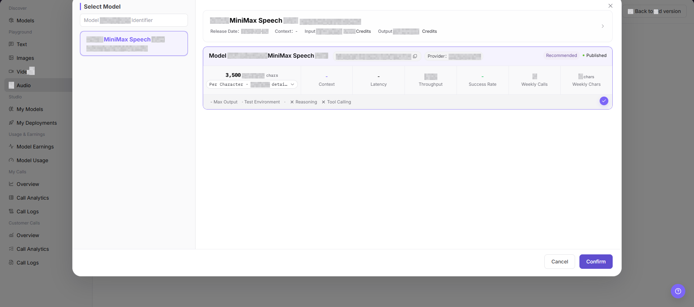
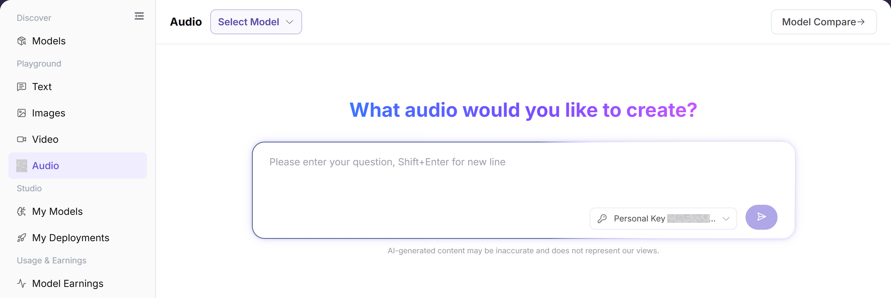

# Audio

## Feature Overview

| Item | Content |
| --- | --- |
| Applicable Roles | Model Provider, Model Consumer |
| Navigation Path | Model Services > Playground > Audio |
| Page Route | `/modelone/exploration/audio` |
| Managed Objects | Audio models, text or audio input, generation parameters, and audio results |

#### Beginner Explanation

The Audio playground is a place to try an audio model. Select an audio model and provider from the selector, enter the input, adjust parameters, and review the result or error message before integration.

#### Terminology

| Term | Description |
| --- | --- |
| Model Instance | The model and provider combination used by the playground. |
| Prompt | Instructions that describe the task, input, and expected output. |
| Generation Parameters | Settings that control length, randomness, size, or other generation behavior. |
| Personal Key | A personal credential used for calls. Documentation uses `<PERSONAL_KEY>`. |

#### Recommended Operation Order

For a first trial, select an audio model, verify the provider and Personal Key, configure the input and parameters, and then submit and review the result. Change only a few parameters at a time so that results remain comparable.

#### Beginner Checklist

| Scenario | Do First | Do Not Do Directly |
| --- | --- | --- |
| Unsure which audio model to use | Compare status and capabilities in the selector | Submit with the default model immediately |
| Preparing input | Remove credentials, customer data, and production data | Paste raw sensitive content |
| Preparing parameter changes | Change only a few parameters at a time | Change every parameter together |
| Generation fails | Review the page error and call logs first | Submit repeatedly |

## Prerequisites

1. The current account has access to the audio Playground page.
2. The target audio model is published and listed for trial.
3. Text content has been checked to avoid sensitive information, private data, or unauthorized content.
4. You understand that clicking the send or generation button may create a real model call and billing record.

::: warning Call And Content Risks
Clicking Send creates a real model call and may consume quota or create billing records and call logs. Before submission, remove personal data, customer information, credentials, copyrighted text, and unauthorized content.
:::

## Page Description

The page contains audio model selection, an input area, parameters, Personal Key selection, and a result area. Submission creates a real call and may create usage or billing records.

Page screenshots:

Focus on the model, input area, parameter entry, and submit button. Verify the input again before submission.

## Main Operations

### Select Audio Model

1. Go to `Model Services > Playground > Audio`.
2. Click the current model name or **"Select Model"** to open the selector.
3. Locate the target model and compare provider, context, price, latency, throughput, success rate, and status.
4. Select a listed instance and return to the playground. Confirm that the model and provider shown at the top are correct.

The image shows the model selector. Compare provider capability, price, performance, and status.

This image provides an additional view of model selection and instance information.

### Configure and Generate Audio Content

1. Confirm that the current model, provider, and Personal Key are correct.
2. Enter the content to generate and set voice, speed, format, or other parameters shown in the panel. Confirm that the input contains no sensitive information, and then click **"Send"**.
3. After submission, review the result, latency, usage, and error message. For a failure, check model status, quota, parameters, and rate limits first.
4. When recording an issue, retain only a redacted request identifier, model name, and time. Do not copy real credentials or complete sensitive input.

The image shows the input and parameter area. Verify the model, input, Personal Key, and generation settings before submission.

## Parameter Reference

| Field Name | Required | Field Type | Example | Description |
| --- | --- | --- | --- | --- |
| Model | Yes | Dropdown | `Example Audio Model` | The audio model currently being tried. |
| Voice ID | Yes | Input or selector | `male-qn-qingse` | Specifies the voice or speaker for generated speech. |
| Text | Yes | Text input | `please input` | Text content to convert into speech. |
| Protocol | Yes | Dropdown | `openai/audio` | Current audio model call protocol. |
| Speed | No | Slider / number input | `1.0` | Controls the speed of generated speech. |
| Volume | No | Slider / number input | `1.0` | Controls the volume of generated speech. |
| Pitch | No | Slider / number input | `1.0` | Controls the pitch of generated speech. |
| Key | Yes | Dropdown | `Personal Key` | Key used to initiate the trial call. |
| Generated Result | No | Result area | Audio result or status message | Shows generated audio, task status, or error messages. |

## Pitfalls

- Do not enter real customer information, ID numbers, phone numbers, secrets, or other sensitive text.
- Speech generation may involve voice synthesis, copyright, and compliance risks. Confirm text source and usage authorization before production use.
- Speed, Volume, or Pitch values that are too high or too low may produce abnormal audio.
- Clicking the send button creates a real call, which may consume quota and write call logs.

## Result Validation

| Check Item | Success Signal | If Abnormal |
| --- | --- | --- |
| Page is accessible | The `Audio` page opens, and the left Playground menu and top model selector are visible. | Check account permissions, navigation path, and page loading status. |
| Model can be selected | The `Select Model` dialog opens, and model name, provider, pricing, and status are visible. | Confirm whether listed models are published, or switch to another model. |
| Input area is visible | Text input, Voice ID, Key, and send entry are visible. | Refresh the page or check model capability configuration. |
| Parameter area is visible | `Protocol`, `Text`, `Speed`, `Volume`, `Pitch`, and other fields are visible. | Check whether the parameter panel is expanded, or select the model again. |
| Result area is visible | If a real call is executed, the page shows an audio result, task status, or error message. | Record the request ID or error message, and check text, Key, and parameter configuration. |

## FAQ

#### Target Model Is Missing

**Symptom:**

The target model does not appear in the selector.

**Possible Causes:**

- The model is not authorized for the account.
- Its status or modality does not match the page.

**Resolution:**

1. Verify visibility and model status.
2. Confirm input and output capabilities in Models.

#### Submit Is Unavailable

**Symptom:**

The request cannot be submitted after input is entered.

**Possible Causes:**

- No model or Personal Key is selected.
- Required input or parameters are incomplete.

**Resolution:**

1. Select the model and Personal Key again.
2. Complete the required input and parameter fields marked on the page.

#### Generation Fails or Times Out

**Symptom:**

The request fails or remains pending.

**Possible Causes:**

- The model service is busy or rate-limited.
- Input or parameters exceed model limits.

**Resolution:**

1. Review the page error and call logs.
2. Shorten input or restore default parameters and retry.

#### Result Does Not Meet Expectations

**Symptom:**

The result does not meet content, format, or quality requirements.

**Possible Causes:**

- The prompt lacks constraints.
- Too many parameters changed together.

**Resolution:**

1. Add goals, format, and prohibited content.
2. Restore baseline settings and compare one change at a time.

#### Usage or Cost Is Unexpected

**Symptom:**

One trial creates more usage than expected.

**Possible Causes:**

- Output size or generation count is too large.
- The same task was submitted repeatedly.

**Resolution:**

1. Check generation settings and call logs.
2. Stop repeated submissions and confirm billing scope.

## Notes

- Do not write real accounts, passwords, access parameters, or internal business data.
- Do not display real keys, tokens, AK/SK, or private keys in the document.
- Before screenshots or export, confirm that the page does not contain sensitive text, personal voice information, or real business data.

## Next Steps

1. Record the model, Voice ID, and parameter combinations that fit the business scenario.
2. If the call fails, go to call logs to view error information.
3. Before production integration, confirm text source, audio generation compliance requirements, and budget.
