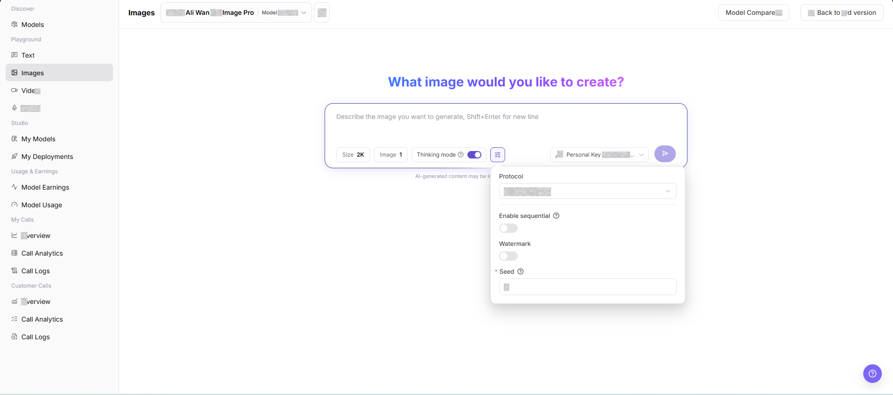
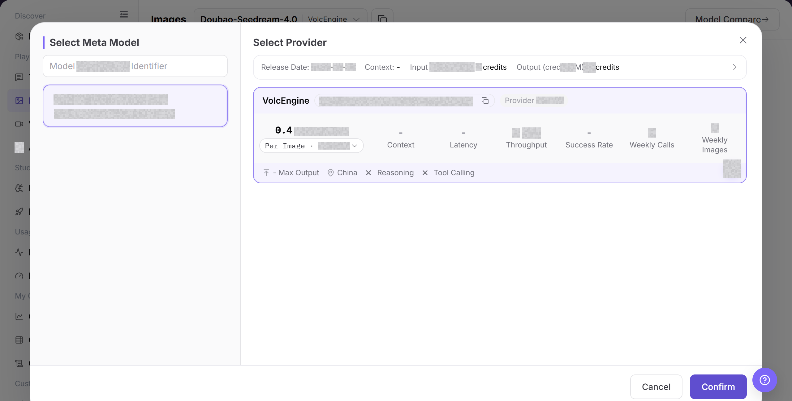
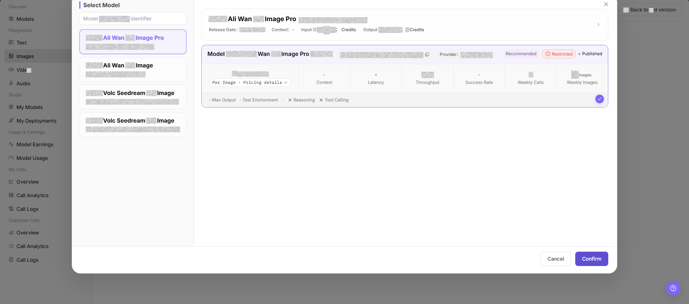
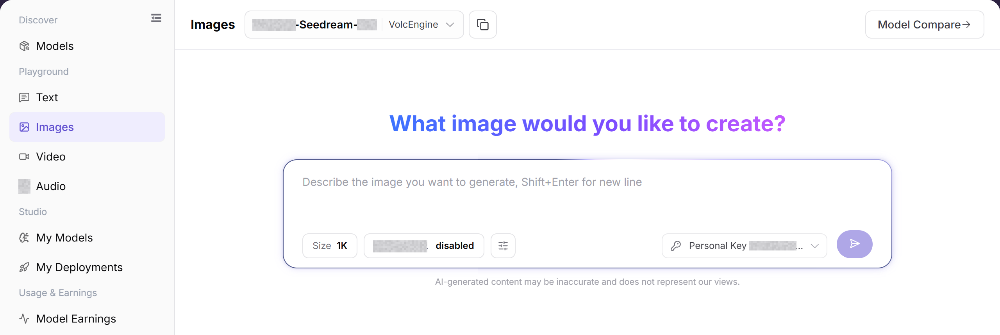

# Images

## Feature Overview

| Item | Content |
| --- | --- |
| Applicable Roles | Model Provider, Model Consumer |
| Navigation Path | Model Services > Playground > Images |
| Page Route | `/modelone/exploration/image` |
| Managed Objects | Image models, prompts, size, generation parameters, and image results |

#### Beginner Explanation

The Images playground is a place to try an image model. Select an image model and provider from the selector, enter the input, adjust parameters, and review the result or error message before integration.

#### Terminology

| Term | Description |
| --- | --- |
| Model Instance | The model and provider combination used by the playground. |
| Prompt | Instructions that describe the task, input, and expected output. |
| Generation Parameters | Settings that control length, randomness, size, or other generation behavior. |
| Personal Key | A personal credential used for calls. Documentation uses `<PERSONAL_KEY>`. |

#### Recommended Operation Order

For a first trial, select an image model, verify the provider and Personal Key, configure the input and parameters, and then submit and review the result. Change only a few parameters at a time so that results remain comparable.

#### Beginner Checklist

| Scenario | Do First | Do Not Do Directly |
| --- | --- | --- |
| Unsure which image model to use | Compare status and capabilities in the selector | Submit with the default model immediately |
| Preparing input | Remove credentials, customer data, and production data | Paste raw sensitive content |
| Preparing parameter changes | Change only a few parameters at a time | Change every parameter together |
| Generation fails | Review the page error and call logs first | Submit repeatedly |

## Prerequisites

1. The current account has access to the image Playground page.
2. The target image model is authorized for the current account to try.
3. Prompts and reference materials do not contain real keys, customer privacy, unauthorized materials, or sensitive content.

::: warning Call, Billing, and Content Risk
Clicking Generate creates a real model call and may consume credits, generate call logs, or create billing records. Before submission, verify the model, parameters, expected usage, and copyright and compliance boundaries for prompts and assets.
:::

## Page Description

The page contains image model selection, an input area, parameters, Personal Key selection, and a result area. Submission creates a real call and may create usage or billing records.

Page screenshots:

Focus on the model, input area, parameter entry, and submit button. Verify the input again before submission.

## Main Operations

### Select Image Model

1. Go to `Model Services > Playground > Images`.
2. Click the current model name or **"Select Model"** to open the selector.
3. Locate the target model and compare provider, context, price, latency, throughput, success rate, and status.
4. Select a listed instance and return to the playground. Confirm that the model and provider shown at the top are correct.

The image shows the model selector. Compare provider capability, price, performance, and status.

This image provides an additional view of model selection and instance information.

### Configure and Generate Image Content

1. Confirm that the current model, provider, and Personal Key are correct.
2. Describe the image and set Size, output count, sequential generation, watermark, and Seed as needed. Confirm that the content and assets meet usage requirements, and then click **"Generate"**.
3. After submission, review the result, latency, usage, and error message. For a failure, check model status, quota, parameters, and rate limits first.
4. When recording an issue, retain only a redacted request identifier, model name, and time. Do not copy real credentials or complete sensitive input.

The image shows the input and parameter area. Verify the model, input, Personal Key, and generation settings before submission.

## Parameter Reference

| Field Name | Required | Field Type | Example | Description |
| --- | --- | --- | --- | --- |
| Model | Yes | Dropdown | `Mock Ali Wan 2.7 Image Pro` | Image model currently being tried. |
| Provider | Yes | Dropdown | `Example Provider` | Provider instance of the current model. |
| Prompt | Yes | Multiline text | `Generate a product poster` | Describes the image content and style to generate. |
| Size | No | Option | `2K` | Controls the generated image size or quality tier. |
| Number of Images | No | Number | `1` | Controls the number of images generated by one request. |
| Thinking mode | No | Toggle | `On` | Controls whether thinking mode is enabled. |
| Protocol | No | Dropdown | `openai/images` | Protocol used by the current image generation call. |
| Enable sequential | No | Toggle | `Off` | Controls whether sequential generation capability is enabled. |
| Watermark | No | Toggle | `Off` | Controls whether a watermark is added. |
| Seed | No | Number | `0` | Random seed used to influence or reproduce generation results. |
| Generated Result | No | Image area | Generated image | Displays generated images, error messages, or an empty state. |

## Pitfalls

- Do not enter real keys, customer privacy, or unauthorized material descriptions in prompts.
- Larger image size and image count usually increase latency and cost.
- Generated images may involve copyright, portrait rights, trademarks, or compliance boundaries. Confirm authorization before formal use.
- Clicking Generate creates a real call. Verify the model, parameters, asset authorization, and expected cost before submission.

## Result Validation

| Check Item | Success Signal | If Abnormal |
| --- | --- | --- |
| Page is accessible | The `Images` page opens, and the left Playground menu and top model selector are visible. | Check account permissions, navigation path, and page loading status. |
| Model selector loads | The model selector can be opened and shows model list, provider instances, and status information. | Refresh the page and retry, or confirm whether the target model is visible to the current account. |
| Input and parameter areas are visible | Prompt input box, Size, image count, Thinking mode, Protocol, Watermark, Seed, and other fields are visible. | Check whether the page has fully loaded. If needed, switch models and view again. |
| Result area is visible | The page shows a generated result, an error message, or an empty state. | If there is no generation record, confirm that the input and parameter areas remain visible. |
| Real generation returns a result | When generation is explicitly allowed, the page returns generated images or clear error messages. | Adjust the prompt, lower image size or image count, and check error messages or call logs. |

## FAQ

#### Target Model Is Missing

**Symptom:**

The target model does not appear in the selector.

**Possible Causes:**

- The model is not authorized for the account.
- Its status or modality does not match the page.

**Resolution:**

1. Verify visibility and model status.
2. Confirm input and output capabilities in Models.

#### Submit Is Unavailable

**Symptom:**

The request cannot be submitted after input is entered.

**Possible Causes:**

- No model or Personal Key is selected.
- Required input or parameters are incomplete.

**Resolution:**

1. Select the model and Personal Key again.
2. Complete the required input and parameter fields marked on the page.

#### Generation Fails or Times Out

**Symptom:**

The request fails or remains pending.

**Possible Causes:**

- The model service is busy or rate-limited.
- Input or parameters exceed model limits.

**Resolution:**

1. Review the page error and call logs.
2. Shorten input or restore default parameters and retry.

#### Result Does Not Meet Expectations

**Symptom:**

The result does not meet content, format, or quality requirements.

**Possible Causes:**

- The prompt lacks constraints.
- Too many parameters changed together.

**Resolution:**

1. Add goals, format, and prohibited content.
2. Restore baseline settings and compare one change at a time.

#### Usage or Cost Is Unexpected

**Symptom:**

One trial creates more usage than expected.

**Possible Causes:**

- Output size or generation count is too large.
- The same task was submitted repeatedly.

**Resolution:**

1. Check generation settings and call logs.
2. Stop repeated submissions and confirm billing scope.

## Notes

- Do not upload or describe sensitive content such as IDs, contracts, medical records, or faces.
- Generated images may involve copyright, portrait rights, trademarks, and compliance boundaries.
- Before screenshots, confirm that prompts, images, and output content can be public.

## Next Steps

1. Save reusable prompts and parameter combinations.
2. When troubleshooting is needed, use model name, time, and error messages to view call logs.
3. Before using generated images formally, confirm copyright, compliance, and public distribution scope.
