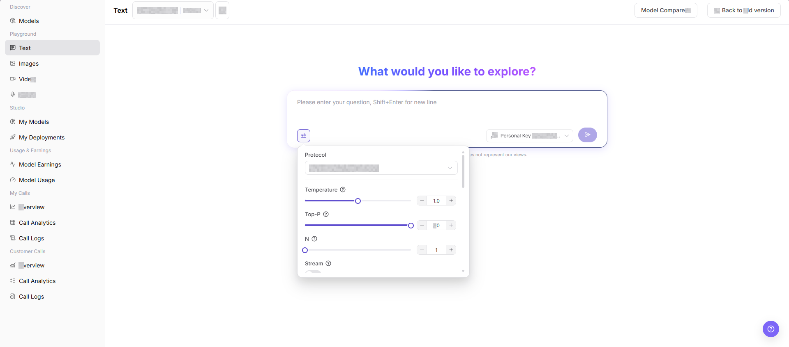
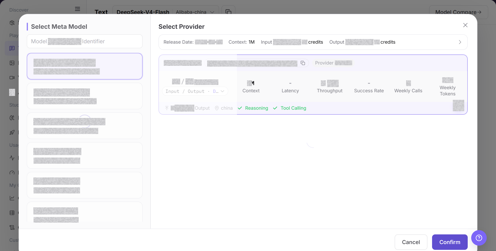
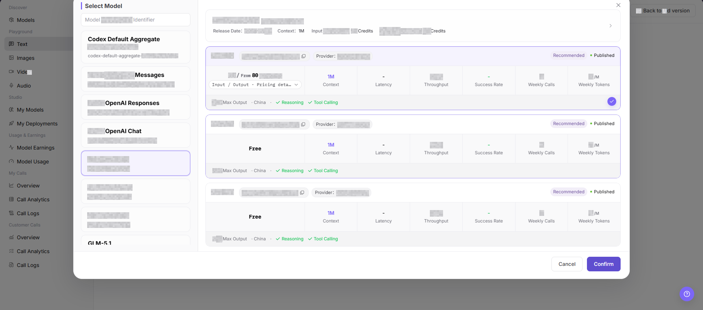
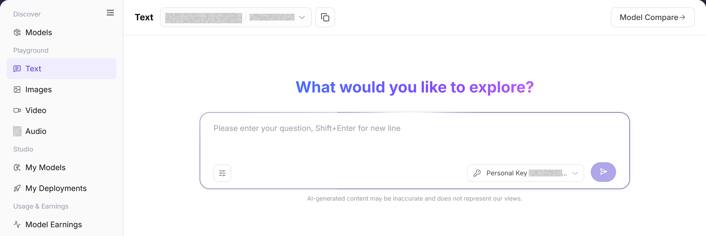

# Text Playground

::: info Document Information
Version: v1.0
Updated: 2026-08-31
:::

## Feature Overview

| Item | Content |
| --- | --- |
| Applicable Roles | Model Provider, Model Consumer |
| Navigation Path | Model Services > Playground > Text |
| Page Route | `/modelone/exploration/chat` |
| Managed Objects | Text models, prompts, generation parameters, and responses |

#### Beginner Explanation

The Text playground is a place to try a text model. Select a text model and provider from the selector, enter the input, adjust parameters, and review the result or error message before integration.

#### Terminology

| Term | Description |
| --- | --- |
| Model Instance | The model and provider combination used by the playground. |
| Prompt | Instructions that describe the task, input, and expected output. |
| Generation Parameters | Settings that control length, randomness, size, or other generation behavior. |
| Personal Key | A personal credential used for calls. Documentation uses `<PERSONAL_KEY>`. |

#### Recommended Operation Order

For a first trial, select a text model, verify the provider and Personal Key, configure the input and parameters, and then submit and review the result. Change only a few parameters at a time so that results remain comparable.

#### Beginner Checklist

| Scenario | Do First | Do Not Do Directly |
| --- | --- | --- |
| Unsure which text model to use | Compare status and capabilities in the selector | Submit with the default model immediately |
| Preparing input | Remove credentials, customer data, and production data | Paste raw sensitive content |
| Preparing parameter changes | Change only a few parameters at a time | Change every parameter together |
| Generation fails | Review the page error and call logs first | Submit repeatedly |

## Prerequisites

1. The current account has access to the text Playground page.
2. The target model is authorized for the current account to try.
3. The Prompt does not contain real keys, customer privacy, or production business data.

::: warning Call and Billing Risk
Clicking Send creates a real model call and may consume credits, generate call logs, or create billing records. Before submission, verify the model, Personal Key, prompt, parameters, and expected usage.
:::

## Page Description

This page is used to try text models. The current page exposes a model selector, `Copy Model ID`, `Model Compare`, `More settings`, a Personal Key selector, and the Prompt input. Focus on selecting the model and provider, entering a Prompt, adjusting Protocol, Temperature, Top-P, N, Stream, and other parameters, and observing the input area, response area, history, and error messages.

Page screenshots:

Focus on the model, input area, parameter entry, and submit button. Verify the input again before submission.

## Main Operations

### Select Text Model

1. Go to `Model Services > Playground > Text`.
2. In the model selector at the top of the page, choose the text model and provider to try.
3. Fill in the Prompt input box with a question, context, or other input content.
4. Select `More settings` and view or adjust `Protocol`, `Temperature`, `Top-P`, `N`, `Stream`, and other parameters as needed.
5. Before clicking the send button, verify the input content, model, provider, key, and parameters.
6. Before clicking **"Send"**, verify the model, Personal Key, input, parameters, and expected usage. The request creates a call record and can consume credits.

The image shows the model selector. Compare provider capability, price, performance, and status.

This image provides an additional view of model selection and instance information.

### Configure and Generate Text Content

1. Confirm that the current model, provider, and Personal Key are correct.
2. Enter a prompt and adjust Protocol, Temperature, Top-P, N, and Stream as needed. Confirm that the input contains no credentials, customer data, or production data, and then click **"Send"**.
3. After submission, review the result, latency, usage, and error message. For a failure, check model status, quota, parameters, and rate limits first.
4. When recording an issue, retain only a redacted request identifier, model name, and time. Do not copy real credentials or complete sensitive input.

The image shows the input and parameter area. Verify the model, input, Personal Key, and generation settings before submission.

## Parameter Reference

| Field Name | Required | Field Type | Example | Description |
| --- | --- | --- | --- | --- |
| Model | Yes | Dropdown | `Example Text Model` | Text model currently being tried. The initial selection can vary by account. |
| Provider | Yes | Dropdown | `Example Provider` | Provider instance of the current model. |
| Prompt | Yes | Multiline text | `Summarize this text` | Prompt, question, or context input to the model. |
| Protocol | No | Dropdown | `openai/chat_completions` | Protocol used by the current call. |
| Temperature | No | Number / Slider | `0.7` | Controls output randomness. Higher values are more divergent. |
| Top-P | No | Number / Slider | `0.8` | Controls candidate token sampling range. |
| N | No | Number / Stepper | `1` | Controls the number of candidate responses returned by one request. |
| Stream | No | Toggle | `On` | Controls whether output is returned as a stream. |
| Response | No | Text area | Model response content | Displays generated content, error messages, or status information. |

## Pitfalls

- Do not set both Temperature and Top-P too high.
- If Max Tokens is too small, answers may be truncated. If it is too large, costs may increase.
- Do not enter real keys or customer privacy in Prompts.
- Sending a prompt creates call records and may consume credits or generate billing records. Verify expected usage and billing scope before submission.

## Result Validation

| Check Item | Success Signal | If Abnormal |
| --- | --- | --- |
| Page is accessible | The `Text` page opens, and the left Playground menu, top model selector, `Model Compare`, and `More settings` controls are visible. | Check account permissions, navigation path, and page loading status. |
| Model selector loads | The model selector can be opened and shows model list, provider instances, and status information. | Refresh the page and retry, or confirm whether the target model is visible to the current account. |
| Input and parameter areas are visible | Prompt input box, `More settings`, Protocol, Temperature, Top-P, N, Stream, and other fields are visible. | Check whether the page has fully loaded. If needed, switch models and view again. |
| History or response area is visible | The page shows conversation history, response content, an error message, or an empty state. | If there is no history, confirm that the input area remains visible. |
| Real call returns a response | When a call is explicitly allowed, the page returns a text response related to the Prompt. | Shorten the Prompt, lower parameters, and check error messages or call logs. |

## FAQ

#### Target Model Is Missing

**Symptom:**

The target model does not appear in the selector.

**Possible Causes:**

- The model is not authorized for the account.
- Its status or modality does not match the page.

**Resolution:**

1. Verify visibility and model status.
2. Confirm input and output capabilities in Models.

#### Submit Is Unavailable

**Symptom:**

The request cannot be submitted after input is entered.

**Possible Causes:**

- No model or Personal Key is selected.
- Required input or parameters are incomplete.

**Resolution:**

1. Select the model and Personal Key again.
2. Complete the required fields marked on the page.

#### Generation Fails or Times Out

**Symptom:**

The request fails or remains pending.

**Possible Causes:**

- The model service is busy or rate-limited.
- Input or parameters exceed model limits.

**Resolution:**

1. Review the page error and call logs.
2. Shorten input or restore default parameters and retry.

#### Result Does Not Meet Expectations

**Symptom:**

The result does not meet content, format, or quality requirements.

**Possible Causes:**

- The prompt lacks constraints.
- Too many parameters changed together.

**Resolution:**

1. Add goals, format, and prohibited content.
2. Restore baseline settings and compare one change at a time.

#### Usage or Cost Is Unexpected

**Symptom:**

One trial creates more usage than expected.

**Possible Causes:**

- Output size or generation count is too large.
- The same task was submitted repeatedly.

**Resolution:**

1. Check generation settings and call logs.
2. Stop repeated submissions and confirm billing scope.

## Notes

- Do not enter keys, access Tokens, or customer privacy in Prompts.
- Redact request IDs and sensitive output content before screenshots.
- When comparing parameters, adjust only a small number of variables at a time.

## Next Steps

1. Save effective Prompt and parameter combinations.
2. When troubleshooting is needed, use request ID to view call logs.
3. Before production integration, organize API parameters and output format requirements.
