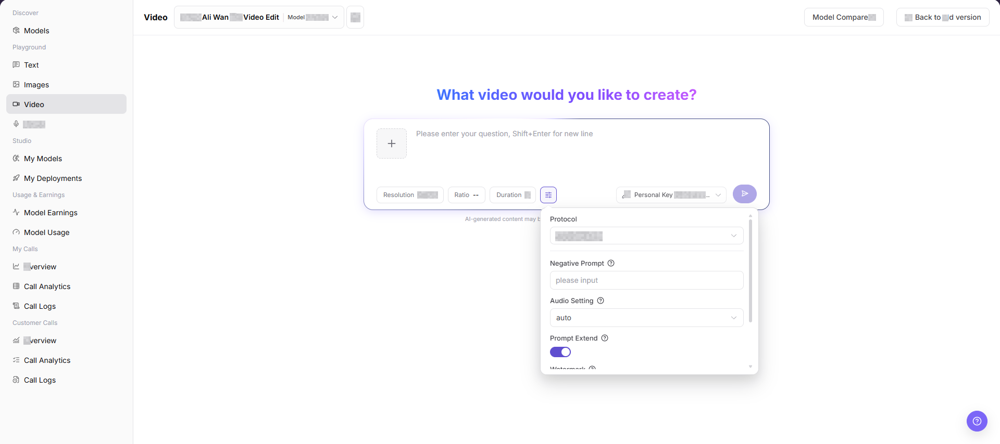
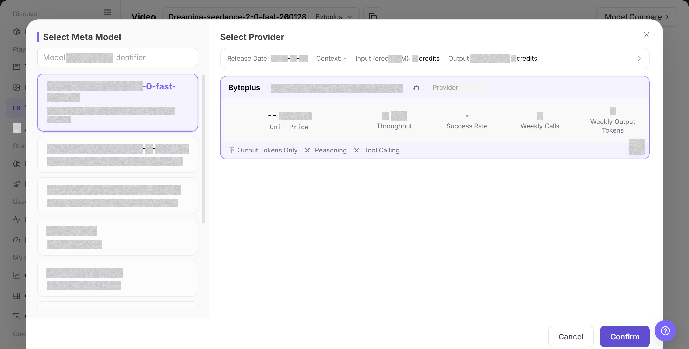
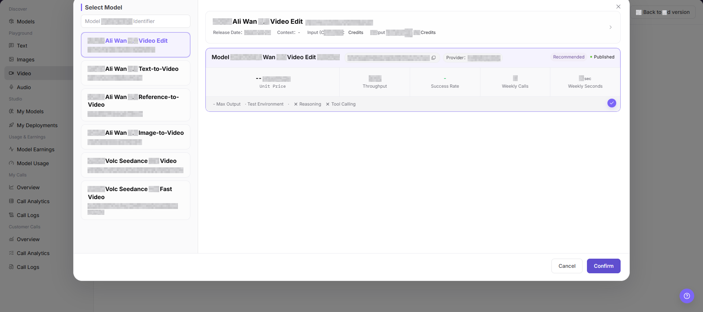
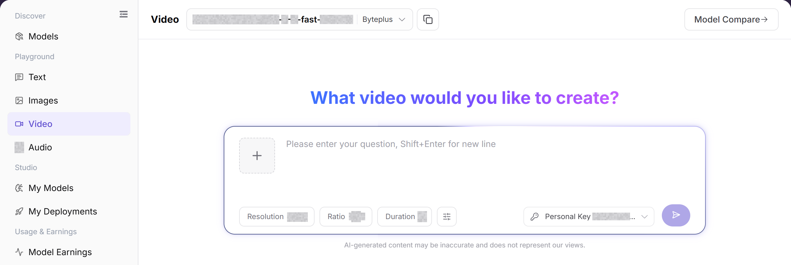

# Video

## Feature Overview

| Item | Content |
| --- | --- |
| Applicable Roles | Model Provider, Model Consumer |
| Navigation Path | Model Services > Playground > Video |
| Page Route | `/modelone/exploration/video` |
| Managed Objects | Video models, prompts, reference assets, generation parameters, and job results |

#### Beginner Explanation

The Video playground is a place to try a video model. Select a video model and provider from the selector, enter the input, adjust parameters, and review the result or error message before integration.

#### Terminology

| Term | Description |
| --- | --- |
| Model Instance | The model and provider combination used by the playground. |
| Prompt | Instructions that describe the task, input, and expected output. |
| Generation Parameters | Settings that control length, randomness, size, or other generation behavior. |
| Personal Key | A personal credential used for calls. Documentation uses `<PERSONAL_KEY>`. |

#### Recommended Operation Order

For a first trial, select a video model, verify the provider and Personal Key, configure the input and parameters, and then submit and review the result. Change only a few parameters at a time so that results remain comparable.

#### Beginner Checklist

| Scenario | Do First | Do Not Do Directly |
| --- | --- | --- |
| Unsure which video model to use | Compare status and capabilities in the selector | Submit with the default model immediately |
| Preparing input | Remove credentials, customer data, and production data | Paste raw sensitive content |
| Preparing parameter changes | Change only a few parameters at a time | Change every parameter together |
| Generation fails | Review the page error and call logs first | Submit repeatedly |

## Prerequisites

1. The current account has access to the video Playground page.
2. The target video model is authorized for the current account to try.
3. Prompts, reference images, and video materials do not contain real keys, customer privacy, unauthorized materials, or sensitive content.
4. Resolution, aspect ratio, duration, and advanced parameters have been confirmed to be within the target model support range.

::: warning Call, Billing, Async Task, and Content Risk
Clicking Generate creates a real model call and may consume credits or create call logs, billing records, and asynchronous tasks. Before submission, verify the model, parameters, asset authorization, expected cost, and queue time.
:::

## Page Description

The page contains video model selection, an input area, parameters, Personal Key selection, and a result area. Submission creates a real call and may create usage or billing records.

Page screenshots:

Focus on the model, input area, parameter entry, and submit button. Verify the input again before submission.

## Main Operations

### Select Video Model

1. Go to `Model Services > Playground > Video`.
2. Click the current model name or **"Select Model"** to open the selector.
3. Locate the target model and compare provider, context, price, latency, throughput, success rate, and status.
4. Select a listed instance and return to the playground. Confirm that the model and provider shown at the top are correct.

The image shows the model selector. Compare provider capability, price, performance, and status.

This image provides an additional view of model selection and instance information.

### Configure and Generate Video Content

1. Confirm that the current model, provider, and Personal Key are correct.
2. Describe the video, upload reference assets when required, and set duration, aspect ratio, and generation parameters. Confirm asset authorization and cost, and then click **"Generate"**.
3. After submission, review the result, latency, usage, and error message. For a failure, check model status, quota, parameters, and rate limits first.
4. When recording an issue, retain only a redacted request identifier, model name, and time. Do not copy real credentials or complete sensitive input.

The image shows the input and parameter area. Verify the model, input, Personal Key, and generation settings before submission.

## Parameter Reference

| Field Name | Required | Field Type | Example | Description |
| --- | --- | --- | --- | --- |
| Model | Yes | Dropdown | `Mock Ali Wan 2.7 Video Edit` | Video model currently being tried. |
| Provider | Yes | Dropdown | `Example Provider` | Provider instance of the current model. |
| Prompt | Yes | Multiline text | `Generate a product showcase video` | Describes the video content, action, and style to generate. |
| Reference Image | Conditionally required | Image upload | `reference.png` | Used for image-to-video, reference-to-video, or video editing scenarios. |
| Resolution | No | Option | `1080P` | Controls the generated video resolution. |
| Aspect Ratio | No | Option | `--` | Controls the generated video aspect ratio. |
| Duration | No | Number / Option | `0` | Controls the generated video duration. |
| Protocol | No | Dropdown | `openai/video` | Protocol used by the current video generation call. |
| Negative Prompt | No | Text | `blurry, shaky` | Describes content that should not appear in the video. |
| Audio Setting | No | Dropdown | `auto` | Controls audio generation or retention strategy. |
| Prompt Extend | No | Toggle | `On` | Controls whether prompt extension is enabled. |
| Watermark | No | Toggle | `Off` | Controls whether a watermark is added. |
| Generated Result | No | Video / Task area | Generated video or task progress | Displays generated videos, task progress, error messages, or an empty state. |

## Pitfalls

- Do not upload or describe videos or reference images containing customer privacy, faces, license plates, contracts, medical records, or unauthorized materials.
- Video generation usually takes longer. Higher resolution, longer duration, and more complex reference materials increase cost and failure probability.
- Generated videos may involve copyright, portrait rights, trademarks, and compliance boundaries. Confirm authorization before formal use.
- Video generation may create asynchronous or queued tasks. Check existing task status before submitting again.

## Result Validation

| Check Item | Success Signal | If Abnormal |
| --- | --- | --- |
| Page is accessible | The `Video` page opens, and the left Playground menu and top model selector are visible. | Check account permissions, navigation path, and page loading status. |
| Model selector loads | The model selector can be opened and shows model list, provider instances, and status information. | Refresh the page and retry, or confirm whether the target model is visible to the current account. |
| Input and parameter areas are visible | Reference image entry, prompt input box, Resolution, Ratio, Duration, Negative Prompt, Audio Setting, Prompt Extend, and other fields are visible. | Check whether the page has fully loaded. If needed, switch models and view again. |
| Result area is visible | The page shows generated results, task progress, an error message, or an empty state. | If there is no generation record, confirm that the input and parameter areas remain visible. |
| Real generation returns a result | When generation is explicitly allowed, the page returns a generated video, task progress, or clear error message. | Adjust the prompt, lower resolution, or shorten duration, and check error messages or call logs. |

## FAQ

#### Target Model Is Missing

**Symptom:**

The target model does not appear in the selector.

**Possible Causes:**

- The model is not authorized for the account.
- Its status or modality does not match the page.

**Resolution:**

1. Verify visibility and model status.
2. Confirm input and output capabilities in Models.

#### Submit Is Unavailable

**Symptom:**

The request cannot be submitted after input is entered.

**Possible Causes:**

- No model or Personal Key is selected.
- Required input or parameters are incomplete.

**Resolution:**

1. Select the model and Personal Key again.
2. Complete the required input and parameter fields marked on the page.

#### Generation Fails or Times Out

**Symptom:**

The request fails or remains pending.

**Possible Causes:**

- The model service is busy or rate-limited.
- Input or parameters exceed model limits.

**Resolution:**

1. Review the page error and call logs.
2. Shorten input or restore default parameters and retry.

#### Result Does Not Meet Expectations

**Symptom:**

The result does not meet content, format, or quality requirements.

**Possible Causes:**

- The prompt lacks constraints.
- Too many parameters changed together.

**Resolution:**

1. Add goals, format, and prohibited content.
2. Restore baseline settings and compare one change at a time.

#### Usage or Cost Is Unexpected

**Symptom:**

One trial creates more usage than expected.

**Possible Causes:**

- Output size or generation count is too large.
- The same task was submitted repeatedly.

**Resolution:**

1. Check generation settings and call logs.
2. Stop repeated submissions and confirm billing scope.

## Notes

- Do not upload or describe videos containing customer privacy, faces, license plates, contracts, medical records, or unauthorized materials.
- Long videos and high-resolution generation significantly increase latency, cost, and failure probability.
- Before screenshots, confirm that prompts, materials, and generated content can be public.

## Next Steps

1. Save reusable prompts and parameter combinations.
2. When troubleshooting is needed, use model name, time, and error messages to view call logs.
3. Before using generated videos formally, confirm copyright, portrait rights, compliance, and public distribution scope.
