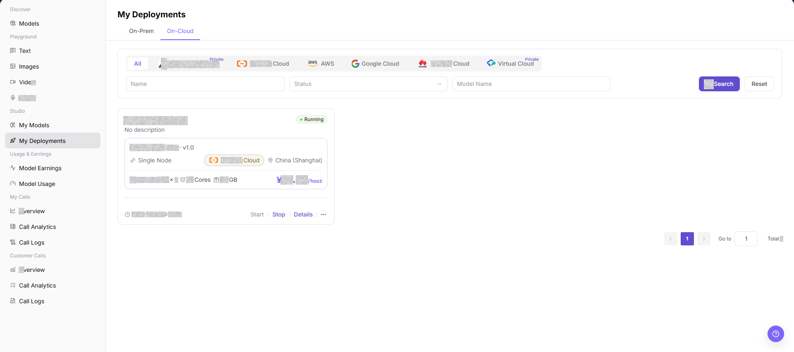
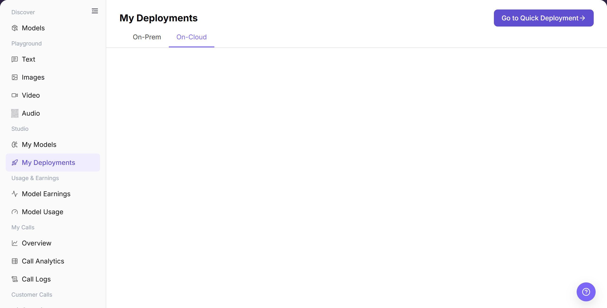
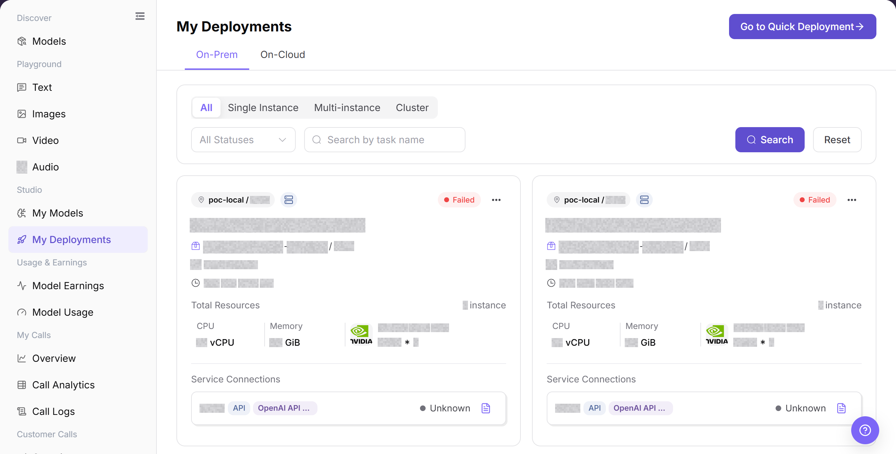
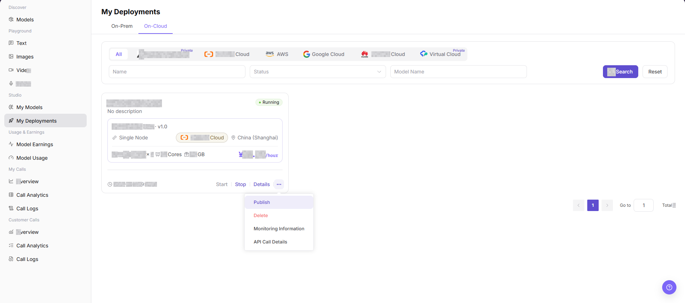
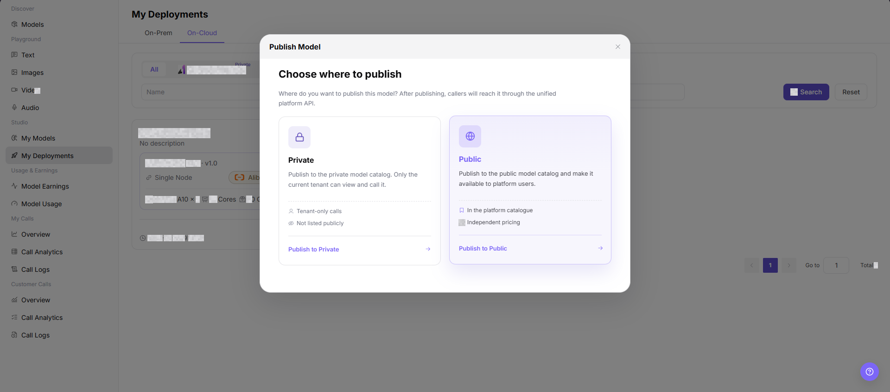
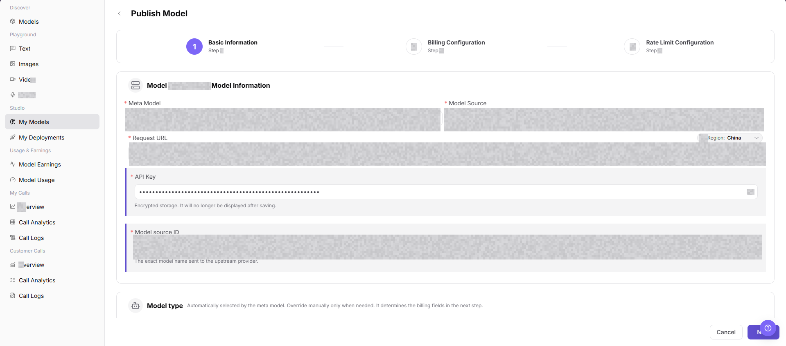

# My Deployments

## Feature Overview

| Item | Content |
| --- | --- |
| Applicable Roles | Model Provider |
| Navigation Path | Model Services > Studio > My Deployments |
| Page Route | `/modelone/my-deployments/models` |
| Managed Objects | On-Cloud deployments, On-Prem deployments, deployment status, and publishing entry |

#### Beginner Explanation

My Deployments works like a model deployment register. On-Cloud shows cloud deployments and On-Prem shows deployments in self-managed environments. Confirm the deployment type before reviewing status, resources, and call information.

#### Terminology

| Term | Description |
| --- | --- |
| On-Cloud | A deployment that runs on cloud-platform resources. |
| On-Prem | A deployment that runs in self-managed physical or virtual infrastructure. |
| Deployment Status | The current creation, running, failed, or stopped state of a deployment. |
| Call Information | The URL, protocol, and authentication requirements used after deployment. |

#### Recommended Operation Order

Open the relevant On-Cloud or On-Prem tab, locate the deployment, and review its details. To publish a new model, use the publishing entry and confirm the region before continuing.

#### Beginner Checklist

| Scenario | Do First | Do Not Do Directly |
| --- | --- | --- |
| Unsure where a deployment runs | Check both deployment tabs | Query one tab repeatedly |
| Deployment status is abnormal | Review details and status information | Redeploy immediately |
| Preparing to record call information | Use URL and credential placeholders | Put real credentials in documentation |
| Preparing to publish a model | Confirm region and resources first | Submit publication immediately |

## Prerequisites

1. The current account has permission to view `Studio > My Deployments`.
2. At least one deployment record is listed on the page.
3. The target deployment meets the conditions for displaying the publish entry, and `Publish` is visible in the more actions menu.
4. Before publishing, the publish region, visibility scope, billing configuration, and call configuration risks have been confirmed.
5. Before publication, confirm the deployment region, resources, model source, visibility, billing, and rate limits.

::: warning High-Risk Operation Boundary
Publishing a model affects model visibility, call methods, billing, and user access. Before submission, verify the publishing region, business scope, resources, model source, billing, and rate limits.
:::

## Page Description

The page separates deployment locations into On-Cloud and On-Prem. Lists show models, regions, status, and actions. The publishing entry starts a new model publication flow.

Page screenshots:

Focus on deployment type, model name, region, status, and actions.

## Main Operations

### View On-Cloud Deployments

1. Go to `Model Services > Studio > My Deployments`.
2. Click **"On-Cloud"**.
3. Locate a deployment by name or status and verify the model, cloud platform, region, and running state.

The image shows On-Cloud deployments. Verify cloud platform, region, and status.

### View On-Prem Deployments

1. Go to `Model Services > Studio > My Deployments`.
2. Click **"On-Prem"**.
3. Locate a deployment by name or status and verify the model, resources, instances, and running state.

The image shows On-Prem deployments. Verify resources, instances, and deployment status.

### Publish a Model

1. Click **"Publish Model"** on My Deployments.
2. Select a publishing region and confirm deployment mode and visibility.
3. Complete the publication form and verify resources, model source, billing, and rate limits before submission.
4. Return to the relevant deployment tab to review status. If the status is abnormal, open details before submitting again.

Start a new deployment publication flow from this entry.

Confirm the publishing region and deployment scope.

Verify resources, source, billing, and rate limits before submission.

## Parameter Reference

| Field Name | Required | Field Type | Example | Description |
| --- | --- | --- | --- | --- |
| Deployment Name | Yes | Text | `Example Deployment` | Identifies the target deployment record. |
| Model Name | Yes | Text | `Example Model` | Model associated with the target deployment. |
| Deployment Status | Yes | Status tag | `Running` | Indicates whether the deployment may show a publish entry or meet later publishing conditions. |
| Region | Yes | Text | `China (Shanghai)` | Region where the target deployment is running. Verify it against the publish region and business scope before publishing. |
| Resource Specification | Yes | Text | `NVIDIA A10 x 1` | Shows GPU, CPU, memory, and other resource specifications used by the deployment. |
| Publish Entry | Yes | More actions | `Publish` | Entry from the target deployment to the publish region selection flow. |
| Publish Region | Yes | Card selection | `Private` / `Public` | Determines the publish target and visibility scope after the redirect. |
| Redirect Target | Yes | Page redirect | `My Models > Publish Model` | Target page after a publish region is selected. |
| Publish Scope | Conditionally required | Page configuration | `Private` / `Public` | Confirms the model visibility scope on the publish model page. |
| Billing Configuration | Conditionally required | Step configuration | `Token` / `Free` | Confirms pricing, free quota, or billing method on the publish model page. |
| Call Configuration | Conditionally required | Step configuration | `<BASE_URL><ENDPOINT_PATH>` | Confirms request URL, API Key, model source ID, rate limits, and other call-related settings. |
| Actions | No | Row buttons / more menu | `Start` / `Stop` / `Details` / `Publish` | Page entries for viewing, controlling, or entering the publish flow. |

## Pitfalls

- My Deployments shows deployment status. It does not mean the model has been published to the marketplace.
- When deployment is abnormal, check Resource Pool, Runtime Image, model asset, and startup logs before submitting again.
- Deleting, stopping, or restarting a deployment may affect Model Consumers. Confirm traffic and rollback path first.

## Result Validation

| Check Item | Success Signal | If Abnormal |
| --- | --- | --- |
| Page is accessible | The `My Deployments` page opens, and the `On-Prem` and `On-Cloud` tabs are visible. | Check account permissions, navigation path, and page loading status. |
| Deployment list loads | The target deployment card shows deployment name, model name, status, region, and resource specification. | Click **"Search"** or `Reset` and retry. Check filters and deployment permissions if needed. |
| Target deployment status is visible | The target deployment status is shown as the real page status, such as `Running`. | Confirm whether the deployment task is complete, or open `Details` to view deployment status. |
| Publish entry is visible | Eligible deployments show `Publish` in the more actions menu. | Check deployment status, account permissions, and row actions. |
| Publish region can be selected | The `Publish Model` dialog opens and shows `Private`, `Public`, and the corresponding publish buttons. | Close the dialog and retry, or check whether the account has permission for the selected publish region. |
| Redirect target is correct | After selecting a publish region, the page opens the `Publish Model` page under `Model Services > Studio > My Models`. | Check publish region permissions, page route, and browser redirect status. |
| Publish fields are visible | The page shows `Basic Information`, `Billing Configuration`, `Rate Limit Configuration`, and their key fields. | Go back and select the publish region again, or refresh the publish model page. |

## FAQ

#### Deployment List Is Empty

**Symptom:**

The target deployment is missing from On-Cloud or On-Prem.

**Possible Causes:**

- The wrong tab is open.
- Filters or visibility do not match.

**Resolution:**

1. Check both deployment tabs.
2. Reset filters and verify permission.

#### Deployment Details Do Not Open

**Symptom:**

Opening a deployment returns no details or an error.

**Possible Causes:**

- The record is still being created.
- The record expired or permission is missing.

**Resolution:**

1. Refresh the list and verify status.
2. Confirm the record exists and the account can view it.

#### Deployment Status Does Not Change

**Symptom:**

Status remains in creating or processing.

**Possible Causes:**

- Resources are not ready.
- The deployment task encountered an error.

**Resolution:**

1. Review stages and errors in details.
2. Ask an authorized operator to inspect the task.

#### Call Information Is Unavailable

**Symptom:**

No call information is listed after deployment.

**Possible Causes:**

- The service is not ready.
- Call permission or network scope is not configured.

**Resolution:**

1. Verify deployment health.
2. Check authorization and network access.

#### Model Publication Fails

**Symptom:**

No deployment record is created after submission.

**Possible Causes:**

- Resource, source, or billing configuration is incomplete.
- The name is duplicated or the region is incorrect.

**Resolution:**

1. Correct fields indicated by the page.
2. Verify name and region before resubmission.

## Notes

- Publishing a model affects model visibility, call methods, billing configuration, and user access.
- Selecting the wrong publish region may publish the model to the wrong site, region, or business scope.
- `发布 / Publish`, `提交 / Submit`, and `保存 / Save` are high-risk final actions.
- Do not write real accounts, secrets, tokens, AK/SK, Endpoints, API Keys, customer names, pricing strategies, cloud resource IDs, or internal test parameters.

## Next Steps

1. Return to `My Models` to view the publish model configuration progress.
2. Verify the model visibility, billing configuration, and call configuration for the selected publish region.
3. If a real publish action has been performed, open model details or the call page to confirm status and access control.
