# My Models

## Feature Overview

| Item | Content |
| --- | --- |
| Applicable Roles | Model Provider |
| Navigation Path | Model Services > Studio > My Models |
| Page Route | `/modelone/model/my/overview` |
| Managed Objects | Published models, aggregate models, publishing entry, and aggregate-model creation entry |

#### Beginner Explanation

My Models is the Model Provider workspace. My Published manages directly published models, My Aggregate manages models composed from multiple sources, and the overview entries start new publishing or aggregation flows.

#### Terminology

| Term | Description |
| --- | --- |
| My Published | Models published directly by the current Model Provider. |
| My Aggregate | Models composed from multiple listed models by a routing strategy. |
| Private Region | A scope visible and callable only to members of the publishing tenant. |
| Public Region | A scope that can provide models to platform tenants or selected tenants. |

#### Recommended Operation Order

For a first publication, open the publishing entry, confirm the region, and complete basic information, billing, and rate limits. Verify the status in My Published afterward. Before creating an aggregate model, confirm that all candidate models are listed.

#### Beginner Checklist

| Scenario | Do First | Do Not Do Directly |
| --- | --- | --- |
| Preparing to publish | Confirm Private or Public Region | Skip visibility review |
| Preparing an aggregate model | Verify candidate model status | Select models whose status does not permit aggregation |
| No record after publication | Check tab, status, and filters | Submit publication repeatedly |
| Preparing to change a listed model | Assess customer and call impact | Delist or overwrite key settings directly |

## Prerequisites

1. The current account has access to the `My Models` page. A Model Provider sees `Start`. A Model Consumer sees `Contact Us` for protected entries.
2. Before publishing a model, the meta model, model source, request URL, authentication information, protocol, and billing plan are prepared.
3. Before creating an aggregate model, at least two compatible published models are listed for aggregation.
4. Before publishing, saving, creating, delisting, or deleting, confirm the impact scope, customer visibility, billing changes, and recovery plan.

::: warning High-Risk Operation Boundary
`Publish`, `Submit`, `Save`, `Create`, `Delist`, and `Delete`, and changes to billing, free quota, visibility, call configuration, or routing strategy affect model services, customer calls, and billing. Verify affected objects, approval requirements, and the recovery plan before execution.
:::

## Page Description

The page contains Overview, My Published, and My Aggregate. Lists show existing models, while business entries in Overview start model publication or aggregate-model creation.

Page screenshots:

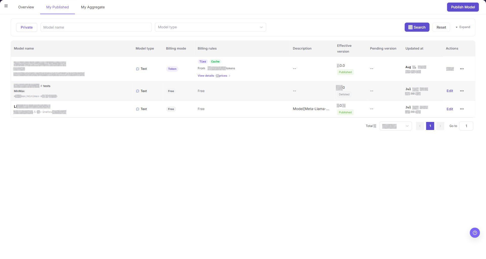

My Published shows directly published models, regions, status, and actions.

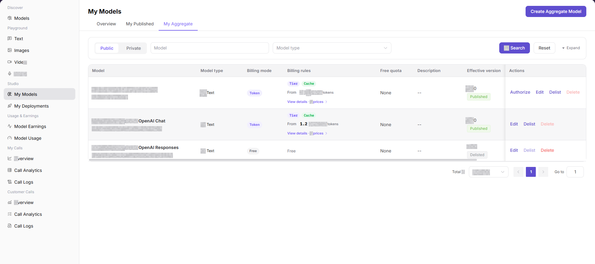

My Aggregate shows aggregate models and their current status.

## Main Operations

### View Published Models

1. Go to `Model Services > Studio > My Models`.
2. Click **"My Published"**.
3. Locate a model by name, region, or status, and verify its state and row actions.

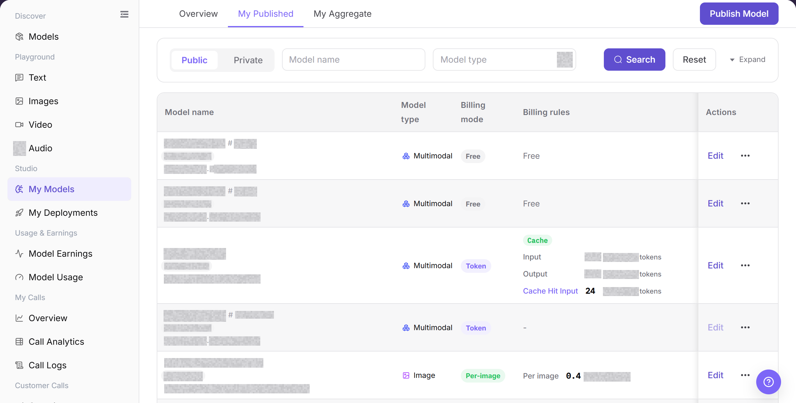

The image shows My Published. Verify the publishing region, status, and actions.

### View Aggregate Models

1. Go to `Model Services > Studio > My Models`.
2. Click **"My Aggregate"**.
3. Verify the aggregate-model name, region, status, and candidate-model information.

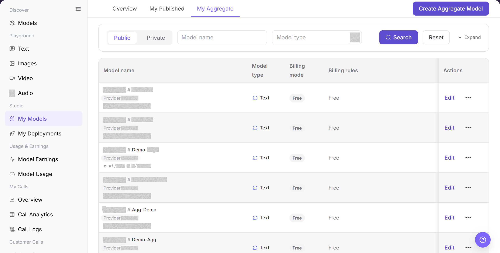

The image shows My Aggregate. Verify aggregate-model status and row actions.

### Publish a Model

1. Open the model publishing entry from My Models Overview.
2. Select Private Region or Public Region and confirm the intended visibility.
3. Complete basic information, model source, billing, and rate limits. Use `<BASE_URL>`, `<ENDPOINT_PATH>`, and `<PERSONAL_KEY>` for example URLs and credentials.
4. Before submission, verify price, rate limits, authorization scope, and model status. Check the result in **"My Published"** afterward.

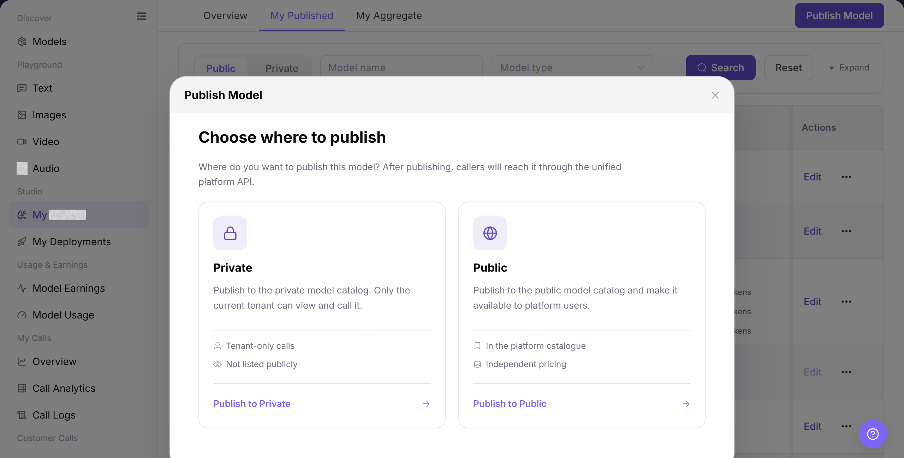

The image shows publishing-region options. Confirm Private or Public Region before continuing.

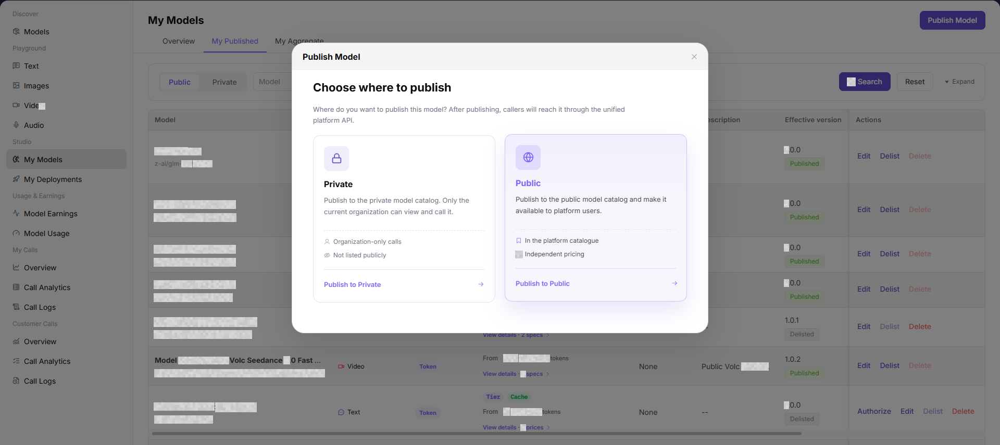

Confirm that the publishing region matches the intended visibility.

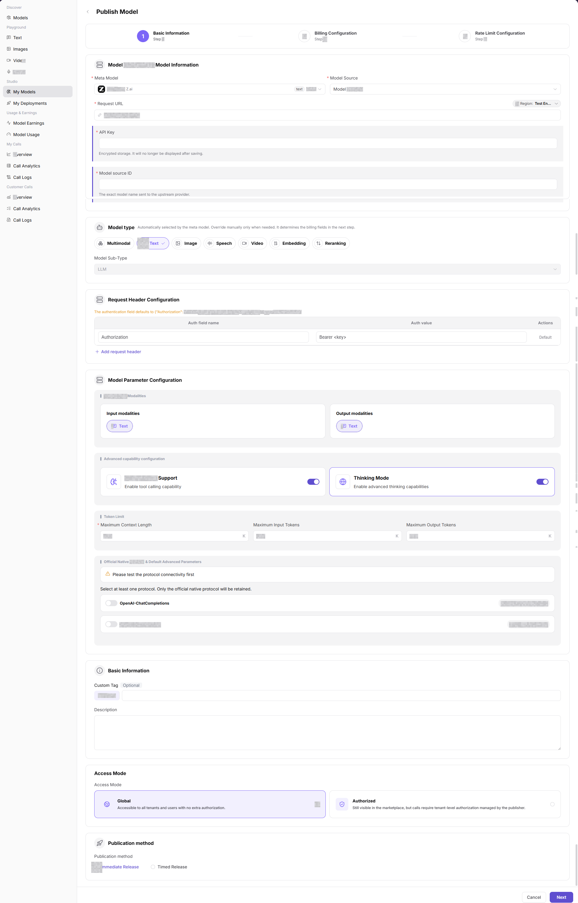

Verify the model name, source, and display information.

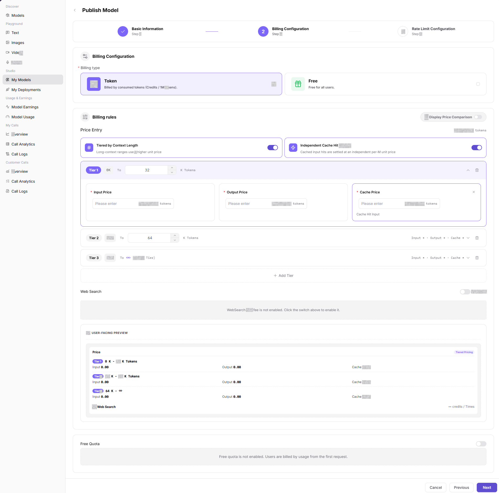

Verify billing units, price, and free quota.

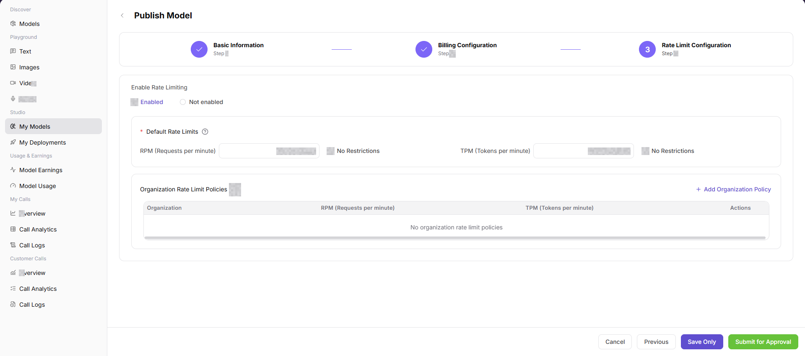

Verify the rate-limit period, threshold, and scope.

### Create an Aggregate Model

1. Open the aggregate-model entry from My Models Overview.
2. Select Private Region or Public Region and confirm the target customer scope.
3. Enter basic information, select listed candidate models, and configure routing, billing, and rate limits.
4. Before submission, verify candidate-model status and strategy. Check the result in **"My Aggregate"** afterward.

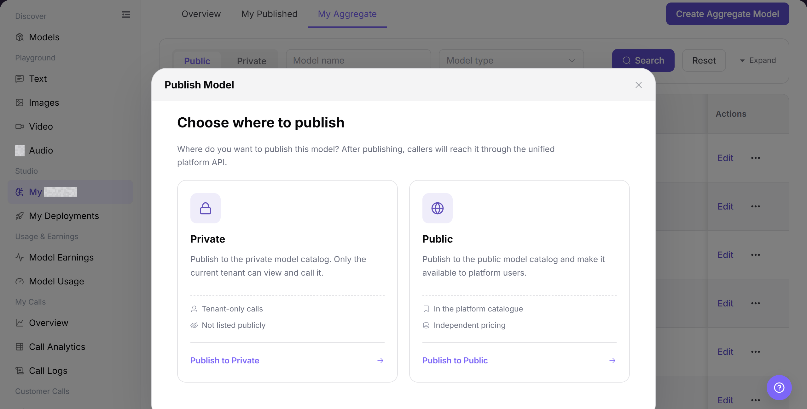

The image shows aggregate-model region options. Confirm visibility before continuing.

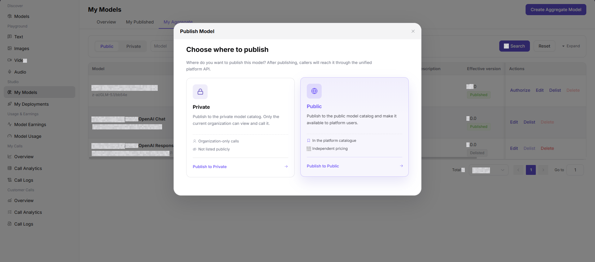

Confirm the aggregate-model region and customer scope.

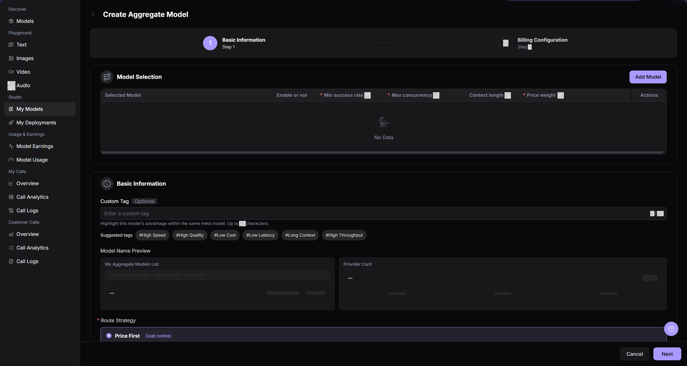

Verify the name, candidate models, and routing strategy.

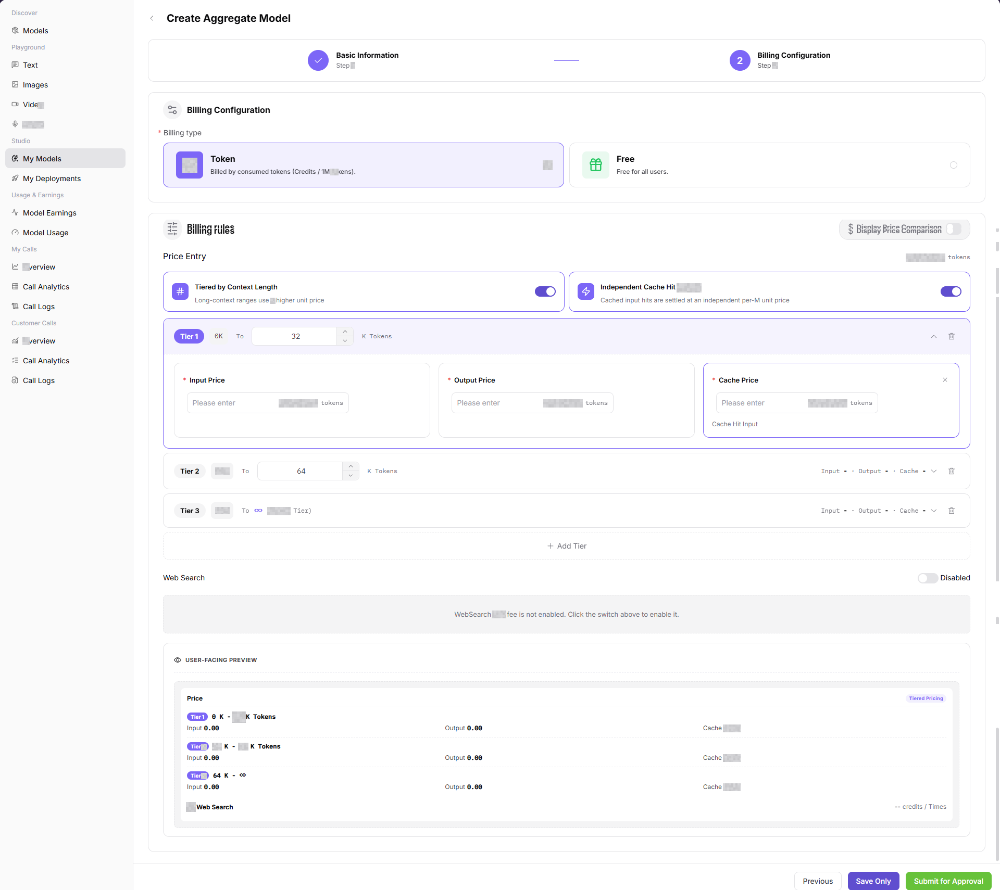

Verify aggregate-model billing units and price.

## Parameter Reference

| Field Name | Required | Field Type | Example | Description |
| --- | --- | --- | --- | --- |
| Publishing destination | Yes | Card selection | `Private` / `Public` | Determines the catalog and call scope after publishing. |
| Meta Model | Required for publishing | Dropdown | `Example Meta Model` | Defines model capability, protocol, and base type. |
| Model Source | Required for publishing | Dropdown | `Example Source` | Model request source or provider connection source. |
| Request URL | Required for publishing | Input | `<BASE_URL><ENDPOINT_PATH>` | Model service access URL. Do not write real internal URLs in the document. |
| API Key | Conditionally required | Secret input | `Bearer <API_KEY>` | Authenticates model source requests and is not shown after saving. |
| Model Source ID | Conditionally required | Input | `example-model-id` | Model identifier sent to the upstream provider. |
| Model Type | Yes | Radio / tag | `Text` | Model capability type, such as Text, Image, Speech, Video, Embedding, or Reranking. |
| Protocol | Yes | Toggle / tag | `OpenAI-ChatCompletions` | Call protocol supported by the model. |
| Access Mode | Yes | Radio card | `Global` / `Authorized` | Controls whether calls require authorization. |
| Publication method | Yes | Radio | `Immediate Release` / `Timed Release` | Controls when publishing takes effect. |
| Billing type | Yes | Selector | `Token` | Sets the model call billing method. |
| Price Entry | No | Selector / toggle | `Input / Output` | Sets the pricing configuration entry or how pricing takes effect. |
| Input Price | Conditionally required | Number | `0.1 Credits` | Sets the billing price for input Tokens, characters, or requests. |
| Output Price | Conditionally required | Number | `0.2 Credits` | Sets the billing price for output Tokens, characters, or results. |
| Cache Price | No | Number | `0.05 Credits` | Sets the price for cache hits or cache-related calls. |
| Web Search | No | Toggle / selector | `On` / `Off` | Sets whether the model supports Web Search and related billing capabilities. |
| Free Quota | No | Number | `100 Credits` | Sets the quota that users can use for free. |
| Aggregate Model | Required for aggregation | Model selection | `Example Source:Example Model` | Published model included in the aggregate model. |
| Enable | No | Toggle | `On` | Includes or excludes the model from routing. |
| Minimum Success Rate | Yes | Number input | `95` | Sets the minimum success-rate requirement for the model row. |
| Maximum Concurrency | Yes | Number input | `10` | Sets the maximum concurrent calls for the model row. |
| Context Length | No | Number input | `8,192 Tokens` | Shows or sets the context-length boundary for the model row. |
| Price Weight | Yes | Number input | `1-100` | Sets a unitless routing weight. It is not a billing amount. |
| Custom or Suggested Tag | No | Text / tag | `#Low Latency` | Describes an advantage and updates the model-name preview. |
| Model Name Preview | System generated | Preview | `Example Aggregate Model` | Previews the aggregate model name in list and provider-card layouts. |
| Route Strategy | Required for aggregation | Radio | `Price First` | Selects one of the five routing strategies shown on the page. |
| Status | No | Tag | `Published` / `Delisted` | Current publishing status of the model. |
| Actions | No | Row buttons | `Authorize` / `Edit` / `Delist` / `Delete` | View or manage a model record. |

## Pitfalls

- My Models is a publishing workspace. A record on this page does not prove that Model Consumers can select or invoke the model. Check its review and deployment status.
- Before changing model source, template, Endpoint, or billing configuration, confirm whether existing Model Consumers are affected.
- Review materials must not expose real keys, internal addresses, customer data, or complete test requests.

## Result Validation

| Check Item | Success Signal | If Abnormal |
| --- | --- | --- |
| Page opens | The page shows the `Overview`, `My Published`, and `My Aggregate` tabs. | Check account permissions, navigation path, and page loading status. |
| Model list loads | `My Published` or `My Aggregate` shows model records, status, version, and operation entries. | Click **"Search"** or `Reset` and retry. Check permissions and filters if needed. |
| Publish Model entry is visible | The `Publish Model` button or publishing entry is visible and can open the publishing destination dialog. | Check whether the account has model publishing permission. |
| Create Aggregate Model entry is visible | The `Create Aggregate Model` button or entry is visible and opens the publishing destination dialog. | Confirm that compatible published models are listed. |
| Publish fields are visible | The page shows the Basic Information, Billing Configuration, and Rate Limit Configuration steps. | Go back to select the publishing destination again, or refresh the page. |
| Aggregate fields are visible | The page shows Model Selection, row controls, tags, name preview, Route Strategy, Access Mode, and Billing Configuration. | Check whether selected models meet the same meta model requirement. |

## FAQ

#### Target Model Is Missing from the List

**Symptom:**

A published or aggregate model does not appear.

**Possible Causes:**

- The active tab or filters are incorrect.
- Submission failed or status is still updating.

**Resolution:**

1. Open the relevant tab and reset filters.
2. Verify submission result and model status.

#### Publishing Entry Cannot Continue

**Symptom:**

The publishing flow does not proceed.

**Possible Causes:**

- The account lacks publishing permission.
- The required region or prerequisite configuration is missing.

**Resolution:**

1. Verify that the account has Model Provider permissions.
2. Confirm region, model source, and prerequisites.

#### Public Publication Is Blocked

**Symptom:**

Publication cannot continue after Public Region is selected.

**Possible Causes:**

- Identity or authorization conditions are unmet.
- Model information or review conditions are incomplete.

**Resolution:**

1. Verify identity and authorization scope.
2. Complete model information and submit again.

#### No Candidate Model Is Listed

**Symptom:**

No candidate can be selected for an aggregate model.

**Possible Causes:**

- Candidates are not listed or visible.
- Model type or region does not match.

**Resolution:**

1. Verify candidate status and visibility.
2. Align model type and publishing region.

#### Published Model Is Not Visible

**Symptom:**

My Published has a record but Models does not.

**Possible Causes:**

- The model is under review or not listed.
- Visibility does not include the current account.

**Resolution:**

1. Verify publishing status and region.
2. Validate visibility with an account in the target scope.

## Notes

- Do not write real accounts, passwords, access parameters, API Keys, tokens, AK/SK, or private keys in the document.
- Before screenshots or export, confirm that the page does not contain real secrets, unredacted request headers, internal Endpoints, or sensitive business data.
- Publishing models and creating aggregate models affect model visibility, customer calls, and billing. Complete an impact assessment before submission.
- Pricing, billing type, Web Search, and free quota affect real call costs, billing statistics, and user quota. The document only describes the configuration flow and does not record real pricing strategies.

## Next Steps

1. After publishing, view model status, review records, and effective version.
2. Go to **"Models"** or **"Playground"** to verify model name, capability, pricing, and visibility.
3. Track call quality and billing results through call logs, usage details, and model earnings.
4. After an aggregate model is live, continue monitoring success rate, latency, cost, and routing hits.
