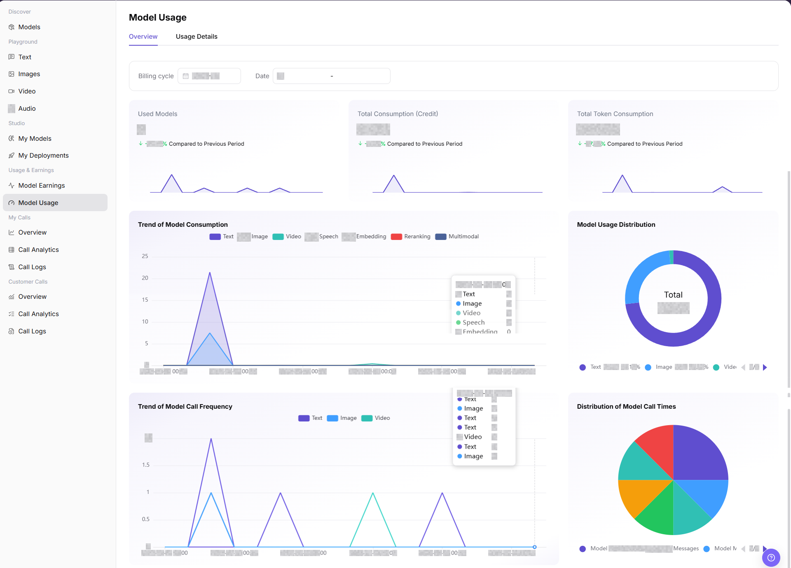
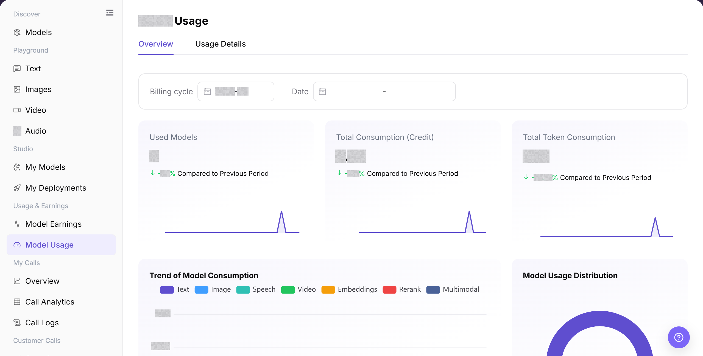
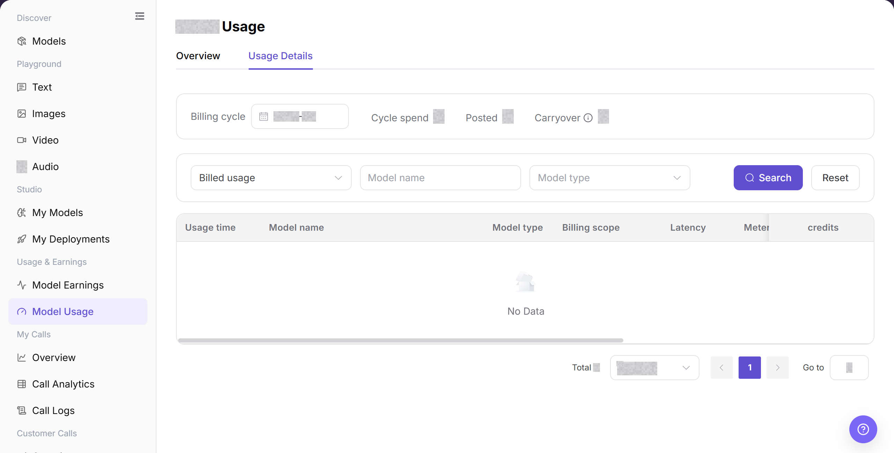
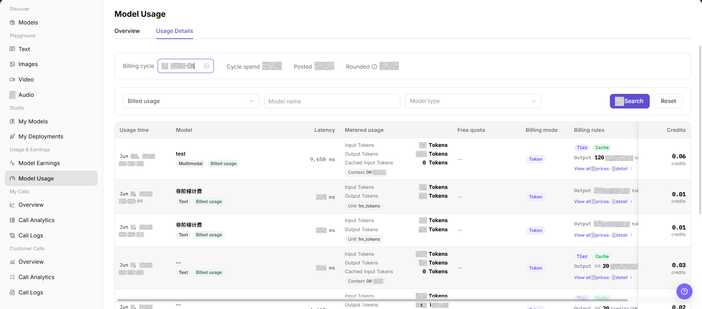

# Model Usage

## Feature Overview

| Item | Content |
| --- | --- |
| Applicable Roles | Model Provider |
| Navigation Path | Model Services > Usage and Earnings > Model Usage |
| Page Route | `/modelone/accounting/deduction/overview/model` |
| Managed Objects | Usage overview, consumption trends, model distribution, and usage details |

#### Beginner Explanation

Model Usage works like a usage ledger for model activity. Use the overview for totals and trends, and use details to reconcile records by time, user, or model.

#### Terminology

| Term | Description |
| --- | --- |
| Overview | Summarizes usage indicators and trends for the selected time range. |
| Usage Details | Shows individual usage records by time and business object. |
| Statistics Period | Determines the time range and aggregation scope for overview and details. |
| Model Distribution | Shows each model's share of total usage. |

#### Recommended Operation Order

Review totals, trends, and model distribution in Overview, and then query records in Usage Details. Use the same statistics period in both tabs during reconciliation.

#### Beginner Checklist

| Scenario | Do First | Do Not Do Directly |
| --- | --- | --- |
| No data | Expand the statistics period first | Conclude that there is no usage |
| Overview and details differ | Align time range and filters | Mix different scopes |
| Preparing reconciliation | Record the period and filters | Keep screenshot values only |
| Sharing data | Redact users and business identifiers first | Share raw details externally |

## Prerequisites

1. The current account has access to the `Model Usage` page.
2. The target model has call records in the statistical period.
3. The billing cycle, date range, billed usage status, model name, or model type to view has been confirmed.
4. Consumption amount, model call records, request content, and request IDs are sensitive information and must be redacted before screenshots or export.

::: warning High-Risk Operation Boundary
Use this page to view and reconcile usage overview and details. Charging, account adjustment, settlement, and sensitive-data export are not performed here. Redact accounts, requests, amounts, credentials, and business identifiers before sharing data.
:::

## Page Description

The page contains Overview and Usage Details. The overview shows aggregate indicators and trends, while details provide a queryable record list.

Page screenshots:

Use this image to identify aggregate indicators and charts.

## Main Operations

### View Model Usage Overview

1. Go to `Model Services > Usage and Earnings > Model Usage`.
2. Click **"Overview"**.
3. Select a statistics period and verify totals, trends, model distribution, and update time.
4. If no data is shown, expand the period and confirm that the current account has relevant records.

The image shows the overview. Verify the period, aggregate indicators, trends, and model distribution.

### Query Model Usage Details

1. Click **"Usage Details"**.
2. Set the time range, then filter by billing status, model name, or model type.
3. Verify record time, model, business object, and usage value.
4. Before sharing or reconciliation, remove user names, business identifiers, and other sensitive information.

The image shows detail filters and results. Verify the time range, filters, and result scope.

This image provides an additional view of detail fields and list structure.

## Parameter Reference

| Field Name | Required | Field Type | Example | Description |
| --- | --- | --- | --- | --- |
| Billing cycle | Yes | Month selector | `2026-07` | Month that the usage statistics and posting belong to. |
| Date | No | Date range | `2026-07-01 to 2026-07-17` | Limits the statistical time range for overview charts. |
| Billed usage | No | Dropdown | `Billed usage` | Filters usage details by whether the record is billed. |
| Model Name | No | Input | `Example Model` | Filters usage records by model. |
| Model Type | No | Dropdown | `Text` | Filters usage details by model capability type. |
| Input Usage | System-generated | Number | `Input Tokens` | Request input tokens or input-side usage. |
| Output Usage | System-generated | Number | `Output Tokens` | Model output tokens or output-side usage. |
| Cache Usage | System-generated | Number | `Cached Input Tokens` | Cached input hits or cache-related usage. |
| Web Search Usage | System-generated | Number | `12` | Consumption generated by Web Search tools or related capabilities. |
| Cost | System-generated | Number | `Credits` | Credit consumption generated by the call. |
| Status | System-generated | Tag | `Billed usage` | Billing or posting status of the usage record. |
| Actions | No | Row entry | `View` | View usage records, pricing rules, or related billing information. |

## Pitfalls

- Model Usage is for consumption reconciliation. It does not directly equal final revenue, which also depends on billing rules and settlement scope.
- Align model, customer, time range, and call type before comparing usage.
- Recent calls may not appear immediately because of statistical delay. Check call logs at the same time.

## Result Validation

| Check Item | Success Signal | If Abnormal |
| --- | --- | --- |
| Page is accessible | The `Model Usage` page opens, and `Overview` and `Usage Details` tabs are visible. | Check account permissions, navigation path, and page loading status. |
| Usage overview displays | Used Models, Total Consumption, Total Token Consumption, and charts are visible. | Switch Billing cycle or Date and retry. Confirm whether the current period has usage data. |
| Filter controls can be selected | Billing cycle, Date, Billed usage, Model name, and Model type can be entered or selected. | Check filter format, or click **"Reset"** and query again. |
| List data loads | The usage details list shows Usage time, Model, Metered usage, Billing mode, Billing rules, and Credits. | Confirm whether the billing cycle contains usage records, or broaden filters. |
| Details entry opens | Pricing rules, detail, or view entries display related information. | Check whether the record is complete, or refresh the page and retry. |
| Fields match filters | Usage, cost, status, and time fields match the filter conditions. | Compare call logs and model earnings to confirm statistical delay or billing-rule differences. |

## FAQ

#### Model Usage Data Is Empty

**Symptom:**

No usage data appears for the selected period.

**Possible Causes:**

- No relevant record exists in the period.
- The filters are too narrow.

**Resolution:**

1. Click **"Reset"** to clear the filters.
2. Select a billing cycle and date range that contain a known call.
3. Check **"My Calls > Call Logs"** with the same range. Contact the administrator if the log exists but Model Usage remains empty.

#### Overview and Details Differ

**Symptom:**

The overview total differs from the sum of details.

**Possible Causes:**

- The tabs use different time ranges.
- Detail filters are still active.

**Resolution:**

1. Align the statistics period.
2. Reset detail filters and calculate again.
3. If the totals still differ, send the billing cycle, date range, and Model ID to the administrator.

#### Target Model Has No Record

**Symptom:**

No usage record appears for the target model.

**Possible Causes:**

- Model name or time criteria do not match.
- The current account does not include the record in its visible model scope.

**Resolution:**

1. Query the model and expand the period.
2. Check the same Model ID in **"My Calls > Call Logs"**.
3. If the log exists but Model Usage has no record, send a redacted request ID to the administrator.

#### Data Update Time Is Abnormal

**Symptom:**

A recent call appears in Call Logs but has no related Model Usage record.

**Possible Causes:**

- Model Usage and Call Logs use different billing cycles or date ranges.
- The target call uses a different model or account.

**Resolution:**

1. Use the same billing cycle, date range, and Model ID.
2. Record the redacted request ID from Call Logs.
3. If Model Usage still has no record, send the filters and request ID to the administrator.

#### Reconciliation Has a Difference

**Symptom:**

Page usage differs from an external record.

**Possible Causes:**

- Billing units or time boundaries differ.
- Model or customer scopes differ.

**Resolution:**

1. Fix time, model, and billing unit.
2. Reconcile record by record from details.
3. If the difference remains, send the redacted details and reconciliation rules to the billing administrator.

## Notes

- Do not write real accounts, request content, amounts, secrets, request IDs, or internal test parameters in the document.
- Before screenshots or export, confirm that model names, business identifiers, Credits, and billing details are redacted.
- Exporting sensitive data, charging, account adjustment, and settlement are outside the scope of this document.

## Next Steps

1. Cross-check with model earnings, call analytics, and call logs.
2. Use redacted usage details for reconciliation.
3. Adjust rate limits, pricing, or model operations strategy based on consumption trends, model usage distribution, and call frequency distribution.
