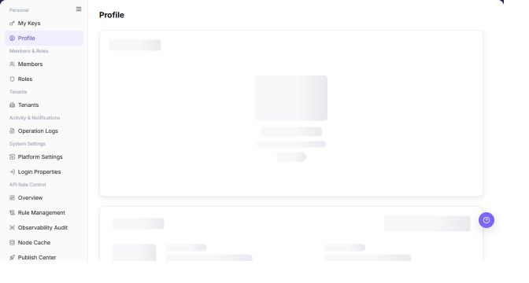

# Getting Started

## Feature Overview

| Item | Content |
| --- | --- |
| Applicable Role | Operator |
| Navigation path | Settings > Operator administration |
| Page route | Current page entry |
| Managed objects | Getting Started |

#### Beginner Explanation

Settings is the platform control panel. Confirm who you are first, then confirm which members exist, which roles they have, and whether the task is about tenant rules, login security, or API rate control. Do not change configuration before identifying the object and risk scope.

#### Terms Quick Reference

| Term | Description |
| --- | --- |
| Profile | Identity and security contact information for the current account.; Confirm account context before sensitive actions. |
| Key | Credential for model or system API calls.; Separate by purpose and rotate regularly. |
| Member | Account that can sign in or collaborate.; Check member status first when login fails. |
| Role | A set of menu and operation permissions.; Check role binding when menus are missing. |
| Tenant | Business subject in the platform.; Confirm tenant and administrator before actions. |

## Prerequisites

1. The current account can access Settings.
2. The target object is clear: personal account, members and roles, tenants, logs, system settings, or API rate control.
3. Before delete, reset, authorize, publish, rollback, export, or login-policy changes, the impact scope and rollback path have been confirmed.
4. Before external communication, confirm that accounts, emails, phone numbers, Keys, AK/SK, tokens, and internal addresses are desensitized.

## Page Description

This page is used to view and process Getting Started-related objects. The entry, filters, list, and settings area depend on what the current role can actually see.

The screenshot keeps the left navigation and the complete functional area with the top menu hidden. Check the fields, buttons, and action locations on the Getting Started page.

## Main Operations

### Choose a Settings Entry

1. Open `Settings > Operator administration`.
2. Locate the target Getting Started by using the visible filters.
3. Review the list, details, or status fields and confirm the target object in context.
4. If the result is unexpected, clear the filters and reopen the page to verify it.

The screenshot keeps the left navigation and the complete functional area with the top menu hidden. Check the fields, buttons, and action locations on the Getting Started page.

**Result validation:** The list, details, and status fields show the target object and remain consistent.

**Note:** Use only the fields and entries visible on the current page. Do not infer behavior from another role's page.

**FAQ:** If the entry is hidden, the button is disabled, or the result is not updated, check the current account permission, filters, object status, and page refresh time.

### Open a Settings Feature Page

1. Open `Settings > Operator administration`.
2. Locate the target Getting Started by using the visible filters.
3. Review the list, details, or status fields and confirm the target object in context.
4. If the result is unexpected, clear the filters and reopen the page to verify it.

The screenshot keeps the left navigation and the complete functional area with the top menu hidden. Check the fields, buttons, and action locations on the Getting Started page.

**Result validation:** The list, details, and status fields show the target object and remain consistent.

**Note:** Use only the fields and entries visible on the current page. Do not infer behavior from another role's page.

**FAQ:** If the entry is hidden, the button is disabled, or the result is not updated, check the current account permission, filters, object status, and page refresh time.

## Parameter Quick Reference

| Field Name | Required | Field Type | Example | Description |
| --- | --- | --- | --- | --- |
| Entry | Yes | Navigation item | `Members & Roles > Members` | Locates the next Settings page to open. |
| Role | Yes | Enum | `Operator` | Determines whether to use the user side or operator side. |
| Permission scope | Yes | Role permission | `Admin` | Determines visible menus and allowed actions. |
| Target object | Conditionally required | Enum | `Role` | Locates members, roles, Keys, login properties, or rate-control configuration. |
| High-risk action | No | Button / action | `Publish` | Indicates whether approval, a change window, and rollback plan are required. |

## Pitfalls

- This getting-started page only helps choose the path. It does not replace field references or operation steps on feature pages.
- When a member cannot see a menu, do not check account status alone. Also verify tenant context, role binding, and menu permissions.
- Keys, login properties, role permissions, and API rate control can all affect access. Troubleshoot by object layer.

## Result Validation

| Check Item | Success Signal | If Abnormal |
| --- | --- | --- |
| Correct entry | You can tell whether the task belongs to Personal, Members and Roles, Tenants, System Settings, or API Rate Control. | Return to the applicable role table and locate the entry again. |
| Clear permission | You know which pages and actions the current account can access. | Check role authorization and tenant context. |
| Clear next step | You can open the specific feature page for the issue. | Follow the recommended reading path. |
| Risk identified | Delete, reset, publish, or export actions have an impact statement. | Prepare approval, change window, and rollback plan first. |

## FAQ

#### Should I start from the user side or operator side?

You are not sure which Settings area to open.

**Possible cause:**

User-side Settings focuses on the current account and objects visible in its tenant. Operator-side Settings focuses on platform-level members, tenants, system policies, and API rate control.

**Resolution:**

For your own account, Keys, projects, and quotas, start from the user side. For members, roles, tenants, login properties, or rate-control rules, start from the operator side.

#### What if a Settings menu is missing?

The left navigation does not show the target menu, or the page has no operation button.

**Possible cause:**

The current account lacks the required role permission, or the current tenant context does not include the target object.

**Resolution:**

Confirm the current account and tenant. Ask an administrator to check role authorization. If permissions changed recently, sign in again and refresh the menu.

#### Why does the Getting Started change not appear?

**Symptom:**

The list or details page still shows the previous value after an action.

**Possible causes:**

Synchronization or cache is delayed, the action was not submitted, or a different object was opened.

**Resolution:**

Check the success message, object identifier, and update time. Refresh the list and reopen details. Review Operation Logs when needed.

#### How should the Getting Started page be exported or captured safely?

**Symptom:**

Page information is needed for troubleshooting, audit, or delivery.

**Possible causes:**

The page may contain accounts, email addresses, IP addresses, internal paths, tenant identifiers, Keys, or amounts.

**Resolution:**

Keep only the necessary fields and action context. Use opaque light-gray pixel mosaics for sensitive text and never share complete credentials or internal addresses.

#### What should I do when the Getting Started page shows unexpected data?

**Symptom:**

A field, status, metric, or related object differs from the expectation.

**Possible causes:**

The page scope, time condition, role permission, or upstream setting does not match.

**Resolution:**

Record the redacted object, time, and result. Verify the entry and filters first, then check related pages and Operation Logs.

## Notes

- This getting-started page only helps choose a path. It does not replace field references on feature pages.
- Accounts, roles, tenants, and system settings can affect one another. Keep the object scope consistent during troubleshooting.
- Login property changes, rate-control publishing, member deletion, and Key rotation are high-risk actions and require impact confirmation.

## Next Steps

- To configure the full account and permission workflow, read [Configure Accounts and Permissions](../end-to-end/configure-account-and-permissions/).
- To manage personal access credentials, open [My Keys](../user/personal/my-keys/).
- To troubleshoot member permissions, open [Members](../operator/members-roles/members/) and [Roles](../operator/members-roles/roles/).
- To troubleshoot rate control, open [API Rate Control Overview](../operator/api-rate-control/overview/).
