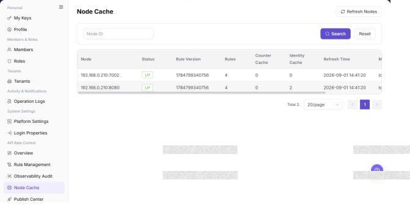

# Node Cache

## Feature Overview

| Item | Content |
| --- | --- |
| Applicable Role | Operator |
| Navigation path | Settings > API Rate Control > Node Cache |
| Page route | `/user/system/rate-control/node-cache` |
| Managed objects | API rate-control nodes, rule versions, rule counts, and cache status |

#### Beginner Explanation

Node Cache works like a synchronization status table for rate-control rules on each node. Use it to confirm whether rules have been delivered to nodes and whether node versions are consistent.

#### Terms Quick Reference

| Term | Description |
| --- | --- |
| Node cache | Rate-control rule status stored locally on a node.; Check versions after publishing. |
| Rule version | The rule version currently loaded by a node.; Troubleshoot publishing when versions differ. |
| Synchronization status | Whether a node has completed rule synchronization.; Check Publish Center when abnormal. |
| Refresh | Reload node cache status.; Use it after publishing to confirm status. |

## Prerequisites

1. The current account has permission to view API rate-control nodes.
2. You have opened `API Rate Control > Node Cache`.
3. When troubleshooting rule effectiveness, the target rule version and publish time have been recorded.

## Page Description

The following screenshot shows the Node Cache page. Node addresses and cache details are desensitized.

| Area | Description |
| --- | --- |
| Refresh Nodes | Fetch node cache status again. |
| Node ID | Filter by node. |
| Node table | Displays node, status, rule version, rule count, counter cache, identity cache, refresh time, and message. |

The screenshot keeps the left navigation and the complete functional area with the top menu hidden. Check the fields, buttons, and action locations on the Node Cache page.

## Main Operations

### View Node Cache

1. Go to `Settings > API Rate Control > Node Cache` and filter by node, status, version, or update time.
2. Check node availability, cached rule version, synchronization time, and error messages.
3. If no node is returned, reset filters and check node availability. For a version mismatch, record the node and target version.
4. Viewing cache does not change rate-control state. Do not clear cache or force synchronization during validation.

The screenshot keeps the left navigation and the complete functional area with the top menu hidden. Check the fields, buttons, and action locations on the Node Cache page.

**Result validation:** The list, details, and status fields show the target object and remain consistent.

**Note:** Use only the fields and entries visible on the current page. Do not infer behavior from another role's page.

**FAQ:** If the entry is hidden, the button is disabled, or the result is not updated, check the current account permission, filters, object status, and page refresh time.

### Compare Node Cache Versions

1. Open the abnormal node details and compare its cache version with the target version in Publish Center.
2. Check the latest synchronization time, rule count, and error summary.
3. A healthy node should show the same version or synchronized status. For a mismatch, first confirm that publishing completed, then escalate to authorized personnel.
4. Do not repeatedly publish or clear cache to test the issue because online requests may be affected.

Use this operation to query node cache status. Do not add create or publish operations to this query-oriented workflow.

The screenshot keeps the left navigation and the complete functional area with the top menu hidden. Check the fields, buttons, and action locations on the Node Cache page.

**Result validation:** The list, details, and status fields show the target object and remain consistent.

**Note:** Use only the fields and entries visible on the current page. Do not infer behavior from another role's page.

**FAQ:** If the entry is hidden, the button is disabled, or the result is not updated, check the current account permission, filters, object status, and page refresh time.

### Refresh Node Cache

1. Go to `Settings > API Rate Control > Node Cache`.
2. Review node status, rule version, rule count, counter cache, identity cache, refresh time, and messages in the node list.
3. Compare the rule version with the published version on the rule management page to confirm whether rules have been synchronized to nodes.
4. Click **"Refresh Nodes"** to fetch node cache status again.
5. If the page provides clear or rebuild cache entries, confirm node scope, business impact, and approval requirements first.
6. For learning or screenshots, only view the list and refresh status. Do not clear, rebuild, or perform other high-risk operations.

**Result validation:** Follow the page success message, then return to the list or details page to verify the object status, update time, and affected scope.

**Note:** Recheck the target object and impact before submission. For changes to permissions, status, data, or external settings, confirm approval and rollback information first.

**FAQ:** If the entry is hidden, the button is disabled, or the result is not updated, check the current account permission, filters, object status, and page refresh time.

## Parameter Quick Reference

| Field Name | Required | Field Type | Example | Description |
| --- | --- | --- | --- | --- |
| Node | No | Text | `<node_name>` | Identifies an API rate-control node. |
| Node Status | System generated | Enum | `Normal` | Shows whether the node is online, abnormal, or synchronized. |
| Rule Version | System generated | Version | `<rule_version>` | The rule version currently loaded by the node. |
| Rule Count | System generated | Number | `10` | Number of rules currently cached on the node. |
| Counter Cache | System generated | Number / status | `Loaded` | Shows rate-limit counter cache status. |
| Identity Cache | System generated | Number / status | `Loaded` | Shows identity or access-subject cache status. |
| Refresh Time | System generated | Time | `Refresh Time` | Latest refresh time of node cache status. |
| Message | System generated | Text | `Synchronized` | Shows synchronization or abnormal node-cache information. |
| Refresh Nodes | No | Button | `Refresh Nodes` | Fetches node cache status again. |
| Actions | No | Button / menu | `Clear` | Provides node-cache operation entries. |

## Pitfalls

- Node cache reflects the synchronization status of rate-control rules on each node. Abnormal status may cause rules to be ineffective or node behavior to be inconsistent.
- `Refresh Nodes` fetches node status again and should not be used too frequently.
- `Clear`, `Rebuild`, and `Refresh Cache` are high-risk actions and may affect rule synchronization, counter cache, and identity cache.
- Do not write real node addresses, internal IP addresses, tokens, tenant IDs, customer names, node names, internal error details, or load-test parameters in the manual.

## Result Validation

| Check Item | Success Signal | If Abnormal |
| --- | --- | --- |
| Node visibility | The node list is displayed normally. | Check the Node ID filter. |
| Version consistency | The node rule version matches the published version on the rule management page. | Open Publish Center and check release records. |
| Normal status | Node status, counter cache, identity cache, and messages are normal. | Use Observability Audit to troubleshoot node issues. |
| Controlled refresh | Refresh time or messages update as expected after `Refresh Nodes`. | Avoid frequent refreshes and confirm node status and permissions. |

## FAQ

#### Node version is not updated after rule publishing

Rule Management shows that the rule is published, but the rule version in Node Cache is still old.

**Possible cause:**

The node has not refreshed, or the publish record did not synchronize successfully.

**Resolution:**

Click **"Refresh Nodes"**, then open Publish Center and check the corresponding publish status.

#### Why is the target node missing from the node cache list?

The Node Cache page does not display the target node or cache status.

**Possible cause:**

The node is not connected to the API rate-control component, cache data has not been reported, or region and status filters exclude the node.

**Resolution:**

Clear the filters and confirm node access. Check cache reporting time and node health. If the node is still absent, review rate-control service logs with sanitized context.

#### Why are the node cache refresh or clear buttons unavailable?

The node cache record is visible, but refresh, clear, or rebuild cache buttons cannot be clicked.

**Possible cause:**

The current account has view-only permission, the node is offline, or cache cleanup requires approval because it is high risk.

**Resolution:**

Confirm rate-control operation permissions and node online status. Record the impact scope before cleanup and let an authorized administrator perform the action.

#### How should the Node Cache page be exported or captured safely?

**Symptom:**

Page information is needed for troubleshooting, audit, or delivery.

**Possible causes:**

The page may contain accounts, email addresses, IP addresses, internal paths, tenant identifiers, Keys, or amounts.

**Resolution:**

Keep only the necessary fields and action context. Use opaque light-gray pixel mosaics for sensitive text and never share complete credentials or internal addresses.

#### What should I do when the Node Cache page shows unexpected data?

**Symptom:**

A field, status, metric, or related object differs from the expectation.

**Possible causes:**

The page scope, time condition, role permission, or upstream setting does not match.

**Resolution:**

Record the redacted object, time, and result. Verify the entry and filters first, then check related pages and Operation Logs.

## Notes

- Node Cache is used to troubleshoot rule synchronization. It does not replace rule publishing operations.
- `Refresh Nodes` fetches node status again and should not be used too frequently.
- `Clear`, `Rebuild`, and `Refresh Cache` are high-risk actions and may affect rule synchronization, counter cache, and identity cache.
- Do not write real node addresses, internal IP addresses, tokens, tenant IDs, customer names, node names, internal error details, or load-test parameters in the manual.

## Next Steps

1. To view publish records, go to [Publish Center](../publish-center/).
2. To view rule hit status, go to [Observability Audit](../observability-audit/).
