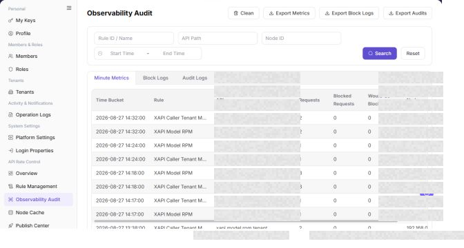

# Observability Audit

## Feature Overview

| Item | Content |
| --- | --- |
| Applicable Role | Operator |
| Navigation path | Settings > API Rate Control > Observability Audit |
| Page route | `/user/system/rate-control/observation` |
| Managed objects | Minute statistics, blocked logs, and audit logs |

#### Beginner Explanation

Observability Audit works like a detail viewer for API rate control. Use it to check which requests were counted or blocked, then locate issues by rule, node, API, and time range.

#### Terms Quick Reference

| Term | Description |
| --- | --- |
| Audit record | Details generated by rate-control statistics or blocked requests.; Filter by time during troubleshooting. |
| Node | The service node that executes rate-control rules.; Check node cache when node results differ. |
| Rule hit | A request matches and triggers a rule.; Compare with Rule Management. |
| Clean data | An action that deletes or archives audit data.; Confirm the scope before continuing. |

## Prerequisites

1. The current account has permission to access API rate-control observability audit data.
2. You have opened `API Rate Control > Observability Audit`.
3. The scope and purpose are confirmed before cleanup or export.

## Page Description

The following screenshot shows the Observability Audit page. API, node, and log details are desensitized.

| Area | Description |
| --- | --- |
| Minute Statistics | View request, blocked, and over-limit statistics aggregated by minute. |
| Blocked Logs | View request records blocked by rate-control rules. |
| Audit Logs | View rule audit records. |
| API Path | Filter by API path. |
| Node ID | Filter by node. |
| Start Time / End Time | Filter by time range. |
| Clean | Entry for cleaning observability or audit data. |
| Export Statistics / Export Blocked Logs / Export Audit Logs | Export the corresponding data. |

The screenshot keeps the left navigation and the complete functional area with the top menu hidden. Check the fields, buttons, and action locations on the Observability Audit page.

## Main Operations

### View Observability Metrics

1. Go to `Settings > API Rate Control > Observability Audit` and select a time range.
2. Filter by rule, node, request result, block reason, or request ID.
3. Check request volume, blocked requests, matched rules, and status distribution. If no data is shown, check the time zone, node, and filter scope.
4. Observability data may contain call identifiers and business paths and must be redacted before export or screenshots.

The screenshot keeps the left navigation and the complete functional area with the top menu hidden. Check the fields, buttons, and action locations on the Observability Audit page.

**Result validation:** The list, details, and status fields show the target object and remain consistent.

**Note:** Use only the fields and entries visible on the current page. Do not infer behavior from another role's page.

**FAQ:** If the entry is hidden, the button is disabled, or the result is not updated, check the current account permission, filters, object status, and page refresh time.

### View Block Event Details

1. Click an abnormal metric or **"Details"** for the target event.
2. Review the matched rule, node, action, status code, time, and error summary.
3. Compare the rule version and conditions in Rule Management to determine whether the block was expected.
4. If it cannot be explained, record a redacted request ID, rule ID, and time range. Do not change rules or republish.

Use this operation to query observability and audit data. Do not add create, publish, or save operations to this query-oriented workflow.

The screenshot keeps the left navigation and the complete functional area with the top menu hidden. Check the fields, buttons, and action locations on the Observability Audit page.

**Result validation:** The list, details, and status fields show the target object and remain consistent.

**Note:** Use only the fields and entries visible on the current page. Do not infer behavior from another role's page.

**FAQ:** If the entry is hidden, the button is disabled, or the result is not updated, check the current account permission, filters, object status, and page refresh time.

### Export Observability Data

1. Open `Settings > API Rate Control > Observability Audit`.
2. Locate the target Observability Audit and click **"Export"**.
3. Review or complete the required fields shown on the page, and confirm the target object, scope, and current status.
4. For an action that changes data, permissions, status, or an external setting, confirm the impact and rollback path before clicking the final confirmation button.
5. After the action, return to the list or details page and verify the status, update time, or result message.

The screenshot keeps the left navigation and the complete functional area with the top menu hidden. Check the fields, buttons, and action locations on the Observability Audit page.

**Result validation:** Follow the page success message, then return to the list or details page to verify the object status, update time, and affected scope.

**Note:** Recheck the target object and impact before submission. For changes to permissions, status, data, or external settings, confirm approval and rollback information first.

**FAQ:** If the entry is hidden, the button is disabled, or the result is not updated, check the current account permission, filters, object status, and page refresh time.

### Clean Observability Data

1. Open `Settings > API Rate Control > Observability Audit`.
2. Locate the target Observability Audit and click **"Clean"**.
3. Review or complete the required fields shown on the page, and confirm the target object, scope, and current status.
4. For an action that changes data, permissions, status, or an external setting, confirm the impact and rollback path before clicking the final confirmation button.
5. After the action, return to the list or details page and verify the status, update time, or result message.

The screenshot keeps the left navigation and the complete functional area with the top menu hidden. Check the fields, buttons, and action locations on the Observability Audit page.

**Result validation:** Follow the page success message, then return to the list or details page to verify the object status, update time, and affected scope.

**Note:** Recheck the target object and impact before submission. For changes to permissions, status, data, or external settings, confirm approval and rollback information first.

**FAQ:** If the entry is hidden, the button is disabled, or the result is not updated, check the current account permission, filters, object status, and page refresh time.

## Parameter Quick Reference

| Field Name | Required | Field Type | Example | Description |
| --- | --- | --- | --- | --- |
| Tab | Yes | Tab | `Minute Statistics` | Switches between statistics, blocked logs, and audit data views. |
| Time Range | No | Time range | `Start Time` / `End Time` | Filters observability or audit records by time. |
| API | No | Text | `<api_path>` | Filters by API path. |
| Node | No | Text | `<node_name>` | Filters by execution node. |
| Rule | No | Text | `<rule_name>` | Filters by matched rule. |
| Hit Count | System generated | Number | `10` | Shows rule or API hit count. |
| Blocked Result | System generated | Enum | `Blocked` | Shows whether the request was blocked by a rule. |
| Cost | System generated | Number | `120 ms` | Shows request or processing cost. |
| Audit Details | System generated | Text / link | `View Details` | Opens context information for an audit record. |
| Export | No | Button | `Export Audit Logs` | Exports statistics, blocked logs, or audit data. |
| Clean | No | Button | `Clean` | Cleans observability or audit data. |

## Pitfalls

- Observability audit data may expose API paths, nodes, rules, account clues, IP addresses, abnormal requests, and internal capacity information.
- `Export Statistics`, `Export Blocked Logs`, and `Export Audit Logs` export real audit data and are high-risk actions.
- `Clean` affects later troubleshooting and compliance retention and is a high-risk action.
- Do not write real API paths, tokens, IP addresses, accounts, tenant IDs, customer names, node names, internal error details, or load-test parameters in the manual.

## Result Validation

| Check Item | Success Signal | If Abnormal |
| --- | --- | --- |
| Tab switching | The three data tabs can be switched normally. | Refresh the page and re-enter it. |
| Filter result | The list refreshes according to API, node, rule, or time range. | Check filters, click **"Reset"**, and search again. |
| Export entry | Export buttons are displayed according to permissions. | Confirm time range, desensitization requirements, and recipient before exporting. |
| Clean entry | The cleanup entry is displayed according to permissions and has a clear scope confirmation before execution. | Stop cleanup if retention requirements are unclear. |

## FAQ

#### Overview shows blocked requests, but audit records are not found

The overview shows an increase in blocked requests, but no corresponding record appears in Observability Audit.

**Possible cause:**

The time ranges differ, or the current tab is not Blocked Logs.

**Resolution:**

Switch to `Blocked Logs`, expand the time range, and search again.

#### What should be checked before cleaning data?

The page provides a `Clean` entry.

**Possible cause:**

Cleanup affects later audit tracing.

**Resolution:**

Confirm retention requirements and troubleshooting needs first. Only an authorized operator should perform cleanup.

#### Why are observability audit records empty?

No API hit, rate-control, blocked-request, or exception record appears on the Observability Audit page.

**Possible cause:**

No request triggered a rate-control rule in the selected time range, requests bypassed the rate-control gateway, or audit collection is delayed.

**Resolution:**

Expand the time range and confirm the request path. Check rule publishing and gateway access. If records remain empty, compare reporting status in Node Cache.

#### How should the Observability Audit page be exported or captured safely?

**Symptom:**

Page information is needed for troubleshooting, audit, or delivery.

**Possible causes:**

The page may contain accounts, email addresses, IP addresses, internal paths, tenant identifiers, Keys, or amounts.

**Resolution:**

Keep only the necessary fields and action context. Use opaque light-gray pixel mosaics for sensitive text and never share complete credentials or internal addresses.

#### What should I do when the Observability Audit page shows unexpected data?

**Symptom:**

A field, status, metric, or related object differs from the expectation.

**Possible causes:**

The page scope, time condition, role permission, or upstream setting does not match.

**Resolution:**

Record the redacted object, time, and result. Verify the entry and filters first, then check related pages and Operation Logs.

## Notes

- Observability audit data may expose API paths, nodes, rules, account clues, IP addresses, abnormal requests, and internal capacity information.
- `Export Statistics`, `Export Blocked Logs`, and `Export Audit Logs` export real audit data and are high-risk actions.
- `Clean` affects later troubleshooting and compliance retention and is a high-risk action.
- Do not write real API paths, tokens, IP addresses, accounts, tenant IDs, customer names, node names, internal error details, or load-test parameters in the manual.

## Next Steps

1. To adjust rules, go to [Rule Management](../rule-management/).
2. To check node status, go to [Node Cache](../node-cache/).

### Preserved Existing Screenshots

