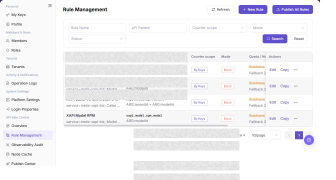

# Rule Management

## Feature Overview

| Item | Content |
| --- | --- |
| Applicable Role | Operator |
| Navigation path | Settings > API Rate Control > Rule Management |
| Page route | `/user/system/rate-control/rules` |
| Managed objects | API rate-control rules, API Patterns, enabled status, and publication status |

#### Beginner Explanation

Rule Management is the API rate-control rule library. It defines which APIs are counted or blocked and under what conditions. Before publishing a rule, confirm its match scope, threshold, and rollout impact.

#### Terms Quick Reference

| Term | Description |
| --- | --- |
| Rate-control rule | A rule that counts or limits API requests.; Confirm the match scope before publication. |
| Threshold | The request limit that triggers counting or blocking.; A low threshold can block valid traffic. |
| Statistical mode | A mode that records over-limit requests without blocking them.; Use it to observe behavior before enforcement. |
| Publish | The action that synchronizes rules to nodes.; Check Node Cache after publication. |

## Prerequisites

1. The current account has permission to manage API rate-control rules.
2. You have opened `API Rate Control > Rule Management`.
3. Before publishing a rule, you have assessed its scope and impact.

## Page Description

The following screenshot shows the Rule Management page. Rule details are desensitized.

| Area | Description |
| --- | --- |
| Refresh | Refreshes the rule list. |
| Create Rule | Opens the rule creation flow. |
| Publish All Rule Versions | Publishes the current rule versions to nodes. |
| Rule Name | Filters by rule name. |
| API Pattern | Filters by API match pattern. |
| Rule table | Shows rules, counting scope, mode, quota, window, priority, publication state, enabled state, and actions. |

The screenshot keeps the left navigation and the complete functional area with the top menu hidden. Check the fields, buttons, and action locations on the Rule Management page.

## Main Operations

### View Rate Control Rules

1. Go to `Settings > API Rate Control > Rule Management`.
2. Filter by name, status, scope, action, or update time.
3. Open details and check match conditions, thresholds, actions, priority, target nodes, and version.
4. If no record is returned, reset filters. For unexpected matches, compare Observability Audit and the currently published version.

The screenshot keeps the left navigation and the complete functional area with the top menu hidden. Check the fields, buttons, and action locations on the Rule Management page.

**Result validation:** The list, details, and status fields show the target object and remain consistent.

**Note:** Use only the fields and entries visible on the current page. Do not infer behavior from another role's page.

**FAQ:** If the entry is hidden, the button is disabled, or the result is not updated, check the current account permission, filters, object status, and page refresh time.

### Create Rate Control Rule

1. Go to `Settings > API Rate Control > Rule Management`.
2. Click **"Create Rule"**, `Create Rate Control Rule`, or the actual create entry on the page.
3. In the rule creation page or dialog, review the rule configuration fields.

4. Fill in rule name, API path, request method, match conditions, rate limit threshold, and time window.
5. Select effective scope, result handling policy, enabled status, or priority according to page fields.
6. Before clicking the final `Save`, `Submit`, or `Publish`, verify that the rule will not block normal business requests by mistake.
7. For learning or screenshots only, view fields and click **"Cancel"** or return without submitting real rule configuration.

**Result validation:** Follow the page success message, then return to the list or details page to verify the object status, update time, and affected scope.

**Note:** Recheck the target object and impact before submission. For changes to permissions, status, data, or external settings, confirm approval and rollback information first.

**FAQ:** If the entry is hidden, the button is disabled, or the result is not updated, check the current account permission, filters, object status, and page refresh time.

### Edit Rate Control Rule

1. Open `Settings > API Rate Control > Rule Management`.
2. Locate the target Rule Management and click **"Edit"**.
3. Review or complete the required fields shown on the page, and confirm the target object, scope, and current status.
4. For an action that changes data, permissions, status, or an external setting, confirm the impact and rollback path before clicking the final confirmation button.
5. After the action, return to the list or details page and verify the status, update time, or result message.

The screenshot keeps the left navigation and the complete functional area with the top menu hidden. Check the fields, buttons, and action locations on the Rule Management page.

**Result validation:** Follow the page success message, then return to the list or details page to verify the object status, update time, and affected scope.

**Note:** Recheck the target object and impact before submission. For changes to permissions, status, data, or external settings, confirm approval and rollback information first.

**FAQ:** If the entry is hidden, the button is disabled, or the result is not updated, check the current account permission, filters, object status, and page refresh time.

### Copy Rate Control Rule

1. Open `Settings > API Rate Control > Rule Management`.
2. Locate the target Rule Management and click **"Copy"**.
3. Review or complete the required fields shown on the page, and confirm the target object, scope, and current status.
4. For an action that changes data, permissions, status, or an external setting, confirm the impact and rollback path before clicking the final confirmation button.
5. After the action, return to the list or details page and verify the status, update time, or result message.

The screenshot keeps the left navigation and the complete functional area with the top menu hidden. Check the fields, buttons, and action locations on the Rule Management page.

**Result validation:** The list, details, and status fields show the target object and remain consistent.

**Note:** Use only the fields and entries visible on the current page. Do not infer behavior from another role's page.

**FAQ:** If the entry is hidden, the button is disabled, or the result is not updated, check the current account permission, filters, object status, and page refresh time.

### Publish Rate Control Rules

1. Open `Settings > API Rate Control > Rule Management`.
2. Locate the target Rule Management and click **"Publish All Rules"**.
3. Review or complete the required fields shown on the page, and confirm the target object, scope, and current status.
4. For an action that changes data, permissions, status, or an external setting, confirm the impact and rollback path before clicking the final confirmation button.
5. After the action, return to the list or details page and verify the status, update time, or result message.

The screenshot keeps the left navigation and the complete functional area with the top menu hidden. Check the fields, buttons, and action locations on the Rule Management page.

**Result validation:** Follow the page success message, then return to the list or details page to verify the object status, update time, and affected scope.

**Note:** Recheck the target object and impact before submission. For changes to permissions, status, data, or external settings, confirm approval and rollback information first.

**FAQ:** If the entry is hidden, the button is disabled, or the result is not updated, check the current account permission, filters, object status, and page refresh time.

## Parameter Quick Reference

| Field Name | Required | Field Type | Example | Description |
| --- | --- | --- | --- | --- |
| Rule Name | Yes | Text | `Example Rule A` | Identifies the rate control rule. |
| API Path | Yes | Text | `<ENDPOINT_PATH>` | The API path matched by the rule. Desensitize it in documentation. |
| Request Method | No | Enum | `GET` | The HTTP request method matched by the rule. |
| Match Condition | Yes | Condition expression | `tenant = example` | The condition set used to match the rule. |
| Rate Limit Threshold | Yes | Number | `100 requests/minute` | The request limit that triggers statistics or blocking. |
| Time Window | Yes | Time | `1 minute` | The time window used to count requests. |
| Effective Scope | Yes | Enum / Multi-select | `Global` | The API, tenant, user, or service scope where the rule applies. |
| Handling Policy | Yes | Enum | `Block` | The processing policy after the rule is hit. |
| Enabled Status | Yes | Enum | `Enabled` | Indicates whether the rule participates in rate control. |
| Priority | No | Number | `10` | The processing order when multiple rules match. |
| Actions | System generated | Button / link | `Edit / Copy / Publish / Delete` | Provides rule maintenance entry points. |

## Pitfalls

- Do not change roles, members, login policies, Keys, or API rate-control rules without confirming the affected users and systems.
- UI entries can differ by role and tenant scope; verify the current account context before troubleshooting.
- Never copy complete Keys, AK/SK, tokens, or secrets into documentation, tickets, or screenshots.
- Creating or publishing a rate control rule affects real API access, user request success rate, and business availability.
- Incorrect API paths, match conditions, thresholds, or time windows may block normal business requests by mistake.
- `Save`, `Submit`, `Publish`, `Publish All`, `Disable`, and `Delete` are high-risk actions.
- Do not write real API paths, tokens, accounts, tenant IDs, customer names, internal error details, or load-test parameters in documentation.

## Result Validation

| Check Item | Success Signal | If Abnormal |
| --- | --- | --- |
| Rule filter | The list refreshes by rule name or API Pattern. | Check the filter values. |
| Status | Publication and enabled states are displayed. | Refresh the rule list. |
| Publication record | A publication record appears in Publish Center after publication. | Open Publish Center and verify the record. |
| Create entry | Clicking `Create Rule` opens the rule creation page or dialog. | Check whether the current account has rule creation permission. |

## FAQ

#### A new rule does not take effect after publication

**Symptom:**

The rule is configured, but target requests are not counted or blocked.

**Possible cause:**

The rule was not published to nodes, it is disabled, or its API Pattern does not match the request.

**Resolution:**

Verify the enabled and publication states, then check Node Cache and Observability & Audit.

#### What should be checked before publishing all rule versions?

**Symptom:**

The page provides a `Publish All Rule Versions` action.

**Possible cause:**

Publication changes the rule version that is effective on the nodes.

**Resolution:**

Review the rule differences, affected APIs, and rollback plan. Only an authorized operator should publish the versions.

#### Why are rate-control rules missing?

**Symptom:**

The expected tenant, model, or API rule is not shown in Rule Management.

**Possible cause:**

The rule belongs to another scope, is disabled, or the current account cannot view API rate-control rules.

**Resolution:**

Clear the rule type, status, and tenant filters. Confirm the rule scope. If it is still missing, ask the rate-control administrator to check the configuration and publication state.

#### How should the Rule Management page be exported or captured safely?

**Symptom:**

Page information is needed for troubleshooting, audit, or delivery.

**Possible causes:**

The page may contain accounts, email addresses, IP addresses, internal paths, tenant identifiers, Keys, or amounts.

**Resolution:**

Keep only the necessary fields and action context. Use opaque light-gray pixel mosaics for sensitive text and never share complete credentials or internal addresses.

#### What should I do when the Rule Management page shows unexpected data?

**Symptom:**

A field, status, metric, or related object differs from the expectation.

**Possible causes:**

The page scope, time condition, role permission, or upstream setting does not match.

**Resolution:**

Record the redacted object, time, and result. Verify the entry and filters first, then check related pages and Operation Logs.

## Notes

- An overly broad API Pattern can block valid requests.
- Confirm the impact scope and rollback method before publishing or enabling a rule.
- `Save`, `Submit`, `Publish`, `Publish All`, `Disable`, and `Delete` are high-risk actions.
- Do not write real API paths, tokens, accounts, tenant IDs, customer names, internal error details, or load-test parameters in documentation.

## Next Steps

1. To review rate-control trends, go to [Overview](../overview/).
2. To verify node synchronization, go to [Node Cache](../node-cache/).
3. To review publication results, go to [Publish Center](../publish-center/).
