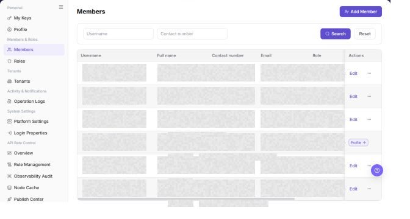

# Members

## Feature Overview

| Item | Content |
| --- | --- |
| Applicable Role | Operator |
| Navigation path | Settings > Members & Roles > Members |
| Page route | `/user/user-space/team-members` |
| Managed objects | Members, roles, status, and contact information |

#### Beginner Explanation

Operator members are the platform-console duty roster. They determine who can enter the operator console and manage configuration, approvals, audits, and platform-level tasks. They are different from members of a user-side tenant.

#### Terms Quick Reference

| Term | Description |
| --- | --- |
| Operator member | A member with access to platform administration functions.; Assign a role based on job responsibilities. |
| Platform role | A role that controls which operator modules a member can manage.; Do not grant more permission than required. |
| Member status | Indicates whether a member is enabled, disabled, or pending activation.; Check status first when login fails. |
| Management scope | The tenants or system settings visible to a member.; Confirm the scope during troubleshooting. |

## Prerequisites

1. The current account has permission to manage members.
2. You have opened `Members & Roles > Members`.
3. Before changing a member, you have confirmed the person's identity, role scope, and reason for the change.

## Page Description

The following screenshot shows the Members page. Phone numbers and email addresses are desensitized.

| Area | Description |
| --- | --- |
| Username | Filters members by username. |
| Phone Number | Filters members by phone number. |
| Add Member | Opens the member creation flow. |
| Member table | Shows username, name, phone number, email, role, status, creation time, and actions. |

The screenshot keeps the left navigation and the complete functional area with the top menu hidden. Check the fields, buttons, and action locations on the Members page.

## Main Operations

### View Members

1. Go to `Settings > Members and Roles > Members`.
2. Filter by name, username, email, role, or status.
3. Open member details and check the tenant, roles, status, and latest update time.
4. If no record is returned, reset filters and check the tenant context. Avoid screenshots or sharing when personal information is displayed.

The screenshot keeps the left navigation and the complete functional area with the top menu hidden. Check the fields, buttons, and action locations on the Members page.

**Result validation:** The list, details, and status fields show the target object and remain consistent.

**Note:** Use only the fields and entries visible on the current page. Do not infer behavior from another role's page.

**FAQ:** If the entry is hidden, the button is disabled, or the result is not updated, check the current account permission, filters, object status, and page refresh time.

### Add a Member

1. Go to `Settings > Members & Roles > Members`.
2. Click **"Add Member"** in the upper-right corner of the page.
3. In the `Add Member` dialog, review the member creation fields.

4. Fill in `Username`, `Full name`, `Email`, `Password`, and `Confirm Password`.
5. Fill in `Contact number` as needed, including the country or region code and phone number.
6. Select a member role from `Role`.
7. Select `Enable` or `Disable` in `Status`.
8. Before clicking the final `Confirm`, verify the member identity, role permissions, and enabled status.
9. For learning or screenshots only, view the fields and click **"Cancel"** to close the dialog without submitting real member configuration.

**Result validation:** Follow the page success message, then return to the list or details page to verify the object status, update time, and affected scope.

**Note:** Recheck the target object and impact before submission. For changes to permissions, status, data, or external settings, confirm approval and rollback information first.

**FAQ:** If the entry is hidden, the button is disabled, or the result is not updated, check the current account permission, filters, object status, and page refresh time.

### Edit a Member

1. Open `Settings > Members & Roles > Members`.
2. Locate the target Members and click **"Edit"**.
3. Review or complete the required fields shown on the page, and confirm the target object, scope, and current status.
4. For an action that changes data, permissions, status, or an external setting, confirm the impact and rollback path before clicking the final confirmation button.
5. After the action, return to the list or details page and verify the status, update time, or result message.

The screenshot keeps the left navigation and the complete functional area with the top menu hidden. Check the fields, buttons, and action locations on the Members page.

**Result validation:** Follow the page success message, then return to the list or details page to verify the object status, update time, and affected scope.

**Note:** Recheck the target object and impact before submission. For changes to permissions, status, data, or external settings, confirm approval and rollback information first.

**FAQ:** If the entry is hidden, the button is disabled, or the result is not updated, check the current account permission, filters, object status, and page refresh time.

## Parameter Quick Reference

| Field Name | Required | Field Type | Example | Description |
| --- | --- | --- | --- | --- |
| Username | Yes | Text | `ops-user` | The username used by the operator member to sign in. |
| Full name | Yes | Text | `Example Member` | The display name of the member on the page. |
| Contact number | No | Text | `188****8888` | The member contact number, including country or region code when required. |
| Email | Yes | Text | `user@example.com` | The member email address. |
| Password | Yes | Password | `******` | The initial login password of the member. |
| Confirm Password | Yes | Password | `******` | Re-entered password used to confirm both password entries match. |
| Role | Yes | Dropdown | `Audit Admin` | Controls the member permission scope on the operator side. |
| Status | Yes | Enum | `Enable` | Determines whether the member can sign in and operate. |
| Actions | System generated | Button / link | `Edit / Reset Password / Delete` | Provides row-level entry points for member management. |

## Pitfalls

- Do not change roles, members, login policies, Keys, or API rate-control rules without confirming the affected users and systems.
- UI entries can differ by role and tenant scope; verify the current account context before troubleshooting.
- Never copy complete Keys, AK/SK, tokens, or secrets into documentation, tickets, or screenshots.
- Adding a member creates a real operator-side account and may affect platform management permissions.
- `Confirm` is the final submit action. For learning or screenshots, only view fields and use `Cancel` to exit.
- Selecting the wrong role may grant excessive permissions or prevent the member from completing operator tasks.
- Do not write real phone numbers, emails, usernames, user IDs, passwords, customer names, or internal test data in documentation.

## Result Validation

| Check Item | Success Signal | If Abnormal |
| --- | --- | --- |
| Member filter | The list refreshes by username or phone number. | Clear the filters and search again. |
| Status | The member status control is displayed. | Check the current account's permissions. |
| Actions | Edit, Reset Password, and Delete are displayed according to permission. | Ask an administrator to verify the role assignment. |
| Add dialog | Clicking `Add Member` opens the same-name dialog. | Check whether the current account has member creation permission. |
| Cancel exit | Clicking `Cancel` closes the dialog without submitting member configuration. | Refresh the page and confirm no test member was added. |

## FAQ

#### A member cannot sign in

**Symptom:**

The member cannot access the platform.

**Possible cause:**

The member is disabled, a reset password was not communicated, or the assigned role lacks permission.

**Resolution:**

Verify the member status, role, and password-reset record, and then restore access according to your account-management process.

#### What should be checked before deleting a member?

**Symptom:**

The member row provides a `Delete` action.

**Possible cause:**

The member may still own business actions, keys, or approval records.

**Resolution:**

Confirm that the member no longer has active responsibilities before continuing with the deletion.

#### Why is the operator member list empty?

**Symptom:**

No platform administrator or operator member is shown.

**Possible cause:**

The current account is not in the platform administration tenant, the members belong to a user-side tenant, or the current role limits the list scope.

**Resolution:**

Confirm that you are using the operator entry and verify the platform tenant and administrator role. Ask a super administrator to grant operator-member access when required.

#### How should the Members page be exported or captured safely?

**Symptom:**

Page information is needed for troubleshooting, audit, or delivery.

**Possible causes:**

The page may contain accounts, email addresses, IP addresses, internal paths, tenant identifiers, Keys, or amounts.

**Resolution:**

Keep only the necessary fields and action context. Use opaque light-gray pixel mosaics for sensitive text and never share complete credentials or internal addresses.

#### What should I do when the Members page shows unexpected data?

**Symptom:**

A field, status, metric, or related object differs from the expectation.

**Possible causes:**

The page scope, time condition, role permission, or upstream setting does not match.

**Resolution:**

Record the redacted object, time, and result. Verify the entry and filters first, then check related pages and Operation Logs.

## Notes

- Do not expose member phone numbers, email addresses, or account identifiers in documentation or screenshots.
- Reset Password, Delete, and status changes affect member access and require review.
- `Confirm` is the final submit action. Before adding a member, verify the member identity, role permissions, and enabled status.
- For learning or screenshots only, open the dialog to view fields and use `Cancel` to exit.
- Do not write real phone numbers, emails, usernames, user IDs, passwords, customer names, or internal test data in documentation.

## Next Steps

1. To adjust role permissions, go to [Roles](../roles/).
2. To review member actions, go to [Operation Logs](../../activity-notifications/operation-logs/).
