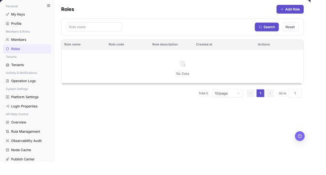

# Roles

## Feature Overview

| Item | Content |
| --- | --- |
| Applicable Role | Operator |
| Navigation path | Settings > Members & Roles > Roles |
| Page route | `/user/user-space/roles` |
| Managed objects | Role names, role identifiers, permission scopes, and creation times |

#### Beginner Explanation

Operator roles are platform-console permission templates. They define which system modules an administrator can view, which settings the administrator can change, and which approvals the administrator can process. They are different from project collaboration roles.

#### Terms Quick Reference

| Term | Description |
| --- | --- |
| Platform role | A set of operator-administration permissions.; Separate roles by responsibility. |
| Permission | A menu, button, or API-level control item.; Confirm the impact before changing it. |
| Built-in role | A system-provided role that usually cannot be deleted.; View it or use it as a reference. |
| Member assignment | The operator members assigned to a role.; Remove assignments before deleting the role. |

## Prerequisites

1. The current account has permission to manage roles.
2. You have opened `Members & Roles > Roles`.
3. Before authorizing or deleting a role, you have confirmed which members will be affected.

## Page Description

The following screenshot shows the Roles page. Role details are desensitized.

| Area | Description |
| --- | --- |
| Role Name | Filters roles by name. |
| Add Role | Opens the role creation flow. |
| Role table | Shows role name, identifier, description, creation time, and actions. |

The screenshot keeps the left navigation and the complete functional area with the top menu hidden. Check the fields, buttons, and action locations on the Roles page.

## Main Operations

### View Roles

1. Go to `Settings > Members and Roles > Roles`.
2. Filter by role name, status, or update time.
3. Open details and check menu, button, and API permissions and assigned members.
4. If no record is returned, reset filters. For unexpected permissions, check whether the member has multiple roles.

The screenshot keeps the left navigation and the complete functional area with the top menu hidden. Check the fields, buttons, and action locations on the Roles page.

**Result validation:** The list, details, and status fields show the target object and remain consistent.

**Note:** Use only the fields and entries visible on the current page. Do not infer behavior from another role's page.

**FAQ:** If the entry is hidden, the button is disabled, or the result is not updated, check the current account permission, filters, object status, and page refresh time.

### Add a Role

1. Go to `Settings > Members & Roles > Roles`.
2. Click **"Add Role"** in the upper-right corner of the page.
3. In the `Add Role` dialog, review the role creation fields.

4. Fill in `Role name`.
5. Fill in the required `Role code`. Use a stable, readable, lowercase English code that is easy to audit.
6. Fill in `Role description` according to the intended role usage.
7. Before clicking the final `Confirm`, verify that the role name, role code, and later authorization scope follow the least-privilege principle.
8. For learning or screenshots only, view the fields and click **"Cancel"** to close the dialog without submitting real role configuration.

**Result validation:** Follow the page success message, then return to the list or details page to verify the object status, update time, and affected scope.

**Note:** Recheck the target object and impact before submission. For changes to permissions, status, data, or external settings, confirm approval and rollback information first.

**FAQ:** If the entry is hidden, the button is disabled, or the result is not updated, check the current account permission, filters, object status, and page refresh time.

### Edit a Role

1. Open `Settings > Members & Roles > Roles`.
2. Locate the target Roles and click **"Edit"**.
3. Review or complete the required fields shown on the page, and confirm the target object, scope, and current status.
4. For an action that changes data, permissions, status, or an external setting, confirm the impact and rollback path before clicking the final confirmation button.
5. After the action, return to the list or details page and verify the status, update time, or result message.

The screenshot keeps the left navigation and the complete functional area with the top menu hidden. Check the fields, buttons, and action locations on the Roles page.

**Result validation:** Follow the page success message, then return to the list or details page to verify the object status, update time, and affected scope.

**Note:** Recheck the target object and impact before submission. For changes to permissions, status, data, or external settings, confirm approval and rollback information first.

**FAQ:** If the entry is hidden, the button is disabled, or the result is not updated, check the current account permission, filters, object status, and page refresh time.

### Authorize a Role

1. Open `Settings > Members & Roles > Roles`.
2. Locate the target Roles and click **"Authorize"**.
3. Review or complete the required fields shown on the page, and confirm the target object, scope, and current status.
4. For an action that changes data, permissions, status, or an external setting, confirm the impact and rollback path before clicking the final confirmation button.
5. After the action, return to the list or details page and verify the status, update time, or result message.

The screenshot keeps the left navigation and the complete functional area with the top menu hidden. Check the fields, buttons, and action locations on the Roles page.

**Result validation:** Follow the page success message, then return to the list or details page to verify the object status, update time, and affected scope.

**Note:** Recheck the target object and impact before submission. For changes to permissions, status, data, or external settings, confirm approval and rollback information first.

**FAQ:** If the entry is hidden, the button is disabled, or the result is not updated, check the current account permission, filters, object status, and page refresh time.

### Delete a Role

1. Open `Settings > Members & Roles > Roles`.
2. Locate the target Roles and click **"Delete"**.
3. Review or complete the required fields shown on the page, and confirm the target object, scope, and current status.
4. For an action that changes data, permissions, status, or an external setting, confirm the impact and rollback path before clicking the final confirmation button.
5. After the action, return to the list or details page and verify the status, update time, or result message.

The screenshot keeps the left navigation and the complete functional area with the top menu hidden. Check the fields, buttons, and action locations on the Roles page.

**Result validation:** Follow the page success message, then return to the list or details page to verify the object status, update time, and affected scope.

**Note:** Recheck the target object and impact before submission. For changes to permissions, status, data, or external settings, confirm approval and rollback information first.

**FAQ:** If the entry is hidden, the button is disabled, or the result is not updated, check the current account permission, filters, object status, and page refresh time.

## Parameter Quick Reference

| Field Name | Required | Field Type | Example | Description |
| --- | --- | --- | --- | --- |
| Role name | Yes | Text | `Audit Admin` | The display name of the operator role. |
| Role code | Yes | Text | `audit_admin` | The unique role identifier. Use a stable, readable code that is easy to audit. |
| Role description | No | Text | `View audit logs and basic operator information` | Describes the role purpose and authorization boundary. |
| Permission items | Yes | Multi-select | `View Operation Logs` | Controls menus and operations available to the role. |
| Member count | No | Number | `3` | Shows how many members are bound to the role. |
| Role status | No | Enum | `Enabled` | Controls whether the role can continue to be assigned. |
| Actions | System generated | Button / link | `Edit / Authorize / Delete` | Provides role maintenance entry points. |

## Pitfalls

- Do not change roles, members, login policies, Keys, or API rate-control rules without confirming the affected users and systems.
- UI entries can differ by role and tenant scope; verify the current account context before troubleshooting.
- Never copy complete Keys, AK/SK, tokens, or secrets into documentation, tickets, or screenshots.
- Adding a role creates a new platform permission template. Later authorization and member binding can affect platform management permissions.
- `Confirm` is the final submit action. For learning or screenshots, only view fields and use `Cancel` to exit.
- Once `Role code` is referenced, later changes may affect permission identification, auditing, and automation configuration.
- Do not write real internal role codes, accounts, member IDs, customer names, or internal test data.

## Result Validation

| Check Item | Success Signal | If Abnormal |
| --- | --- | --- |
| Role filter | The list refreshes by role name. | Check that the name is correct. |
| Authorization entry | The target role can open its authorization page. | Check the current account's role-management permission. |
| Delete entry | Delete is displayed according to permission. | Confirm that no critical member depends on the role before deletion. |
| Add dialog | Clicking `Add Role` opens the same-name dialog. | Check whether the current account has role creation permission. |
| Cancel exit | Clicking `Cancel` closes the dialog without submitting role configuration. | Refresh the page and confirm no test role was added. |

## FAQ

#### A member cannot see a menu

**Symptom:**

A member cannot see a menu or button after signing in.

**Possible cause:**

The role assigned to the member does not include the required menu or action permission.

**Resolution:**

Review the permission scope for the role, then confirm that the member is assigned to the correct role.

#### Can a role be deleted directly?

**Symptom:**

The role list provides a Delete action.

**Possible cause:**

The role may still be assigned to members, and deleting it can remove their access.

**Resolution:**

Check the members assigned to the role, then follow the tenant permission-change process.

#### Why is the operator role list empty?

**Symptom:**

The page does not show platform administrator, auditor, or configuration administrator roles.

**Possible cause:**

The current account lacks operator role-management permission, the roles belong to another administration tenant, or system roles cannot be edited in the list.

**Resolution:**

Confirm that you are using operator-side Settings and verify the role-management permission. Ask a super administrator to check abnormal built-in roles.

#### How should the Roles page be exported or captured safely?

**Symptom:**

Page information is needed for troubleshooting, audit, or delivery.

**Possible causes:**

The page may contain accounts, email addresses, IP addresses, internal paths, tenant identifiers, Keys, or amounts.

**Resolution:**

Keep only the necessary fields and action context. Use opaque light-gray pixel mosaics for sensitive text and never share complete credentials or internal addresses.

#### What should I do when the Roles page shows unexpected data?

**Symptom:**

A field, status, metric, or related object differs from the expectation.

**Possible causes:**

The page scope, time condition, role permission, or upstream setting does not match.

**Resolution:**

Record the redacted object, time, and result. Verify the entry and filters first, then check related pages and Operation Logs.

## Notes

- Authorization changes affect menu visibility and button availability.
- Before deleting a role, confirm that no critical member depends on it.
- `Confirm` is the final submit action. Before adding a role, verify the role name, role code, and later authorization scope.
- Once `Role code` is referenced, later changes may affect permission identification, auditing, and automation configuration.
- For learning or screenshots only, open the dialog to view fields and use `Cancel` to exit.
- Do not write real internal role codes, accounts, member IDs, customer names, or internal test data.

## Next Steps

1. To view members assigned to roles, go to [Members](../members/).
2. To trace permission changes, go to [Operation Logs](../../activity-notifications/operation-logs/).
