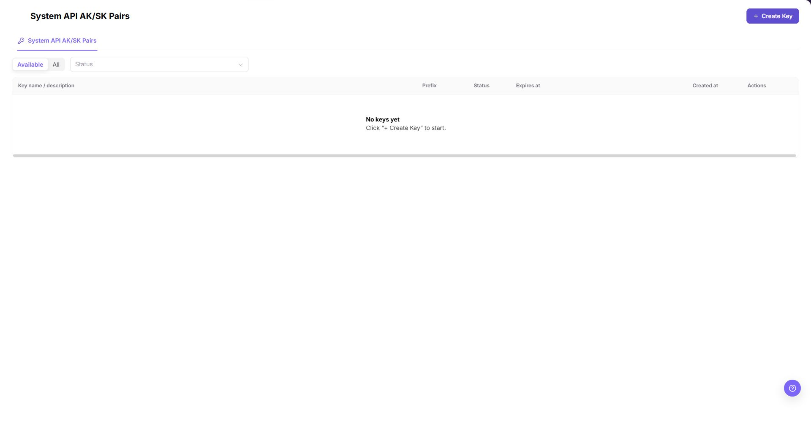
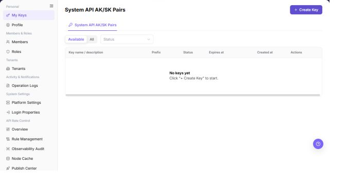

# My Keys

## Feature Overview

| Item | Content |
| --- | --- |
| Applicable Role | Operator Account |
| Navigation path | Settings > Personal > My Keys |
| Page route | `/user/user-space/my-keys/system` |
| Managed objects | System API AK/SK Pairs, status, expiration, and creation records |

#### Beginner Explanation

An AK/SK pair is a system API credential for controlled administrative or automation calls. Treat it as a high-sensitivity credential: define its purpose, set an appropriate expiration time, store the generated values only through the approved security process, and never place the complete pair in documentation.

#### Terms Quick Reference

| Term | Description |
| --- | --- |
| System API AK/SK Pair | A system API access identifier and secret pair.; Use it only for the intended system integration. |
| Prefix | The non-secret identifier shown in the list.; Use it to recognize a credential; it is not the complete secret. |
| Expiration | The time after which the pair is no longer valid.; Replace the pair before an automation reaches this time. |
| Status | The current availability state of the pair.; Check it before troubleshooting a failed call. |

## Prerequisites

1. The current account has permission to view and create System API credentials.
2. You have opened `Settings > Personal > My Keys` from the Operator menu.
3. Before creating a pair, you have confirmed its caller, purpose, expiration plan, and secure handoff method.

## Page Description

The current Operator page exposes the `System API AK/SK Pairs` tab only. It does not expose a `Model API Keys` tab in this role.

| Area | Description |
| --- | --- |
| Top button | `Create Key` opens the System API AK/SK Pair creation dialog. |
| Type tab | `System API AK/SK Pairs` is the visible Operator tab. |
| Availability | `Available` and `All` switch the list scope. |
| Status | Filters the list by credential status. |
| Credential list | Shows Key name / description, prefix, status, expiration time, creation time, and actions. |
| Empty state | When no pair exists, the page shows `No keys yet` and instructs the operator to click **"+ Create Key"**. |

The screenshot keeps the left navigation and the complete functional area with the top menu hidden. Check the fields, buttons, and action locations on the My Keys page.

## Main Operations

### View System API Keys

1. Go to `Settings > Personal > My Keys`.
2. Confirm that the `System API AK/SK Pairs` tab is selected.
3. Use `Available` or `All` and the `Status` selector to review the list.
4. Check the Key name / description, prefix, status, expiration time, creation time, and available actions.

The screenshot keeps the left navigation and the complete functional area with the top menu hidden. Check the fields, buttons, and action locations on the My Keys page.

**Result validation:** The list, details, and status fields show the target object and remain consistent.

**Note:** Use only the fields and entries visible on the current page. Do not infer behavior from another role's page.

**FAQ:** If the entry is hidden, the button is disabled, or the result is not updated, check the current account permission, filters, object status, and page refresh time.

### Open the System API Key Creation Dialog

1. Click **"Create Key"** in the upper-right corner.
2. In the `Create System API AK/SK Pair` dialog, review the required `Expire Time`, required `Key Name`, and optional `Description` fields.
3. Before clicking the final `Create`, confirm the purpose, expiration, caller, and secure handoff method.
4. During documentation review or screenshot capture, click **"Cancel"**. Do not create a real credential.

**Result validation:** The list, details, and status fields show the target object and remain consistent.

**Note:** Use only the fields and entries visible on the current page. Do not infer behavior from another role's page.

**FAQ:** If the entry is hidden, the button is disabled, or the result is not updated, check the current account permission, filters, object status, and page refresh time.

## Parameter Quick Reference

| Field Name | Required | Field Type | Example | Description |
| --- | --- | --- | --- | --- |
| Expire Time | Yes | Date time | `2026-12-31 23:59` | Defines when the System API AK/SK Pair expires. |
| Key Name | Yes | Text | `Backend job credential` | Identifies the purpose of the pair. |
| Description | No | Text | `Model service administration` | Optional usage notes, up to 200 characters. |
| Prefix | System generated | Text | `<ACCESS_KEY_ID>` | A masked identifier shown in the list; it is not the complete credential. |
| Status | System generated | Enum | `Enabled` | Indicates whether the pair is currently available. |
| Created at | System generated | Date time | `2026-08-26` | Records when the pair was created. |
| Actions | System generated | Button / menu | `View` | Opens the available read-only or follow-up actions for the row. |

## Pitfalls

- The current Operator page does not expose a `Model API Keys` tab. Do not use this Operator page as evidence for Provider or End User Model API Key behavior.
- The current System API creation dialog exposes only expiration time, Key Name, and optional Description. Do not document permission-scope, quota, reset-cycle, or warning-threshold fields for this dialog unless a later Demo check shows them.
- `Create` is the final high-risk action. Do not click it during learning, screenshots, or page validation.
- Never copy a complete AK/SK pair, token, account, endpoint, or secret into documentation, screenshots, tickets, or examples.
- A prefix is only an identifier; it is not the complete credential.

## Result Validation

| Check Item | Success Signal | If Abnormal |
| --- | --- | --- |
| Operator entry | `Settings > Personal > My Keys` opens the System API AK/SK Pairs page. | Check the current Operator role and menu permission. |
| List filters | `Available`, `All`, and `Status` are visible. | Clear the filter and reopen the page. |
| List columns | Key name / description, prefix, status, expiration, creation time, and actions are visible. | Check page loading and role permission. |
| Create dialog | `Create Key` opens the `Create System API AK/SK Pair` dialog. | Check credential-creation permission. |
| Safe review | `Cancel` closes the dialog without creating a credential. | Do not proceed to `Create`; ask an administrator to verify the environment. |

## FAQ

#### Why is the Model API Keys tab missing?

The Operator role currently exposes the System API AK/SK Pairs page only. Model API Key behavior belongs to the Provider or End User My Keys page and must be documented under those role-specific manuals.

#### Why is a target System API credential missing?

The pair may belong to another account or tenant, may be unavailable in the current filter, or may be expired or disabled. Check the selected availability scope, status, expiration, and creation record.

#### What should be checked before creation or rotation?

Confirm the caller, purpose, expiration window, secure storage path, and replacement plan. Never record the complete AK/SK pair in documentation or screenshots.

#### How should the My Keys page be exported or captured safely?

**Symptom:**

Page information is needed for troubleshooting, audit, or delivery.

**Possible causes:**

The page may contain accounts, email addresses, IP addresses, internal paths, tenant identifiers, Keys, or amounts.

**Resolution:**

Keep only the necessary fields and action context. Use opaque light-gray pixel mosaics for sensitive text and never share complete credentials or internal addresses.

#### What should I do when the My Keys page shows unexpected data?

**Symptom:**

A field, status, metric, or related object differs from the expectation.

**Possible causes:**

The page scope, time condition, role permission, or upstream setting does not match.

**Resolution:**

Record the redacted object, time, and result. Verify the entry and filters first, then check related pages and Operation Logs.

## Notes

- Never copy, paste, or capture a complete AK/SK pair, token, or secret.
- Do not include real credentials, accounts, endpoints, customer names, IDs, or internal test values in documentation, screenshots, tickets, or examples.
- `Create` is a final high-risk action.
- Before rotating or disabling a credential, confirm that its callers have completed the switch.

## Next Steps

1. To review account details, go to [Profile](../profile/).
2. To adjust member permissions, go to [Members](../../members-roles/members/).
3. Use the approved security process to store or rotate the generated pair.
