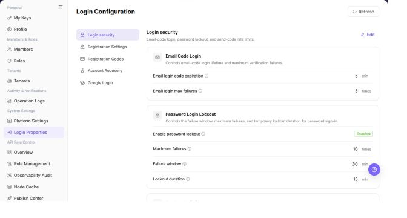

# Login Properties

## Feature Overview

| Item | Content |
| --- | --- |
| Applicable Role | Operator |
| Navigation path | Settings > System Settings > Login Properties |
| Page route | `/user/system/login-properties` |
| Managed objects | Login security, registration settings, registration codes, account recovery, Google Login, and external system integration |

#### Beginner Explanation

Login Properties is the platform's entry gate. It controls verification codes, account recovery, registration policy, and third-party sign-in. Before a change, confirm which sign-in methods and users will be affected.

#### Terms Quick Reference

| Term | Description |
| --- | --- |
| Sign-in policy | Rules that control how users sign in and verify their identities.; Confirm the affected scope before a change. |
| Verification code | A code used during sign-in, registration, or account recovery.; Check email or SMS configuration when delivery fails. |
| Account recovery | A process that helps a user restore account access.; Confirm the security policy before enabling it. |
| Third-party sign-in | An external identity entry such as Google Login.; Test the sign-in flow after a change. |

## Prerequisites

1. The current account has permission to manage login configuration.
2. You have opened `System Settings > Login Properties`.
3. Before changing a login security policy, you have confirmed the impact scope and notification plan.

## Page Description

The page includes `Login security`, `Registration Settings`, `Registration Codes`, `Account Recovery`, and `Google Login`. `Registration Settings` contains registration entrances, default roles, the `Platform Source Catalog`, and `External System Integration`.

| Area | Description |
| --- | --- |
| Refresh | Reloads the login configuration. |
| Login security | Shows email-code login, password lockout, and send-code limits. |
| Registration Settings | Shows registration entrances, default roles, platform sources, and external integrations. |
| Registration Codes | Shows verification-code configuration for registration. |
| Account Recovery | Shows account-recovery configuration. |
| Google Login | Shows third-party sign-in configuration. |
| Edit | Changes the selected configuration category. |

The following screenshot shows login properties.

The screenshot keeps the left navigation and the complete functional area with the top menu hidden. Check the fields, buttons, and action locations on the Login Properties page.

## Main Operations

### View Login Security Settings

1. Go to `Settings > System Settings > Login Properties`.
2. Click or locate `Login Security`.
3. Review password policy, login restrictions, session validity, MFA, or security verification settings.

**Result validation:** The list, details, and status fields show the target object and remain consistent.

**Note:** Use only the fields and entries visible on the current page. Do not infer behavior from another role's page.

**FAQ:** If the entry is hidden, the button is disabled, or the result is not updated, check the current account permission, filters, object status, and page refresh time.

### Edit Registration Settings

1. Go to `Settings > System Settings > Login Properties`.
2. Select `Registration Settings`.
3. Review each registration entrance and its default roles.
4. Confirm that each default role belongs to the `DEFAULT` application before you edit the configuration.
5. Review the `Platform Source Catalog` and the controlled recharge channel for each enabled source.
6. Review the source and note in `External System Integration`.
7. A disabled master switch also disables its dependent registration path.
8. If the configuration does not load, refresh the page before you open an edit action.
9. Do not save an endpoint or credential until you confirm its owner and rollback plan.

**Result validation:** Follow the page success message, then return to the list or details page to verify the object status, update time, and affected scope.

**Note:** Recheck the target object and impact before submission. For changes to permissions, status, data, or external settings, confirm approval and rollback information first.

**FAQ:** If the entry is hidden, the button is disabled, or the result is not updated, check the current account permission, filters, object status, and page refresh time.

### Edit Registration Verification Settings

1. Go to `Settings > System Settings > Login Properties`.
2. Locate `Registration Verification Code`.
3. Review verification code type, sending method, validity period, rate limits, and enabled status.

**Result validation:** Follow the page success message, then return to the list or details page to verify the object status, update time, and affected scope.

**Note:** Recheck the target object and impact before submission. For changes to permissions, status, data, or external settings, confirm approval and rollback information first.

**FAQ:** If the entry is hidden, the button is disabled, or the result is not updated, check the current account permission, filters, object status, and page refresh time.

### Edit Account Recovery Settings

1. Go to `Settings > System Settings > Login Properties`.
2. Locate `Account Recovery`.
3. Review email, phone, verification code, identity verification, and recovery flow settings.

**Result validation:** Follow the page success message, then return to the list or details page to verify the object status, update time, and affected scope.

**Note:** Recheck the target object and impact before submission. For changes to permissions, status, data, or external settings, confirm approval and rollback information first.

**FAQ:** If the entry is hidden, the button is disabled, or the result is not updated, check the current account permission, filters, object status, and page refresh time.

### Edit Google Sign-in Settings

1. Go to `Settings > System Settings > Login Properties`.
2. Locate `Google Login`.
3. Review Client ID, callback URL, enabled status, and login entry settings.

**Result validation:** Follow the page success message, then return to the list or details page to verify the object status, update time, and affected scope.

**Note:** Recheck the target object and impact before submission. For changes to permissions, status, data, or external settings, confirm approval and rollback information first.

**FAQ:** If the entry is hidden, the button is disabled, or the result is not updated, check the current account permission, filters, object status, and page refresh time.

## Parameter Quick Reference

| Field Name | Required | Field Type | Example | Description |
| --- | --- | --- | --- | --- |
| Configuration Category | System displayed | Text | `Login Security` | The configuration group in login properties. |
| Configuration Item | System displayed | Text | `Verification Code Validity Period` | The login policy parameter to view or maintain. |
| Default Value | System displayed | Text | `5 minutes` | The default or system-provided value of the configuration item. |
| Current Value | System displayed / Editable | Text | `5 minutes` | The currently effective configuration value. |
| Enabled Status | System displayed / Editable | Enum | `Enabled` | Indicates whether the configuration item or login capability is enabled. |
| Registration Entrance | System displayed / Editable | Text | `Email Registration` | Identifies a registration path and its entrance code. |
| Default Roles | System displayed / Editable | Role list | Displayed on page | Lists the roles assigned to new users for an entrance. Roles must belong to `DEFAULT`. |
| Platform Source Catalog | System displayed / Editable | Source list | Displayed on page | Lists external business sources, source status, and controlled recharge channels. |
| External System Integration | System displayed / Editable | Integration settings | Displayed on page | Shows an external registration source, master switch, and note. |
| Save | Operation button | Button | `Save` | Saves the current login configuration change. |
| Reset | Operation button | Button | `Reset` | Restores the configuration to the default value or last saved state. |
| Actions | System generated | Button / link | `Edit / Enable / Disable` | Provides login configuration view or maintenance entries. |

## Pitfalls

- Do not change roles, members, login policies, Keys, or API rate-control rules without confirming the affected users and systems.
- UI entries can differ by role and tenant scope; verify the current account context before troubleshooting.
- Never copy complete Keys, AK/SK, tokens, or secrets into documentation, tickets, or screenshots.
- Login properties affect user sign-in, registration, account recovery, verification code delivery, and third-party login entries.
- `Save`, `Reset`, `Enable`, and `Disable` are high-risk actions.
- Client Secret, callback URLs, internal domains, test accounts, and tokens in Google Login configuration must not be written into documentation or screenshots.
- For learning or screenshots, only view configuration items and do not submit real configuration changes.

## Result Validation

| Check Item | Success Signal | If Abnormal |
| --- | --- | --- |
| Policy categories | Login security, registration codes, and other categories are displayed. | Refresh the page and open it again. |
| Edit entry | Edit is displayed according to permission. | Check the current account's system-configuration permission. |
| Code-delivery limits | Per-minute, per-hour, and per-day limits are displayed. | Compare sign-in logs with operation logs. |
| Screenshots | Login security, Registration Settings, registration verification code, account recovery, and Google Login screenshots render normally. | Check whether image paths exist. |

## FAQ

#### A user does not receive a verification code

**Symptom:**

The user does not receive a code during sign-in or account recovery.

**Possible cause:**

The code-delivery limits are too restrictive, the email or SMS channel is misconfigured, or the account's contact information is incorrect.

**Resolution:**

Check the delivery limits, email configuration, and account contact information, then review operation logs.

#### What should be done before changing a sign-in policy?

**Symptom:**

The page provides an Edit action for login configuration.

**Possible cause:**

A sign-in policy change can affect all users.

**Resolution:**

Confirm the change window, impact scope, and rollback method before changing the policy.

#### Why does Login Properties not load?

**Symptom:**

Password policy, sign-in methods, or identity-source configuration is not displayed.

**Possible cause:**

The current account lacks system-settings permission, the configuration is managed by an upstream identity provider, or configuration synchronization is delayed.

**Resolution:**

Verify system-settings permission and the current environment. Confirm whether an identity provider maintains the configuration. If it is still missing, ask a platform administrator to check configuration synchronization.

#### How should the Login Properties page be exported or captured safely?

**Symptom:**

Page information is needed for troubleshooting, audit, or delivery.

**Possible causes:**

The page may contain accounts, email addresses, IP addresses, internal paths, tenant identifiers, Keys, or amounts.

**Resolution:**

Keep only the necessary fields and action context. Use opaque light-gray pixel mosaics for sensitive text and never share complete credentials or internal addresses.

#### What should I do when the Login Properties page shows unexpected data?

**Symptom:**

A field, status, metric, or related object differs from the expectation.

**Possible causes:**

The page scope, time condition, role permission, or upstream setting does not match.

**Resolution:**

Record the redacted object, time, and result. Verify the entry and filters first, then check related pages and Operation Logs.

## Notes

- Login configuration changes can affect sign-in across the platform.
- Balance verification-code and lockout policies between security and availability.
- `Save`, `Reset`, `Enable`, and `Disable` are high-risk actions.
- Client Secret, callback URLs, internal domains, test accounts, and tokens in Google Login configuration must not be written into documentation or screenshots.
- For learning or screenshots, only view configuration items and do not submit real configuration changes.

## Next Steps

1. To review platform configuration, go to [Platform Settings](../platform-settings/).
2. To review sign-in-related actions, go to [Operation Logs](../../activity-notifications/operation-logs/).
