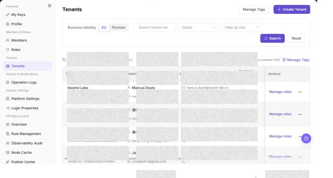

# Tenants

## Feature Overview

| Item | Content |
| --- | --- |
| Applicable Role | Operator |
| Navigation path | Settings > Tenants & Settings > Tenants |
| Page route | `/user/tenant` |
| Managed objects | Tenant entities, business identities, status, roles, and tags |

#### Beginner Explanation

Tenants is the platform's directory of business entities. It maintains tenants, administrators, roles, tags, and business ownership. Confirm the tenant identity before creating a tenant, changing a role, or investigating billing.

#### Terms Quick Reference

| Term | Description |
| --- | --- |
| Tenant | A business entity on the platform.; Confirm its unique identity before an action. |
| Tenant administrator | The account responsible for tenant administration.; Verify it before contact or authorization. |
| Tenant role | A permission set available to a tenant.; Confirm the impact before changing it. |
| Tenant tag | A label used to classify tenants.; Use it for filtering and operations. |

## Prerequisites

1. The current account has permission to manage tenants.
2. You have opened `Tenants & Settings > Tenants`.
3. Before creating a tenant or managing its roles or tags, you have confirmed its business identity and authorization boundary.

## Page Description

The tenant list uses the tenant `Name` for display and search. Before opening an action, confirm the target by its `Name`, tenant ID, administrator, and business identity. Tenant names, administrator information, and email addresses are desensitized in the following screenshot.

| Area | Description |
| --- | --- |
| Business Identity | Filters by identities such as EU or Provider. |
| Tenant / Administrator / Tenant ID | Searches by tenant, administrator, or tenant ID. |
| Status | Filters by tenant status. |
| Role | Filters by tenant role. |
| Tag filter | Filters by tags such as VIP, High Potential, Trial, Follow-up, or Churn Risk. |
| Manage Tags | Maintains tenant tags. |
| Create Tenant | Opens the tenant creation flow. |

The screenshot keeps the left navigation and the complete functional area with the top menu hidden. Check the fields, buttons, and action locations on the Tenants page.

## Main Operations

### View Tenants

1. Go to `Settings > Tenants and Settings > Tenants`.
2. Filter by tenant name, identifier, status, or creation time.
3. Open details and check tenant status, members, roles, quota, and update time.
4. If no record is returned, reset filters. Tenant information is organization-sensitive and must be redacted before screenshots or sharing.

The screenshot keeps the left navigation and the complete functional area with the top menu hidden. Check the fields, buttons, and action locations on the Tenants page.

**Result validation:** The list, details, and status fields show the target object and remain consistent.

**Note:** Use only the fields and entries visible on the current page. Do not infer behavior from another role's page.

**FAQ:** If the entry is hidden, the button is disabled, or the result is not updated, check the current account permission, filters, object status, and page refresh time.

### Create a Tenant

1. Go to `Settings > Tenants > Tenants`.
2. Click **"Create Tenant"** in the upper-right corner of the page.
3. On the `Create Tenant` page, review the tenant creation fields.

4. In `Tenant details`, fill in the required `Tenant Name`.
5. In `Tenant administrator`, fill in `Admin name`, `Admin sign-in account`, and `Admin email`. Fill in `Admin phone` as needed.
6. In `Access and security`, select `Role`, then fill in `Password` and `Confirm Password`.
7. Before final submission, verify the tenant name, administrator account, email, role, and initial password.
8. For learning or screenshots only, view the fields without submitting real tenant configuration.

**Result validation:** Follow the page success message, then return to the list or details page to verify the object status, update time, and affected scope.

**Note:** Recheck the target object and impact before submission. For changes to permissions, status, data, or external settings, confirm approval and rollback information first.

**FAQ:** If the entry is hidden, the button is disabled, or the result is not updated, check the current account permission, filters, object status, and page refresh time.

### Manage Tenant Tags

1. Open `Settings > Tenants & Settings > Tenants`.
2. Locate the target Tenants and click **"Manage Tags"**.
3. Review or complete the required fields shown on the page, and confirm the target object, scope, and current status.
4. For an action that changes data, permissions, status, or an external setting, confirm the impact and rollback path before clicking the final confirmation button.
5. After the action, return to the list or details page and verify the status, update time, or result message.

The screenshot keeps the left navigation and the complete functional area with the top menu hidden. Check the fields, buttons, and action locations on the Tenants page.

**Result validation:** The list, details, and status fields show the target object and remain consistent.

**Note:** Use only the fields and entries visible on the current page. Do not infer behavior from another role's page.

**FAQ:** If the entry is hidden, the button is disabled, or the result is not updated, check the current account permission, filters, object status, and page refresh time.

### Manage Tenant Roles

1. Open `Settings > Tenants & Settings > Tenants`.
2. Locate the target Tenants and click **"Manage Roles"**.
3. Review or complete the required fields shown on the page, and confirm the target object, scope, and current status.
4. For an action that changes data, permissions, status, or an external setting, confirm the impact and rollback path before clicking the final confirmation button.
5. After the action, return to the list or details page and verify the status, update time, or result message.

The screenshot keeps the left navigation and the complete functional area with the top menu hidden. Check the fields, buttons, and action locations on the Tenants page.

**Result validation:** The list, details, and status fields show the target object and remain consistent.

**Note:** Use only the fields and entries visible on the current page. Do not infer behavior from another role's page.

**FAQ:** If the entry is hidden, the button is disabled, or the result is not updated, check the current account permission, filters, object status, and page refresh time.

## Parameter Quick Reference

| Field Name | Required | Field Type | Example | Description |
| --- | --- | --- | --- | --- |
| Tenant Name | Yes | Text | `Example Tenant A` | Identifies the tenant entity. |
| Business Identity | No | Filter / tag | `Provider` | Filters or identifies the tenant business identity. |
| Admin name | Yes | Text | `Example Admin` | The display name of the tenant administrator. |
| Admin sign-in account | Yes | Text | `tenant-admin` | The sign-in account of the tenant administrator. |
| Admin email | Yes | Text | `admin@example.com` | The email address of the tenant administrator. |
| Admin phone | No | Text | `188****8888` | The contact number of the tenant administrator. |
| Role | Yes | Dropdown | `Tenant Admin` | Controls the platform access scope of the tenant administrator. |
| Password | Yes | Password | `******` | The initial password of the tenant administrator. |
| Confirm Password | Yes | Password | `******` | Re-entered password used to confirm both password entries match. |
| Status | System generated | Enum | `Enabled` | Indicates whether the tenant is available. |
| Actions | System generated | Button / link | `Manage Roles / Manage Tags` | Provides tenant maintenance entry points. |

## Pitfalls

- Do not change roles, members, login policies, Keys, or API rate-control rules without confirming the affected users and systems.
- UI entries can differ by role and tenant scope; verify the current account context before troubleshooting.
- Never copy complete Keys, AK/SK, tokens, or secrets into documentation, tickets, or screenshots.
- Creating a tenant creates a real tenant entity and a fixed administrator account.
- Initial passwords, administrator emails, and phone numbers are sensitive information. Do not write them into documentation or screenshots.
- Role selection affects the platform access scope of the tenant administrator.
- The current UI does not provide an action to turn off the `Provider` business identity after enablement. Confirm the tenant, business owner, and downstream impact before enablement.
- This restriction applies to the `Provider` business identity. The `Manage Roles` dialog can still remove ordinary role tags when permitted.
- Final submission is a high-risk action. Do not submit real tenant configuration during learning or screenshots.

## Result Validation

| Check Item | Success Signal | If Abnormal |
| --- | --- | --- |
| Filters | The tenant list refreshes according to the selected conditions. | Select Reset and query again. |
| Tags | The list scope changes after selecting a tag. | Check whether any tenant has that tag. |
| Tenant actions | Manage Roles, Manage Tags, and other actions are displayed according to permission. | Check the current account's tenant-management permission. |
| Create page | Clicking `Create Tenant` opens the same-name creation page. | Check whether the current account has tenant creation permission. |
| Learning exit | Real tenant configuration is not submitted when only reviewing fields. | Refresh the list and confirm no test tenant was added. |

## FAQ

#### A target tenant cannot be found

**Symptom:**

The list is empty after searching by tenant name or tenant ID.

**Possible cause:**

The filters are too restrictive, or the business identity, status, or role filter does not match the tenant.

**Resolution:**

Select `Reset`, then search again with fewer filters.

#### What should be checked before changing tenant roles?

**Symptom:**

The page provides a `Manage Roles` action.

**Possible cause:**

Tenant roles control which functions the tenant can use.

**Resolution:**

Confirm the tenant identity, administrator, and business scope, then follow the permission-change process.

#### Why is the target tenant missing from the tenant list?

**Symptom:**

The operator-side tenant page does not show the target tenant.

**Possible cause:**

The tenant was not created, is disabled, or is outside the current operator account's authorized scope.

**Resolution:**

Clear the tenant name, status, and region filters. Confirm the tenant creation record and status. If the tenant is still missing, ask a platform administrator to check tenant authorization.

#### How should the Tenants page be exported or captured safely?

**Symptom:**

Page information is needed for troubleshooting, audit, or delivery.

**Possible causes:**

The page may contain accounts, email addresses, IP addresses, internal paths, tenant identifiers, Keys, or amounts.

**Resolution:**

Keep only the necessary fields and action context. Use opaque light-gray pixel mosaics for sensitive text and never share complete credentials or internal addresses.

#### What should I do when the Tenants page shows unexpected data?

**Symptom:**

A field, status, metric, or related object differs from the expectation.

**Possible causes:**

The page scope, time condition, role permission, or upstream setting does not match.

**Resolution:**

Record the redacted object, time, and result. Verify the entry and filters first, then check related pages and Operation Logs.

## Notes

- The page contains administrator details, email addresses, and tenant IDs. Desensitize screenshots before sharing them.
- Creating a tenant or changing roles can affect the functions visible to the tenant. Confirm the authorization boundary first.
- Creating a tenant creates a real tenant entity and a fixed administrator account.
- Initial passwords, administrator emails, and phone numbers are sensitive information. Do not write them into documentation or screenshots.
- Final submission is a high-risk action. Do not submit real tenant configuration during learning or screenshots.

## Next Steps

1. To manage member permissions, go to [Members](../../members-roles/members/).
2. To review tenant changes, go to [Operation Logs](../../activity-notifications/operation-logs/).
