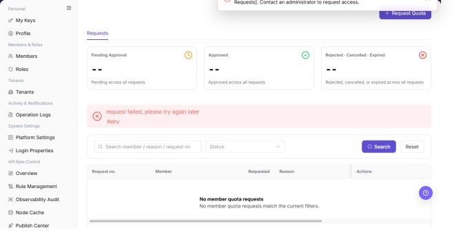

# Quota Requests

## Feature Overview

| Item | Content |
| --- | --- |
| Applicable Role | Model Consumer |
| Navigation path | Settings > Members & Roles > Quota Requests |
| Page route | `/user/user-space/quota-requests` |
| Managed objects | Quota requests, request records, adjustment records, status, and request reasons |

#### Beginner Explanation

Quota Requests is the ticket entry for member quota. It is used to submit and track requests for additional quota. Before submission, state the purpose, target member, and required amount clearly.

#### Terms Quick Reference

| Term | Description |
| --- | --- |
| Quota request | A record that requests additional member or project quota.; Explain the intended use before submission. |
| Request status | The current processing stage of a request.; Contact the approver when it does not change for a long time. |
| Requested quota | The amount requested in this submission.; Do not request more than the business needs. |
| Approval comment | The approver's processing note.; If rejected, revise the request according to the comment. |

## Prerequisites

1. The current account can access Quota Requests.
2. Before submitting, you have confirmed the required credits and business reason.
3. Usually, only one pending request should exist for the same member at a time.

## Page Description

| Area | Description |
| --- | --- |
| Top action | `Request Quota` |
| Tabs | Request Records and Adjustment Records |
| Filters | Status, member / reason / request ID search, and event type |
| Request record columns | Request ID, member, requested quota, reason, submission time, status, approver, and actions |
| Adjustment record columns | Time, member, event type, change, operator, and note |
| High-risk action | Submitting a quota request |

The screenshot keeps the left navigation and the complete functional area with the top menu hidden. Check the fields, buttons, and action locations on the Quota Requests page.

## Main Operations

### View Quota Requests

1. Go to `Settings > Members and Roles > Quota Requests`.
2. Filter by requester, project, resource type, status, or request time.
3. Check requested quota, current quota, reason, status, and processing time.
4. If no record is returned, reset filters and check the time range. Request and quota information must be redacted before sharing.

The screenshot keeps the left navigation and the complete functional area with the top menu hidden. Check the fields, buttons, and action locations on the Quota Requests page.

**Result validation:** The list, details, and status fields show the target object and remain consistent.

**Note:** Use only the fields and entries visible on the current page. Do not infer behavior from another role's page.

**FAQ:** If the entry is hidden, the button is disabled, or the result is not updated, check the current account permission, filters, object status, and page refresh time.

### View Quota Request Details

1. Click **"Details"** for the target request.
2. Review the reason, quota change, attachments or comments, and processing history.
3. Check that the current status matches the list. If not, refresh and determine whether another processor acted on it.
4. Do not submit, withdraw, approve, or reject requests during read-only validation.

The screenshot keeps the left navigation and the complete functional area with the top menu hidden. Check the fields, buttons, and action locations on the Quota Requests page.

**Result validation:** The list, details, and status fields show the target object and remain consistent.

**Note:** Use only the fields and entries visible on the current page. Do not infer behavior from another role's page.

**FAQ:** If the entry is hidden, the button is disabled, or the result is not updated, check the current account permission, filters, object status, and page refresh time.

### Submit a Quota Request

1. Go to `Settings > Members & Roles > Quota Requests`.
2. On `Request Records`, review pending, approved, rejected, canceled, and expired requests.
3. Filter requests by status and search text.

The following screenshot shows the Quota Requests list.

4. Select `Request Quota` to open the request dialog.
5. Enter the requested quota and reason.
6. Confirm that no duplicate request is pending, then submit the request.

The following screenshot shows the Request Quota dialog.

**Result validation:** Follow the page success message, then return to the list or details page to verify the object status, update time, and affected scope.

**Note:** Recheck the target object and impact before submission. For changes to permissions, status, data, or external settings, confirm approval and rollback information first.

**FAQ:** If the entry is hidden, the button is disabled, or the result is not updated, check the current account permission, filters, object status, and page refresh time.

## Parameter Quick Reference

| Field Name | Required | Field Type | Example | Description |
| --- | --- | --- | --- | --- |
| Keyword or name | No | Text | `Example name` | Used to locate a specific record. |
| Status | No | Enum | `Enabled` | Used to determine the current processing or availability state. |
| Time range or billing cycle | No | Date / Month | `2026-07` | Used to narrow statistics, logs, bills, or settlements. |
| Tenant / customer / member | No | Text | `Example tenant` | Used to identify the business ownership scope. |
| Operation | System generated | Button / link | `View Details` | Provides row-level entry points for follow-up checks. |

## Pitfalls

- Do not change roles, members, login policies, Keys, or API rate-control rules without confirming the affected users and systems.
- UI entries can differ by role and tenant scope; verify the current account context before troubleshooting.
- Never copy complete Keys, AK/SK, tokens, or secrets into documentation, tickets, or screenshots.

## Result Validation

| Check Item | Success Signal | If Abnormal |
| --- | --- | --- |
| Request recorded | A new record appears on Request Records after submission. | Check the request type, time range, and submission result. |
| Statistics | Pending, approved, and rejected counts match the list. | Clear the filters and calculate again. |
| Adjustment trace | Adjustment Records shows the quota change. | Verify the member, quota type, and adjustment time. |

## FAQ

#### A new quota request cannot be submitted

**Symptom:**

Submit is unavailable or the page reports an existing pending request.

**Possible cause:**

- The member already has a pending request.
- The requested quota or reason is missing.
- The tenant disables or limits quota requests.

**Resolution:**

1. Review pending records on Request Records.
2. Complete the requested quota and reason.
3. For an urgent request, ask the approver to process the existing record.

#### Why are quota request records empty?

**Symptom:**

No request, approval, or adjustment records are displayed.

**Possible cause:**

The member has not submitted a request, filters exclude the records, or the request belongs to another tenant, project, or member.

**Resolution:**

Clear status and time filters. Confirm the tenant, project, and member that own the request. If it is still absent, submit the request again from Overview and record the result.

#### Why are quota request or approval actions unavailable?

**Symptom:**

Records are visible, but New Request, Withdraw, Approve, or Adjust cannot be selected.

**Possible cause:**

The current account lacks request or approval permission, an existing request is still pending, or the request status does not allow another action.

**Resolution:**

Check for pending records, then verify the current role and request status. An authorized approver must perform approval actions.

#### How should the Quota Requests page be exported or captured safely?

**Symptom:**

Page information is needed for troubleshooting, audit, or delivery.

**Possible causes:**

The page may contain accounts, email addresses, IP addresses, internal paths, tenant identifiers, Keys, or amounts.

**Resolution:**

Keep only the necessary fields and action context. Use opaque light-gray pixel mosaics for sensitive text and never share complete credentials or internal addresses.

#### What should I do when the Quota Requests page shows unexpected data?

**Symptom:**

A field, status, metric, or related object differs from the expectation.

**Possible causes:**

The page scope, time condition, role permission, or upstream setting does not match.

**Resolution:**

Record the redacted object, time, and result. Verify the entry and filters first, then check related pages and Operation Logs.

## Notes

- Do not include customer-sensitive data, Keys, tokens, or passwords in the request reason.
- Do not submit duplicate requests for the same purpose.

## Next Steps

1. After approval, return to Overview or Member Quotas to verify the quota.
2. Review request actions in Operation Logs.
