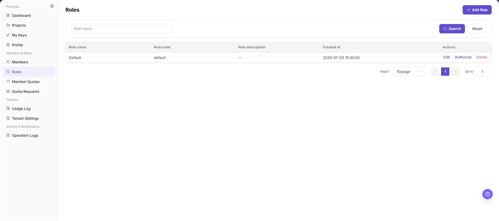
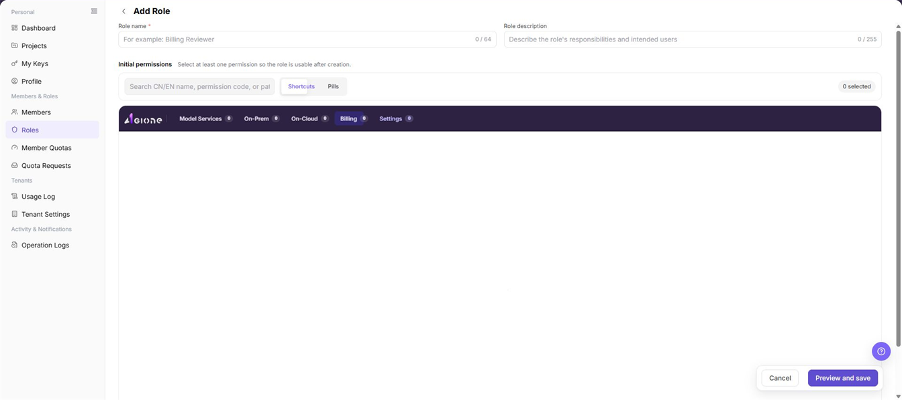
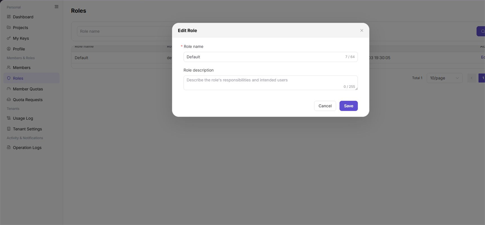
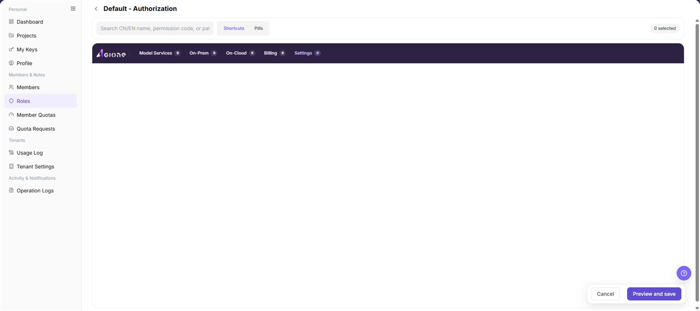

# Roles

## Feature Overview

| Item | Content |
| --- | --- |
| Applicable role | Model Consumer |
| Navigation path | Settings > Members & Roles > Roles |
| Page route | `/user/user-space/roles` |
| Managed objects | Role names, role codes, role descriptions, and permission scopes |

#### Beginner Explanation

Roles are reusable permission sets. Select page and action permissions in a role, then assign the role to members so they receive the same access rules.

#### Terms Quick Reference

| Term | Description |
| --- | --- |
| Role | A set of page and action permissions. |
| Role code | The identifier shown in the role list; the current create and edit forms do not expose this field. |
| Initial permissions | The first page, action, or data permissions selected when a role is created. |
| Permission scope | The pages a role can access and the actions it can perform. |

## Prerequisites

1. The current account has permission to view or manage roles. The visible Add, Edit, Authorize, and Delete entries depend on the current permission.
2. Before creating a role, define its name, optional description, and at least one initial permission.
3. Before editing or authorizing a role, confirm its member scope, target services, and permission impact.

## Page Description

The Roles page provides the role list and object-level action entries. The list shows role name, role code, role description, creation time, and actions. The page provides a role-name filter, **"Search"**, **"Reset"**, and **"Add Role"**.

The create form contains role name, role description, and an Initial permissions area. Initial permissions are grouped by service, and the display can switch between **"Shortcuts"** and **"Pills"**. Role authorization also provides menu-based Page access, Available actions, and Data access permissions.

The screenshot hides only the top menu and keeps the left navigation and complete functional area. Check the list fields, role-name filter, and the Edit, Authorize, and Delete entries in each row.

## Main Operations

<!-- main-operation-title-exceptions: Edit,Delete -->

### View Roles

1. Go to `Settings > Members & Roles > Roles`.
2. To narrow the list, enter a name in `Role name` and click **"Search"**. Click **"Reset"** to restore the list.
3. Read the role name, role code, role description, and creation time in the table. Check whether **"Edit"**, **"Authorize"**, and **"Delete"** are shown in the Actions column.
4. The current page provides list-level information and action entries, but no separate role-details entry. Open **"Authorize"** when you need to review permission details.

The screenshot keeps the list and Actions column with the top menu hidden. `Default` is a neutral example record shown on the page.

**Result validation:** The list shows the target role, its name, code, description, and creation time are readable, and the result matches the filter.

**Note:** Do not treat pagination, filtering, or sorting as role-object operations. Do not infer fields that are not shown on this page from another page.

**FAQ:** If the list is empty, click **"Reset"** and wait for the data to load. If it remains empty, check the tenant scope and role-view permission.

### Create a Role

1. Go to `Settings > Members & Roles > Roles` and click **"Add Role"**.
2. Enter a role name in **"Role name"**. The field is required, and its length limit is shown by the counter.
3. Enter the purpose and intended users in **"Role description"**. This field is optional.
4. In **"Initial permissions"**, select at least one permission. Select an associated service first, then choose the page access, available action, or data access entries shown on the page.
5. Click **"Preview and save"**, review the role name, description, and initial permission scope, and complete creation according to the page prompt.

The screenshot shows the create form, Initial permissions area, and service switcher. An empty permission area means that no permission has been selected yet; it does not mean Initial permissions can be skipped.

**Result validation:** After creation, the new role appears in the Roles list, can be found by name, and shows a role code, creation time, and action entries.

**Note:** Select at least one initial permission. Before submission, confirm the service, page, and action scope so the new role does not receive unnecessary high privileges.

**FAQ:** If creation cannot continue after **"Preview and save"**, check that the role name is present, at least one initial permission is selected, and the current account can manage roles.

### Edit a Role

1. Go to `Settings > Members & Roles > Roles`, locate the target role, and click **"Edit"**.
2. Review **"Role name"** and **"Role description"** in the edit form. The current edit form does not expose a role-code field.
3. Change the required name or description and confirm that the text does not mislead members or expose sensitive information.
4. Click **"Save"**, confirm the page message, and return to the Roles list.

The screenshot shows the Edit Role form. Check the role name, description, and **"Save"** entry with the top menu hidden.

**Result validation:** The role name or description is updated in the list, the role code and creation time remain visible, and reopening the form shows the latest values.

**Note:** Changing the name or description affects how members and audit records identify the role. Do not infer that the role code or permission scope can be changed from this form.

**FAQ:** If Edit is hidden or Save fails, check that the role belongs to the current tenant, the current account has management permission, and the name meets the length and content limits.

### Authorize a Role

1. Go to `Settings > Members & Roles > Roles` and click **"Authorize"** for the target role.
2. Confirm the role name in the authorization-page title, then review the selected-permission total and associated-service counts.
3. Select `Model Services`, `On-Prem`, `On-Cloud`, `Billing`, or `Settings`, then use Menu navigation to locate the target page.
4. Adjust Page access, Available actions, and Data access as required. Use **"Shortcuts"** or **"Pills"** to change the display mode.
5. Click **"Preview and save"**, review the permission changes and affected scope, and complete the authorization update according to the page prompt.

The screenshot shows the authorization workbench, service counts, menu navigation, and permission columns. Selected totals and service counts vary with the role configuration.

**Result validation:** After returning to the Roles list, members using this role can see the expected pages. Reopening **"Authorize"** shows the expected selected permissions and service counts.

**Note:** Authorization changes the menus and actions available to members. Before clearing page access, confirm that the change does not remove a required management entry.

**FAQ:** If a service shows `0` on the authorization page, confirm whether that service exposes assignable permissions in the current tenant, then check the role's authorization-management permission.

### Delete a Role

1. Go to `Settings > Members & Roles > Roles`, locate the target role, and click **"Delete"**.
2. In the confirmation prompt, verify the role name and impact. Confirm that the role no longer controls member access.
3. If the page reports member assignments or another dependency, resolve the dependency first, then return to the Roles list and start deletion again.
4. After confirming the scope, click the final delete button in the prompt and wait for the result.

The screenshot shows the actual Delete entry. Always use the page confirmation prompt as the final evidence; this list screenshot does not replace the prompt or show a fabricated post-delete result.

**Result validation:** After successful deletion, the role is absent from the list and a search for its former name returns no match. The member's effective role should also be adjusted as intended.

**Note:** Deletion is an irreversible object-level operation. Do not delete a role that members still use or that still performs a management function.

**FAQ:** If the role remains after deletion, refresh the page and check for a member-assignment, system-protection, or insufficient-permission message.

## Parameter Quick Reference

| Field Name | Required | Field Type | Example | Description |
| --- | --- | --- | --- | --- |
| Role name | Yes | Text, up to 64 characters | `Resource Reviewer` | Identifies the role and is available in create and edit forms. |
| Role description | No | Text, up to 255 characters | `Reviews resource access` | Describes the role's purpose and intended users. |
| Role code | System field | Text | `example-role-code` | Shown in the list; the current create and edit forms do not expose it. |
| Initial permissions | Required on create | Permission set | `Roles: Page access` | At least one permission must be selected when creating a role. |
| Associated service | No | Single choice | `Settings` | Switches the service whose permissions are being configured. |
| Permission display mode | No | Single choice | `Shortcuts` | Switches between shortcut and pill displays. |
| Role-name filter | No | Text | `review` | Narrows the role list by role name. |

## Pitfalls

- A role created without Initial permissions does not have a usable permission scope.
- Role code is visible in the list, but the create and edit forms do not contain that field. Do not fill in a nonexistent input.
- Service counts and selected totals change with the role. When a count is `0`, confirm whether the current service has assignable permissions.
- A list filter only affects role records; it does not replace permission selection in the authorization workbench.
- Do not put accounts, passwords, Keys, internal addresses, or customer-sensitive information in role names or descriptions.

## Result Validation

| Check Item | Success Signal | If Abnormal |
| --- | --- | --- |
| List search | Only matching records appear after a role-name search | Click **"Reset"**, then verify that the full role name was entered. |
| Creation result | The new role appears with a role code and creation time | Check the initial-permission count, duplicate-name message, and role-management permission. |
| Edit result | The updated name or description appears in the list | Reopen the edit form and check the length limit and tenant ownership. |
| Authorization result | Selected totals and service counts match the intended scope | Check Menu navigation, Page access, Available actions, and Data access for each service. |
| Deletion result | The role is absent from the list and the former filter returns no match | Read the page message and check member assignments, protection rules, and delete permission. |

## FAQ

#### Why is the target role missing from the list?

**Symptom:**

The expected role does not appear on the Roles page.

**Possible causes:**

- A role-name filter is still active.
- The current account is viewing another tenant or lacks role-view permission.

**Resolution:**

1. Click **"Reset"** to clear the filter.
2. Confirm the tenant scope and role-view permission.
3. Reload the Roles list.

#### Why cannot I continue while creating a role?

**Symptom:**

The create form cannot complete preview or save.

**Possible causes:**

- Role name is empty or exceeds the length limit.
- No Initial permissions are selected.

**Resolution:**

Enter a valid role name, select at least one page, action, or data permission in Initial permissions, and select **"Preview and save"** again.

#### Why does the authorization page show zero permissions?

**Symptom:**

A service or permission column shows `0`, and no selectable entries are visible.

**Possible cause:**

The service has no assignable permissions, or the current role lacks permission to manage that service's scope.

**Resolution:**

Switch to another service to confirm that the page works. If the target service remains at `0`, ask the tenant administrator to check that service's permission configuration.

#### Why is Role code missing from the edit form?

**Symptom:**

The edit form contains only Role name and Role description.

**Possible cause:**

Role code is a list identifier, and the current edit form does not expose a change entry.

**Resolution:**

Verify Role code in the list. When the role identity must change, follow the tenant's role-governance process to create and authorize a new role instead of treating another field as Role code.

#### What happens to member access after a role is deleted?

**Symptom:**

Member assignments must be checked before deleting a role.

**Possible cause:**

The role may still be assigned to members, so deleting it can change their visible pages and available actions.

**Resolution:**

Review role assignments on Members and follow the page prompt for any dependency. After the assignment changes, verify the members' effective permissions.

## Notes

- Role permissions directly control member visibility and available actions; use least privilege when authorizing.
- Before editing or deleting a role, confirm member assignments, service scope, and rollback information.
- Use role names and descriptions for management context only. Do not include accounts, passwords, Keys, internal addresses, or customer-sensitive information.

## Next Steps

1. Assign the confirmed role to target members on Members and verify their effective permissions.
2. Use Member Quotas to limit resource usage and, when needed, use Operation Logs to review role changes.
