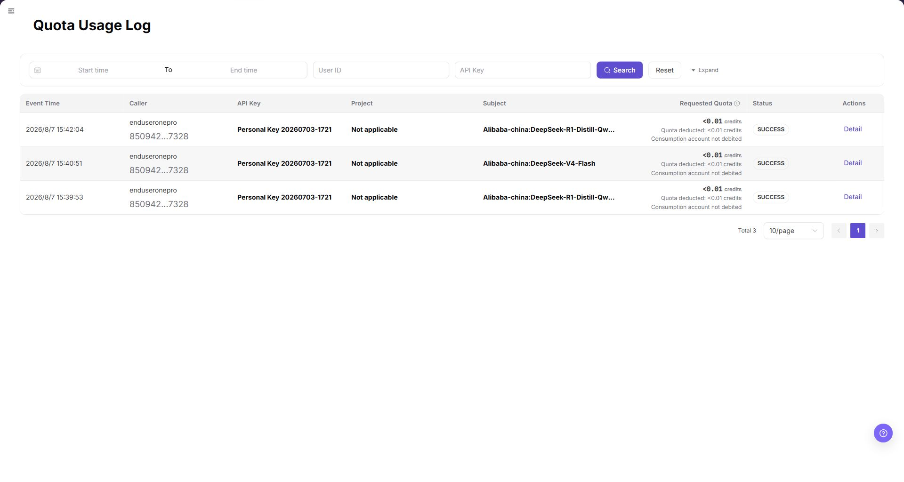
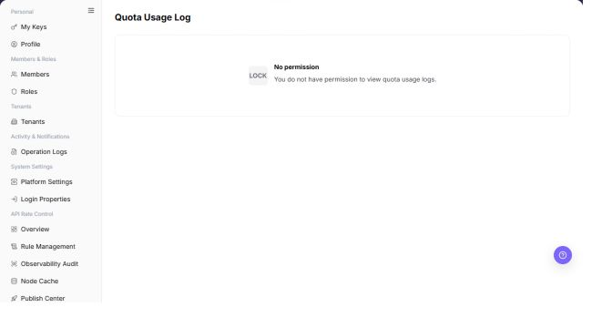

# Usage Log

## Feature Overview

| Item | Content |
| --- | --- |
| Applicable Role | Model Consumer |
| Navigation path | Settings > Tenants > Usage Log |
| Page route | `/user/user-space/usage-log` |
| Managed objects | Quota usage events and their read-only details |

#### Beginner Explanation

Confirm the page object first, use the visible entry points, and verify the resulting status on the page.

#### Terms Quick Reference

| Term | Description |
| --- | --- |
| Usage Log | The object managed on the Usage Log page. |
| Status | The current availability or activation state. |
| Action entry | A visible button, row action, or details entry. |

## Prerequisites

1. The current End User account can access the `Usage Log` entry under Settings.
2. The account has at least one visible quota usage event, or the page is available for an empty-state check.
3. Do not copy or record real API Keys, caller identifiers, project names, subjects, or request details.

## Page Description

The filter bar provides `Start time`, `End time`, `User ID`, and `API Key` fields, together with `Search`, `Reset`, and `Expand` controls.

The table contains:

| Field | Description |
| --- | --- |
| Event Time | Time when the usage event occurred. |
| Caller | Caller identity shown for the event. |
| API Key | The masked or abbreviated Key associated with the event. |
| Project | Project context, when applicable. |
| Subject | Model or request subject associated with the event. |
| Requested Quota | Requested and deducted quota information. |
| Status | Processing result, such as `SUCCESS`. |
| Actions | `Detail` opens read-only event information. |

The screenshot keeps the left navigation and the complete functional area with the top menu hidden. Check the fields, buttons, and action locations on the Usage Log page.

## Main Operations

### View Quota Usage Events

1. Go to `Settings > Tenants and Settings > Quota Usage Log`.
2. Select a time range and filter by member, project, resource type, action, or result.
3. Check the target event time, quota change, object, and reason.
4. If no record is returned, check the time zone and clear combined filters. Redact quota and member data before sharing.

The screenshot keeps the left navigation and the complete functional area with the top menu hidden. Check the fields, buttons, and action locations on the Usage Log page.

**Result validation:** The list, details, and status fields show the target object and remain consistent.

**Note:** Use only the fields and entries visible on the current page. Do not infer behavior from another role's page.

**FAQ:** If the entry is hidden, the button is disabled, or the result is not updated, check the current account permission, filters, object status, and page refresh time.

### View Quota Usage Event Details

1. Click **"Details"** for the target event.
2. Compare quota before, change amount, quota after, and the related object.
3. Check for a reversal or subsequent adjustment near the same time.
4. If the change cannot be explained, escalate with a redacted event ID and time range. Do not modify quota directly.

The screenshot keeps the left navigation and the complete functional area with the top menu hidden. Check the fields, buttons, and action locations on the Usage Log page.

**Result validation:** The list, details, and status fields show the target object and remain consistent.

**Note:** Use only the fields and entries visible on the current page. Do not infer behavior from another role's page.

**FAQ:** If the entry is hidden, the button is disabled, or the result is not updated, check the current account permission, filters, object status, and page refresh time.

## Parameter Quick Reference

| Field Name | Required | Field Type | Example | Description |
| --- | --- | --- | --- | --- |
| Target object | Yes | Text | `<OBJECT_ID>` | Identifies the object managed on the Quota usage events and their read-only details page. |
| Status | System generated | Enum | `Enabled` | Shows whether the object is available or active. |
| Action entry | Conditional | Button / menu | `View` | Opens the view, edit, or follow-up workflow. |
| Updated at | System generated | Date time | `2026-01-01 00:00` | Used to verify the latest synchronization or change. |

## Pitfalls

- Usage Log is an audit view; opening `Detail` does not change quota or billing state.
- A masked or abbreviated API Key is still sensitive. Do not copy it into documentation or tickets.
- Empty results may reflect the selected time range, account scope, or a lack of usage events.

## Result Validation

| Check Item | Success Signal | If Abnormal |
| --- | --- | --- |
| Page is accessible | `Usage Log` opens from the visible Settings menu. | Check account permission and menu visibility. |
| Filters work | `Search` refreshes the list and `Reset` clears the criteria. | Clear criteria and retry. |
| Event fields display | Event time, caller, API Key, project, subject, requested quota, status, and actions are visible. | Check whether the account has visible usage events. |
| Detail is read-only | `Detail` opens event information without a save or submit action. | Close the view and report the restriction. |

## FAQ

#### Why is the target Usage Log missing from the list?

**Symptom:**

The target Usage Log is not shown after the page is opened.

**Possible causes:**

The filters are too narrow, the tenant scope does not match, or the current account cannot view the object.

**Resolution:**

Clear the filters and search again. Confirm the current tenant and role scope. Ask an operator administrator to check access when required.

#### Why is the Usage Log action unavailable?

**Symptom:**

A button is hidden, disabled, or does not respond.

**Possible causes:**

The current account lacks permission, the object is in a state that cannot be changed, or the page has not refreshed.

**Resolution:**

Check the role permission and object status, refresh the page, and follow the page message. Do not submit the same action repeatedly.

#### Why does the Usage Log change not appear?

**Symptom:**

The list or details page still shows the previous value after an action.

**Possible causes:**

Synchronization or cache is delayed, the action was not submitted, or a different object was opened.

**Resolution:**

Check the success message, object identifier, and update time. Refresh the list and reopen details. Review Operation Logs when needed.

#### How should the Usage Log page be exported or captured safely?

**Symptom:**

Page information is needed for troubleshooting, audit, or delivery.

**Possible causes:**

The page may contain accounts, email addresses, IP addresses, internal paths, tenant identifiers, Keys, or amounts.

**Resolution:**

Keep only the necessary fields and action context. Use opaque light-gray pixel mosaics for sensitive text and never share complete credentials or internal addresses.

#### What should I do when the Usage Log page shows unexpected data?

**Symptom:**

A field, status, metric, or related object differs from the expectation.

**Possible causes:**

The page scope, time condition, role permission, or upstream setting does not match.

**Resolution:**

Record the redacted object, time, and result. Verify the entry and filters first, then check related pages and Operation Logs.

## Notes

- This page was added to the End User Settings menu in the Demo verification.
- The documentation screenshot masks all event records and identity values while retaining filter and column labels.

## Next Steps

1. Return to Settings > Tenants > Usage Log and verify the status and update time.
2. If a related object must be processed, open the next business entry shown on the page.
