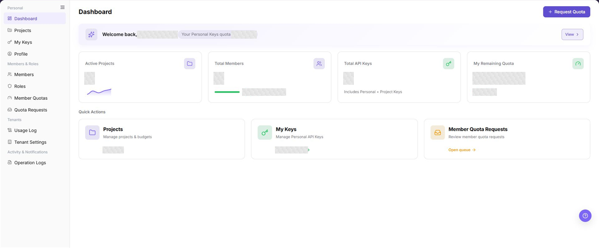
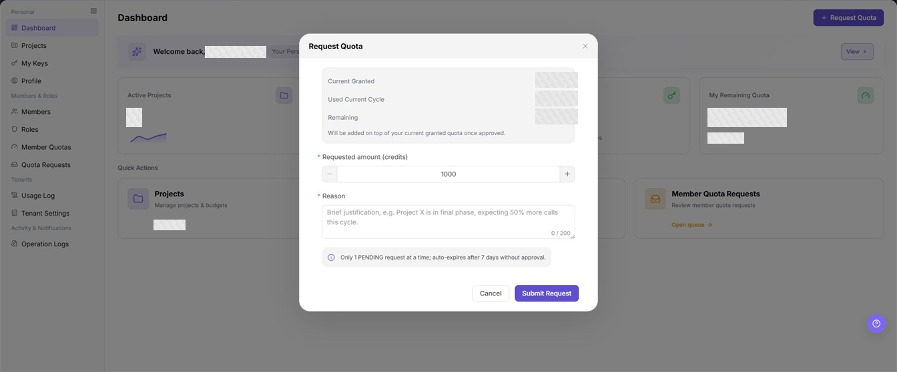

# Dashboard

## Feature Overview

| Item | Content |
| --- | --- |
| Applicable Role | Model Consumer |
| Navigation path | Settings > Personal > Dashboard |
| Page route | `/user/user-space/workspace/overview` |
| Managed objects | Personal Keys quota, project and member statistics, API Key statistics, and quick actions |

#### Beginner Explanation

Dashboard is the status panel for a personal workspace. Use it to review quota, project, member, and API Key information, then open Projects, My Keys, or Member Quota Requests, or start a quota request.

#### Terms Quick Reference

| Term | Description |
| --- | --- |
| Personal Keys quota | Quota available to the current member when using personal Keys. |
| Active Projects | Number of active projects visible to the current member. |
| Total API Keys | Combined number of personal Keys and project Keys in the current scope. |
| Member Quota Request | A quota request submitted by a member and waiting for review. |

## Prerequisites

1. The current account has permission to view Dashboard. Quick-action visibility depends on role permissions.
2. Before requesting quota, confirm the required amount and business reason.
3. Before acting on project, Key, or member-quota data, confirm the current tenant and member scope.

## Page Description

Dashboard shows the Personal Keys quota and **"Request Quota"** at the top. The summary cards show Active Projects, Total Members, Total API Keys, and My Remaining Quota. Quick Actions open Projects, My Keys, and Member Quota Requests.

The screenshot hides only the top menu and keeps the left navigation and full functional area. Light-gray mosaics cover only the account, quota, and statistic values. Check the summary cards, **"Request Quota"**, and the three quick actions.

## Main Operations

### View Dashboard

1. Go to `Settings > Personal > Dashboard`.
2. Review the Personal Keys quota in the welcome area and confirm that **"View"** and **"Request Quota"** are visible.
3. Check `Active Projects`, `Total Members`, `Total API Keys`, and `My Remaining Quota` in order.
4. Use the card descriptions to confirm member status and whether Total API Keys includes both personal and project Keys.

The screenshot shows the dashboard summary and quick actions. Statistic values are redacted, while field names and card order match the live page.

**Result validation:** All four summary cards show a statistic or quota state, and Projects, My Keys, and Member Quota Requests are available below them.

**Note:** Dashboard provides a quick summary. Use the Projects, Keys, Members, and Quota Requests pages for details.

**FAQ:** If a card is empty or does not update, confirm the current tenant and member scope, then check the corresponding details page.

### Request Quota

1. Go to `Settings > Personal > Dashboard` and click **"Request Quota"**.
2. Review `Current Granted`, `Used Current Cycle`, and `Remaining` in the dialog.
3. Enter the required amount in `Requested amount (credits)`, or use the increase and decrease buttons.
4. Enter a business justification of no more than 200 characters in `Reason`. Do not include accounts, Keys, internal addresses, or customer-sensitive information.
5. Confirm that no other `PENDING` request exists, then click **"Submit Request"**. Only one `PENDING` request can exist at a time, and a request expires after seven days without approval.

The screenshot shows the quota summary, requested amount, reason, and submission entry. Current quota values are redacted; field names, the default input value, and the status notice remain visible.

**Result validation:** After successful submission, the request appears on Quota Requests. After approval, Dashboard updates the quota according to the result.

**Note:** Confirm the quota unit and reason before submission. Do not submit duplicate requests for the same purpose.

**FAQ:** If submission fails, check the amount and reason, an existing `PENDING` request, and the current account's quota-request permission.

### Open Projects

1. Go to `Settings > Personal > Dashboard`.
2. Locate the `Projects` card under `Quick Actions`.
3. Click the card or its active-project entry to open Projects.
4. On Projects, review the project list, member scope, and budget information.

The `Projects` card at the lower left opens project management. The value in the card is the current active-project statistic.

**Result validation:** The page opens `/user/user-space/projects`, and `Projects` is selected in the left navigation.

**Note:** Dashboard shows only the number of active projects. Project members and budgets are defined on Projects.

**FAQ:** If the card is unavailable or the project list is empty, check project-view permission and whether the current member has joined a project.

### Open My Keys

1. Go to `Settings > Personal > Dashboard`.
2. Locate the `My Keys` card under `Quick Actions`.
3. Click the card or its personal-Key count to open My Keys.
4. On the target page, confirm the visible scope for personal and project Keys. Never expose a complete credential in documentation, tickets, or screenshots.

The `My Keys` card in the center opens personal-Key management. Dashboard does not display complete Key values.

**Result validation:** The page opens `/user/user-space/my-keys`, and `My Keys` is selected in the left navigation.

**Note:** Total API Keys includes personal and project Keys, while the My Keys quick-action card shows a personal-Key statistic. These counts use different scopes.

**FAQ:** If the Dashboard statistic differs from the target page, check Key type, project scope, and page refresh time.

### Open Member Quota Requests

1. Go to `Settings > Personal > Dashboard`.
2. Locate the `Member Quota Requests` card under `Quick Actions`.
3. Click the card or **"Open queue"** to open Quota Requests.
4. On the target page, review the requester, requested amount, status, and submission time, then continue according to the current permissions.

The `Member Quota Requests` card at the lower right opens the request queue. Search, filters, and pagination are supporting actions on the target page.

**Result validation:** The page opens `/user/user-space/quota-requests`, and `Quota Requests` is selected in the left navigation.

**Note:** The Dashboard entry only opens the queue. It does not indicate that the current account can approve or withdraw requests.

**FAQ:** If the queue is unavailable, check Quota Requests menu permission, tenant scope, and whether any visible request exists.

## Parameter Quick Reference

| Field Name | Required | Field Type | Example | Description |
| --- | --- | --- | --- | --- |
| Personal Keys quota | System displayed | Quota state | `Unlimited` | Shows the current member's quota state for personal Keys. |
| Active Projects | System displayed | Statistic | `3` | Shows the number of active projects visible to the current member. |
| Total Members | System displayed | Statistic | `8` | Shows the total number of members and separates active and disabled members. |
| Total API Keys | System displayed | Statistic | `12` | Counts personal Keys and project Keys. |
| My Remaining Quota | System displayed | Quota state | `5000 credits` | Shows the remaining quota or an unlimited state. |
| Requested amount | Yes | Number | `1000` | Amount requested in credits. |
| Reason | Yes | Text, up to 200 characters | `The project is entering delivery and call volume is expected to increase.` | Explains the purpose and need for the request. |

## Pitfalls

- Total API Keys includes personal and project Keys. It is not the same as the personal-Key count on the My Keys card.
- Dashboard cards are summaries. Reload Dashboard after a recent change on a details page.
- Only one `PENDING` quota request can exist at a time. Duplicate submissions do not create parallel reviews.
- If **"View"** does not produce an observable result, open My Keys or Member Quotas to check the corresponding data.
- When sharing a Dashboard screenshot, redact only the account, quota, and statistic values. Keep field names, buttons, and navigation visible.

## Result Validation

| Check Item | Success Signal | If Abnormal |
| --- | --- | --- |
| Dashboard summary | All four cards show a statistic or quota state. | Confirm the tenant and member scope, then reload Dashboard. |
| Quota request | A new record and its status appear on Quota Requests. | Check the submission message, an existing `PENDING` request, and request permission. |
| Projects entry | The quick action opens Projects. | Check Projects permission and the relationship between the member and project. |
| Keys entry | The quick action opens My Keys. | Check Key-management permission and distinguish personal from project Keys. |
| Request-queue entry | The quick action opens Quota Requests. | Check Quota Requests permission and the current tenant's data scope. |

## FAQ

#### Why do Dashboard statistics differ from the details pages?

**Symptom:**

The project, member, or Key count differs from the corresponding details page.

**Possible causes:**

- Dashboard and the details page use different statistic scopes.
- A project, member, or Key changed recently and Dashboard has not refreshed.
- The current member can view only part of the project or Key data.

**Resolution:**

1. Distinguish Active Projects, personal Keys, and Total API Keys.
2. Reload Dashboard and record the update time.
3. Check the current tenant and member scope on the corresponding details page.

#### Why can I not submit a quota request?

**Symptom:**

The request cannot be completed after **"Submit Request"** is selected.

**Possible causes:**

- Requested amount or Reason is empty.
- A `PENDING` request already exists.
- The current account lacks quota-request permission.

**Resolution:**

1. Check Requested amount and Reason.
2. Open Quota Requests and look for an existing pending record.
3. Ask the tenant administrator to check the current role's quota-request permission.

#### Why does a quota request expire automatically?

**Symptom:**

A submitted quota request is not approved and later changes status.

**Possible cause:**

The request was not approved within seven days and expired according to the page rule.

**Resolution:**

Check the record status on Quota Requests. If quota is still required, update the reason and submit a new request.

#### Why does View next to Personal Keys quota show no result?

**Symptom:**

Selecting **"View"** produces no observable navigation or details.

**Possible cause:**

The current tenant's quota state or page capability does not provide a separate details result.

**Resolution:**

Open My Keys to check personal Keys, or open Member Quotas to check quota settings. If the value remains unclear, review Operation Logs and contact the tenant administrator.

#### Why is a quick action unavailable?

**Symptom:**

Projects, My Keys, or Member Quota Requests cannot be selected, or the target page contains no data.

**Possible causes:**

- The current role lacks permission for the target page.
- The current member has no project, Key, or request record.
- The target menu is not enabled for the current tenant.

**Resolution:**

1. Confirm that the corresponding menu exists in the left navigation.
2. Check the current member's relationship with the project, Key, or request record.
3. Ask the tenant administrator to grant the required permission.

## Notes

- Quota, project, member, and Key statistics can be sensitive business data. Redact them before exporting or capturing the page.
- Do not include passwords, complete Keys, internal addresses, or customer-sensitive information in a quota-request reason.
- After opening a target page from Quick Actions, create, update, approve, and delete operations still depend on target-page permissions and confirmation prompts.

## Next Steps

1. Open Projects to review project members and budgets.
2. Open My Keys to manage personal Keys and confirm their valid scope.
3. Open Quota Requests to review request status, or open Member Quotas to check granted quota.
