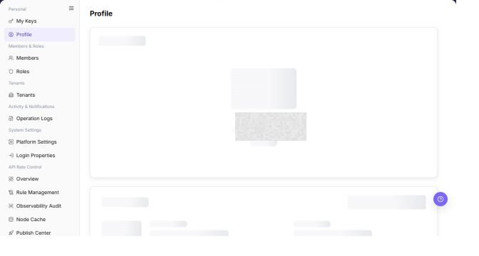

# Profile

## Feature Overview

| Item | Content |
| --- | --- |
| Applicable Role | Model Consumer |
| Navigation path | Settings > Personal > Profile |
| Page route | `/user/user-space/profile` |
| Managed objects | Basic account information, password status, security information, phone number, and email address |

#### Beginner Explanation

Profile is the identity card for the signed-in account. Use it to confirm who you are, which account context you are using, and whether security contact information is correct before opening a critical operation page.

#### Terms Quick Reference

| Term | Description |
| --- | --- |
| User information | Basic display information for the current account.; Desensitize it before taking a screenshot. |
| Username | The name used to sign in to or identify an account.; Verify it during identity troubleshooting. |
| Security information | Phone number, email address, and other security contact information.; Ask an administrator to complete it when empty. |
| Account context | The current tenant or identity scope of the account.; Confirm it before a cross-tenant action. |

## Prerequisites

1. The current account is signed in to Settings.
2. When reviewing Profile, do not capture or share complete accounts, email addresses, passwords, IDs, or other sensitive values.

## Page Description

| Area | Description |
| --- | --- |
| User Information | Shows the avatar, nickname, or system identifier. |
| Account Password | Shows username and password status. |
| Security Information | Shows phone number, email address, and other security contacts. |
| Top action | No create or save action is displayed on this page. |
| Copy icon | Copies a supported account field and shows success feedback. |

The screenshot keeps the left navigation and the complete functional area with the top menu hidden. Check the fields, buttons, and action locations on the Profile page.

## Main Operations

### View Profile

1. Go to `Settings > Personal > Profile`.
2. Confirm the tenant name, tenant ID, and business identity.
3. Review the display name, username, user ID, phone, email, and password status.
4. To copy a supported value, select its copy icon once.
5. Confirm the success feedback before you paste the value.
6. Treat copied account IDs and email addresses as sensitive data. Do not paste them into public channels.

The screenshot keeps the left navigation and the complete functional area with the top menu hidden. Check the fields, buttons, and action locations on the Profile page.

**Result validation:** The list, details, and status fields show the target object and remain consistent.

**Note:** Use only the fields and entries visible on the current page. Do not infer behavior from another role's page.

**FAQ:** If the entry is hidden, the button is disabled, or the result is not updated, check the current account permission, filters, object status, and page refresh time.

### Verify Account Permissions

1. Check the username, tenant, roles, and account status.
2. Confirm that protected fields did not change during profile editing.
3. If permissions are unexpected, inspect role assignments without elevating privileges.
4. Hide email, contact details, and internal identifiers before screenshots or sharing.

The screenshot keeps the left navigation and the complete functional area with the top menu hidden. Check the fields, buttons, and action locations on the Profile page.

**Result validation:** The list, details, and status fields show the target object and remain consistent.

**Note:** Use only the fields and entries visible on the current page. Do not infer behavior from another role's page.

**FAQ:** If the entry is hidden, the button is disabled, or the result is not updated, check the current account permission, filters, object status, and page refresh time.

## Parameter Quick Reference

| Field Name | Required | Field Type | Example | Description |
| --- | --- | --- | --- | --- |
| Tenant Name | System generated | Text | Sanitized value | Identifies the current tenant. |
| Tenant ID | System generated / Copyable | Text | Sanitized value | Identifies the tenant. Treat the copied value as sensitive data. |
| Business Identity | System generated | Tag | `Provider` | Shows the current tenant business identity. |
| Display Name | System generated / Editable | Text | Sanitized value | Shows the user display name. |
| Username | System generated / Copyable | Text | Sanitized value | Identifies the current user account. |
| User ID | System generated / Copyable | Text | Sanitized value | Identifies the current user. Treat the copied value as sensitive data. |
| Phone | System generated / Editable | Text | Sanitized value | Shows the configured phone number. |
| Email | System generated / Editable / Copyable | Text | Sanitized value | Shows the configured email address. |

## Pitfalls

- Do not change roles, members, login policies, Keys, or API rate-control rules without confirming the affected users and systems.
- UI entries can differ by role and tenant scope; verify the current account context before troubleshooting.
- Never copy complete Keys, AK/SK, tokens, or secrets into documentation, tickets, or screenshots.

## Result Validation

| Check Item | Success Signal | If Abnormal |
| --- | --- | --- |
| Page access | The `Personal > Profile` page opens and data loads normally. | Check role permissions and refresh the page. |
| Account information | User Information, Account Password, and Security Information are displayed. | Check account permissions and page loading status. |
| Copy feedback | Selecting a copy icon shows success feedback. | Select the icon once again and check browser clipboard permission. |
| Password security | The page does not display a plaintext password. | If a sensitive value is exposed, stop taking screenshots and ask an administrator to investigate. |

## FAQ

#### Security information is empty

**Symptom:**

The phone number or email address is not displayed.

**Possible cause:**

- Security information has not been bound to the account.
- The tenant manages account information centrally.

**Resolution:**

1. Complete security information through the tenant account process.
2. Ask an administrator whether self-service changes are allowed.

#### Why is some account information missing?

**Symptom:**

Phone number, email, security information, or sign-in method is absent.

**Possible cause:**

The profile is incomplete, some fields are managed by an identity provider, or the current account cannot view sensitive security information.

**Resolution:**

Confirm whether an enterprise identity provider owns the field. Complete editable fields through the organization process. Ask an administrator to check account synchronization when sensitive fields are missing.

#### Why cannot Profile be edited?

**Symptom:**

Profile is visible, but avatar, email, phone number, or security information cannot be changed.

**Possible cause:**

An enterprise identity provider synchronizes the profile, sensitive fields do not support self-service changes, or secondary verification is required.

**Resolution:**

Change basic information in the enterprise identity provider. Request security-field changes through the account-management process, then sign in again to verify synchronization.

#### How should the Profile page be exported or captured safely?

**Symptom:**

Page information is needed for troubleshooting, audit, or delivery.

**Possible causes:**

The page may contain accounts, email addresses, IP addresses, internal paths, tenant identifiers, Keys, or amounts.

**Resolution:**

Keep only the necessary fields and action context. Use opaque light-gray pixel mosaics for sensitive text and never share complete credentials or internal addresses.

#### What should I do when the Profile page shows unexpected data?

**Symptom:**

A field, status, metric, or related object differs from the expectation.

**Possible causes:**

The page scope, time condition, role permission, or upstream setting does not match.

**Resolution:**

Record the redacted object, time, and result. Verify the entry and filters first, then check related pages and Operation Logs.

## Notes

- Do not retain complete accounts, email addresses, phone numbers, IDs, or passwords in documentation or screenshots.

## Next Steps

1. Return to Dashboard to review quota and shortcuts.
2. Open My Keys to manage calling credentials.
