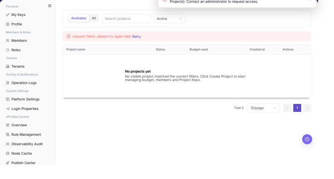

# Projects

## Feature Overview

| Item | Content |
| --- | --- |
| Applicable Role | Model Consumer |
| Navigation path | Settings > Personal > Projects |
| Page route | `/user/user-space/projects` |
| Managed objects | Projects, project status, budget usage, creation time, and project details |

#### Beginner Explanation

Projects is the project ledger for a provider account. It shows project names, budgets, model counts, and member ownership, and helps determine whether a call failed because of project status or budget.

#### Terms Quick Reference

| Term | Description |
| --- | --- |
| Project | A business workspace for model calls, budgets, and member collaboration.; Confirm project ownership before creation or troubleshooting. |
| Project budget | The quota or amount limit available to a project.; Reaching it can block calls. |
| Model count | The models associated with or available to a project.; Check model authorization when it is unexpected. |
| Member | An account that collaborates in a project.; Verify the member role for permission problems. |

## Prerequisites

1. The current account has permission to view projects.
2. Before creating a project, you have defined the project name, budget cycle, and over-budget policy.
3. If a model allowlist is enabled, you have defined which models can be called.

## Page Description

| Area | Description |
| --- | --- |
| Top action | `Create Project` |
| Filters | Search projects and availability status |
| Table columns | Project name, status, budget used, creation time, and actions |
| Row actions | View and Archive |
| Detail tabs | Overview, Members, Usage, API Keys, Activity, and Settings |

The screenshot keeps the left navigation and the complete functional area with the top menu hidden. Check the fields, buttons, and action locations on the Projects page.

## Main Operations

### View Projects

1. Go to `Settings > Personal > Projects`.
2. Filter by project name, status, member, or update time.
3. Open details and check members, quota, defaults, and status.
4. If no record is returned, reset filters and check the tenant context. Project information must be redacted before sharing.

The screenshot keeps the left navigation and the complete functional area with the top menu hidden. Check the fields, buttons, and action locations on the Projects page.

**Result validation:** The list, details, and status fields show the target object and remain consistent.

**Note:** Use only the fields and entries visible on the current page. Do not infer behavior from another role's page.

**FAQ:** If the entry is hidden, the button is disabled, or the result is not updated, check the current account permission, filters, object status, and page refresh time.

### Create a Project

1. Click **"Create Project"**.
2. Check the name, members, quota, and defaults.
3. Before saving, confirm quota and member scope. Close the form without submission during read-only validation.
4. After an approved save, verify the new state in the list and details. If it fails, check name uniqueness, required fields, and quota limits.

The screenshot keeps the left navigation and the complete functional area with the top menu hidden. Check the fields, buttons, and action locations on the Projects page.

**Result validation:** Follow the page success message, then return to the list or details page to verify the object status, update time, and affected scope.

**Note:** Recheck the target object and impact before submission. For changes to permissions, status, data, or external settings, confirm approval and rollback information first.

**FAQ:** If the entry is hidden, the button is disabled, or the result is not updated, check the current account permission, filters, object status, and page refresh time.

### Edit a Project

1. Go to `Settings > Personal > Projects`.
2. Use search or status filters to locate the project.
3. Review project name, status, budget usage, and creation time.

The following screenshot shows the project list. Filters are above the list and row actions are on the right.

4. Select `Create Project` to open the form.
5. Enter project name, description, reset cycle, cycle budget, budget alert threshold, over-budget policy, and model allowlist.
6. Confirm the impact before selecting `Create`.

The following screenshot shows the Create Project form.

7. Select `View` in the project row to open project details.
8. Use Overview, Members, Usage, API Keys, Activity, and Settings to review project configuration.

The following screenshot shows project details.

**Result validation:** Follow the page success message, then return to the list or details page to verify the object status, update time, and affected scope.

**Note:** Recheck the target object and impact before submission. For changes to permissions, status, data, or external settings, confirm approval and rollback information first.

**FAQ:** If the entry is hidden, the button is disabled, or the result is not updated, check the current account permission, filters, object status, and page refresh time.

### View Project Details

1. Open `Settings > Personal > Projects`.
2. Locate the target Projects and click **"View"**.
3. Review or complete the required fields shown on the page, and confirm the target object, scope, and current status.
4. For an action that changes data, permissions, status, or an external setting, confirm the impact and rollback path before clicking the final confirmation button.
5. After the action, return to the list or details page and verify the status, update time, or result message.

The screenshot keeps the left navigation and the complete functional area with the top menu hidden. Check the fields, buttons, and action locations on the Projects page.

**Result validation:** The list, details, and status fields show the target object and remain consistent.

**Note:** Use only the fields and entries visible on the current page. Do not infer behavior from another role's page.

**FAQ:** If the entry is hidden, the button is disabled, or the result is not updated, check the current account permission, filters, object status, and page refresh time.

## Parameter Quick Reference

| Field Name | Required | Field Type | Example | Description |
| --- | --- | --- | --- | --- |
| Keyword or name | No | Text | `Example name` | Used to locate a specific record. |
| Status | No | Enum | `Enabled` | Used to determine the current processing or availability state. |
| Time range or billing cycle | No | Date / Month | `2026-07` | Used to narrow statistics, logs, bills, or settlements. |
| Tenant / customer / member | No | Text | `Example tenant` | Used to identify the business ownership scope. |
| Operation | System generated | Button / link | `View Details` | Provides row-level entry points for follow-up checks. |

## Pitfalls

- Do not change roles, members, login policies, Keys, or API rate-control rules without confirming the affected users and systems.
- UI entries can differ by role and tenant scope; verify the current account context before troubleshooting.
- Never copy complete Keys, AK/SK, tokens, or secrets into documentation, tickets, or screenshots.

## Result Validation

| Check Item | Success Signal | If Abnormal |
| --- | --- | --- |
| Project created | The new project appears in the list. | Refresh the list and check the creation result message. |
| Complete details | Project details show budget, remaining credits, policies, and trends. | Reopen project details and confirm view permission. |
| Tabs | Members, Usage, API Keys, Activity, and Settings can be selected. | Check the project role and page loading status. |

## FAQ

#### Calls fail after a project reaches its budget

**Symptom:**

Project calls are blocked or report insufficient quota.

**Possible cause:**

- The over-budget policy is `STOP`.
- The cycle budget is exhausted.
- The next reset time has not arrived.

**Resolution:**

1. Open project details and review budget usage.
2. Adjust the budget or policy when authorized.
3. Confirm that the project Key is still enabled.

#### Why is a target project missing from the list?

**Symptom:**

The expected project is absent, or only some projects are shown.

**Possible cause:**

The current account is not a project member, the project is disabled or belongs to another tenant, or name and status filters limit the list.

**Resolution:**

Clear filters and query again. Confirm the current tenant and project membership. If it is still missing, ask the project administrator to check project status and authorization.

#### Why are Create Project or Settings unavailable?

**Symptom:**

The project list is visible, but Create Project, Edit Budget, Configure Members, or Manage API Keys cannot be selected.

**Possible cause:**

The current account is not a project administrator, the tenant disables self-service project creation, or the project is disabled or frozen.

**Resolution:**

Verify the project role and tenant project policy. Ask a project or tenant administrator to make the change, then verify it in project details.

#### How should the Projects page be exported or captured safely?

**Symptom:**

Page information is needed for troubleshooting, audit, or delivery.

**Possible causes:**

The page may contain accounts, email addresses, IP addresses, internal paths, tenant identifiers, Keys, or amounts.

**Resolution:**

Keep only the necessary fields and action context. Use opaque light-gray pixel mosaics for sensitive text and never share complete credentials or internal addresses.

#### What should I do when the Projects page shows unexpected data?

**Symptom:**

A field, status, metric, or related object differs from the expectation.

**Possible causes:**

The page scope, time condition, role permission, or upstream setting does not match.

**Resolution:**

Record the redacted object, time, and result. Verify the entry and filters first, then check related pages and Operation Logs.

## Notes

- `Archive` affects later project use. Confirm that the project no longer serves calls before archiving it.
- Do not include customer-sensitive information in a project name or description.

## Next Steps

1. Maintain members and API Keys in project details.
2. Review project usage and activity.
3. Adjust budget, allowlist, and over-budget policy when required.
