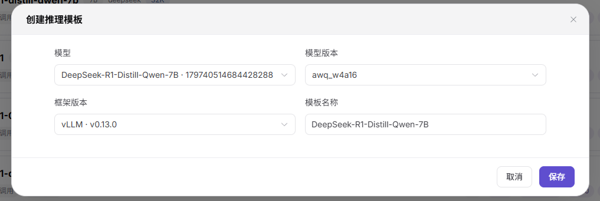
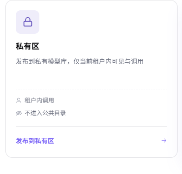
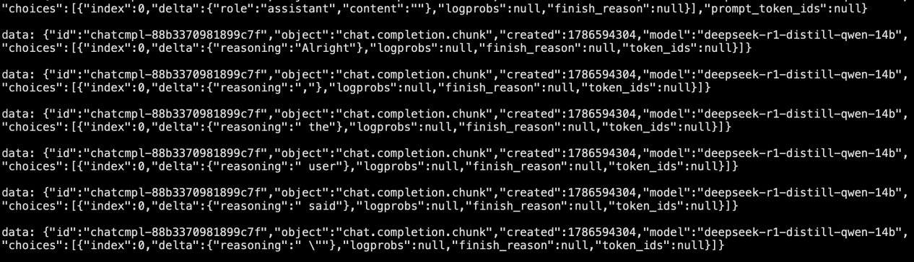

# 模型自动下载与推理模板验证最佳实践

::: info 文档信息
版本：v1.3<br>
更新日期：2026-08-13
:::

## 概述

当客户需要通过新推理模板启动模型实例时，应按以下顺序完成整个流程：

1. **确认模型已下载 — Operator：** 在 On-Prem 中找到目标模型，确认模型权重已下载到指定集群。
2. **创建推理模板 — Operator：** 配置模型、版本、框架、显存系数、加速卡关系和模板可用状态。
3. **使用模板创建模型实例 — End User：** 选择模板，配置并发量和上下文长度，确认平台推荐的资源规格正确。
4. **使用已创建实例发布私有模型 — End User：** 为运行中的实例选择 `私有模型` 类型，启用并测试 API 协议，然后配置标签、计费和限流。
5. **测试私有模型 — End User：** 在私有模型列表中找到已发布模型，在 Playground 中测试，再到 Shell 中验证平台生成的 cURL 命令。

只有当模型文件就绪、推理模板可用、实例进入 `Running` 且服务端口可用，并且网页体验和 API 调用均成功时，整个流程才算完成。

## 开始前准备

- 准备具有相应权限的 Operator 和 End User 账号。
- 确认目标模型、模型版本、仓库 Model ID、目标集群、推理框架和加速卡类型。
- 确认目标集群能够访问 ModelScope 或 Hugging Face，并具有足够的存储和加速卡资源。
- 只有模型许可证或仓库明确要求时才准备仓库 Token。文档和截图中不得出现 Token、密码、API Key 或内部 Endpoint。
- 发布前确认允许使用的计费和限流策略。

::: warning 副作用说明
保存模型版本会启动下载；提交实例会占用算力；发布私有模型会改变模型在当前租户内的可见状态；协议测试、Playground 和 cURL 都会调用模型。只能在已获批准的环境中执行这些动作。
:::

## 1. 确认模型已下载 — Operator

### 1.1 查找模型

1. 使用 Operator 账号登录。
2. 将鼠标移到 `AI基础设施`，选择 `On-Prem`，打开 `模型` 或 `模型配置`。
3. 搜索目标模型，例如 `DeepSeek-R1-Distill-Qwen-7B`。
4. 模型通常已预先创建。如果列表中没有所需模型，点击 `添加模型`，先完成模型基础信息配置。


### 1.2 选择集群和模型版本

1. 点击目标模型，进入模型详情页。
2. 向下滚动到集群区域，点击 `选择关联集群`。
3. 选择用于保存模型文件并运行后续实例的集群。
4. 如果该集群尚未下载模型，点击目标版本的 `编辑`。


### 1.3 配置自动下载

1. 将 `模型来源` 从 `Local` 改为 `ModelScope` 或 `Hugging Face`。
2. 如果当前环境访问 Hugging Face 不稳定，并且 ModelScope 属于已批准来源，则选择 `ModelScope`。
3. 打开选定的模型仓库，搜索准确的模型和版本，复制 Model ID，并把它填写到 AGIOne 的远程仓库 ID 字段中。
4. 大多数公开开源仓库不需要 Token。如果所选模型有许可证或访问限制，应通过平台的凭据机制使用已批准的 Token。

例如，使用 ModelScope 时，应先在 ModelScope 搜索目标模型，从匹配的仓库页面复制 Model ID，再返回 AGIOne 填写。


### 1.4 保存并验证下载

1. 复核模型来源、Model ID、版本和关联集群。
2. 如果下载成功后需要立即启用模型，可勾选 `下载后启用`。
3. 点击 `保存`，AGIOne 将自动开始下载模型。
4. 刷新或重新打开模型详情，直到下载进入成功状态。

**成功标准：** 指定集群中的完整模型版本显示为已下载且可用。仅保存配置成功或下载仍在进行中，不能判定为通过。

**下载失败时：** 检查仓库连通性、Model ID、Token 权限、集群存储容量、代理配置和残缺文件后再重试。

## 2. 创建推理模板 — Operator

### 2.1 创建模板

1. 打开 `推理模板` 页面。
2. 点击 `新建推理模板` 或 `创建推理模板`。
3. 选择已完成下载的模型及其版本。
4. 选择所需推理框架，并填写清晰的模板名称。



### 2.2 完成模板配置

1. 在 `关联显存系数` 中点击 `编辑`，为本文所述的 vLLM 配置选择 `Common Model Inference VRAM Param Table for vLLM`。
   不要仅因为模型是开源模型或采用 MoE 架构就直接套用该显存系数；如果模型架构或显存行为超出已验证范围，应先由专业服务人员确认。
2. 向下滚动到 `框架关系`，点击 `编辑`。
3. 选择目标环境中可用的加速卡。部署到 `Ascend 910B` 时选择 `Ascend 910B`；只有框架、镜像和资源规格已针对其他加速卡完成验证时，才改选其他型号。
4. 点击 `确认`，保存框架关系。
5. 基础验证阶段保持 `额外参数` 不变。如需修改，应先完成专业的推理性能调优。
6. 将框架状态改为 `可用`。
7. 保存模板，并确认它已成功显示在推理模板列表中。


**成功标准：** 模板关联了预期模型版本、框架、显存系数和加速卡关系；框架状态为 `可用`，且 End User 可以在部署页面选择该模板。

## 3. 使用模板创建模型实例 — End User

### 3.1 选择模型和模板

1. 使用 End User 账号登录。
2. 进入 `AI基础设施 > On-Prem > 模型部署 > 部署模板`。如果当前版本在 On-Prem 首页提供模板入口，则使用对应入口；旧版本可能显示 `我的模型 > 开始`，其目标同样是打开可用部署模板。
3. 搜索目标模型，选择它并进入配置页。


### 3.2 配置业务参数和资源规格

1. 设置模型实例所需的并发量。
2. 设置所需的上下文长度。
3. 查看右侧可用资源规格；并发量或上下文长度变化时，规格会自动更新。
4. 除非项目已经验证并批准其他选择，否则使用平台推荐规格。


### 3.3 提交并等待实例就绪

1. 复核模型、版本、框架、并发量、上下文长度、资源规格和加速卡。
2. 只有算力使用已获批准时才点击 `提交`。
3. 返回实例列表，点击 `搜索` 或刷新页面。
4. 等待实例状态变为 `Running`，并确认服务端口已经可用。


实例启动可能需要数分钟。DeepSeek-R1 14B 实例在常规验证环境中可预留约 5–10 分钟，实际时间取决于调度、镜像拉取、模型加载和健康检查。该时间仅为估算，不是 SLA。

**成功标准：** 页面显示预期模型和框架，实例状态为 `Running`，所需服务端口可用。

**实例无法启动时：** 检查调度事件、加速卡可用量、镜像拉取状态、模型挂载路径、框架日志、启动参数、服务端口和健康检查时间。

## 4. 使用已创建实例发布私有模型 — End User

### 4.1 选择私有模型类型并开始发布

1. 继续使用 End User 账号，进入 `AI基础设施 > On-Prem > 模型部署 > 模型实例`。
2. 确认目标实例状态为 `Running` 且服务端口可用，然后在模型实例列表或 `我的部署` 中打开该实例的操作菜单并点击 `发布`。
3. 在 `选择发布区域` 中选择 `私有区`，点击 `发布到私有区`。
4. 确认发布来源是上一阶段创建的实例。



AGIOne 将发布后的模型分为 `公有模型` 和 `私有模型`；这是模型类型，不是发布方式名称。当前界面使用 `私有区` 卡片和 `发布到私有区` 按钮选择私有模型类型。私有模型只有当前租户能够查看和调用，不进入公共模型目录。

### 4.2 配置并测试协议

1. 至少启用一个 API 协议，例如 `OpenAI-ChatCompletions`。
2. 点击 `测试`，确认协议测试通过后再继续。
3. 可将 `自定义标签` 设置为 `testing`，用于标识验证模型。


### 4.3 配置计费和限流

1. 对于已批准的非生产验证，可在计费页面选择 `免费`。其他使用场景应执行已批准的计费策略。


2. 进入限流页面，按已批准策略决定是否启用限流。对于已批准的隔离验证，可以保持限流关闭；如果启用限流，应填写已批准的 RPM 和 TPM。共享环境或生产环境不得在未经批准的情况下使用无限制配置。
3. 提交私有模型审批。
4. 如果当前环境已开启自动审批，则不需要 Operator 操作；否则应等待 Operator 审核通过后再测试模型。


**成功标准：** 协议测试通过，私有模型配置正确，模型进入已发布/已审批状态；模型只出现在当前租户的私有目录中，不进入公共模型目录。

## 5. 测试私有模型 — End User

### 5.1 查找模型并打开 Playground

1. 使用 End User 账号进入 `模型及AI服务 > 创作空间 > 我的模型 > 我的发布`。
2. 选择 `私有模型`，搜索刚发布的模型，确认状态为已发布或已审批。应通过模型名称和 Model ID 核对，不能只依赖列表位置。
3. 确认模型出现在当前租户的 `私有模型` 列表中；再切换到 `公共模型`，使用同一 Model ID 搜索，确认没有对应公共模型记录。
4. 打开该私有模型记录，点击 `Playground`。
5. 输入一条无副作用的测试消息并发送。
6. 确认页面返回完整且相关的回答，没有协议错误或服务错误。

### 5.2 验证平台生成的 cURL 命令

1. 打开所选私有模型详情页，点击 `快速开始`。
2. 在 `快速开始` 中选择目标服务 Provider 和协议。
3. 检查 Model ID、Base URL、路径、请求头和 cURL 请求体。
4. 复制 cURL 命令，将它粘贴到目标 Shell 环境中。
5. 执行命令，确认 HTTP 请求和模型响应均成功。

以下命令结构用于核对调用字段。Base URL、Model ID 和路径必须使用所选私有模型 `快速开始` 页面显示的值：

```bash
curl -X POST "${AGIONE_BASE_URL}/v1/chat/completions" \
  -H "Content-Type: application/json" \
  -H "Authorization: Bearer ${AGIONE_API_KEY}" \
  -d '{
    "stream": true,
    "model": "MODEL_ID_FROM_QUICK_START",
    "messages": [
      {"role": "user", "content": "Hello"}
    ]
  }'
```

只能在已授权的 Shell 会话中替换变量。不得把真实 API Key 写入文档、截图、工单、脚本或 Shell 历史，测试时只能使用当前登录账号获得且已授权使用的 Key。



调用成功后，Shell 会持续返回流式响应事件。留存命令执行证据前，必须遮盖 Endpoint 和全部凭据。

**成功标准：** 私有模型对当前租户可见、不进入公共目录，并且网页聊天和 cURL 请求都能针对已发布 Model ID 返回有效模型响应。

## 完成记录

记录以下信息，但不得包含敏感数据：

| 阶段 | 最少证据 |
| --- | --- |
| 模型下载 | 模型、版本、仓库来源、Model ID、关联集群和下载成功状态 |
| 推理模板 | 模板名称、模型版本、框架、显存系数、加速卡关系和 `可用` 状态 |
| 模型实例 | 并发量、上下文长度、所选规格、加速卡、`Running` 状态和服务端口 |
| 发布私有模型 | `私有模型` 类型、已测试协议、标签、计费、限流配置、审批状态，以及模型未进入公共目录的确认结果 |
| 模型测试 | 网页测试结果、cURL HTTP/结果摘要、Model ID、时间和已移除敏感信息的请求标识 |

## 相关文档

- [模型配置](/zh-CN/usermanual/ai-infra-on-prem/operator/templates/models/)
- [推理模板](/zh-CN/usermanual/ai-infra-on-prem/operator/templates/inference-templates/)
- [部署模板](/zh-CN/usermanual/ai-infra-on-prem/user/model-deployment/templates/)
- [模型实例](/zh-CN/usermanual/ai-infra-on-prem/user/model-deployment/instances/)
- [我的部署](/zh-CN/usermanual/model-services/user/studio/my-deployments/)
- [我的模型](/zh-CN/usermanual/model-services/user/studio/my-models/)
- [模型的体验与调用](/zh-CN/userguide/scenarios/model-experience-api-calling/)
