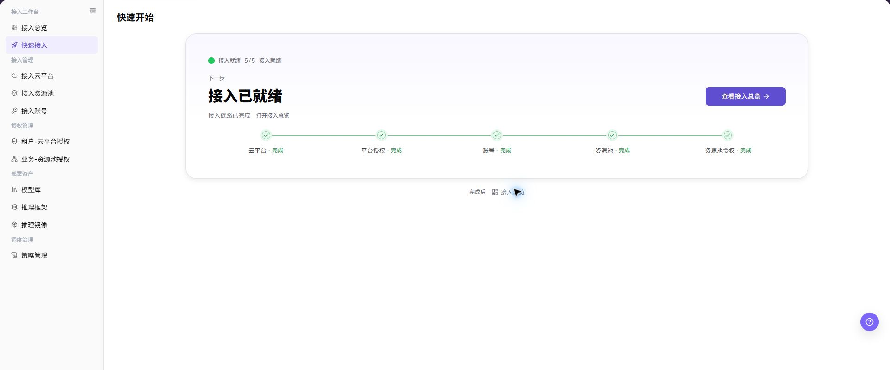

# 快速入门

## 功能概述

| 项目 | 内容 |
| --- | --- |
| 适用角色 | 运营管理员、模型提供方、模型调用方 |
| 导航路径 | 用户手册 > 多平台调度 > 快速入门 |
| 页面路由 | 不适用（文档导航页） |
| 管理对象 | 角色边界、资源层级、授权关系和推荐阅读顺序 |

#### 新手理解

快速入门像一张上手路线图。它先解释三类角色各自负责什么，再说明云平台、账号、资源池、部署资产和模型部署之间的先后关系。

#### 术语表

| 术语 | 英文 | 说明 |
| --- | --- | --- |
| 运营管理员 | Operator | 维护接入、授权、部署资产和调度策略的角色。 |
| 模型提供方 | Model Provider | 接入账号、部署并发布模型服务的角色。 |
| 模型调用方 | Model Consumer | 查找并调用已发布模型服务的角色。 |

#### 推荐操作顺序

先确认角色和目标，再查看接入总览；缺少底座资源时按快速接入补齐，资产和授权完成后再进入快速部署。

#### 小白先看

| 场景 | 先做 | 不要直接做 |
| --- | --- | --- |
| 第一次进入页面 | 查看现有对象、状态和可用操作 | 直接修改未知对象 |
| 准备变更配置 | 核对上游依赖、影响范围和目标对象 | 跳过依赖和影响检查 |
| 操作完成 | 按结果校验表复核当前页和下游页面 | 只看成功提示不复核下游 |
| 页面出现异常 | 记录脱敏对象、时间和页面提示 | 反复提交或写入真实凭据 |

## 前提条件

1. 当前账号具备 `快速入门` 页面或流程所需权限。
2. 已确认当前账号对应的角色，以及要完成的业务目标。
3. 涉及凭据、授权、部署或计费的操作已确认责任人和影响范围。

## 页面说明

本页提供角色分工、资源层级和主链路说明。下图展示运营管理员用于判断接入完成度的快速接入页面。

页面截图：

上图展示快速接入参考。重点核对目标对象、当前状态、字段和操作入口。

## 主要操作

### 确认角色职责

1. 运营管理员负责接入、授权、资产和策略。
2. 模型提供方负责账号接入、模型部署和发布。
3. 模型调用方只使用已获得权限的模型服务。

### 确认资源准备顺序

1. 先登记云平台和账号，再启用资源池。
2. 完成租户-云平台授权和业务-资源池授权。
3. 准备模型、框架、镜像和策略后再部署。

### 选择下一入口

1. 接入状态不明确时进入 **"接入总览"**。
2. 接入步骤缺失时进入 **"快速接入"**。
3. 资源与授权齐备时进入 **"快速部署"**。

## 参数速查表

| 字段名称 | 是否必填 | 字段类型 | 示例 | 说明 |
| --- | --- | --- | --- | --- |
| 角色类型 | 是 | 枚举 | 模型提供方 | 用于判断阅读运营侧接入配置还是用户侧部署流程。 |
| 云账号 | 否 | 文本 | 示例云账号 A | 用于定位接入账号、云账号授权和资源同步状态。 |
| 资源池 | 否 | 文本 | 示例资源池 | 用于确认可部署地域、规格和库存范围。 |
| 部署资产 | 否 | 文本 | 示例模型 / 示例镜像 | 用于核对模型库、推理框架和推理镜像是否匹配。 |

## 踩坑提示

- 不要跳过上游依赖检查：已确认当前账号对应的角色，以及要完成的业务目标。
- 配置变更前先确认影响：涉及凭据、授权、部署或计费的操作已确认责任人和影响范围。
- 页面成功提示不等于下游已同步，操作后必须按结果校验表复核。
- 示例凭据只使用 `<API_KEY>`、`<PERSONAL_KEY>`、`<ACCESS_KEY_ID>`、`<ACCESS_KEY_SECRET>`、`<BASE_URL>` 和 `<ENDPOINT_PATH>`。

## 结果校验

| 检查项 | 成功表现 | 异常时处理 |
| --- | --- | --- |
| 页面可访问 | 标题、导航和主要内容正常显示 | 检查角色权限和导航路径 |
| 管理对象可见 | 角色边界、资源层级、授权关系和推荐阅读顺序按预期显示 | 清除筛选并核对上游依赖 |
| 操作结果已保存 | 页面显示预期状态或新记录 | 查看页面提示、必填字段和依赖关系 |
| 下游结果一致 | 关联页面能看到本页变更 | 等待同步后刷新，并回到责任对象排查 |

## 常见问题

#### 快速入门中找不到目标对象

**问题现象：**

页面列表或选择器中没有预期对象。

**可能原因：**

- 查询条件仍在生效，目标对象被过滤。
- 上游对象未启用，或当前角色没有可见权限。

**处理方式：**

1. 清除筛选并刷新页面。
2. 回到前置对象核对：已确认当前账号对应的角色，以及要完成的业务目标。
3. 确认当前角色和数据范围后重新定位目标对象。

#### 快速入门操作入口不可用

**问题现象：**

预期按钮、菜单或状态开关不可用。

**可能原因：**

- 当前账号缺少对应操作权限。
- 目标对象状态、引用关系或前置条件不允许执行该操作。

**处理方式：**

1. 核对按钮对应的权限和目标对象当前状态。
2. 检查页面提示的引用关系和前置条件。
3. 解除阻断条件后刷新页面，再执行一次。

#### 快速入门修改后下游未生效

**问题现象：**

页面提示成功，但后续页面仍显示旧状态。

**可能原因：**

- 关联页面存在缓存或同步延迟。
- 当前页与下游页使用了不同角色、租户或数据范围。

**处理方式：**

1. 等待同步完成并刷新当前页和下游页。
2. 确认两页使用相同角色、租户和对象范围。
3. 仍不一致时回到责任对象核对保存结果。

#### 快速入门数据与其他页面不一致

**问题现象：**

当前页面的数量或状态与关联页面不同。

**可能原因：**

- 两个页面的筛选条件、统计口径或更新时间不同。
- 对象变更仍在同步，或当前角色的数据权限不同。

**处理方式：**

1. 统一两页的筛选条件和统计口径。
2. 核对各页面更新时间并等待同步。
3. 按对象详情逐项比较，不只对比汇总数量。

#### 快速入门操作失败如何排查

**问题现象：**

提交后页面提示失败或状态长时间不变化。

**可能原因：**

- 必填字段、字段组合或对象状态不满足提交条件。
- 上游依赖失效、网络请求失败，或同一操作已在处理中。

**处理方式：**

1. 记录脱敏后的对象、时间和完整页面提示。
2. 核对必填字段、对象状态和上游依赖。
3. 确认没有进行中的相同任务后再重试一次。

## 注意事项

- 涉及凭据、授权、部署或计费的操作已确认责任人和影响范围。
- 文档、截图、工单和聊天记录中不得写入真实账号、凭据、内部地址或客户数据。
- 涉及授权、部署、删除、发布、启停或计费的变更，应保留可审计记录并准备恢复方案。

## 后续操作

1. 运营管理员继续阅读接入云平台、云账号、资源池、授权管理和部署资产页面。
2. 模型提供方继续阅读接入账号、快速部署和我的部署页面；如需发布模型，继续查看 [模型及AI服务的我的部署](../../model-services/user/studio/my-deployments/) 和 [我的模型](../../model-services/user/studio/my-models/)。
3. 需要完整链路时，继续阅读 [从零开始部署云上模型服务](../end-to-end/deploy-cloud-model-service/)。
