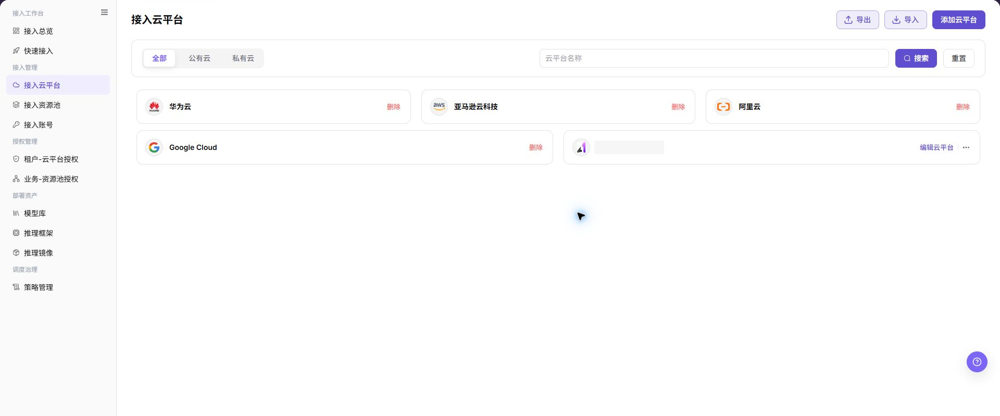
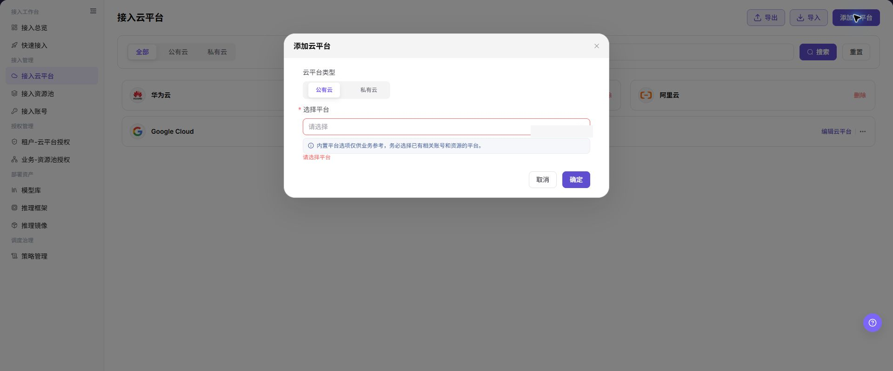
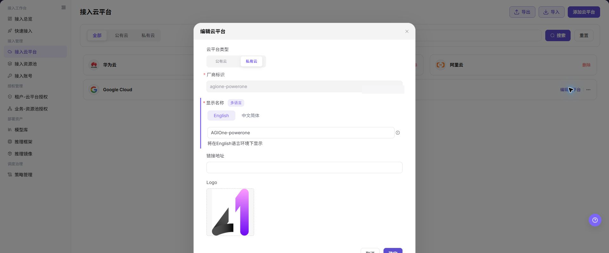

# 接入云平台

## 功能概述

| 项目 | 内容 |
| --- | --- |
| 适用角色 | 运营管理员 |
| 导航路径 | AI基础设施 > On-Cloud > 接入管理 > 接入云平台 |
| 页面路由 | `/infrahub/op/access/platform` |
| 管理对象 | 公有云、私有云及其展示配置 |

#### 新手理解

接入云平台像登记可使用的云厂商目录。先添加平台类型和平台记录，后续账号、资源池和授权才能引用它。

#### 术语表

| 术语 | 英文 | 说明 |
| --- | --- | --- |
| 公有云 | Public Cloud | 由外部云厂商提供的云平台类型。 |
| 私有云 | Private Cloud | 由组织自行维护的云平台类型。 |
| 平台标识 | Provider Identifier | 私有云记录的唯一识别字段。 |

#### 推荐操作顺序

先查看列表避免重复，再添加云平台；私有云展示信息变化时执行编辑；删除前先确认没有账号、资源池或授权引用。

#### 小白先看

| 场景 | 先做 | 不要直接做 |
| --- | --- | --- |
| 第一次进入页面 | 查看现有对象、状态和可用操作 | 直接修改未知对象 |
| 准备变更配置 | 核对上游依赖、影响范围和目标对象 | 跳过依赖和影响检查 |
| 操作完成 | 按结果校验表复核当前页和下游页面 | 只看成功提示不复核下游 |
| 页面出现异常 | 记录脱敏对象、时间和页面提示 | 反复提交或写入真实凭据 |

## 前提条件

1. 当前账号具备 `接入云平台` 页面或流程所需权限。
2. 目标平台类型和平台归属已确认，且不存在同一平台的重复记录。
3. 编辑或删除前已核对账号、资源池、授权和部署依赖。

## 页面说明

页面支持按全部、公有云、私有云查看平台，并提供添加、导入、导出、编辑和删除入口。

页面截图：

上图展示云平台页面。重点核对目标对象、当前状态、字段和操作入口。

上图展示云平台列表参考。重点核对目标对象、当前状态、字段和操作入口。

## 主要操作

### 添加云平台

1. 点击 **"添加云平台"**。
2. 选择 `公有云` 或 `私有云`。
3. 在 `选择平台` 中选择已有平台，确认没有重复记录。
4. 点击 **"确定"**，随后在列表中确认新记录。

上图展示添加云平台。重点核对目标对象、当前状态、字段和操作入口。

上图展示添加云平台参考。重点核对目标对象、当前状态、字段和操作入口。

### 编辑云平台

1. 在目标私有云卡片点击 **"编辑云平台"**。
2. 核对平台类型和平台标识，按需修改多语言显示名称、链接地址或 Logo。
3. 点击 **"确定"** 后刷新列表核对展示结果。

上图展示编辑云平台。重点核对目标对象、当前状态、字段和操作入口。

### 删除云平台

1. 定位目标卡片并确认其未被账号、资源池或授权引用。
2. 点击 **"删除"** 并核对确认提示中的目标平台。
3. 确认删除后刷新列表；若删除失败，先解除页面提示的依赖关系。

## 参数速查表

| 字段名称 | 是否必填 | 字段类型 | 示例 | 说明 |
| --- | --- | --- | --- | --- |
| 云平台名称 | 否 | 文本 / 搜索条件 | `华为云` | 列表展示和搜索使用的云平台名称。 |
| 云平台类型 | 必填 | 分段选择 | `公有云` | 添加云平台时选择平台分类，当前截图可见 `公有云`、`私有云`。 |
| 选择平台 | 必填 | 下拉选择 | `阿里云` | 添加云平台时选择具体云厂商或云平台。 |
| 添加云平台 | 否 | 操作按钮 | `添加云平台` | 打开新增云平台弹窗。 |
| 搜索 | 否 | 操作按钮 | `搜索` | 按云平台名称等条件筛选列表。 |
| 重置 | 否 | 操作按钮 | `重置` | 清空筛选条件并恢复默认列表。 |
| 导入 | 否 | 操作按钮 | `导入` | 导入云平台配置，可能影响真实配置，需谨慎使用。 |
| 导出 | 否 | 操作按钮 | `导出` | 导出云平台配置或列表数据，需注意敏感信息。 |
| 编辑云平台 | 否 | 操作入口 | `编辑云平台` | 进入已有云平台配置页面或弹窗。 |
| 删除 | 否 | 高风险操作 | `删除` | 删除云平台记录前需确认依赖的账号、资源池和授权关系。 |

## 踩坑提示

- 不要跳过上游依赖检查：目标平台类型和平台归属已确认，且不存在同一平台的重复记录。
- 配置变更前先确认影响：编辑或删除前已核对账号、资源池、授权和部署依赖。
- 页面成功提示不等于下游已同步，操作后必须按结果校验表复核。
- 示例凭据只使用 `<API_KEY>`、`<PERSONAL_KEY>`、`<ACCESS_KEY_ID>`、`<ACCESS_KEY_SECRET>`、`<BASE_URL>` 和 `<ENDPOINT_PATH>`。

## 结果校验

| 检查项 | 成功表现 | 异常时处理 |
| --- | --- | --- |
| 页面可访问 | 标题、导航和主要内容正常显示 | 检查角色权限和导航路径 |
| 管理对象可见 | 公有云、私有云及其展示配置按预期显示 | 清除筛选并核对上游依赖 |
| 操作结果已保存 | 页面显示预期状态或新记录 | 查看页面提示、必填字段和依赖关系 |
| 下游结果一致 | 关联页面能看到本页变更 | 等待同步后刷新，并回到责任对象排查 |

## 常见问题

#### 接入云平台中找不到目标对象

**问题现象：**

页面列表或选择器中没有预期对象。

**可能原因：**

- 查询条件仍在生效，目标对象被过滤。
- 上游对象未启用，或当前角色没有可见权限。

**处理方式：**

1. 清除筛选并刷新页面。
2. 回到前置对象核对：目标平台类型和平台归属已确认，且不存在同一平台的重复记录。
3. 确认当前角色和数据范围后重新定位目标对象。

#### 接入云平台操作入口不可用

**问题现象：**

预期按钮、菜单或状态开关不可用。

**可能原因：**

- 当前账号缺少对应操作权限。
- 目标对象状态、引用关系或前置条件不允许执行该操作。

**处理方式：**

1. 核对按钮对应的权限和目标对象当前状态。
2. 检查页面提示的引用关系和前置条件。
3. 解除阻断条件后刷新页面，再执行一次。

#### 接入云平台修改后下游未生效

**问题现象：**

页面提示成功，但后续页面仍显示旧状态。

**可能原因：**

- 关联页面存在缓存或同步延迟。
- 当前页与下游页使用了不同角色、租户或数据范围。

**处理方式：**

1. 等待同步完成并刷新当前页和下游页。
2. 确认两页使用相同角色、租户和对象范围。
3. 仍不一致时回到责任对象核对保存结果。

#### 接入云平台数据与其他页面不一致

**问题现象：**

当前页面的数量或状态与关联页面不同。

**可能原因：**

- 两个页面的筛选条件、统计口径或更新时间不同。
- 对象变更仍在同步，或当前角色的数据权限不同。

**处理方式：**

1. 统一两页的筛选条件和统计口径。
2. 核对各页面更新时间并等待同步。
3. 按对象详情逐项比较，不只对比汇总数量。

#### 接入云平台操作失败如何排查

**问题现象：**

提交后页面提示失败或状态长时间不变化。

**可能原因：**

- 必填字段、字段组合或对象状态不满足提交条件。
- 上游依赖失效、网络请求失败，或同一操作已在处理中。

**处理方式：**

1. 记录脱敏后的对象、时间和完整页面提示。
2. 核对必填字段、对象状态和上游依赖。
3. 确认没有进行中的相同任务后再重试一次。

## 注意事项

- 编辑或删除前已核对账号、资源池、授权和部署依赖。
- 文档、截图、工单和聊天记录中不得写入真实账号、凭据、内部地址或客户数据。
- 涉及授权、部署、删除、发布、启停或计费的变更，应保留可审计记录并准备恢复方案。

## 后续操作

1. 进入接入账号页面，为已添加云平台配置账号接入。
2. 进入接入资源池页面，创建或同步对应资源池。
3. 进入租户-云平台授权或业务-资源池授权页面，配置可用范围。
