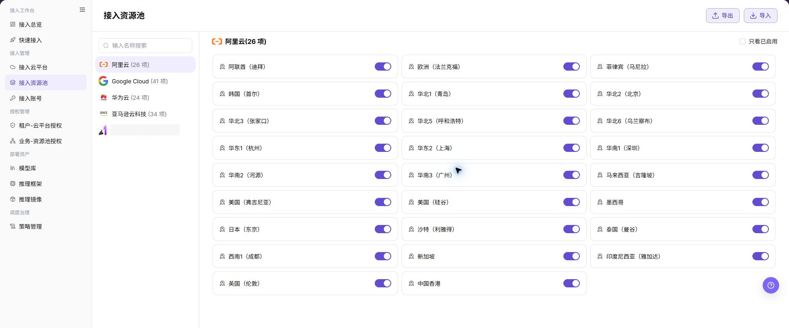

# 接入资源池

## 功能概述

| 项目 | 内容 |
| --- | --- |
| 适用角色 | 运营管理员 |
| 导航路径 | AI基础设施 > On-Cloud > 接入管理 > 接入资源池 |
| 页面路由 | `/infrahub/op/access/region` |
| 管理对象 | 云平台下地域资源池及启用状态 |

#### 新手理解

接入资源池像给各云地域设置可用开关。启用后资源池才能进入授权和调度范围，禁用会影响后续部署可选项。

#### 术语表

| 术语 | 英文 | 说明 |
| --- | --- | --- |
| 资源池 | Resource Pool | 按云平台和地域组织的可用资源范围。 |
| 启用状态 | Enabled State | 资源池能否进入授权和调度流程的状态。 |
| 只看已启用 | Enabled Only | 只显示当前已启用资源池的筛选项。 |

#### 推荐操作顺序

先选择云平台并查看资源池，再确认授权和部署影响，最后切换目标资源池状态并复核下游可见性。

#### 小白先看

| 场景 | 先做 | 不要直接做 |
| --- | --- | --- |
| 第一次进入页面 | 查看现有对象、状态和可用操作 | 直接修改未知对象 |
| 准备变更配置 | 核对上游依赖、影响范围和目标对象 | 跳过依赖和影响检查 |
| 操作完成 | 按结果校验表复核当前页和下游页面 | 只看成功提示不复核下游 |
| 页面出现异常 | 记录脱敏对象、时间和页面提示 | 反复提交或写入真实凭据 |

## 前提条件

1. 当前账号具备 `接入资源池` 页面或流程所需权限。
2. 目标云平台已接入，资源池列表可正常加载。
3. 状态变更前已检查租户授权、业务授权、调度策略和现有部署。

## 页面说明

左侧展示云平台，右侧展示所选平台下的地域资源池和状态开关。

页面截图：

上图展示资源池页面。重点核对目标对象、当前状态、字段和操作入口。

上图展示资源池列表参考。重点核对目标对象、当前状态、字段和操作入口。

## 主要操作

### 查看资源池

1. 选择左侧目标云平台。
2. 按需勾选 `只看已启用`，在步骤内缩小列表范围。
3. 核对地域名称和启用状态。

### 启用或禁用资源池

1. 定位目标地域并确认当前状态。
2. 切换状态开关，阅读确认提示中的地域和动作。
3. 点击 **"确定"** 后刷新列表。
4. 到授权页和部署页确认可见范围与预期一致。

上图展示启用或禁用资源池。重点核对目标对象、当前状态、字段和操作入口。

## 参数速查表

| 字段名称 | 是否必填 | 字段类型 | 示例 | 说明 |
| --- | --- | --- | --- | --- |
| 云平台 | 是 | 列表项 | `阿里云` | 资源池所属云平台。 |
| 资源池数量 | 系统生成 | 数值 | `26 项` | 当前云平台下的资源池数量。 |
| 资源池名称 | 系统生成 | 文本 | `华东1（杭州）` | 当前页面按地域展示的资源池名称。 |
| 启用状态 | 是 | 开关 | 开启 / 关闭 | 控制资源池是否可继续用于授权、展示或调度。 |
| 只看已启用 | 否 | 复选框 | 勾选 / 不勾选 | 过滤列表，仅查看已启用资源池。 |
| 名称搜索 | 否 | 输入框 | 按页面输入 | 按名称搜索云平台或资源池相关条目。 |
| 导入 | 否 | 操作按钮 | `导入` | 导入资源池相关配置，可能影响真实配置，需谨慎使用。 |
| 导出 | 否 | 操作按钮 | `导出` | 导出资源池列表或配置数据，需注意敏感信息。 |
| 确认提示 | 系统生成 | 弹窗 | `确定禁用地域华东1（杭州）吗?` | 启用或禁用前的二次确认提示。 |
| 取消 | 否 | 操作按钮 | `取消` | 关闭确认弹窗，不应用变更。 |
| 确定 | 否 | 高风险操作 | `确定` | 确认启用或禁用资源池，会应用真实状态变更。 |

## 踩坑提示

- 不要跳过上游依赖检查：目标云平台已接入，资源池列表可正常加载。
- 配置变更前先确认影响：状态变更前已检查租户授权、业务授权、调度策略和现有部署。
- 页面成功提示不等于下游已同步，操作后必须按结果校验表复核。
- 示例凭据只使用 `<API_KEY>`、`<PERSONAL_KEY>`、`<ACCESS_KEY_ID>`、`<ACCESS_KEY_SECRET>`、`<BASE_URL>` 和 `<ENDPOINT_PATH>`。

## 结果校验

| 检查项 | 成功表现 | 异常时处理 |
| --- | --- | --- |
| 页面可访问 | 标题、导航和主要内容正常显示 | 检查角色权限和导航路径 |
| 管理对象可见 | 云平台下地域资源池及启用状态按预期显示 | 清除筛选并核对上游依赖 |
| 操作结果已保存 | 页面显示预期状态或新记录 | 查看页面提示、必填字段和依赖关系 |
| 下游结果一致 | 关联页面能看到本页变更 | 等待同步后刷新，并回到责任对象排查 |

## 常见问题

#### 接入资源池中找不到目标对象

**问题现象：**

页面列表或选择器中没有预期对象。

**可能原因：**

- 查询条件仍在生效，目标对象被过滤。
- 上游对象未启用，或当前角色没有可见权限。

**处理方式：**

1. 清除筛选并刷新页面。
2. 回到前置对象核对：目标云平台已接入，资源池列表可正常加载。
3. 确认当前角色和数据范围后重新定位目标对象。

#### 接入资源池操作入口不可用

**问题现象：**

预期按钮、菜单或状态开关不可用。

**可能原因：**

- 当前账号缺少对应操作权限。
- 目标对象状态、引用关系或前置条件不允许执行该操作。

**处理方式：**

1. 核对按钮对应的权限和目标对象当前状态。
2. 检查页面提示的引用关系和前置条件。
3. 解除阻断条件后刷新页面，再执行一次。

#### 接入资源池修改后下游未生效

**问题现象：**

页面提示成功，但后续页面仍显示旧状态。

**可能原因：**

- 关联页面存在缓存或同步延迟。
- 当前页与下游页使用了不同角色、租户或数据范围。

**处理方式：**

1. 等待同步完成并刷新当前页和下游页。
2. 确认两页使用相同角色、租户和对象范围。
3. 仍不一致时回到责任对象核对保存结果。

#### 接入资源池数据与其他页面不一致

**问题现象：**

当前页面的数量或状态与关联页面不同。

**可能原因：**

- 两个页面的筛选条件、统计口径或更新时间不同。
- 对象变更仍在同步，或当前角色的数据权限不同。

**处理方式：**

1. 统一两页的筛选条件和统计口径。
2. 核对各页面更新时间并等待同步。
3. 按对象详情逐项比较，不只对比汇总数量。

#### 接入资源池操作失败如何排查

**问题现象：**

提交后页面提示失败或状态长时间不变化。

**可能原因：**

- 必填字段、字段组合或对象状态不满足提交条件。
- 上游依赖失效、网络请求失败，或同一操作已在处理中。

**处理方式：**

1. 记录脱敏后的对象、时间和完整页面提示。
2. 核对必填字段、对象状态和上游依赖。
3. 确认没有进行中的相同任务后再重试一次。

## 注意事项

- 状态变更前已检查租户授权、业务授权、调度策略和现有部署。
- 文档、截图、工单和聊天记录中不得写入真实账号、凭据、内部地址或客户数据。
- 涉及授权、部署、删除、发布、启停或计费的变更，应保留可审计记录并准备恢复方案。

## 后续操作

1. 进入租户-云平台授权或业务-资源池授权页面，核对资源池可见范围。
2. 进入调度策略页面，确认启用或禁用后的调度规则。
3. 进入接入总览，复核资源池状态和资源清单展示。
