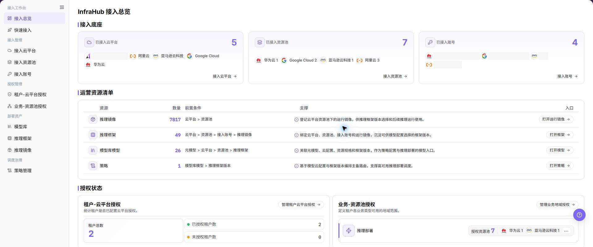

# 接入总览

## 功能概述

| 项目 | 内容 |
| --- | --- |
| 适用角色 | 运营管理员 |
| 导航路径 | AI基础设施 > On-Cloud > 接入工作台 > 接入总览 |
| 页面路由 | `/infrahub/op/workbanch/overview` |
| 管理对象 | 接入底座、运营资源清单和授权状态 |

#### 新手理解

接入总览像云资源接入仪表盘。它把云平台、资源池、账号、部署资产和两类授权集中展示，用于判断部署前还缺哪一项。

#### 术语表

| 术语 | 英文 | 说明 |
| --- | --- | --- |
| 接入底座 | Access Foundation | 已接入云平台、资源池和账号的汇总。 |
| 运营资源清单 | Operational Resource Checklist | 推理镜像、框架、模型和策略的准备情况。 |
| 授权状态 | Authorization Status | 租户云平台授权和业务资源池授权的汇总。 |

#### 推荐操作顺序

先看接入底座，再看运营资源清单，最后检查两类授权；发现缺项后从对应入口进入对象页补齐。

#### 小白先看

| 场景 | 先做 | 不要直接做 |
| --- | --- | --- |
| 第一次进入页面 | 查看现有对象、状态和可用操作 | 直接修改未知对象 |
| 准备变更配置 | 核对上游依赖、影响范围和目标对象 | 跳过依赖和影响检查 |
| 操作完成 | 按结果校验表复核当前页和下游页面 | 只看成功提示不复核下游 |
| 页面出现异常 | 记录脱敏对象、时间和页面提示 | 反复提交或写入真实凭据 |

## 前提条件

1. 当前账号具备 `接入总览` 页面或流程所需权限。
2. 当前账号具备接入总览及对应明细页的查看权限。
3. 总览仅用于判断状态；修改应在对应对象页完成并重新回到总览复核。

## 页面说明

页面上方展示接入底座，中部展示运营资源清单，下方展示授权状态和管理入口。

页面截图：

上图展示接入总览页面。重点核对目标对象、当前状态、字段和操作入口。

## 主要操作

### 查看接入总览

1. 进入 `AI基础设施 > On-Cloud > 接入工作台 > 接入总览`。
2. 核对已接入云平台、资源池和账号数量。
3. 核对推理镜像、框架、模型和策略数量及前置条件。
4. 核对租户和业务授权状态。

上图展示接入总览明细。重点核对目标对象、当前状态、字段和操作入口。

### 打开资源管理页

1. 在运营资源清单中定位目标资源。
2. 点击该行 **"打开"** 进入对应管理页。
3. 处理完成后返回接入总览并刷新核对。

### 打开授权管理页

1. 在授权状态中定位租户或业务授权区域。
2. 点击 **"管理授权"** 进入对应授权页。
3. 完成授权后返回总览，确认数量和状态已同步。

## 参数速查表

| 字段名称 | 是否必填 | 字段类型 | 示例 | 说明 |
| --- | --- | --- | --- | --- |
| 已接入云平台 | 系统生成 | 数值 / 列表 | 按页面展示 | 展示已完成接入的云平台数量和名称。 |
| 已接入资源池 | 系统生成 | 数值 / 列表 | 按页面展示 | 展示已完成接入的资源池数量和名称。 |
| 已接入账号 | 系统生成 | 数值 / 列表 | 按页面展示 | 展示已接入账号数量和账号名称。 |
| 资源 | 系统生成 | 文本 | `推理镜像` | 运营资源清单中的资源类型。 |
| 数量 | 系统生成 | 数值 | 按页面展示 | 当前资源类型下已登记或已配置的数量。 |
| 前置条件 | 系统生成 | 文本 | 按页面展示 | 使用该资源前需要完成的接入配置。 |
| 支撑 | 系统生成 | 文本 | 按页面展示 | 说明该资源在推理部署或调度链路中的作用。 |
| 入口 | 否 | 操作入口 | `打开` | 跳转到对应资源管理页面。 |
| 租户总数 | 系统生成 | 数值 | 按页面展示 | 当前统计范围内租户数量。 |
| 已授权租户数 | 系统生成 | 数值 | 按页面展示 | 已配置云平台授权的租户数量。 |
| 未授权租户数 | 系统生成 | 数值 | 按页面展示 | 尚未配置云平台授权的租户数量。 |
| 授权资源池 | 系统生成 | 数值 / 标签 | 按页面展示 | 业务类型可使用的资源池数量及资源池名称。 |

## 踩坑提示

- 不要跳过上游依赖检查：当前账号具备接入总览及对应明细页的查看权限。
- 配置变更前先确认影响：总览仅用于判断状态；修改应在对应对象页完成并重新回到总览复核。
- 页面成功提示不等于下游已同步，操作后必须按结果校验表复核。
- 示例凭据只使用 `<API_KEY>`、`<PERSONAL_KEY>`、`<ACCESS_KEY_ID>`、`<ACCESS_KEY_SECRET>`、`<BASE_URL>` 和 `<ENDPOINT_PATH>`。

## 结果校验

| 检查项 | 成功表现 | 异常时处理 |
| --- | --- | --- |
| 页面可访问 | 标题、导航和主要内容正常显示 | 检查角色权限和导航路径 |
| 管理对象可见 | 接入底座、运营资源清单和授权状态按预期显示 | 清除筛选并核对上游依赖 |
| 操作结果已保存 | 页面显示预期状态或新记录 | 查看页面提示、必填字段和依赖关系 |
| 下游结果一致 | 关联页面能看到本页变更 | 等待同步后刷新，并回到责任对象排查 |

## 常见问题

#### 接入总览中找不到目标对象

**问题现象：**

页面列表或选择器中没有预期对象。

**可能原因：**

- 查询条件仍在生效，目标对象被过滤。
- 上游对象未启用，或当前角色没有可见权限。

**处理方式：**

1. 清除筛选并刷新页面。
2. 回到前置对象核对：当前账号具备接入总览及对应明细页的查看权限。
3. 确认当前角色和数据范围后重新定位目标对象。

#### 接入总览操作入口不可用

**问题现象：**

预期按钮、菜单或状态开关不可用。

**可能原因：**

- 当前账号缺少对应操作权限。
- 目标对象状态、引用关系或前置条件不允许执行该操作。

**处理方式：**

1. 核对按钮对应的权限和目标对象当前状态。
2. 检查页面提示的引用关系和前置条件。
3. 解除阻断条件后刷新页面，再执行一次。

#### 接入总览修改后下游未生效

**问题现象：**

页面提示成功，但后续页面仍显示旧状态。

**可能原因：**

- 关联页面存在缓存或同步延迟。
- 当前页与下游页使用了不同角色、租户或数据范围。

**处理方式：**

1. 等待同步完成并刷新当前页和下游页。
2. 确认两页使用相同角色、租户和对象范围。
3. 仍不一致时回到责任对象核对保存结果。

#### 接入总览数据与其他页面不一致

**问题现象：**

当前页面的数量或状态与关联页面不同。

**可能原因：**

- 两个页面的筛选条件、统计口径或更新时间不同。
- 对象变更仍在同步，或当前角色的数据权限不同。

**处理方式：**

1. 统一两页的筛选条件和统计口径。
2. 核对各页面更新时间并等待同步。
3. 按对象详情逐项比较，不只对比汇总数量。

#### 接入总览操作失败如何排查

**问题现象：**

提交后页面提示失败或状态长时间不变化。

**可能原因：**

- 必填字段、字段组合或对象状态不满足提交条件。
- 上游依赖失效、网络请求失败，或同一操作已在处理中。

**处理方式：**

1. 记录脱敏后的对象、时间和完整页面提示。
2. 核对必填字段、对象状态和上游依赖。
3. 确认没有进行中的相同任务后再重试一次。

## 注意事项

- 总览仅用于判断状态；修改应在对应对象页完成并重新回到总览复核。
- 文档、截图、工单和聊天记录中不得写入真实账号、凭据、内部地址或客户数据。
- 涉及授权、部署、删除、发布、启停或计费的变更，应保留可审计记录并准备恢复方案。

## 后续操作

1. 进入云平台、资源池或接入账号页面补齐接入配置。
2. 进入推理镜像、推理框架、模型库模型或策略页面查看运营资源准备情况。
3. 进入授权管理页面核对租户和业务资源池授权。
