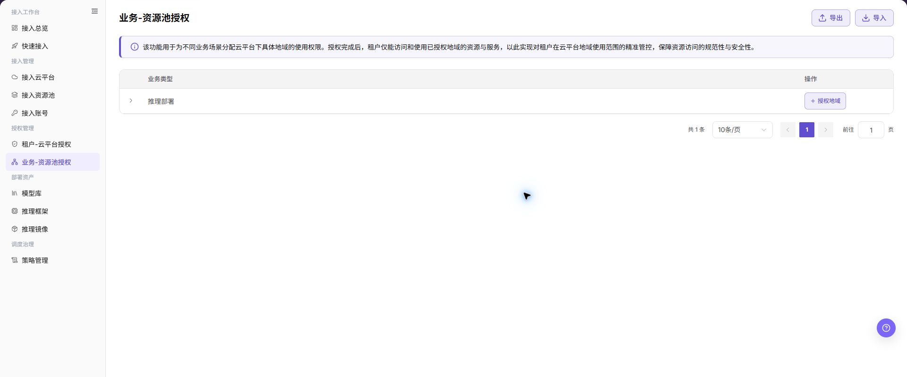
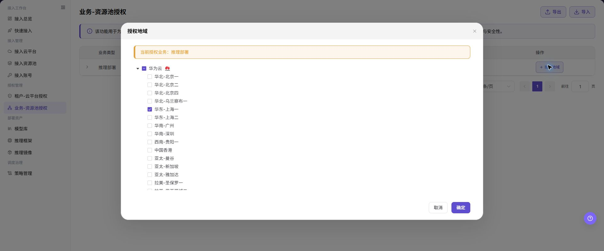

# 业务-资源池授权

## 功能概述

| 项目 | 内容 |
| --- | --- |
| 适用角色 | 运营管理员 |
| 导航路径 | AI基础设施 > On-Cloud > 授权管理 > 业务-资源池授权 |
| 页面路由 | `/infrahub/op/auth/region-auth` |
| 管理对象 | 业务类型与云平台地域资源池之间的授权 |

#### 新手理解

业务-资源池授权像给某类业务圈定可使用的地域。即使租户已获得云平台权限，业务仍只能在这里授权的资源池范围内部署。

#### 术语表

| 术语 | 英文 | 说明 |
| --- | --- | --- |
| 业务类型 | Business Type | 需要使用云资源的业务场景。 |
| 授权地域 | Authorized Region | 业务类型可以使用的云平台地域。 |
| 资源池范围 | Resource Pool Scope | 当前业务可见和可调度的资源池集合。 |

#### 推荐操作顺序

先确认业务类型，再展开查看现有地域，最后打开授权地域弹窗调整范围并到部署页复核。

#### 小白先看

| 场景 | 先做 | 不要直接做 |
| --- | --- | --- |
| 第一次进入页面 | 查看现有对象、状态和可用操作 | 直接修改未知对象 |
| 准备变更配置 | 核对上游依赖、影响范围和目标对象 | 跳过依赖和影响检查 |
| 操作完成 | 按结果校验表复核当前页和下游页面 | 只看成功提示不复核下游 |
| 页面出现异常 | 记录脱敏对象、时间和页面提示 | 反复提交或写入真实凭据 |

## 前提条件

1. 当前账号具备 `业务-资源池授权` 页面或流程所需权限。
2. 目标业务类型已存在，相关云平台和资源池已接入并启用。
3. 调整地域前已检查现有部署、调度策略和容量安排。

## 页面说明

页面按业务类型展示授权入口，授权弹窗按云平台列出可选地域。

页面截图：

上图展示业务资源池授权页面。重点核对目标对象、当前状态、字段和操作入口。

上图展示业务授权列表参考。重点核对目标对象、当前状态、字段和操作入口。

## 主要操作

### 查看业务资源池授权

1. 进入业务-资源池授权页面。
2. 展开目标业务类型，查看已授权地域。
3. 对照资源池状态和部署需求确认范围。

### 授权资源池

1. 在目标业务行点击 **"授权地域"**。
2. 按云平台展开地域树，勾选或取消目标地域。
3. 核对当前授权业务和地域范围后点击 **"确定"**。
4. 到快速部署或接入总览确认授权结果。

上图展示授权资源池。重点核对目标对象、当前状态、字段和操作入口。

上图展示授权地域参考。重点核对目标对象、当前状态、字段和操作入口。

## 参数速查表

| 字段名称 | 是否必填 | 字段类型 | 示例 | 说明 |
| --- | --- | --- | --- | --- |
| 业务类型 | 是 | 文本/分组 | `推理部署` | 当前需要配置地域授权的业务场景。 |
| 当前授权业务 | 是 | 提示信息 | `推理部署` | 弹窗中提示当前正在授权的业务类型。 |
| 云平台 | 是 | 树形分组 | `华为云` | 用于展开和选择该云平台下的地域。 |
| 授权地域 | 是 | 多选 | `华东-上海一` | 允许当前业务使用的云平台地域。 |
| 地域数量 | 否 | 数字 | `2` | 列表卡片中显示的已授权地域数量。 |
| 授权地域入口 | 否 | 按钮 | `授权地域` | 打开地域授权弹窗。 |
| 导出 | 否 | 按钮 | `导出` | 导出授权数据，可能包含敏感运营信息。 |
| 导入 | 否 | 按钮 | `导入` | 批量导入授权数据，可能改变多条授权配置。 |
| 取消 | 否 | 按钮 | `取消` | 关闭弹窗且不保存本次配置。 |
| 确定 | 是 | 按钮 | `确定` | 最终提交地域授权配置，点击前需完成复核。 |

## 踩坑提示

- 不要跳过上游依赖检查：目标业务类型已存在，相关云平台和资源池已接入并启用。
- 配置变更前先确认影响：调整地域前已检查现有部署、调度策略和容量安排。
- 页面成功提示不等于下游已同步，操作后必须按结果校验表复核。
- 示例凭据只使用 `<API_KEY>`、`<PERSONAL_KEY>`、`<ACCESS_KEY_ID>`、`<ACCESS_KEY_SECRET>`、`<BASE_URL>` 和 `<ENDPOINT_PATH>`。

## 结果校验

| 检查项 | 成功表现 | 异常时处理 |
| --- | --- | --- |
| 页面可访问 | 标题、导航和主要内容正常显示 | 检查角色权限和导航路径 |
| 管理对象可见 | 业务类型与云平台地域资源池之间的授权按预期显示 | 清除筛选并核对上游依赖 |
| 操作结果已保存 | 页面显示预期状态或新记录 | 查看页面提示、必填字段和依赖关系 |
| 下游结果一致 | 关联页面能看到本页变更 | 等待同步后刷新，并回到责任对象排查 |

## 常见问题

#### 业务-资源池授权中找不到目标对象

**问题现象：**

页面列表或选择器中没有预期对象。

**可能原因：**

- 查询条件仍在生效，目标对象被过滤。
- 上游对象未启用，或当前角色没有可见权限。

**处理方式：**

1. 清除筛选并刷新页面。
2. 回到前置对象核对：目标业务类型已存在，相关云平台和资源池已接入并启用。
3. 确认当前角色和数据范围后重新定位目标对象。

#### 业务-资源池授权操作入口不可用

**问题现象：**

预期按钮、菜单或状态开关不可用。

**可能原因：**

- 当前账号缺少对应操作权限。
- 目标对象状态、引用关系或前置条件不允许执行该操作。

**处理方式：**

1. 核对按钮对应的权限和目标对象当前状态。
2. 检查页面提示的引用关系和前置条件。
3. 解除阻断条件后刷新页面，再执行一次。

#### 业务-资源池授权修改后下游未生效

**问题现象：**

页面提示成功，但后续页面仍显示旧状态。

**可能原因：**

- 关联页面存在缓存或同步延迟。
- 当前页与下游页使用了不同角色、租户或数据范围。

**处理方式：**

1. 等待同步完成并刷新当前页和下游页。
2. 确认两页使用相同角色、租户和对象范围。
3. 仍不一致时回到责任对象核对保存结果。

#### 业务-资源池授权数据与其他页面不一致

**问题现象：**

当前页面的数量或状态与关联页面不同。

**可能原因：**

- 两个页面的筛选条件、统计口径或更新时间不同。
- 对象变更仍在同步，或当前角色的数据权限不同。

**处理方式：**

1. 统一两页的筛选条件和统计口径。
2. 核对各页面更新时间并等待同步。
3. 按对象详情逐项比较，不只对比汇总数量。

#### 业务-资源池授权操作失败如何排查

**问题现象：**

提交后页面提示失败或状态长时间不变化。

**可能原因：**

- 必填字段、字段组合或对象状态不满足提交条件。
- 上游依赖失效、网络请求失败，或同一操作已在处理中。

**处理方式：**

1. 记录脱敏后的对象、时间和完整页面提示。
2. 核对必填字段、对象状态和上游依赖。
3. 确认没有进行中的相同任务后再重试一次。

## 注意事项

- 调整地域前已检查现有部署、调度策略和容量安排。
- 文档、截图、工单和聊天记录中不得写入真实账号、凭据、内部地址或客户数据。
- 涉及授权、部署、删除、发布、启停或计费的变更，应保留可审计记录并准备恢复方案。

## 后续操作

1. 使用业务视角验证部署或资源选择流程。
2. 结合调度策略复核地域选择顺序和回退范围。
3. 定期检查授权地域数量，避免业务可用范围过大或过窄。
