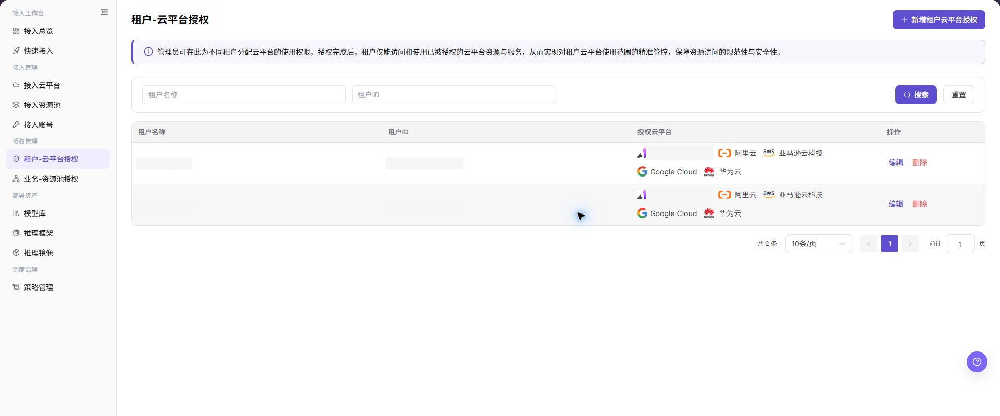
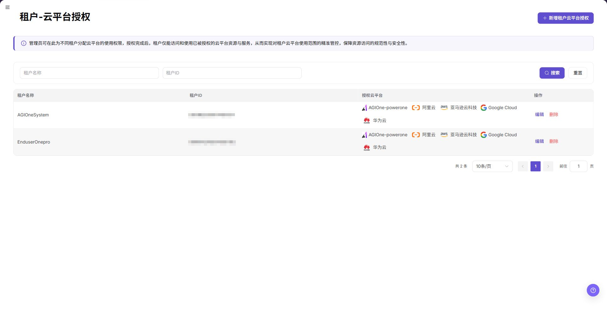
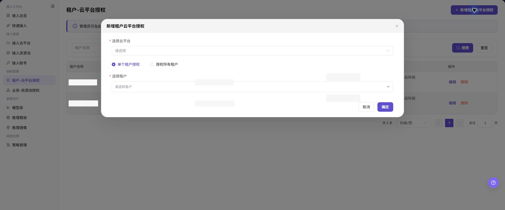
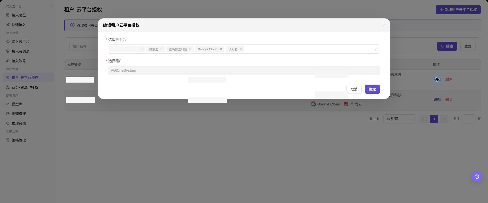
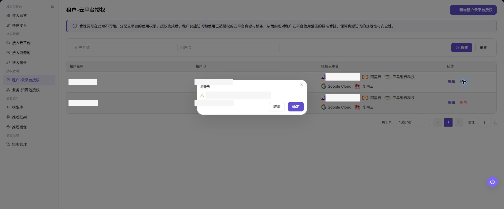

# 租户-云平台授权

## 功能概述

| 项目 | 内容 |
| --- | --- |
| 适用角色 | 运营管理员 |
| 导航路径 | AI基础设施 > On-Cloud > 授权管理 > 租户-云平台授权 |
| 页面路由 | `/infrahub/op/auth/platform-auth` |
| 管理对象 | 租户与云平台之间的使用授权 |

#### 新手理解

租户-云平台授权像给租户发放云平台通行证。授权后租户才可能在后续部署中看到对应平台资源，取消授权会收回这层可见范围。

#### 术语表

| 术语 | 英文 | 说明 |
| --- | --- | --- |
| 单个租户授权 | Single-Tenant Authorization | 只把所选云平台授权给指定租户。 |
| 授权所有租户 | Authorize All Tenants | 把所选云平台授权给全部租户。 |
| 授权关系 | Authorization Relationship | 租户与云平台之间已保存的可用范围。 |

#### 推荐操作顺序

先查看现有关系，再新增授权；范围变化时编辑；删除前确认目标租户的部署和业务不再依赖该云平台。

#### 小白先看

| 场景 | 先做 | 不要直接做 |
| --- | --- | --- |
| 第一次进入页面 | 查看现有对象、状态和可用操作 | 直接修改未知对象 |
| 准备变更配置 | 核对上游依赖、影响范围和目标对象 | 跳过依赖和影响检查 |
| 操作完成 | 按结果校验表复核当前页和下游页面 | 只看成功提示不复核下游 |
| 页面出现异常 | 记录脱敏对象、时间和页面提示 | 反复提交或写入真实凭据 |

## 前提条件

1. 当前账号具备 `租户-云平台授权` 页面或流程所需权限。
2. 目标云平台和租户均已存在，授权边界已获确认。
3. 授权变更前已确认租户部署、业务可见性和回收安排。

## 页面说明

页面展示租户名称、授权云平台和操作入口，并支持新增、编辑和删除授权。

页面截图：

上图展示租户云平台授权页面。重点核对目标对象、当前状态、字段和操作入口。

上图展示租户授权列表参考。重点核对目标对象、当前状态、字段和操作入口。

## 主要操作

### 添加租户云平台授权

1. 点击 **"新增租户-云平台授权"**。
2. 选择云平台。
3. 选择 `单个租户授权` 或 `授权所有租户`；单租户模式下继续选择目标租户。
4. 核对范围后点击 **"确定"**。

上图展示添加租户授权。重点核对目标对象、当前状态、字段和操作入口。

上图展示添加租户授权参考。重点核对目标对象、当前状态、字段和操作入口。

### 编辑租户云平台授权

1. 在目标记录点击 **"编辑"**。
2. 核对云平台、授权模式和租户范围。
3. 保存后返回列表，确认授权关系已更新。

上图展示编辑租户授权。重点核对目标对象、当前状态、字段和操作入口。

### 删除租户云平台授权

1. 确认目标租户不再依赖该云平台。
2. 点击 **"删除"** 并核对目标记录。
3. 确认后检查列表和租户侧可见范围。

上图展示删除租户授权。重点核对目标对象、当前状态、字段和操作入口。

## 参数速查表

| 字段名称 | 是否必填 | 字段类型 | 示例 | 说明 |
| --- | --- | --- | --- | --- |
| 租户名称 | 否 | 文本 | `示例租户` | 用于按租户名称筛选授权记录，请勿写入真实客户名称。 |
| 租户ID | 否 | 文本/数字 | `1000000000000000` | 用于按租户唯一标识筛选授权记录，示例值仅用于说明。 |
| 授权云平台 | 是 | 列表/多值 | `阿里云` | 展示或选择租户可访问的云平台范围。 |
| 选择云平台 | 是 | 下拉选择 | `阿里云` | 新增授权时选择要授权的云平台。 |
| 授权方式 | 是 | 单选 | `单个租户授权` | 选择只授权单个租户或授权所有租户。 |
| 选择租户 | 条件必填 | 下拉选择 | `示例租户` | 选择 `单个租户授权` 时填写目标租户。 |
| 搜索 | 否 | 按钮 | `搜索` | 按当前筛选条件查询授权记录。 |
| 重置 | 否 | 按钮 | `重置` | 清空筛选条件并恢复列表展示。 |
| 分页 | 否 | 分页控件 | `10 条/页` | 打开其他结果页，不修改授权记录。 |
| 编辑 | 否 | 操作入口 | `编辑` | 修改已有授权前需确认影响范围。 |
| 删除 | 否 | 操作入口 | `删除` | 删除授权可能影响租户可用资源，需谨慎操作。 |
| 取消 | 否 | 按钮 | `取消` | 关闭弹窗且不保存本次配置。 |
| 确定 | 是 | 按钮 | `确定` | 最终提交授权配置，点击前需完成复核。 |

## 踩坑提示

- 不要跳过上游依赖检查：目标云平台和租户均已存在，授权边界已获确认。
- 配置变更前先确认影响：授权变更前已确认租户部署、业务可见性和回收安排。
- 页面成功提示不等于下游已同步，操作后必须按结果校验表复核。
- 示例凭据只使用 `<API_KEY>`、`<PERSONAL_KEY>`、`<ACCESS_KEY_ID>`、`<ACCESS_KEY_SECRET>`、`<BASE_URL>` 和 `<ENDPOINT_PATH>`。

## 结果校验

| 检查项 | 成功表现 | 异常时处理 |
| --- | --- | --- |
| 页面可访问 | 标题、导航和主要内容正常显示 | 检查角色权限和导航路径 |
| 管理对象可见 | 租户与云平台之间的使用授权按预期显示 | 清除筛选并核对上游依赖 |
| 操作结果已保存 | 页面显示预期状态或新记录 | 查看页面提示、必填字段和依赖关系 |
| 下游结果一致 | 关联页面能看到本页变更 | 等待同步后刷新，并回到责任对象排查 |

## 常见问题

#### 租户-云平台授权中找不到目标对象

**问题现象：**

页面列表或选择器中没有预期对象。

**可能原因：**

- 查询条件仍在生效，目标对象被过滤。
- 上游对象未启用，或当前角色没有可见权限。

**处理方式：**

1. 清除筛选并刷新页面。
2. 回到前置对象核对：目标云平台和租户均已存在，授权边界已获确认。
3. 确认当前角色和数据范围后重新定位目标对象。

#### 租户-云平台授权操作入口不可用

**问题现象：**

预期按钮、菜单或状态开关不可用。

**可能原因：**

- 当前账号缺少对应操作权限。
- 目标对象状态、引用关系或前置条件不允许执行该操作。

**处理方式：**

1. 核对按钮对应的权限和目标对象当前状态。
2. 检查页面提示的引用关系和前置条件。
3. 解除阻断条件后刷新页面，再执行一次。

#### 租户-云平台授权修改后下游未生效

**问题现象：**

页面提示成功，但后续页面仍显示旧状态。

**可能原因：**

- 关联页面存在缓存或同步延迟。
- 当前页与下游页使用了不同角色、租户或数据范围。

**处理方式：**

1. 等待同步完成并刷新当前页和下游页。
2. 确认两页使用相同角色、租户和对象范围。
3. 仍不一致时回到责任对象核对保存结果。

#### 租户-云平台授权数据与其他页面不一致

**问题现象：**

当前页面的数量或状态与关联页面不同。

**可能原因：**

- 两个页面的筛选条件、统计口径或更新时间不同。
- 对象变更仍在同步，或当前角色的数据权限不同。

**处理方式：**

1. 统一两页的筛选条件和统计口径。
2. 核对各页面更新时间并等待同步。
3. 按对象详情逐项比较，不只对比汇总数量。

#### 租户-云平台授权操作失败如何排查

**问题现象：**

提交后页面提示失败或状态长时间不变化。

**可能原因：**

- 必填字段、字段组合或对象状态不满足提交条件。
- 上游依赖失效、网络请求失败，或同一操作已在处理中。

**处理方式：**

1. 记录脱敏后的对象、时间和完整页面提示。
2. 核对必填字段、对象状态和上游依赖。
3. 确认没有进行中的相同任务后再重试一次。

## 注意事项

- 授权变更前已确认租户部署、业务可见性和回收安排。
- 文档、截图、工单和聊天记录中不得写入真实账号、凭据、内部地址或客户数据。
- 涉及授权、部署、删除、发布、启停或计费的变更，应保留可审计记录并准备恢复方案。

## 后续操作

1. 在业务地域授权页面继续确认租户可用地域。
2. 使用租户视角检查模型部署或资源选择页面。
3. 定期复核 `授权所有租户` 类配置，避免授权范围过大。
