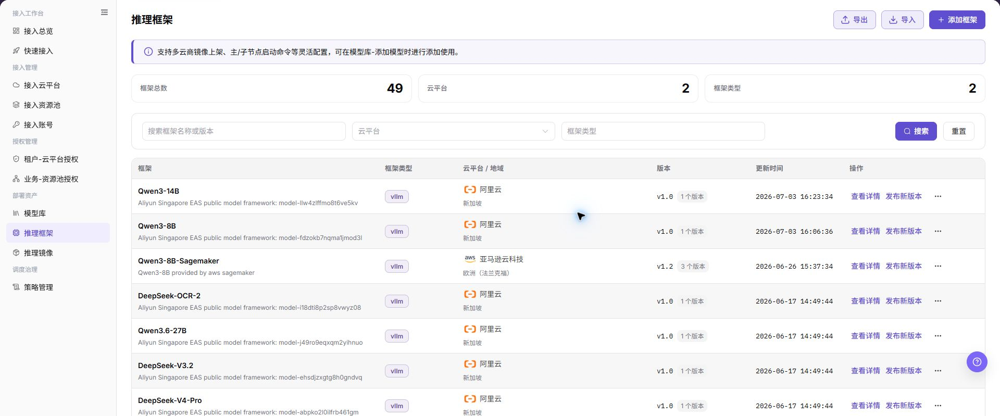
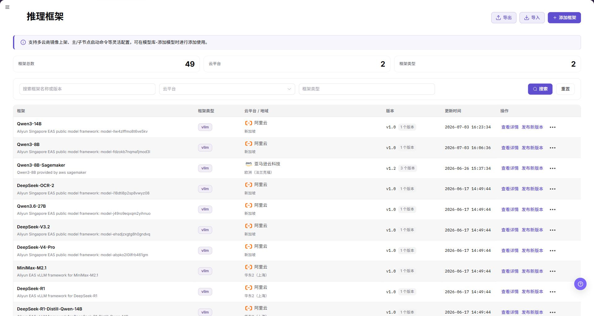
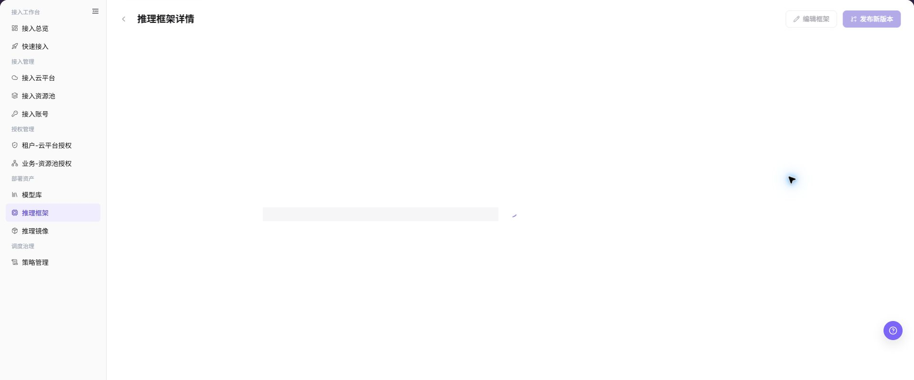
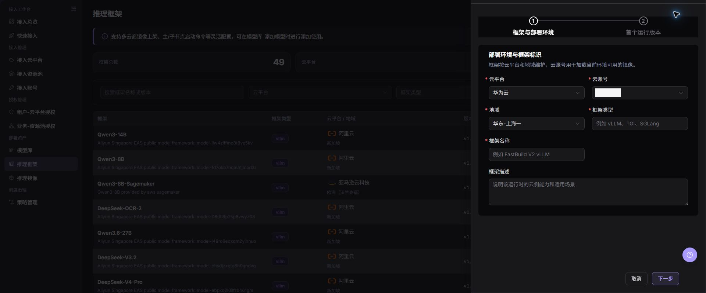
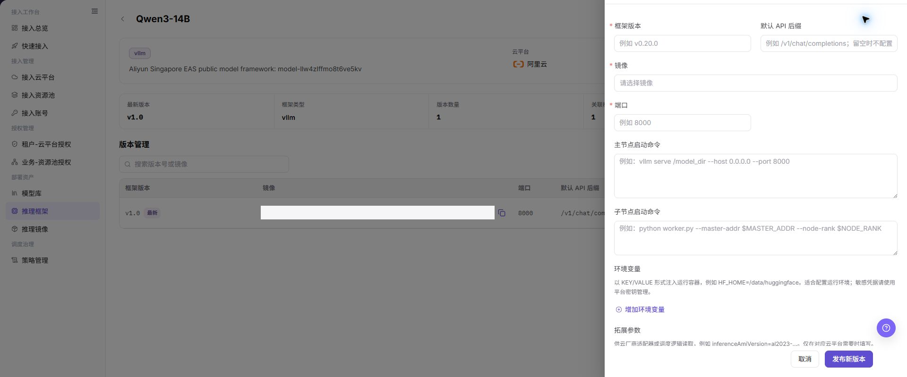

# 推理框架

## 功能概述

| 项目 | 内容 |
| --- | --- |
| 适用角色 | 运营管理员 |
| 导航路径 | AI基础设施 > On-Cloud > 部署资产 > 推理框架 |
| 页面路由 | `/infrahub/op/model/framework` |
| 管理对象 | 推理框架、框架版本、运行镜像和启动配置 |

#### 新手理解

推理框架像模型服务的运行说明书。框架版本把运行镜像、启动方式和支持范围组合起来，模型库会引用它完成部署。

#### 术语表

| 术语 | 英文 | 说明 |
| --- | --- | --- |
| 推理框架 | Inference Framework | 承载模型推理服务的运行框架。 |
| 框架版本 | Framework Version | 框架在特定镜像和启动配置下的版本记录。 |
| 发布版本 | Publish Version | 把已维护版本开放给模型配置选择。 |

#### 推荐操作顺序

先查看框架详情和已有版本，再添加框架；版本配置完成后发布，并到模型库验证能否被选择。

#### 小白先看

| 场景 | 先做 | 不要直接做 |
| --- | --- | --- |
| 第一次进入页面 | 查看现有对象、状态和可用操作 | 直接修改未知对象 |
| 准备变更配置 | 核对上游依赖、影响范围和目标对象 | 跳过依赖和影响检查 |
| 操作完成 | 按结果校验表复核当前页和下游页面 | 只看成功提示不复核下游 |
| 页面出现异常 | 记录脱敏对象、时间和页面提示 | 反复提交或写入真实凭据 |

## 前提条件

1. 当前账号具备 `推理框架` 页面或流程所需权限。
2. 目标运行镜像已登记，框架版本和启动要求已确认。
3. 发布版本前已检查模型库引用、镜像可访问性和启动参数。

## 页面说明

页面展示框架列表、详情、版本和添加入口。

页面截图：

上图展示推理框架页面。重点核对目标对象、当前状态、字段和操作入口。

上图展示推理框架列表参考。重点核对目标对象、当前状态、字段和操作入口。

## 主要操作

### 查看框架详情

1. 在列表定位目标框架并打开详情。
2. 核对框架标识、状态和版本列表。
3. 打开目标版本，核对运行镜像和启动配置。

上图展示框架详情。重点核对目标对象、当前状态、字段和操作入口。

### 添加框架

1. 点击 **"添加框架"**。
2. 填写基础信息并添加版本。
3. 选择运行镜像，维护启动方式和支持范围。
4. 点击 **"确定"** 后打开详情核对。

上图展示添加框架。重点核对目标对象、当前状态、字段和操作入口。

上图展示添加框架参考。重点核对目标对象、当前状态、字段和操作入口。

### 发布框架版本

1. 在框架详情中定位已完成配置的版本。
2. 点击 **"发布"** 并核对版本、镜像和适用范围。
3. 发布后到模型库确认该版本可选。

上图展示发布框架版本。重点核对目标对象、当前状态、字段和操作入口。

## 参数速查表

| 字段名称 | 是否必填 | 字段类型 | 示例 | 说明 |
| --- | --- | --- | --- | --- |
| 云平台 | 是 | 页签/单选 | `阿里云` | 选择框架所属云平台。 |
| 云账号 | 是 | 下拉选择 | `示例云账号` | 选择当前云平台下的云账号。 |
| 地域 | 是 | 下拉选择 | `华东2（上海）` | 选择框架可用地域。 |
| 框架类型 | 是 | 文本 | `LLM` | 填写框架类型，页面示例包含 `LLM` 等。 |
| 框架名称 | 是 | 文本 | `示例推理框架` | 框架在列表和模型配置中的展示名称。 |
| 框架描述 | 否 | 多行文本 | `示例说明` | 描述框架用途或适配场景，避免写入内部敏感信息。 |
| 框架版本 | 是 | 文本 | `v1.0` | 框架版本号。 |
| 默认 API 后缀 | 否 | 文本 | `/v1/chat/completions` | 模型服务默认 API 路径后缀。 |
| 镜像 | 是 | 下拉选择 | `示例镜像` | 选择运行框架使用的镜像。 |
| 端口 | 是 | 数字/文本 | `8000` | 框架服务监听端口。 |
| 主节点启动命令 | 是 | 多行文本 | `python3 /opt/start.py` | 主节点启动命令，示例需脱敏。 |
| 子节点启动命令 | 否 | 多行文本 | `python3 /opt/worker.py` | 子节点启动命令，按框架需要填写。 |
| 环境变量 | 否 | 键值配置 | `ENV_NAME=value` | 通过 `增加环境变量` 添加，禁止写入真实密钥。 |
| 拓展参数 | 否 | 键值配置 | `PARAM=value` | 通过 `增加拓展参数` 添加，禁止写入内部敏感参数。 |
| 导出 | 否 | 按钮 | `导出` | 导出框架配置，可能包含敏感运营信息。 |
| 导入 | 否 | 按钮 | `导入` | 批量导入框架配置，可能改变多条记录。 |
| 取消 | 否 | 按钮 | `取消` | 关闭弹窗且不保存本次配置。 |
| 确定 | 是 | 按钮 | `确定` | 最终提交框架配置，点击前需完成复核。 |

## 踩坑提示

- 不要跳过上游依赖检查：目标运行镜像已登记，框架版本和启动要求已确认。
- 配置变更前先确认影响：发布版本前已检查模型库引用、镜像可访问性和启动参数。
- 页面成功提示不等于下游已同步，操作后必须按结果校验表复核。
- 示例凭据只使用 `<API_KEY>`、`<PERSONAL_KEY>`、`<ACCESS_KEY_ID>`、`<ACCESS_KEY_SECRET>`、`<BASE_URL>` 和 `<ENDPOINT_PATH>`。

## 结果校验

| 检查项 | 成功表现 | 异常时处理 |
| --- | --- | --- |
| 页面可访问 | 标题、导航和主要内容正常显示 | 检查角色权限和导航路径 |
| 管理对象可见 | 推理框架、框架版本、运行镜像和启动配置按预期显示 | 清除筛选并核对上游依赖 |
| 操作结果已保存 | 页面显示预期状态或新记录 | 查看页面提示、必填字段和依赖关系 |
| 下游结果一致 | 关联页面能看到本页变更 | 等待同步后刷新，并回到责任对象排查 |

## 常见问题

#### 推理框架中找不到目标对象

**问题现象：**

页面列表或选择器中没有预期对象。

**可能原因：**

- 查询条件仍在生效，目标对象被过滤。
- 上游对象未启用，或当前角色没有可见权限。

**处理方式：**

1. 清除筛选并刷新页面。
2. 回到前置对象核对：目标运行镜像已登记，框架版本和启动要求已确认。
3. 确认当前角色和数据范围后重新定位目标对象。

#### 推理框架操作入口不可用

**问题现象：**

预期按钮、菜单或状态开关不可用。

**可能原因：**

- 当前账号缺少对应操作权限。
- 目标对象状态、引用关系或前置条件不允许执行该操作。

**处理方式：**

1. 核对按钮对应的权限和目标对象当前状态。
2. 检查页面提示的引用关系和前置条件。
3. 解除阻断条件后刷新页面，再执行一次。

#### 推理框架修改后下游未生效

**问题现象：**

页面提示成功，但后续页面仍显示旧状态。

**可能原因：**

- 关联页面存在缓存或同步延迟。
- 当前页与下游页使用了不同角色、租户或数据范围。

**处理方式：**

1. 等待同步完成并刷新当前页和下游页。
2. 确认两页使用相同角色、租户和对象范围。
3. 仍不一致时回到责任对象核对保存结果。

#### 推理框架数据与其他页面不一致

**问题现象：**

当前页面的数量或状态与关联页面不同。

**可能原因：**

- 两个页面的筛选条件、统计口径或更新时间不同。
- 对象变更仍在同步，或当前角色的数据权限不同。

**处理方式：**

1. 统一两页的筛选条件和统计口径。
2. 核对各页面更新时间并等待同步。
3. 按对象详情逐项比较，不只对比汇总数量。

#### 推理框架操作失败如何排查

**问题现象：**

提交后页面提示失败或状态长时间不变化。

**可能原因：**

- 必填字段、字段组合或对象状态不满足提交条件。
- 上游依赖失效、网络请求失败，或同一操作已在处理中。

**处理方式：**

1. 记录脱敏后的对象、时间和完整页面提示。
2. 核对必填字段、对象状态和上游依赖。
3. 确认没有进行中的相同任务后再重试一次。

## 注意事项

- 发布版本前已检查模型库引用、镜像可访问性和启动参数。
- 文档、截图、工单和聊天记录中不得写入真实账号、凭据、内部地址或客户数据。
- 涉及授权、部署、删除、发布、启停或计费的变更，应保留可审计记录并准备恢复方案。

## 后续操作

1. 在模型库添加模型时选择该框架并验证算力方案。
2. 使用测试模型创建部署，确认服务启动和健康检查结果。
3. 定期复核框架镜像、启动命令和环境变量，避免配置过期。
