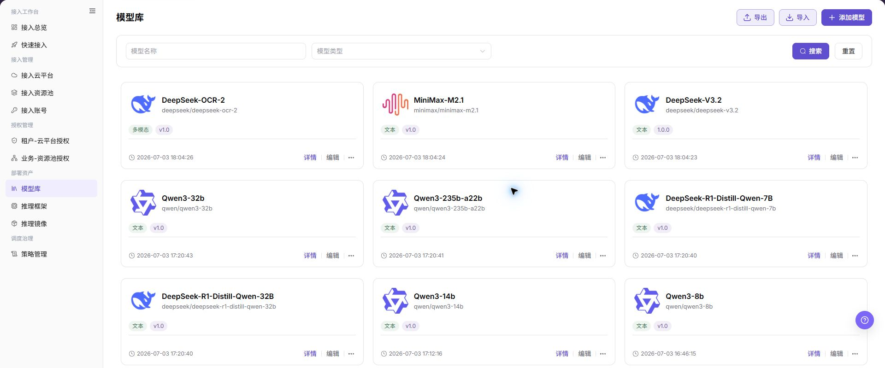
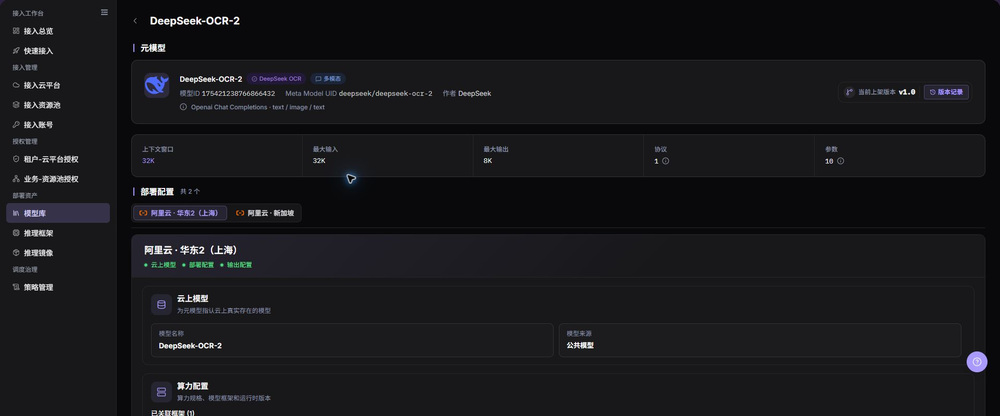
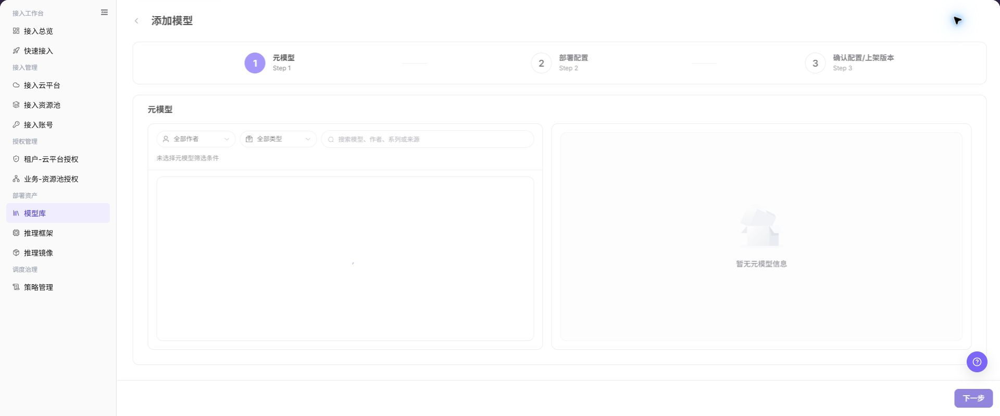

# 模型库

## 功能概述

| 项目 | 内容 |
| --- | --- |
| 适用角色 | 运营管理员 |
| 导航路径 | AI基础设施 > On-Cloud > 部署资产 > 模型库 |
| 页面路由 | `/infrahub/op/model/model` |
| 管理对象 | 模型库模型、元模型、部署点和云上模型配置 |

#### 新手理解

模型库像部署用模型资产目录。每条模型记录把元模型能力、云上部署点、资源方案和输出配置组合起来，供策略和快速部署引用。

#### 术语表

| 术语 | 英文 | 说明 |
| --- | --- | --- |
| 元模型 | Meta-model | 描述模型能力、模态和协议的基础定义。 |
| 部署点 | Deployment Target | 模型可运行的云平台与地域组合。 |
| 算力方案 | Compute Plan | 部署模型时使用的资源规格组合。 |

#### 推荐操作顺序

先查看详情确认已有资产，再添加模型并依次选择元模型、部署点、云上模型、算力方案和输出配置，最后提交并验证下游可选性。

#### 小白先看

| 场景 | 先做 | 不要直接做 |
| --- | --- | --- |
| 第一次进入页面 | 查看现有对象、状态和可用操作 | 直接修改未知对象 |
| 准备变更配置 | 核对上游依赖、影响范围和目标对象 | 跳过依赖和影响检查 |
| 操作完成 | 按结果校验表复核当前页和下游页面 | 只看成功提示不复核下游 |
| 页面出现异常 | 记录脱敏对象、时间和页面提示 | 反复提交或写入真实凭据 |

## 前提条件

1. 当前账号具备 `模型库` 页面或流程所需权限。
2. 元模型、云平台、资源池和推理框架已准备完成。
3. 新增或修改模型前已确认部署地域、资源成本和策略引用。

## 页面说明

页面展示模型库记录及详情入口，并提供添加模型。

页面截图：

上图展示模型库页面。重点核对目标对象、当前状态、字段和操作入口。

上图展示模型库列表参考。重点核对目标对象、当前状态、字段和操作入口。

## 主要操作

### 查看模型详情

1. 在模型库定位目标记录。
2. 点击模型名称或 **"详情"**。
3. 核对元模型、部署点、框架版本、算力方案和状态。

上图展示模型详情。重点核对目标对象、当前状态、字段和操作入口。

### 添加模型

1. 点击 **"添加模型"** 并选择元模型。
2. 添加部署点并选择云平台、地域和云上模型。
3. 选择算力方案、框架版本和输出配置。
4. 逐步核对配置，最后点击 **"提交"**。
5. 回到模型库并在策略和快速部署中验证可选性。

上图展示添加模型。重点核对目标对象、当前状态、字段和操作入口。

上图展示选择元模型。重点核对目标对象、当前状态、字段和操作入口。

上图展示添加部署点。重点核对目标对象、当前状态、字段和操作入口。

上图展示选择云上模型。重点核对目标对象、当前状态、字段和操作入口。

上图展示选择算力方案。重点核对目标对象、当前状态、字段和操作入口。

上图展示添加输出配置。重点核对目标对象、当前状态、字段和操作入口。

上图展示确认模型配置。重点核对目标对象、当前状态、字段和操作入口。

## 参数速查表

| 字段名称 | 是否必填 | 字段类型 | 示例 | 说明 |
| --- | --- | --- | --- | --- |
| 模型名称 | 是 | 文本 | `示例模型` | 模型库列表和详情中展示的模型名称。 |
| 模型类型 | 否 | 下拉选择/标签 | `对话模型` | 用于筛选或标识模型能力类型。 |
| 元模型 | 是 | 单选 | `示例元模型` | 添加模型第一步选择的基础模型定义。 |
| 云侧部署点 | 是 | 列表/选择 | `示例云平台 - 示例地域` | 每个部署点绑定一个云平台和地域。 |
| 云账号 | 条件必填 | 下拉选择 | `示例云账号` | 指认云上模型时选择的云账号。 |
| 云上模型 | 条件必填 | 下拉选择 | `示例云上模型` | 云账号下可被当前模型绑定的云侧模型。 |
| 模型框架 | 是 | 单选/表格 | `示例框架` | 选择可运行该模型的框架。 |
| 类型 | 否 | 文本 | `vllm` | 模型框架类型。 |
| 版本 | 否 | 文本 | `v1.0` | 框架或模型版本。 |
| 镜像 | 是 | 文本 | `<BASE_URL>/runtime:tag` | 运行镜像地址，文档中仅使用占位符。 |
| GPU型号 | 否 | 文本 | `示例 GPU` | 筛选部署规格时使用。 |
| GPU数量 | 否 | 数字 | `1` | 筛选部署规格时使用。 |
| CPU核数 | 否 | 数字 | `4` | 部署规格中的 CPU 配置。 |
| 内存(GB) | 否 | 数字 | `16` | 部署规格中的内存配置。 |
| 卡类型 | 否 | 下拉选择 | `GPU` | 筛选规格时选择的卡类型。 |
| 规格名 | 是 | 单选 | `example.spec` | 实际部署规格名称。 |
| 价格/计费周期 | 否 | 文本 | `--` | 页面展示的价格或计费周期，配置前需确认成本影响。 |
| 请求URL | 是 | 文本 | `{request_url}` | 部署后生成，请勿写入真实内部地址。 |
| 请求方法 | 是 | 下拉选择 | `POST` | 输出配置中的请求方法。 |
| 请求头 | 否 | 表格 | `Authorization` | 请求头配置，禁止写入真实凭据。 |
| 请求参数 | 否 | 表格 | `temperature` | 请求参数配置。 |
| 参数类型 | 否 | 下拉选择 | `string` | 请求头或请求参数的类型。 |
| 是否必须 | 否 | 复选框 | `是` | 标记参数是否必填。 |
| 保存 | 是 | 按钮 | `保存` | 保存当前弹窗或配置块。 |
| 下一步 | 是 | 按钮 | `下一步` | 进入下一阶段配置。 |

## 踩坑提示

- 不要跳过上游依赖检查：元模型、云平台、资源池和推理框架已准备完成。
- 配置变更前先确认影响：新增或修改模型前已确认部署地域、资源成本和策略引用。
- 页面成功提示不等于下游已同步，操作后必须按结果校验表复核。
- 示例凭据只使用 `<API_KEY>`、`<PERSONAL_KEY>`、`<ACCESS_KEY_ID>`、`<ACCESS_KEY_SECRET>`、`<BASE_URL>` 和 `<ENDPOINT_PATH>`。

## 结果校验

| 检查项 | 成功表现 | 异常时处理 |
| --- | --- | --- |
| 页面可访问 | 标题、导航和主要内容正常显示 | 检查角色权限和导航路径 |
| 管理对象可见 | 模型库模型、元模型、部署点和云上模型配置按预期显示 | 清除筛选并核对上游依赖 |
| 操作结果已保存 | 页面显示预期状态或新记录 | 查看页面提示、必填字段和依赖关系 |
| 下游结果一致 | 关联页面能看到本页变更 | 等待同步后刷新，并回到责任对象排查 |

## 常见问题

#### 模型库中找不到目标对象

**问题现象：**

页面列表或选择器中没有预期对象。

**可能原因：**

- 查询条件仍在生效，目标对象被过滤。
- 上游对象未启用，或当前角色没有可见权限。

**处理方式：**

1. 清除筛选并刷新页面。
2. 回到前置对象核对：元模型、云平台、资源池和推理框架已准备完成。
3. 确认当前角色和数据范围后重新定位目标对象。

#### 模型库操作入口不可用

**问题现象：**

预期按钮、菜单或状态开关不可用。

**可能原因：**

- 当前账号缺少对应操作权限。
- 目标对象状态、引用关系或前置条件不允许执行该操作。

**处理方式：**

1. 核对按钮对应的权限和目标对象当前状态。
2. 检查页面提示的引用关系和前置条件。
3. 解除阻断条件后刷新页面，再执行一次。

#### 模型库修改后下游未生效

**问题现象：**

页面提示成功，但后续页面仍显示旧状态。

**可能原因：**

- 关联页面存在缓存或同步延迟。
- 当前页与下游页使用了不同角色、租户或数据范围。

**处理方式：**

1. 等待同步完成并刷新当前页和下游页。
2. 确认两页使用相同角色、租户和对象范围。
3. 仍不一致时回到责任对象核对保存结果。

#### 模型库数据与其他页面不一致

**问题现象：**

当前页面的数量或状态与关联页面不同。

**可能原因：**

- 两个页面的筛选条件、统计口径或更新时间不同。
- 对象变更仍在同步，或当前角色的数据权限不同。

**处理方式：**

1. 统一两页的筛选条件和统计口径。
2. 核对各页面更新时间并等待同步。
3. 按对象详情逐项比较，不只对比汇总数量。

#### 模型库操作失败如何排查

**问题现象：**

提交后页面提示失败或状态长时间不变化。

**可能原因：**

- 必填字段、字段组合或对象状态不满足提交条件。
- 上游依赖失效、网络请求失败，或同一操作已在处理中。

**处理方式：**

1. 记录脱敏后的对象、时间和完整页面提示。
2. 核对必填字段、对象状态和上游依赖。
3. 确认没有进行中的相同任务后再重试一次。

## 注意事项

- 新增或修改模型前已确认部署地域、资源成本和策略引用。
- 文档、截图、工单和聊天记录中不得写入真实账号、凭据、内部地址或客户数据。
- 涉及授权、部署、删除、发布、启停或计费的变更，应保留可审计记录并准备恢复方案。

## 后续操作

1. 在模型详情页复核部署点、算力方案和输出配置。
2. 配置或检查租户-云平台授权、业务-资源池授权。
3. 使用用户视角验证快速接入或部署流程是否可选择该模型。
