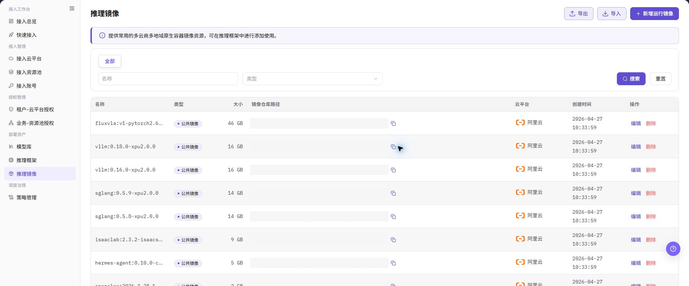
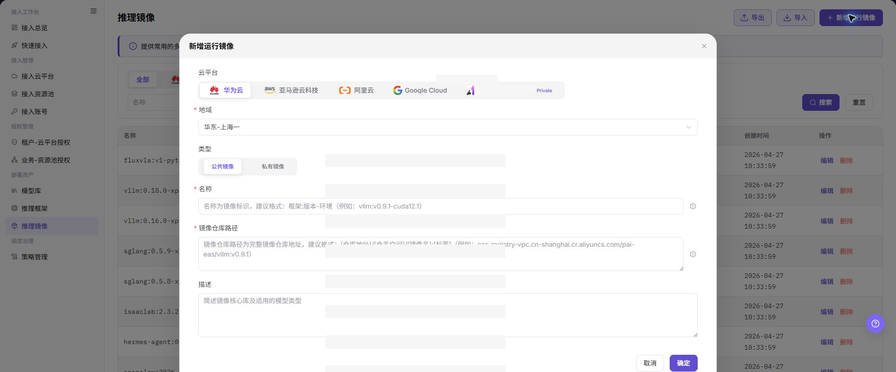
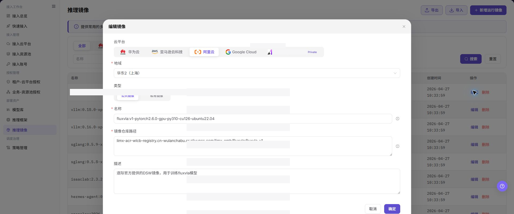

# 推理镜像

## 功能概述

| 项目 | 内容 |
| --- | --- |
| 适用角色 | 运营管理员 |
| 导航路径 | AI基础设施 > On-Cloud > 部署资产 > 推理镜像 |
| 页面路由 | `/infrahub/op/model/image` |
| 管理对象 | 运行镜像、镜像地址、平台架构和资源池范围 |

#### 新手理解

推理镜像像模型服务的运行包。它告诉框架去哪里拉取镜像、适用于什么平台和资源池，配置错误会导致拉取或启动失败。

#### 术语表

| 术语 | 英文 | 说明 |
| --- | --- | --- |
| 镜像地址 | Image Location | 镜像仓库中的引用地址，文档只使用占位信息。 |
| 平台架构 | Platform Architecture | 镜像支持的处理器或运行架构。 |
| 资源池范围 | Resource Pool Scope | 允许使用该镜像的云平台和资源池。 |

#### 推荐操作顺序

先查看是否已有相同镜像，再添加镜像并确认平台、架构和资源池范围；地址或范围变化时编辑，并到框架版本中验证。

#### 小白先看

| 场景 | 先做 | 不要直接做 |
| --- | --- | --- |
| 第一次进入页面 | 查看现有对象、状态和可用操作 | 直接修改未知对象 |
| 准备变更配置 | 核对上游依赖、影响范围和目标对象 | 跳过依赖和影响检查 |
| 操作完成 | 按结果校验表复核当前页和下游页面 | 只看成功提示不复核下游 |
| 页面出现异常 | 记录脱敏对象、时间和页面提示 | 反复提交或写入真实凭据 |

## 前提条件

1. 当前账号具备 `推理镜像` 页面或流程所需权限。
2. 目标镜像已由镜像负责人确认可访问，平台和架构信息已知。
3. 新增或编辑前已检查框架版本、资源池权限和镜像拉取方式。

## 页面说明

页面展示推理镜像列表和添加入口，列表包含镜像归属、状态和操作。

页面截图：

上图展示推理镜像页面。重点核对目标对象、当前状态、字段和操作入口。

上图展示推理镜像列表参考。重点核对目标对象、当前状态、字段和操作入口。

## 主要操作

### 添加推理镜像

1. 点击 **"添加推理镜像"**。
2. 填写名称、镜像地址和平台架构。
3. 选择适用云平台和资源池范围。
4. 点击 **"确定"** 后在列表中核对新记录。

上图展示添加推理镜像。重点核对目标对象、当前状态、字段和操作入口。

上图展示添加推理镜像参考。重点核对目标对象、当前状态、字段和操作入口。

### 编辑推理镜像

1. 在目标镜像行点击 **"编辑"**。
2. 核对镜像地址、架构和资源池范围。
3. 保存后到框架版本中确认镜像仍可选择并能正常拉取。

上图展示编辑推理镜像。重点核对目标对象、当前状态、字段和操作入口。

### 查看推理镜像

1. 按名称或状态定位目标镜像。
2. 核对归属平台、架构、资源池范围和更新时间。
3. 信息不一致时进入编辑页核对，不通过重复添加创建副本。

## 参数速查表

| 字段名称 | 是否必填 | 字段类型 | 示例 | 说明 |
| --- | --- | --- | --- | --- |
| 云平台 | 是 | 页签/单选 | `阿里云` | 选择镜像所属或可使用的云平台。 |
| 地域 | 是 | 下拉选择 | `华东-上海一` | 选择镜像所在或可用地域。 |
| 类型 | 是 | 分段选择 | `公共镜像` | 选择公共镜像或私有镜像。 |
| 名称 | 是 | 文本 | `framework:v1.0-runtime` | 镜像标识名称，建议体现框架、版本和环境。 |
| 镜像仓库路径 | 是 | 多行文本 | `<BASE_URL>/namespace/image:tag` | 完整镜像仓库路径，文档中仅使用占位地址。 |
| 描述 | 否 | 多行文本 | `示例运行镜像说明` | 简要描述镜像核心依赖和适用模型类型，避免写入内部敏感信息。 |
| 大小 | 否 | 文本 | `16 GB` | 列表中展示的镜像大小。 |
| 创建时间 | 否 | 日期时间 | `2026-07-20 10:00:00` | 列表中展示的镜像创建时间。 |
| 搜索 | 否 | 按钮 | `搜索` | 按当前筛选条件查询镜像记录。 |
| 重置 | 否 | 按钮 | `重置` | 清空筛选条件并恢复列表展示。 |
| 导出 | 否 | 按钮 | `导出` | 导出镜像记录，可能包含敏感运营配置。 |
| 导入 | 否 | 按钮 | `导入` | 批量导入镜像记录，可能改变多条配置。 |
| 编辑 | 否 | 操作入口 | `编辑` | 修改已有镜像配置前需确认影响范围。 |
| 删除 | 否 | 操作入口 | `删除` | 删除镜像记录可能影响后续部署选择。 |
| 取消 | 否 | 按钮 | `取消` | 关闭弹窗且不保存本次配置。 |
| 确定 | 是 | 按钮 | `确定` | 最终提交运行镜像配置，点击前需完成复核。 |

## 踩坑提示

- 不要跳过上游依赖检查：目标镜像已由镜像负责人确认可访问，平台和架构信息已知。
- 配置变更前先确认影响：新增或编辑前已检查框架版本、资源池权限和镜像拉取方式。
- 页面成功提示不等于下游已同步，操作后必须按结果校验表复核。
- 示例凭据只使用 `<API_KEY>`、`<PERSONAL_KEY>`、`<ACCESS_KEY_ID>`、`<ACCESS_KEY_SECRET>`、`<BASE_URL>` 和 `<ENDPOINT_PATH>`。

## 结果校验

| 检查项 | 成功表现 | 异常时处理 |
| --- | --- | --- |
| 页面可访问 | 标题、导航和主要内容正常显示 | 检查角色权限和导航路径 |
| 管理对象可见 | 运行镜像、镜像地址、平台架构和资源池范围按预期显示 | 清除筛选并核对上游依赖 |
| 操作结果已保存 | 页面显示预期状态或新记录 | 查看页面提示、必填字段和依赖关系 |
| 下游结果一致 | 关联页面能看到本页变更 | 等待同步后刷新，并回到责任对象排查 |

## 常见问题

#### 推理镜像中找不到目标对象

**问题现象：**

页面列表或选择器中没有预期对象。

**可能原因：**

- 查询条件仍在生效，目标对象被过滤。
- 上游对象未启用，或当前角色没有可见权限。

**处理方式：**

1. 清除筛选并刷新页面。
2. 回到前置对象核对：目标镜像已由镜像负责人确认可访问，平台和架构信息已知。
3. 确认当前角色和数据范围后重新定位目标对象。

#### 推理镜像操作入口不可用

**问题现象：**

预期按钮、菜单或状态开关不可用。

**可能原因：**

- 当前账号缺少对应操作权限。
- 目标对象状态、引用关系或前置条件不允许执行该操作。

**处理方式：**

1. 核对按钮对应的权限和目标对象当前状态。
2. 检查页面提示的引用关系和前置条件。
3. 解除阻断条件后刷新页面，再执行一次。

#### 推理镜像修改后下游未生效

**问题现象：**

页面提示成功，但后续页面仍显示旧状态。

**可能原因：**

- 关联页面存在缓存或同步延迟。
- 当前页与下游页使用了不同角色、租户或数据范围。

**处理方式：**

1. 等待同步完成并刷新当前页和下游页。
2. 确认两页使用相同角色、租户和对象范围。
3. 仍不一致时回到责任对象核对保存结果。

#### 推理镜像数据与其他页面不一致

**问题现象：**

当前页面的数量或状态与关联页面不同。

**可能原因：**

- 两个页面的筛选条件、统计口径或更新时间不同。
- 对象变更仍在同步，或当前角色的数据权限不同。

**处理方式：**

1. 统一两页的筛选条件和统计口径。
2. 核对各页面更新时间并等待同步。
3. 按对象详情逐项比较，不只对比汇总数量。

#### 推理镜像操作失败如何排查

**问题现象：**

提交后页面提示失败或状态长时间不变化。

**可能原因：**

- 必填字段、字段组合或对象状态不满足提交条件。
- 上游依赖失效、网络请求失败，或同一操作已在处理中。

**处理方式：**

1. 记录脱敏后的对象、时间和完整页面提示。
2. 核对必填字段、对象状态和上游依赖。
3. 确认没有进行中的相同任务后再重试一次。

## 注意事项

- 新增或编辑前已检查框架版本、资源池权限和镜像拉取方式。
- 文档、截图、工单和聊天记录中不得写入真实账号、凭据、内部地址或客户数据。
- 涉及授权、部署、删除、发布、启停或计费的变更，应保留可审计记录并准备恢复方案。

## 后续操作

1. 在推理框架中选择或引用该运行镜像。
2. 在模型库添加模型时验证该镜像是否可用于算力方案。
3. 使用测试部署验证镜像拉取、服务启动和健康检查结果。
