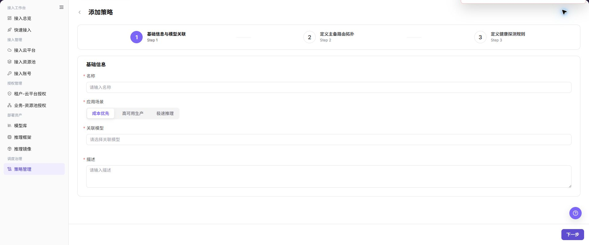

# 策略管理

## 功能概述

| 项目 | 内容 |
| --- | --- |
| 适用角色 | 运营管理员 |
| 导航路径 | AI基础设施 > On-Cloud > 调度治理 > 策略管理 |
| 页面路由 | `/infrahub/op/schedule/policy` |
| 管理对象 | 应用场景、关联模型、主备路由和健康探测规则 |

#### 新手理解

策略管理像模型部署的交通规则。它把模型和主备部署点连接起来，并通过健康探测决定什么时候继续走主路、什么时候切换备用路由。

#### 术语表

| 术语 | 英文 | 说明 |
| --- | --- | --- |
| 应用场景 | Application Scenario | 成本优先、高可用生产或极速推理等调度目标。 |
| 主备路由 | Primary/Backup Route | 模型请求在主要和备用部署点之间的拓扑。 |
| 健康探测 | Health Probe | 用于判断部署点是否可继续接收请求的检测规则。 |

#### 推荐操作顺序

先确认模型和部署点已准备，再创建策略，依次填写基础信息、主备拓扑和健康探测，提交后验证策略状态和实际路由。

#### 小白先看

| 场景 | 先做 | 不要直接做 |
| --- | --- | --- |
| 第一次进入页面 | 查看现有对象、状态和可用操作 | 直接修改未知对象 |
| 准备变更配置 | 核对上游依赖、影响范围和目标对象 | 跳过依赖和影响检查 |
| 操作完成 | 按结果校验表复核当前页和下游页面 | 只看成功提示不复核下游 |
| 页面出现异常 | 记录脱敏对象、时间和页面提示 | 反复提交或写入真实凭据 |

## 前提条件

1. 当前账号具备 `策略管理` 页面或流程所需权限。
2. 关联模型至少有一个可用部署点，框架版本和资源规格已确认。
3. 策略变更前已评估线上路由、容量、费用和故障切换影响。

## 页面说明

页面展示策略列表和添加入口，创建策略分为三个步骤。

页面截图：

上图展示策略管理页面。重点核对目标对象、当前状态、字段和操作入口。

上图展示策略列表参考。重点核对目标对象、当前状态、字段和操作入口。

## 主要操作

### 创建策略

1. 点击 **"添加策略"**。
2. 填写名称，选择应用场景和关联模型。
3. 点击 **"下一步"**，配置主备路由拓扑。
4. 继续配置健康探测规则，核对阈值和探测对象。
5. 点击 **"提交"** 后回到列表核对策略状态。

上图展示创建策略。重点核对目标对象、当前状态、字段和操作入口。

上图展示基础信息与模型关联。重点核对目标对象、当前状态、字段和操作入口。

上图展示主备路由拓扑。重点核对目标对象、当前状态、字段和操作入口。

上图展示健康探测规则。重点核对目标对象、当前状态、字段和操作入口。

### 查看策略

1. 在列表定位目标策略。
2. 核对应用场景、关联模型、状态和更新时间。
3. 进入详情检查主备拓扑和健康探测是否与部署点一致。

## 参数速查表

| 字段名称 | 是否必填 | 字段类型 | 示例 | 说明 |
| --- | --- | --- | --- | --- |
| 名称 | 是 | 文本 | `policy-cost-priority-demo` | 策略展示名称，应使用脱敏示例或业务可识别的非敏感名称。 |
| 标签ID | 否 | 文本 | `label-demo` | 列表筛选字段，用于按标签标识检索策略。 |
| 应用场景 | 是 | 分段选择 | `成本优先` | 选择策略目标，页面支持成本优先、高可用生产和极速推理。 |
| 关联模型 | 是 | 选择框 | `示例模型 / v1.0` | 选择策略绑定的模型及版本。 |
| 云平台 | 否 | 表格字段 | `示例云平台` | 相关路由节点资源所属云平台。 |
| 地域 | 否 | 表格字段 | `示例地域` | 相关路由节点资源所在地域。 |
| 可用规格 | 否 | 表格字段 | `gpu.example` | 当前模型可使用的资源规格。 |
| 可用框架 | 否 | 表格字段 | `示例框架` | 当前模型可使用的推理框架。 |
| 描述 | 是 | 多行文本 | `示例策略说明` | 描述策略用途，避免写入真实客户、租户、业务或内部测试参数。 |
| 路由节点 | 是 | 选择项 | `主路由节点` | 在路由配置中选择参与策略的节点。 |
| 主路由 | 是 | 操作状态 | `主` | 策略优先使用的路由节点。 |
| 备路由 | 否 | 操作状态 | `备` | 主路由不可用时的备用路由节点。 |
| 优先级 | 否 | 排序控件 | `P1` | 调整备路由或候选节点的优先顺序。 |
| 规格 | 否 | 展示字段 | `gpu.example` | 路由节点使用的资源规格。 |
| 价格 | 否 | 展示字段 | `示例价格/小时` | 路由节点的费用参考，文档中不展示真实金额明细。 |
| 框架 | 否 | 展示字段 | `示例框架` | 路由节点使用的推理框架。 |
| 版本 | 否 | 表格字段 | `v1.0` | 镜像或运行配置版本。 |
| 镜像 | 否 | 表格字段 | `<BASE_URL>/namespace/image:tag` | 镜像地址示例仅使用占位信息，不写真实仓库地址。 |
| 主节点启动命令 | 否 | 表格字段 | `--model-path /models/example` | 主节点启动命令，文档中仅使用占位示例。 |
| 子节点启动命令 | 否 | 表格字段 | `--worker` | 子节点启动命令，避免写入内部启动参数。 |
| 端口 | 否 | 数字 | `8000` | 服务监听端口。 |
| 创建时间 | 否 | 日期时间 | `2026-07-21 10:00:00` | 路由节点或版本配置创建时间。 |
| 探测方式 | 是 | 分段选择 | `HTTP心跳` | 健康探测类型，页面支持 HTTP 心跳、GPU 性能指标和服务状态。 |
| 检测路径 | 否 | 文本 | `/health` | HTTP 心跳检测路径。 |
| 检测频率 | 否 | 数字 | `10` | 健康探测执行频率。 |
| 失败阈值 | 否 | 数字 | `3` | 连续失败达到阈值后触发异常判断。 |
| 恢复逻辑 | 否 | 数字/规则 | `2` | 服务恢复判断规则或恢复阈值。 |
| 宕机判定超时时间 | 否 | 数字 | `30` | 判定服务宕机前的超时时间。 |
| 搜索 | 否 | 按钮 | `搜索` | 按当前筛选条件查询策略记录。 |
| 重置 | 否 | 按钮 | `重置` | 清空筛选条件并恢复列表展示。 |
| 导出 | 否 | 按钮 | `导出` | 导出策略记录，可能包含敏感运营配置。 |
| 导入 | 否 | 按钮 | `导入` | 批量导入策略记录，可能改变多条策略配置。 |
| 批量删除 | 否 | 按钮 | `批量删除` | 批量删除策略，执行前需确认影响范围。 |
| 上一步 | 否 | 按钮 | `上一步` | 返回上一配置步骤。 |
| 下一步 | 否 | 按钮 | `下一步` | 校验当前步骤并进入下一步骤。 |
| 提交 | 是 | 按钮 | `提交` | 最终提交策略配置，点击前必须完成复核。 |

## 踩坑提示

- 不要跳过上游依赖检查：关联模型至少有一个可用部署点，框架版本和资源规格已确认。
- 配置变更前先确认影响：策略变更前已评估线上路由、容量、费用和故障切换影响。
- 页面成功提示不等于下游已同步，操作后必须按结果校验表复核。
- 示例凭据只使用 `<API_KEY>`、`<PERSONAL_KEY>`、`<ACCESS_KEY_ID>`、`<ACCESS_KEY_SECRET>`、`<BASE_URL>` 和 `<ENDPOINT_PATH>`。

## 结果校验

| 检查项 | 成功表现 | 异常时处理 |
| --- | --- | --- |
| 页面可访问 | 标题、导航和主要内容正常显示 | 检查角色权限和导航路径 |
| 管理对象可见 | 应用场景、关联模型、主备路由和健康探测规则按预期显示 | 清除筛选并核对上游依赖 |
| 操作结果已保存 | 页面显示预期状态或新记录 | 查看页面提示、必填字段和依赖关系 |
| 下游结果一致 | 关联页面能看到本页变更 | 等待同步后刷新，并回到责任对象排查 |

## 常见问题

#### 策略管理中找不到目标对象

**问题现象：**

页面列表或选择器中没有预期对象。

**可能原因：**

- 查询条件仍在生效，目标对象被过滤。
- 上游对象未启用，或当前角色没有可见权限。

**处理方式：**

1. 清除筛选并刷新页面。
2. 回到前置对象核对：关联模型至少有一个可用部署点，框架版本和资源规格已确认。
3. 确认当前角色和数据范围后重新定位目标对象。

#### 策略管理操作入口不可用

**问题现象：**

预期按钮、菜单或状态开关不可用。

**可能原因：**

- 当前账号缺少对应操作权限。
- 目标对象状态、引用关系或前置条件不允许执行该操作。

**处理方式：**

1. 核对按钮对应的权限和目标对象当前状态。
2. 检查页面提示的引用关系和前置条件。
3. 解除阻断条件后刷新页面，再执行一次。

#### 策略管理修改后下游未生效

**问题现象：**

页面提示成功，但后续页面仍显示旧状态。

**可能原因：**

- 关联页面存在缓存或同步延迟。
- 当前页与下游页使用了不同角色、租户或数据范围。

**处理方式：**

1. 等待同步完成并刷新当前页和下游页。
2. 确认两页使用相同角色、租户和对象范围。
3. 仍不一致时回到责任对象核对保存结果。

#### 策略管理数据与其他页面不一致

**问题现象：**

当前页面的数量或状态与关联页面不同。

**可能原因：**

- 两个页面的筛选条件、统计口径或更新时间不同。
- 对象变更仍在同步，或当前角色的数据权限不同。

**处理方式：**

1. 统一两页的筛选条件和统计口径。
2. 核对各页面更新时间并等待同步。
3. 按对象详情逐项比较，不只对比汇总数量。

#### 策略管理操作失败如何排查

**问题现象：**

提交后页面提示失败或状态长时间不变化。

**可能原因：**

- 必填字段、字段组合或对象状态不满足提交条件。
- 上游依赖失效、网络请求失败，或同一操作已在处理中。

**处理方式：**

1. 记录脱敏后的对象、时间和完整页面提示。
2. 核对必填字段、对象状态和上游依赖。
3. 确认没有进行中的相同任务后再重试一次。

## 注意事项

- 策略变更前已评估线上路由、容量、费用和故障切换影响。
- 文档、截图、工单和聊天记录中不得写入真实账号、凭据、内部地址或客户数据。
- 涉及授权、部署、删除、发布、启停或计费的变更，应保留可审计记录并准备恢复方案。

## 后续操作

1. 使用测试部署验证策略命中、主备路由和故障转移结果。
2. 监控策略影响的模型服务状态、延迟、成本和可用性。
3. 定期复核健康探测阈值、路由优先级和关联模型版本。
