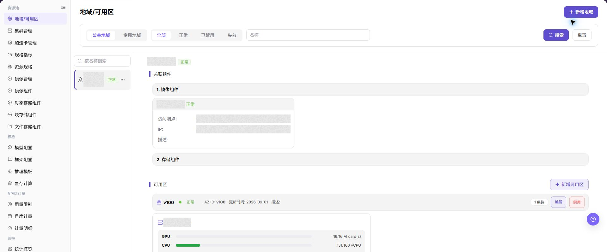
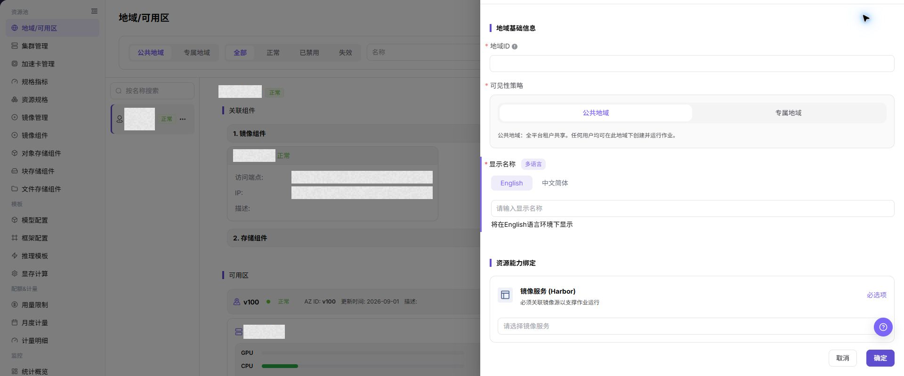

# 从零开始部署模型服务

## 功能概述

| 项目 | 内容 |
| --- | --- |
| 适用角色 | 运营管理员、模型提供方 |
| 导航路径 | 用户手册 > AI基础设施(On-Prem) > 从零开始部署模型服务 |
| 页面路由 | `N/A` |
| 管理对象 | 从资源池准备到模型实例验证的跨角色主链路 |

#### 新手理解

这条流程像搭建一条完整的模型运行通道。运营管理员先准备地域、集群、规格和模板，模型提供方再创建实例并检查状态，出现异常时按失败阶段回到对应页面排查。

#### 术语表

| 术语 | 英文 | 说明 |
| --- | --- | --- |
| 部署模板 | Deployment Template | 定义模型、框架、镜像和资源需求的部署入口。 |
| 模型实例 | Model Instance | 按模板和资源规格创建的模型运行服务。 |
| 资源配额 | Resource Quota | 限制可使用 CPU、内存和加速卡数量的可用额度。 |

#### 推荐操作顺序

严格按地域与可用区、集群、规格、模板、实例、结果校验的顺序执行；前置校验失败时不跳过依赖继续创建。

#### 小白先看

先确认当前任务是否涉及从资源池准备到模型实例验证的跨角色主链路，再按照推荐顺序操作。页面字段或状态与预期不符时，先回到前置对象页核对依赖，不要跳过结果校验直接进入下游流程。

## 前提条件

1. 运营管理员具备资源池、模板、配额和监控管理权限。
2. 模型提供方或模型调用方具备创建模型实例、运行实例、对象存储和镜像项目的权限。
3. Kubernetes API Server、镜像仓库、对象存储或共享存储可从平台侧访问。
4. 租户配额和额度足以支撑本次验证。
5. 镜像、启动命令、模型文件和输入输出路径已规划。

## 页面说明

本页说明角色、资源层级和主要入口。下图展示运营管理员配置资源底座的起点。

请重点关注左侧资源池菜单、顶部新增入口和右侧地域与可用区层级。

## 主要操作

### 创建地域与可用区

1. 运营管理员进入 **"地域/可用区"**，点击 **"新增地域"** 配置资源边界和组件绑定。
2. 选择目标地域，点击 **"新增可用区"** 配置集群归属范围。
3. 提交后确认地域与可用区层级、状态和组件关系正确。

上图展示地域基础信息和资源能力绑定区域。

### 注册集群并准备规格

1. 在 **"集群管理"** 注册集群，并确认节点和加速卡资源正常上报。
2. 在 **"规格指标"** 维护资源键和单位。
3. 在 **"资源规格"** 组合 CPU、内存和加速卡额度。

### 创建并校验模型实例

1. 运营管理员准备模型、框架和推理模板。
2. 模型提供方从 **"部署模板"** 选择模板和资源规格并创建实例。
3. 在 **"模型实例"**、**"资源用量"** 和监控页面核对状态、用量与异常。

## 参数速查表

| 字段名称 | 是否必填 | 字段类型 | 示例 | 说明 |
| --- | --- | --- | --- | --- |
| 地域 / 可用区 | 是 | 枚举 | 华东示例区 | 决定资源池、规格和用户可见范围。 |
| 集群 | 是 | 文本 | 示例集群 A | 承载实例、作业或模型服务的底层资源。 |
| 资源规格 | 是 | 枚举 | 4C16G-1GPU | 用户创建服务时选择的 CPU、内存和加速卡组合。 |
| 镜像 | 是 | 文本 | `<BASE_URL>/<PROJECT>/<IMAGE>:<TAG>` | 运行模型服务所需的镜像地址，占位符不代表真实仓库。 |
| 存储组件 | 否 | 文本 | 示例文件存储 A | 挂载模型、数据或输出文件时使用。 |
| 部署实例 | 系统生成 | 文本 | INSTANCE-202607130001 | 用于追踪服务状态、事件、日志和监控。 |

## 踩坑提示

- 规格可见不代表可调度，仍要确认集群容量、配额、镜像拉取和存储挂载状态。
- 模板参数、镜像启动命令和模型能力不匹配时，实例可能创建成功但服务不可用。
- 排障时先记录脱敏后的地域、集群、规格、实例 ID、失败时间和事件摘要。
- 不要在工单和截图中暴露节点 IP、镜像仓库凭据、存储密钥或内部日志片段。

## 结果校验

| 检查项 | 成功表现 | 异常时处理 |
| --- | --- | --- |
| 页面入口 | 可进入从零开始部署模型服务并看到目标操作入口 | 检查运营管理员权限和对应菜单是否已开放 |
| 对象记录 | 从资源池准备到模型实例验证的跨角色主链路在列表或详情中可见 | 重置筛选并核对名称、所属范围和创建结果 |
| 状态结果 | 新增或变更后的状态符合页面提示 | 查看操作提示、依赖对象状态和最近更新时间 |
| 下游使用 | 后续页面能够选择或关联目标对象 | 回到前置配置核对启用状态、归属关系和可见范围 |

## 常见问题

#### 从零开始部署模型服务中找不到目标对象

**问题现象：**

页面可进入，但没有看到预期的从资源池准备到模型实例验证的跨角色主链路。

**可能原因：**

- 筛选条件仍生效。
- 对象属于其他范围。
- 前置配置未完成。

**处理方式：**

1. 重置筛选
2. 核对所属地域或租户
3. 返回前置页面确认对象状态。

#### 从零开始部署模型服务的操作入口不可用

**问题现象：**

新增、注册或维护入口不可见或不可点击。

**可能原因：**

- 当前角色权限不足。
- 页面处于只读状态。
- 依赖对象不满足条件。

**处理方式：**

1. 检查运营管理员权限
2. 核对页面提示
3. 先完成依赖对象配置。

#### 从零开始部署模型服务的必填项没有可选值

**问题现象：**

表单能打开，但下拉框为空。

**可能原因：**

- 候选对象未启用。
- 所属范围不一致。
- 当前账号不可见。

**处理方式：**

1. 到候选对象页面核对状态
2. 确认归属关系
3. 检查可见范围后刷新表单。

#### 从零开始部署模型服务操作后状态异常

**问题现象：**

提交后记录存在，但状态不是预期值。

**可能原因：**

- 连通性或校验失败。
- 关联对象异常。
- 后台处理尚未完成。

**处理方式：**

1. 查看页面提示和更新时间
2. 检查关联对象
3. 按状态阶段排查处理任务。

#### 下游页面无法使用从零开始部署模型服务

**问题现象：**

当前页状态正常，但下游页面无法选择或关联从资源池准备到模型实例验证的跨角色主链路。

**可能原因：**

- 可见范围不匹配。
- 对象未启用。
- 下游缓存未刷新。

**处理方式：**

1. 核对启用状态和归属
2. 检查角色可见范围
3. 刷新下游页面并重新选择。

## 注意事项

- 从零开始部署模型服务中的归属、状态和关联关系应与实际资源保持一致。
- 变更共享配置前先确认受影响的实例、作业和角色范围。
- 文档、截图和排障材料不得包含真实凭证、账号或内部地址。

## 后续操作

1. 将通过验证的镜像、启动命令、端口、对象路径和参数整理成团队规范。
2. 为常用场景沉淀推理模板或运行实例模板。
3. 按业务周期清理无用对象、镜像标签和已结束实例。
4. 定期检查配额、用量和监控趋势，提前发现容量瓶颈。
