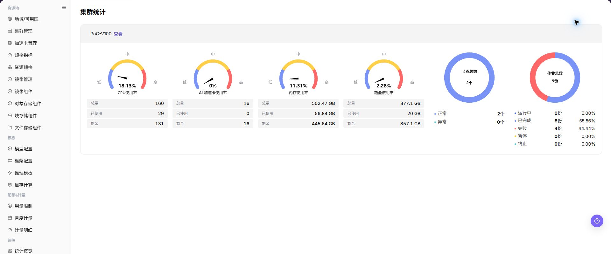

# 集群统计

## 功能概述

| 项目 | 内容 |
| --- | --- |
| 适用角色 | 运营管理员 |
| 导航路径 | AI基础设施 > On-Prem > 监控 > 集群统计 |
| 页面路由 | `/powerone/monitor/cluster` |
| 管理对象 | 集群状态、资源容量、作业数量和地域/可用区归属 |

#### 新手理解

集群统计像每个机房的体检表，用来比较不同集群的容量、健康状态和资源水位，判断问题是局部集群还是全局资源不足。

#### 术语表

| 术语 | 英文 | 说明 |
| --- | --- | --- |
| 集群容量 | Cluster Capacity | Cluster Capacity |
| 资源水位 | Resource Watermark | Resource Watermark |
| 健康状态 | Health Status | Health Status |

#### 推荐操作顺序

先确认集群状态、资源容量、作业数量和地域/可用区归属的前置依赖，再按主要操作顺序处理，最后执行结果校验并进入后续页面。

#### 小白先看

先确认当前任务是否涉及集群状态、资源容量、作业数量和地域/可用区归属，再按照推荐顺序操作。页面字段或状态与预期不符时，先回到前置对象页核对依赖，不要跳过结果校验直接进入下游流程。

## 前提条件

1. 当前账号具备集群监控查看权限。
2. 目标集群已注册并处于可监控范围。
3. 集群容量、节点和加速卡指标已采集。
4. 已确认需要比较的地域或集群范围。

## 页面说明

页面用于查看和处理集群状态、资源容量、作业数量和地域/可用区归属。

上图保留左侧菜单和完整功能区；请先确认页面标题、筛选范围和主要操作入口。

集群统计用于比较不同地域或资源池中的集群容量、健康状态和资源水位。运营管理员可以通过集群维度判断是否存在整体容量不足、采集异常或单集群热点。

## 主要操作

### 查看监控对象

1. 进入监控页面，选择时间范围、地域和资源池。
2. 按集群、节点、设备、作业或状态继续筛选当前页面支持的对象。
3. 核对统计范围、数据更新时间和对象数量，避免比较不同口径的数据。
4. 无数据时扩大时间范围并逐项清除筛选；内部资源名称和指标外发前必须脱敏。

### 下钻异常指标

1. 点击异常指标、趋势点或目标对象的 **"详情"**。
2. 保持相同时间范围，检查资源利用率、状态、告警和关联对象。
3. 判断异常是单点、单集群还是全局趋势；信息不足时对照相邻监控页面。
4. 不通过启动、停止、迁移或删除资源来验证监控异常。

### 查看集群统计

#### 操作步骤

1. 进入 `AI基础设施 > On-Prem > 监控 > 集群统计`。
2. 确认右上角地域和页面筛选条件。
3. 查看列表、图表或统计卡片。
4. 重点关注异常状态、高水位、长时间未更新或与预期不一致的数据。
5. 集群水位异常时，进入集群详情、节点统计和作业监控确认具体节点与作业。

#### 查看集群统计

1. 进入 `AI基础设施 > On-Prem > 监控 > 集群统计`。
2. 查看集群列表和整体运行状态，确认集群名称、地域/可用区、节点数量、设备数量和资源水位。
3. 按页面提供的筛选条件选择地域、集群、资源类型或时间范围。
4. 查看 CPU、内存、加速卡、存储、节点状态和作业相关统计，判断是否存在资源不足、异常节点或设备不可用。
5. 如发现某个集群水位异常，继续进入节点统计、设备监控或作业监控页面排查。

#### 重点关注

- 集群状态是否可用。
- GPU、CPU、内存、磁盘使用率是否异常。
- 作业数量是否集中在少数集群。

## 参数速查表

| 字段名称 | 是否必填 | 字段类型 | 示例 | 说明 |
| --- | --- | --- | --- | --- |
| 集群名称 | 必填 | 文本 | `cluster-prod-a` | 定位被监控的集群对象。 |
| 地域 / 可用区 | 条件必填 | 下拉选择 | `武汉 / 可用区 A` | 限定集群所属的资源位置。 |
| 节点数量 | 系统生成 | 数字 | `10` | 展示集群中纳入监控统计的节点数量。 |
| 设备数量 | 系统生成 | 数字 | `80` | 展示集群中纳入监控统计的加速卡或其他设备数量。 |
| CPU 使用率 | 系统生成 | 百分比 | `70%` | 展示集群 CPU 资源使用水位。 |
| 内存使用率 | 系统生成 | 百分比 | `68%` | 展示集群内存资源使用水位。 |
| 加速卡使用率 | 系统生成 | 百分比 | `65%` | 展示 GPU、NPU 等加速卡资源使用水位。 |
| 存储使用率 | 系统生成 | 百分比 | `72%` | 展示集群存储资源使用水位。 |
| 节点状态 | 系统生成 | 状态 | `正常` | 展示节点在线、异常或不可用状态。 |
| 作业数量 | 系统生成 | 数字 | `32` | 展示集群内运行、排队或异常作业数量。 |
| 时间范围 | 条件必填 | 日期范围 | `近 1 小时` | 控制统计卡片、趋势图和列表数据的查询窗口。 |
| 资源水位 | 系统生成 | 百分比 | `GPU 78%` | 展示 CPU、内存、GPU/NPU 等资源的使用比例。 |
| 健康状态 | 系统生成 | 状态 | `健康` | 展示集群是否存在不可用、告警或采集异常。 |
| GPU 使用率 | 系统生成 | 百分比 | `65%` | 判断加速卡资源是否接近瓶颈。 |
| 更新时间 | 系统生成 | 日期时间 | `2026-07-06 10:00` | 判断集群监控数据是否及时。 |

## 踩坑提示

- 集群水位正常不代表单个节点或设备一定可用。
- 跨集群对比时要统一时间范围和指标单位。
- 集群异常应继续下钻节点和设备监控。
- 集群统计可能有采集延迟，不能只凭单个瞬时指标判断故障。
- 集群水位异常需要结合节点、设备、作业和调度事件一起排查。
- 不在文档中写真实集群 ID、节点名、设备 ID、资源池 ID、租户信息、内部指标 key 或测试数据。

### 配置规则与影响

- **集群状态用于容量判断**：健康但水位高通常优先看扩容或调度，异常则优先排查集群接入和采集。
- **资源水位要分类型看**：CPU、内存、GPU/NPU、存储的瓶颈含义不同，不能只看单一总分。
- **跨集群比较要固定时间范围**：不同时间窗口会影响峰值、均值和异常统计。
- **不可用集群会影响实例创建**：用户创建失败时，应同步核对集群健康、规格关联和配额。

## 结果校验

| 检查项 | 成功表现 | 异常时处理 |
| --- | --- | --- |
| 页面加载 | 集群统计图表或列表正常显示 | 检查当前角色的监控权限和所选地域是否开放采集能力 |
| 统计范围 | 时间范围、地域和对象数量与排查目标一致 | 清除筛选后逐项恢复条件，确认没有混用不同统计口径 |
| 数据新鲜度 | 更新时间落在预期采集周期内 | 到系统设置或监控采集组件核对采集周期、连接和告警 |
| 异常关联 | 异常指标能关联到集群、节点、设备或作业 | 保持相同时间范围，到相邻监控页和对象详情交叉核对 |

## 常见问题

#### 集群统计没有数据

**问题现象：**

页面可进入，但图表或列表为空。

**可能原因：**

- 所选时间没有任务。
- 地域未开放采集。
- 当前角色无指标权限。

**处理方式：**

1. 扩大时间范围并重置筛选
2. 核对地域监控能力
3. 到相邻监控页确认是否同样无数据。

#### 集群统计更新不及时

**问题现象：**

页面数据长时间没有变化。

**可能原因：**

- 采集周期尚未到。
- 采集组件异常。
- 页面缓存未刷新。

**处理方式：**

1. 核对更新时间
2. 检查采集组件和告警
3. 刷新后用同一时间范围复查。

#### 集群统计与相邻页面数值不一致

**问题现象：**

同一对象在两个监控页面显示不同数值。

**可能原因：**

- 聚合粒度不同。
- 时间范围或时区不同。
- 筛选对象不同。

**处理方式：**

1. 统一时间范围和时区
2. 核对聚合口径
3. 清除筛选后逐项恢复。

#### 无法下钻到目标对象

**问题现象：**

点击指标或详情入口后找不到对应对象。

**可能原因：**

- 对象已结束或被移除。
- 角色不可见。
- 关联标识不一致。

**处理方式：**

1. 记录对象名称和时间
2. 到对应列表核对状态
3. 联系运营管理员检查可见范围。

#### 异常峰值无法复现

**问题现象：**

监控中出现峰值，但当前详情已恢复正常。

**可能原因：**

- 峰值持续时间短。
- 采样粒度较粗。
- 任务已经结束。

**处理方式：**

1. 锁定峰值时间段
2. 对照作业和节点事件
3. 保留脱敏截图和对象标识。

## 注意事项

- 集群健康不等于所有业务正常，需要结合实例和作业状态。
- 跨集群比较时固定时间范围。
- 不要暴露集群内部名称、API Server 或网络信息。
- 扩容、迁移或故障判断前，需要结合节点统计、设备监控、作业监控和调度事件交叉确认。
- 文档示例不得包含真实集群 ID、节点名、设备 ID、资源池 ID、租户信息、内部指标 key 或测试数据。

## 后续操作

1. 水位高时进入节点统计定位热点节点。
2. 加速卡紧张时进入设备监控确认型号和显存。
3. 集群不可用时回到资源池集群管理检查接入状态。
