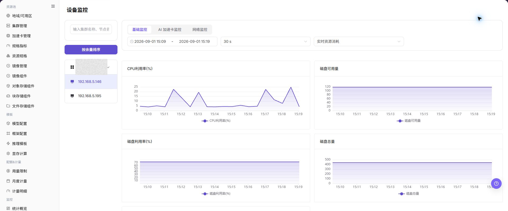

# 设备监控

## 功能概述

| 项目 | 内容 |
| --- | --- |
| 适用角色 | 运营管理员 |
| 导航路径 | AI基础设施 > On-Prem > 监控 > 设备监控 |
| 页面路由 | `/powerone/monitor/device` |
| 管理对象 | GPU/NPU 等加速卡设备、显存、利用率、温度和健康状态 |

#### 新手理解

设备监控像加速卡仪表盘，用来观察 GPU/NPU 利用率、显存、温度和健康状态，判断算力卡是否可继续承载任务。

#### 术语表

| 术语 | 英文 | 说明 |
| --- | --- | --- |
| 设备利用率 | Device Utilization | Device Utilization |
| 显存使用率 | VRAM Usage | VRAM Usage |
| 温度 | Temperature | Temperature |

#### 推荐操作顺序

先确认GPU/NPU 等加速卡设备、显存、利用率、温度和健康状态的前置依赖，再按主要操作顺序处理，最后执行结果校验并进入后续页面。

#### 小白先看

先确认当前任务是否涉及GPU/NPU 等加速卡设备、显存、利用率、温度和健康状态，再按照推荐顺序操作。页面字段或状态与预期不符时，先回到前置对象页核对依赖，不要跳过结果校验直接进入下游流程。

## 前提条件

1. 当前账号具备设备监控查看权限。
2. 目标集群已部署设备插件并能上报 GPU/NPU 指标。
3. 设备型号、显存、温度和健康状态可采集。
4. 已确认需要关注的加速卡型号或作业范围。

## 页面说明

页面用于查看和处理GPU/NPU 等加速卡设备、显存、利用率、温度和健康状态。

上图保留左侧菜单和完整功能区；请先确认页面标题、筛选范围和主要操作入口。

设备监控用于查看 GPU/NPU 利用率、显存、温度和健康状态。运营管理员可用它判断加速卡是否离线、过热、显存不足或被单个任务长期占用。

## 主要操作

### 查看监控对象

1. 进入监控页面，选择时间范围、地域和资源池。
2. 按集群、节点、设备、作业或状态继续筛选当前页面支持的对象。
3. 核对统计范围、数据更新时间和对象数量，避免比较不同口径的数据。
4. 无数据时扩大时间范围并逐项清除筛选；内部资源名称和指标外发前必须脱敏。

### 下钻异常指标

1. 点击异常指标、趋势点或目标对象的 **"详情"**。
2. 保持相同时间范围，检查资源利用率、状态、告警和关联对象。
3. 判断异常是单点、单集群还是全局趋势；信息不足时对照相邻监控页面。
4. 不通过启动、停止、迁移或删除资源来验证监控异常。

### 查看设备监控

#### 操作步骤

1. 进入 `AI基础设施 > On-Prem > 监控 > 设备监控`。
2. 确认右上角地域和页面筛选条件。
3. 查看列表、图表或统计卡片。
4. 重点关注异常状态、高水位、长时间未更新或与预期不一致的数据。
5. 设备异常时，结合节点统计、作业监控和底层驱动状态判断是作业占用还是硬件问题。

#### 查看设备监控

1. 进入 `AI基础设施 > On-Prem > 监控 > 设备监控`。
2. 查看设备列表和整体运行状态，确认设备 ID、设备类型、所属节点、所属集群、地域/可用区和设备状态。
3. 按页面提供的筛选条件选择集群、节点、设备类型、设备状态或时间范围。
4. 查看加速卡使用率、显存使用率、温度、健康状态、绑定作业和异常信息，判断是否存在设备不可用、显存不足或硬件异常。
5. 如发现设备异常，继续进入节点统计或作业监控页面，并结合集群统计、节点日志和调度事件排查。

#### 重点关注

- 设备是否被识别并持续上报。
- 显存和利用率是否接近上限。
- 温度、错误计数或健康状态是否异常。

## 参数速查表

| 字段名称 | 是否必填 | 字段类型 | 示例 | 说明 |
| --- | --- | --- | --- | --- |
| 设备 ID | 系统生成 | 文本 | `GPU-0` | 区分同一节点上的多张设备。 |
| 设备类型 | 必填 | 文本 | `NVIDIA A800` | 展示 GPU/NPU 或其他加速设备类型和型号。 |
| 所属节点 | 条件必填 | 文本 | `node-gpu-01` | 定位设备所在节点。 |
| 所属集群 | 条件必填 | 文本 | `cluster-prod-a` | 定位设备所属集群。 |
| 地域 / 可用区 | 条件必填 | 下拉选择 | `武汉 / 可用区 A` | 限定设备所属资源位置。 |
| 设备状态 | 系统生成 | 状态 | `正常` | 展示设备是否可用、告警或离线。 |
| 加速卡使用率 | 系统生成 | 百分比 | `92%` | 判断计算单元是否高负载。 |
| 显存使用率 | 系统生成 | 百分比 / 容量 | `62 GB / 80 GB` | 判断模型或作业是否占满显存。 |
| 温度 | 系统生成 | 数值 | `71°C` | 辅助判断散热和硬件健康。 |
| 健康状态 | 系统生成 | 状态 | `正常` | 展示设备是否可用、告警或离线。 |
| 绑定作业 | 系统生成 | 文本 / 数字 | `运行中作业` | 展示当前设备关联或占用的作业信息。 |
| 时间范围 | 条件必填 | 日期范围 | `近 1 小时` | 控制统计卡片、趋势图和列表数据的查询窗口。 |

## 踩坑提示

- 显存占满不一定代表算力满载，需要结合利用率判断。
- 温度异常应尽快联系运维检查硬件和散热。
- 设备不可见时先检查驱动、插件和节点状态。
- 设备监控可能存在采集延迟，不能只凭单个瞬时指标判断硬件故障。
- 设备异常需要结合节点状态、作业状态、调度事件、设备插件和节点日志一起排查。
- 显存水位高不一定代表设备故障，需结合绑定作业和模型规格判断。
- 不在文档中写真实设备 ID、节点名、节点 IP、集群 ID、资源池 ID、租户信息、内部指标 key 或测试数据。

### 配置规则与影响

- **显存水位直接影响模型启动**：显存不足时，即使集群总资源看起来充足，实例也可能创建失败。
- **温度和健康状态要一起看**：高温、掉卡或驱动异常都可能导致作业失败。
- **设备维度适合定位热点**：当集群水位正常但作业慢时，可用设备维度确认是否存在单卡热点。
- **型号差异影响可调度性**：同一规格可能要求特定 GPU/NPU 型号、驱动或算力能力。

## 结果校验

| 检查项 | 成功表现 | 异常时处理 |
| --- | --- | --- |
| 页面加载 | 设备监控图表或列表正常显示 | 检查当前角色的监控权限和所选地域是否开放采集能力 |
| 统计范围 | 时间范围、地域和对象数量与排查目标一致 | 清除筛选后逐项恢复条件，确认没有混用不同统计口径 |
| 数据新鲜度 | 更新时间落在预期采集周期内 | 到系统设置或监控采集组件核对采集周期、连接和告警 |
| 异常关联 | 异常指标能关联到集群、节点、设备或作业 | 保持相同时间范围，到相邻监控页和对象详情交叉核对 |

## 常见问题

#### 设备监控没有数据

**问题现象：**

页面可进入，但图表或列表为空。

**可能原因：**

- 所选时间没有任务。
- 地域未开放采集。
- 当前角色无指标权限。

**处理方式：**

1. 扩大时间范围并重置筛选
2. 核对地域监控能力
3. 到相邻监控页确认是否同样无数据。

#### 设备监控更新不及时

**问题现象：**

页面数据长时间没有变化。

**可能原因：**

- 采集周期尚未到。
- 采集组件异常。
- 页面缓存未刷新。

**处理方式：**

1. 核对更新时间
2. 检查采集组件和告警
3. 刷新后用同一时间范围复查。

#### 设备监控与相邻页面数值不一致

**问题现象：**

同一对象在两个监控页面显示不同数值。

**可能原因：**

- 聚合粒度不同。
- 时间范围或时区不同。
- 筛选对象不同。

**处理方式：**

1. 统一时间范围和时区
2. 核对聚合口径
3. 清除筛选后逐项恢复。

#### 无法下钻到目标对象

**问题现象：**

点击指标或详情入口后找不到对应对象。

**可能原因：**

- 对象已结束或被移除。
- 角色不可见。
- 关联标识不一致。

**处理方式：**

1. 记录对象名称和时间
2. 到对应列表核对状态
3. 联系运营管理员检查可见范围。

#### 异常峰值无法复现

**问题现象：**

监控中出现峰值，但当前详情已恢复正常。

**可能原因：**

- 峰值持续时间短。
- 采样粒度较粗。
- 任务已经结束。

**处理方式：**

1. 锁定峰值时间段
2. 对照作业和节点事件
3. 保留脱敏截图和对象标识。

## 注意事项

- 设备序列号、节点位置和内部硬件编号应脱敏。
- 利用率为空不一定表示异常，需要结合任务时间范围。
- 设备健康异常优先按硬件流程处理。
- 设备故障判断前，需要结合节点状态、作业状态、调度事件、设备插件和节点日志交叉确认。
- 文档示例不得包含真实设备 ID、节点名、节点 IP、集群 ID、资源池 ID、租户信息、内部指标 key 或测试数据。

## 后续操作

1. 显存高位时进入作业监控定位占用任务。
2. 温度或健康异常时联系运维处理硬件或驱动。
3. 型号资源不足时复核加速卡配置和规格关联。
