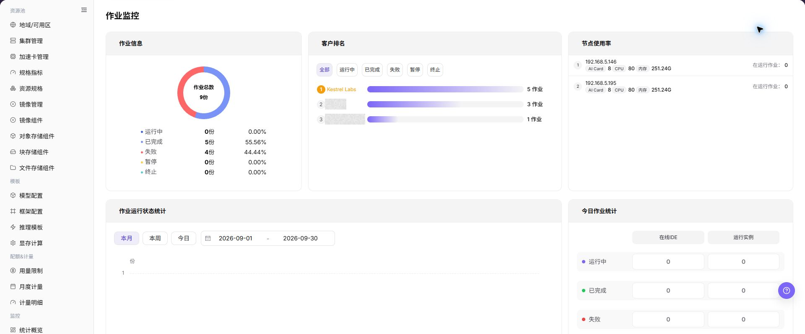

# 作业监控

## 功能概述

| 项目 | 内容 |
| --- | --- |
| 适用角色 | 运营管理员 |
| 导航路径 | AI基础设施 > On-Prem > 监控 > 作业监控 |
| 页面路由 | `/powerone/monitor/work` |
| 管理对象 | 模型实例、在线 IDE、运行实例、训练任务和历史作业 |

#### 新手理解

作业监控像任务排队和执行清单，用来查看训练、推理或开发任务的状态、排队原因、运行时长和资源占用。

#### 术语表

| 术语 | 英文 | 说明 |
| --- | --- | --- |
| 作业状态 | Job Status | Job Status |
| 排队原因 | Queueing Reason | Queueing Reason |
| 运行时长 | Runtime Duration | Runtime Duration |

#### 推荐操作顺序

先确认模型实例、在线 IDE、运行实例、训练任务和历史作业的前置依赖，再按主要操作顺序处理，最后执行结果校验并进入后续页面。

#### 小白先看

先确认当前任务是否涉及模型实例、在线 IDE、运行实例、训练任务和历史作业，再按照推荐顺序操作。页面字段或状态与预期不符时，先回到前置对象页核对依赖，不要跳过结果校验直接进入下游流程。

## 前提条件

1. 当前账号具备作业监控查看权限。
2. 平台已采集作业状态、事件、排队和运行时长。
3. 目标租户、用户或集群范围已明确。
4. 需要排障时已准备作业 ID 或提交时间。

## 页面说明

页面用于查看和处理模型实例、在线 IDE、运行实例、训练任务和历史作业。

上图保留左侧菜单和完整功能区；请先确认页面标题、筛选范围和主要操作入口。

作业监控用于查看作业排队、运行中、失败原因和资源占用。运营管理员可用它分析资源不足、镜像拉取失败、启动异常或长时间运行任务。

## 主要操作

### 查看监控对象

1. 进入监控页面，选择时间范围、地域和资源池。
2. 按集群、节点、设备、作业或状态继续筛选当前页面支持的对象。
3. 核对统计范围、数据更新时间和对象数量，避免比较不同口径的数据。
4. 无数据时扩大时间范围并逐项清除筛选；内部资源名称和指标外发前必须脱敏。

### 下钻异常指标

1. 点击异常指标、趋势点或目标对象的 **"详情"**。
2. 保持相同时间范围，检查资源利用率、状态、告警和关联对象。
3. 判断异常是单点、单集群还是全局趋势；信息不足时对照相邻监控页面。
4. 不通过启动、停止、迁移或删除资源来验证监控异常。

### 查看作业监控

#### 操作步骤

1. 进入 `AI基础设施 > On-Prem > 监控 > 作业监控`。
2. 确认右上角地域和页面筛选条件。
3. 查看列表、图表或统计卡片。
4. 重点关注异常状态、高水位、长时间未更新或与预期不一致的数据。
5. 作业异常时，进入实例详情查看日志、事件、镜像拉取、启动命令和存储挂载。

#### 查看作业监控

1. 进入 `AI基础设施 > On-Prem > 监控 > 作业监控`。
2. 查看作业列表和整体运行状态，确认作业 ID、作业名称、作业类型、作业状态、所属租户/用户、所属集群和资源占用。
3. 按页面提供的筛选条件选择作业状态、租户/用户、集群、资源类型或时间范围。
4. 查看排队时长、运行时长、GPU/加速卡占用、失败信息和事件入口，判断是否存在长时间排队、启动失败、资源不足或异常占用。
5. 如发现作业异常，继续进入作业详情，并结合事件、日志、镜像拉取、启动命令、存储挂载、节点状态和设备状态排查。

#### 重点关注

- 失败和排队作业是否异常增多。
- 长时间运行作业是否占用关键资源。
- 作业所属租户、规格、镜像和集群是否符合预期。

## 参数速查表

| 字段名称 | 是否必填 | 字段类型 | 示例 | 说明 |
| --- | --- | --- | --- | --- |
| 作业 ID | 必填 | 文本 | `job-20260706-001` | 定位单个作业或任务实例。 |
| 作业名称 | 条件必填 | 文本 | `inference-job` | 辅助按业务名称定位作业。 |
| 作业类型 | 条件必填 | 枚举 | `运行实例` | 区分模型实例、在线 IDE、运行实例、训练任务或历史作业。 |
| 作业状态 | 系统生成 | 状态 | `Running` | 展示作业处于排队、运行、成功或失败状态。 |
| 所属租户 / 用户 | 条件必填 | 文本 | `tenant-a` | 用于按租户或用户定位作业归属。 |
| 所属集群 | 条件必填 | 文本 | `cluster-prod-a` | 定位作业运行或排队的集群。 |
| 节点 | 系统生成 | 文本 | `node-gpu-01` | 展示作业实际调度到的节点。 |
| 资源规格 | 系统生成 | 文本 | `2 * A800` | 展示作业申请或占用的资源规格。 |
| GPU / 加速卡占用 | 系统生成 | 数字 / 文本 | `2 * A800` | 展示作业占用的加速卡规格和数量。 |
| 排队时长 | 系统生成 | 时长 | `18 分钟` | 判断调度是否存在等待或资源不足。 |
| 运行时长 | 系统生成 | 时长 | `2 小时 15 分钟` | 判断作业运行是否超出预期。 |
| 失败信息 | 系统生成 | 文本 | `ImagePullBackOff` | 辅助定位作业失败原因。 |
| 时间范围 | 条件必填 | 日期范围 | `近 1 小时` | 控制统计卡片、趋势图和列表数据的查询窗口。 |

## 踩坑提示

- 作业排队不一定是故障，可能是资源或配额不足。
- 失败原因要结合事件、日志和镜像拉取状态判断。
- 长时间运行作业应关注资源占用和费用。
- 作业监控可能存在采集延迟，不能只凭单个瞬时状态判断故障。
- 作业异常需要结合事件、日志、镜像拉取、启动命令、存储挂载、节点状态和设备状态一起排查。
- 长时间运行或高资源占用不一定是异常，需要结合业务预期、租户配额和模型规格判断。
- 不在文档中写真实作业 ID、实例名称、镜像地址、数据路径、日志内容、租户信息、节点名、集群 ID、资源池 ID、内部指标 key 或测试数据。

### 配置规则与影响

- **排队先看资源和调度条件**：排队不一定是平台故障，可能是规格、标签、配额或集群容量限制。
- **失败信息要结合事件**：错误码和事件能区分镜像、存储、启动命令、权限和资源不足问题。
- **运行时长用于发现卡死任务**：长时间运行应结合日志、资源利用率和业务预期判断。
- **资源占用会影响其他用户**：大作业集中提交时，应同步关注租户配额和集群水位。

## 结果校验

| 检查项 | 成功表现 | 异常时处理 |
| --- | --- | --- |
| 页面加载 | 作业监控图表或列表正常显示 | 检查当前角色的监控权限和所选地域是否开放采集能力 |
| 统计范围 | 时间范围、地域和对象数量与排查目标一致 | 清除筛选后逐项恢复条件，确认没有混用不同统计口径 |
| 数据新鲜度 | 更新时间落在预期采集周期内 | 到系统设置或监控采集组件核对采集周期、连接和告警 |
| 异常关联 | 异常指标能关联到集群、节点、设备或作业 | 保持相同时间范围，到相邻监控页和对象详情交叉核对 |

## 常见问题

#### 作业监控没有数据

**问题现象：**

页面可进入，但图表或列表为空。

**可能原因：**

- 所选时间没有任务。
- 地域未开放采集。
- 当前角色无指标权限。

**处理方式：**

1. 扩大时间范围并重置筛选
2. 核对地域监控能力
3. 到相邻监控页确认是否同样无数据。

#### 作业监控更新不及时

**问题现象：**

页面数据长时间没有变化。

**可能原因：**

- 采集周期尚未到。
- 采集组件异常。
- 页面缓存未刷新。

**处理方式：**

1. 核对更新时间
2. 检查采集组件和告警
3. 刷新后用同一时间范围复查。

#### 作业监控与相邻页面数值不一致

**问题现象：**

同一对象在两个监控页面显示不同数值。

**可能原因：**

- 聚合粒度不同。
- 时间范围或时区不同。
- 筛选对象不同。

**处理方式：**

1. 统一时间范围和时区
2. 核对聚合口径
3. 清除筛选后逐项恢复。

#### 无法下钻到目标对象

**问题现象：**

点击指标或详情入口后找不到对应对象。

**可能原因：**

- 对象已结束或被移除。
- 角色不可见。
- 关联标识不一致。

**处理方式：**

1. 记录对象名称和时间
2. 到对应列表核对状态
3. 联系运营管理员检查可见范围。

#### 异常峰值无法复现

**问题现象：**

监控中出现峰值，但当前详情已恢复正常。

**可能原因：**

- 峰值持续时间短。
- 采样粒度较粗。
- 任务已经结束。

**处理方式：**

1. 锁定峰值时间段
2. 对照作业和节点事件
3. 保留脱敏截图和对象标识。

## 注意事项

- 作业名称、镜像地址、数据路径和日志内容可能含敏感信息。
- 终止作业前确认业务影响和输出文件保留策略。
- 高频失败作业应进入模板或镜像复盘。

- 文档示例不得包含真实作业 ID、实例名称、镜像地址、数据路径、日志内容、租户信息、节点名、集群 ID、资源池 ID、内部指标 key 或测试数据。

## 后续操作

1. 排队问题核对配额、规格和集群容量。
2. 失败问题核对镜像、启动命令、存储和事件。
3. 长时间运行任务进入用量和监控页面评估消耗。
