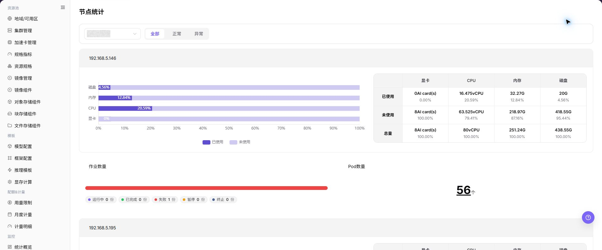

# 节点统计

## 功能概述

| 项目 | 内容 |
| --- | --- |
| 适用角色 | 运营管理员 |
| 导航路径 | AI基础设施 > On-Prem > 监控 > 节点统计 |
| 页面路由 | `/powerone/monitor/node` |
| 管理对象 | 节点状态、节点角色、资源使用率、心跳和所在集群 |

#### 新手理解

节点统计像服务器点检表，用来查看每台节点的 CPU、内存、磁盘和状态，帮助判断问题落在哪台机器上。

#### 术语表

| 术语 | 英文 | 说明 |
| --- | --- | --- |
| 节点状态 | Node Status | Node Status |
| CPU 使用率 | CPU Usage | CPU Usage |
| 内存使用率 | Memory Usage | Memory Usage |

#### 推荐操作顺序

先确认节点状态、节点角色、资源使用率、心跳和所在集群的前置依赖，再按主要操作顺序处理，最后执行结果校验并进入后续页面。

#### 小白先看

先确认当前任务是否涉及节点状态、节点角色、资源使用率、心跳和所在集群，再按照推荐顺序操作。页面字段或状态与预期不符时，先回到前置对象页核对依赖，不要跳过结果校验直接进入下游流程。

## 前提条件

1. 当前账号具备节点监控查看权限。
2. 目标节点属于已接入集群。
3. 节点 CPU、内存、磁盘和状态指标正常上报。
4. 已明确排障时间范围或受影响任务。

## 页面说明

页面用于查看和处理节点状态、节点角色、资源使用率、心跳和所在集群。

上图保留左侧菜单和完整功能区；请先确认页面标题、筛选范围和主要操作入口。

节点统计用于查看每台节点的 CPU、内存、磁盘和运行状态。运营管理员可用它定位 NotReady 节点、高水位节点或采集曲线中断的机器。

## 主要操作

### 查看监控对象

1. 进入监控页面，选择时间范围、地域和资源池。
2. 按集群、节点、设备、作业或状态继续筛选当前页面支持的对象。
3. 核对统计范围、数据更新时间和对象数量，避免比较不同口径的数据。
4. 无数据时扩大时间范围并逐项清除筛选；内部资源名称和指标外发前必须脱敏。

### 下钻异常指标

1. 点击异常指标、趋势点或目标对象的 **"详情"**。
2. 保持相同时间范围，检查资源利用率、状态、告警和关联对象。
3. 判断异常是单点、单集群还是全局趋势；信息不足时对照相邻监控页面。
4. 不通过启动、停止、迁移或删除资源来验证监控异常。

### 查看节点统计

#### 操作步骤

1. 进入 `AI基础设施 > On-Prem > 监控 > 节点统计`。
2. 确认右上角地域和页面筛选条件。
3. 查看列表、图表或统计卡片。
4. 重点关注异常状态、高水位、长时间未更新或与预期不一致的数据。
5. 节点异常时，进入集群节点页查看标签、污点、硬件、运行时和作业信息。

#### 查看节点统计

1. 进入 `AI基础设施 > On-Prem > 监控 > 节点统计`。
2. 查看节点列表和整体运行状态，确认节点名称、所属集群、地域/可用区、节点状态和资源水位。
3. 按页面提供的筛选条件选择集群、节点、资源类型、状态或时间范围。
4. 查看 CPU、内存、加速卡、存储、网络和作业相关统计，判断是否存在节点负载过高、资源不足或状态异常。
5. 如发现节点异常，继续进入设备监控或作业监控页面，并结合集群统计和调度事件排查。

#### 重点关注

- 节点是否在线或 Ready。
- 单节点资源是否接近满载。
- 异常节点是否集中在同一集群或可用区。

## 参数速查表

| 字段名称 | 是否必填 | 字段类型 | 示例 | 说明 |
| --- | --- | --- | --- | --- |
| 节点名称 | 必填 | 文本 | `node-gpu-01` | 定位具体计算节点。 |
| 所属集群 | 条件必填 | 下拉选择 | `cluster-prod-a` | 限定节点所属集群。 |
| 地域 / 可用区 | 条件必填 | 下拉选择 | `武汉 / 可用区 A` | 限定节点所属资源位置。 |
| 节点状态 | 系统生成 | 状态 | `Ready` | 展示节点是否可调度、不可用或存在告警。 |
| CPU 使用率 | 系统生成 | 百分比 | `72%` | 判断节点 CPU 是否接近瓶颈。 |
| 内存使用率 | 系统生成 | 百分比 | `81%` | 判断节点内存压力。 |
| 加速卡使用率 | 系统生成 | 百分比 | `65%` | 判断 GPU、NPU 等加速卡资源是否接近瓶颈。 |
| 存储使用率 | 系统生成 | 百分比 | `68%` | 判断系统盘、数据盘或挂载存储是否接近上限。 |
| 网络流量 | 系统生成 | 数值 / 趋势 | `入方向 / 出方向` | 辅助判断节点网络是否存在异常波动或瓶颈。 |
| 作业数量 | 系统生成 | 数字 | `12` | 展示节点上运行、排队或异常作业数量。 |
| 时间范围 | 条件必填 | 日期范围 | `近 1 小时` | 控制统计卡片、趋势图和列表数据的查询窗口。 |
| 更新时间 | 系统生成 | 日期时间 | `2026-07-06 10:00` | 判断节点指标是否为最新数据。 |

## 踩坑提示

- 节点 Ready 不代表设备插件一定正常。
- 磁盘水位高可能导致镜像拉取或日志写入失败。
- 排障时结合节点事件和作业日志判断。
- 节点统计可能有采集延迟，不能只凭单个瞬时指标判断故障。
- 节点异常需要结合集群、设备、作业、调度事件和节点日志一起排查。
- 不在文档中写真实节点名、节点 IP、设备 ID、集群 ID、资源池 ID、租户信息、内部指标 key 或测试数据。

### 配置规则与影响

- **节点状态优先于资源水位**：节点 NotReady、不可调度或采集异常时，先处理状态问题。
- **磁盘压力会影响作业稳定性**：磁盘水位高可能导致镜像拉取、日志写入或临时文件创建失败。
- **单节点异常会造成局部排队**：调度失败不一定是集群整体容量不足，可能是目标节点标签或污点限制。
- **指标延迟要结合事件判断**：节点指标延迟时，应同时查看集群事件和作业失败原因。

## 结果校验

| 检查项 | 成功表现 | 异常时处理 |
| --- | --- | --- |
| 页面加载 | 节点统计图表或列表正常显示 | 检查当前角色的监控权限和所选地域是否开放采集能力 |
| 统计范围 | 时间范围、地域和对象数量与排查目标一致 | 清除筛选后逐项恢复条件，确认没有混用不同统计口径 |
| 数据新鲜度 | 更新时间落在预期采集周期内 | 到系统设置或监控采集组件核对采集周期、连接和告警 |
| 异常关联 | 异常指标能关联到集群、节点、设备或作业 | 保持相同时间范围，到相邻监控页和对象详情交叉核对 |

## 常见问题

#### 节点统计没有数据

**问题现象：**

页面可进入，但图表或列表为空。

**可能原因：**

- 所选时间没有任务。
- 地域未开放采集。
- 当前角色无指标权限。

**处理方式：**

1. 扩大时间范围并重置筛选
2. 核对地域监控能力
3. 到相邻监控页确认是否同样无数据。

#### 节点统计更新不及时

**问题现象：**

页面数据长时间没有变化。

**可能原因：**

- 采集周期尚未到。
- 采集组件异常。
- 页面缓存未刷新。

**处理方式：**

1. 核对更新时间
2. 检查采集组件和告警
3. 刷新后用同一时间范围复查。

#### 节点统计与相邻页面数值不一致

**问题现象：**

同一对象在两个监控页面显示不同数值。

**可能原因：**

- 聚合粒度不同。
- 时间范围或时区不同。
- 筛选对象不同。

**处理方式：**

1. 统一时间范围和时区
2. 核对聚合口径
3. 清除筛选后逐项恢复。

#### 无法下钻到目标对象

**问题现象：**

点击指标或详情入口后找不到对应对象。

**可能原因：**

- 对象已结束或被移除。
- 角色不可见。
- 关联标识不一致。

**处理方式：**

1. 记录对象名称和时间
2. 到对应列表核对状态
3. 联系运营管理员检查可见范围。

#### 异常峰值无法复现

**问题现象：**

监控中出现峰值，但当前详情已恢复正常。

**可能原因：**

- 峰值持续时间短。
- 采样粒度较粗。
- 任务已经结束。

**处理方式：**

1. 锁定峰值时间段
2. 对照作业和节点事件
3. 保留脱敏截图和对象标识。

## 注意事项

- 节点名、IP、标签和机房信息应脱敏。
- 单点节点异常不一定代表集群整体不可用。
- 节点维护前应确认运行中任务和挂载存储影响。
- 故障判断前，需要结合集群统计、设备监控、作业监控、调度事件和节点日志交叉确认。
- 文档示例不得包含真实节点名、节点 IP、设备 ID、集群 ID、资源池 ID、租户信息、内部指标 key 或测试数据。

## 后续操作

1. 节点 NotReady 时检查集群事件和节点状态。
2. 资源高水位时定位占用资源的实例或作业。
3. 涉及加速卡时继续查看设备监控。
