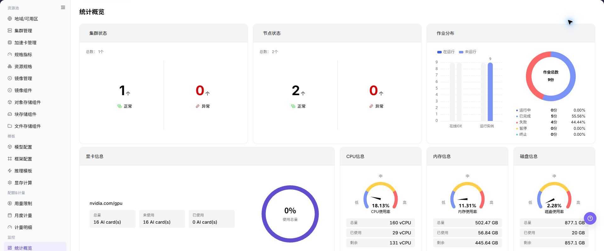

# 统计概览

## 功能概述

| 项目 | 内容 |
| --- | --- |
| 适用角色 | 运营管理员 |
| 导航路径 | AI基础设施 > On-Prem > 监控 > 统计概览 |
| 页面路由 | `/powerone/monitor/overview` |
| 管理对象 | 资源池总览、集群数量、节点状态、作业分布和资源容量 |

#### 新手理解

统计概览像资源池驾驶舱，先看整体水位、异常数量和更新时间，再决定下钻到集群、节点、设备或作业页面继续排查。

#### 术语表

| 术语 | 英文 | 说明 |
| --- | --- | --- |
| 全局水位 | Global Watermark | Global Watermark |
| 异常聚合 | Exception Aggregation | Exception Aggregation |
| 趋势入口 | Trend Entrypoint | Trend Entrypoint |

#### 推荐操作顺序

先确认资源池总览、集群数量、节点状态、作业分布和资源容量的前置依赖，再按主要操作顺序处理，最后执行结果校验并进入后续页面。

#### 小白先看

先确认当前任务是否涉及资源池总览、集群数量、节点状态、作业分布和资源容量，再按照推荐顺序操作。页面字段或状态与预期不符时，先回到前置对象页核对依赖，不要跳过结果校验直接进入下游流程。

## 前提条件

1. 当前账号具备运营管理员监控查看权限。
2. 目标地域、可用区和集群已完成资源接入。
3. 监控采集组件正常上报集群、节点、设备和作业数据。
4. 需要排障时，已明确时间范围和受影响资源类型。

## 页面说明

页面用于查看和处理资源池总览、集群数量、节点状态、作业分布和资源容量。

上图保留左侧菜单和完整功能区；请先确认页面标题、筛选范围和主要操作入口。

统计概览用于查看运营管理员视角的全局资源水位、异常聚合和趋势入口。页面重点帮助运营管理员先判断问题集中在集群、节点、设备还是作业，再进入对应监控页下钻。

## 主要操作

### 查看监控对象

1. 进入监控页面，选择时间范围、地域和资源池。
2. 按集群、节点、设备、作业或状态继续筛选当前页面支持的对象。
3. 核对统计范围、数据更新时间和对象数量，避免比较不同口径的数据。
4. 无数据时扩大时间范围并逐项清除筛选；内部资源名称和指标外发前必须脱敏。

### 下钻异常指标

1. 点击异常指标、趋势点或目标对象的 **"详情"**。
2. 保持相同时间范围，检查资源利用率、状态、告警和关联对象。
3. 判断异常是单点、单集群还是全局趋势；信息不足时对照相邻监控页面。
4. 不通过启动、停止、迁移或删除资源来验证监控异常。

### 查看统计概览

#### 操作步骤

1. 进入 `AI基础设施 > On-Prem > 监控 > 统计概览`。
2. 确认右上角地域和页面筛选条件。
3. 查看列表、图表或统计卡片。
4. 重点关注异常状态、高水位、长时间未更新或与预期不一致的数据。
5. 发现异常后，进入集群统计、节点统计、设备监控或作业监控继续定位。

#### 统计概览

1. 进入 `AI基础设施 > On-Prem > 监控 > 统计概览`。
2. 查看资源池、集群、节点、设备和作业的整体运行状态。
3. 重点关注资源总量、已使用量、剩余量、在线状态、异常状态和趋势指标。
4. 如页面提供时间范围、地域、集群或资源类型筛选，先选择筛选条件，再查看统计结果。
5. 发现资源水位过高、设备异常或作业异常时，继续进入集群统计、节点统计、设备监控或作业监控页面排查。

#### 重点关注

- 集群和节点数量是否异常变化。
- GPU、CPU、内存和磁盘水位是否接近上限。
- 失败、排队或长时间运行作业是否增多。

## 参数速查表

| 字段名称 | 是否必填 | 字段类型 | 示例 | 说明 |
| --- | --- | --- | --- | --- |
| 资源池 | 系统生成 | 汇总对象 | `资源池` | 展示当前运营范围内资源池整体运行和容量情况。 |
| 集群 | 系统生成 | 汇总对象 | `集群` | 展示纳入监控统计的集群数量、状态和异常情况。 |
| 节点 | 系统生成 | 汇总对象 | `节点` | 展示节点在线状态、异常状态和资源水位。 |
| 设备 | 系统生成 | 汇总对象 | `设备` | 展示 GPU 等设备资源的运行状态和可用情况。 |
| 作业 | 系统生成 | 汇总对象 | `作业` | 展示作业数量、运行状态和异常分布。 |
| 资源总量 | 系统生成 | 数字 | `总量` | 展示当前筛选范围内资源的总体容量。 |
| 已使用量 | 系统生成 | 数字 | `已使用` | 展示当前筛选范围内已被占用的资源量。 |
| 剩余量 | 系统生成 | 数字 | `剩余` | 展示当前筛选范围内仍可调度或使用的资源量。 |
| 异常状态 | 系统生成 | 状态 | `异常` | 展示集群、节点、设备或作业的异常聚合状态。 |
| 时间范围 | 必填 | 日期范围 | `近 1 小时` | 控制总览卡片、趋势图和异常统计的查询窗口。 |
| 地域 | 条件必填 | 下拉选择 | `华中一区` | 限定统计概览覆盖的资源范围。 |
| 集群数量 | 系统生成 | 数字 | `12` | 展示当前地域纳入监控统计的集群总数。 |
| 异常数量 | 系统生成 | 数字 | `3` | 汇总集群、节点、设备或作业中的异常对象数量。 |
| 更新时间 | 系统生成 | 日期时间 | `2026-07-06 10:00` | 判断总览数据是否存在采集延迟。 |

## 踩坑提示

- 总览只能帮助定位方向，不能替代具体对象详情。
- 水位升高要结合新增作业、扩容和排队情况判断。
- 统计概览用于观察全局水位，不应单独作为扩容、迁移或故障判断的唯一依据。
- 指标可能存在采集延迟，异常排查需结合集群、节点、设备和作业详情。
- 截图前遮挡租户、节点名和业务标识。
- 不在文档中写真实集群 ID、节点名、资源池 ID、租户信息、内部指标 key 或测试数据。

### 配置规则与影响

- **总览用于先判方向**：先确认异常是否集中在某个地域、集群或资源类型，再进入下钻页面。
- **异常数量要结合时间范围**：时间窗口越长，历史异常越容易被纳入统计，排障时应固定时间范围。
- **更新时间决定可信度**：更新时间明显滞后时，先核对采集链路，再判断资源有无真实异常。
- **水位变化要看趋势**：瞬时高水位不一定是故障，应结合新增作业、扩容、维护窗口和历史趋势判断。

## 结果校验

| 检查项 | 成功表现 | 异常时处理 |
| --- | --- | --- |
| 页面加载 | 统计概览图表或列表正常显示 | 检查当前角色的监控权限和所选地域是否开放采集能力 |
| 统计范围 | 时间范围、地域和对象数量与排查目标一致 | 清除筛选后逐项恢复条件，确认没有混用不同统计口径 |
| 数据新鲜度 | 更新时间落在预期采集周期内 | 到系统设置或监控采集组件核对采集周期、连接和告警 |
| 异常关联 | 异常指标能关联到集群、节点、设备或作业 | 保持相同时间范围，到相邻监控页和对象详情交叉核对 |

## 常见问题

#### 统计概览没有数据

**问题现象：**

页面可进入，但图表或列表为空。

**可能原因：**

- 所选时间没有任务。
- 地域未开放采集。
- 当前角色无指标权限。

**处理方式：**

1. 扩大时间范围并重置筛选
2. 核对地域监控能力
3. 到相邻监控页确认是否同样无数据。

#### 统计概览更新不及时

**问题现象：**

页面数据长时间没有变化。

**可能原因：**

- 采集周期尚未到。
- 采集组件异常。
- 页面缓存未刷新。

**处理方式：**

1. 核对更新时间
2. 检查采集组件和告警
3. 刷新后用同一时间范围复查。

#### 统计概览与相邻页面数值不一致

**问题现象：**

同一对象在两个监控页面显示不同数值。

**可能原因：**

- 聚合粒度不同。
- 时间范围或时区不同。
- 筛选对象不同。

**处理方式：**

1. 统一时间范围和时区
2. 核对聚合口径
3. 清除筛选后逐项恢复。

#### 无法下钻到目标对象

**问题现象：**

点击指标或详情入口后找不到对应对象。

**可能原因：**

- 对象已结束或被移除。
- 角色不可见。
- 关联标识不一致。

**处理方式：**

1. 记录对象名称和时间
2. 到对应列表核对状态
3. 联系运营管理员检查可见范围。

#### 异常峰值无法复现

**问题现象：**

监控中出现峰值，但当前详情已恢复正常。

**可能原因：**

- 峰值持续时间短。
- 采样粒度较粗。
- 任务已经结束。

**处理方式：**

1. 锁定峰值时间段
2. 对照作业和节点事件
3. 保留脱敏截图和对象标识。

## 注意事项

- 总览用于发现方向，不作为事故定责唯一依据。
- 截图前遮挡租户、节点、IP 和业务标识。
- 水位异常需要结合历史趋势、业务窗口和作业变化判断。
- 扩容、迁移或故障处理前，需要结合集群统计、节点统计、设备监控和作业监控交叉确认。
- 文档示例不得包含真实集群 ID、节点名、资源池 ID、租户信息、内部指标 key 或测试数据。

## 后续操作

1. 异常集中在集群时进入集群统计。
2. 异常集中在节点或设备时进入对应监控页。
3. 作业失败或排队升高时进入作业监控并结合配额排查。
