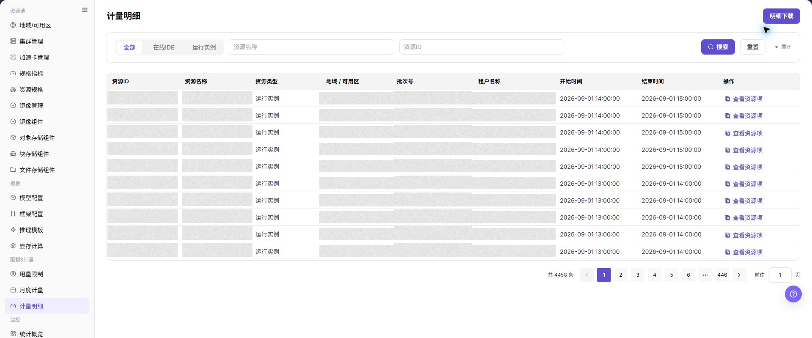

# 计量明细

## 功能概述

| 项目 | 内容 |
| --- | --- |
| 适用角色 | 运营管理员 |
| 导航路径 | AI基础设施 > On-Prem > 配额&计量 > 计量明细 |
| 页面路由 | `/powerone/quota-metric/resource` |
| 管理对象 | 资源 ID、资源名称、资源类型、地域、可用区、批次号、企业和起止时间 |

#### 新手理解

计量明细像资源消费流水，逐条记录租户在什么时间用了什么资源、用了多少以及折算了多少 Credits。

#### 术语表

| 术语 | 英文 | 说明 |
| --- | --- | --- |
| 资源类型 | Resource Type | Resource Type |
| 批次号 | Batch Number | Batch Number |
| 明细下载 | Detail Download | Detail Download |

#### 推荐操作顺序

先确认资源 ID、资源名称、资源类型、地域、可用区、批次号、企业和起止时间的前置依赖，再按主要操作顺序处理，最后执行结果校验并进入后续页面。

#### 小白先看

先确认当前任务是否涉及资源 ID、资源名称、资源类型、地域、可用区、批次号、企业和起止时间，再按照推荐顺序操作。页面字段或状态与预期不符时，先回到前置对象页核对依赖，不要跳过结果校验直接进入下游流程。

## 前提条件

1. 当前账号具备运营管理员权限。
2. 目标地域已选择正确。
3. 相关资源、作业或计量任务已有数据上报。

## 页面说明

页面用于查看和处理资源 ID、资源名称、资源类型、地域、可用区、批次号、企业和起止时间。

上图保留左侧菜单和完整功能区；请先确认页面标题、筛选范围和主要操作入口。

计量明细用于逐条核对租户、资源、计费周期、用量和 Credits 消耗。运营管理员可以按租户、资源名称或时间范围定位异常明细，并与月度计量汇总交叉验证。

下图展示计量明细页面。

## 主要操作

### 查看计量明细

1. 进入 `配额&计量 > 计量明细`，选择时间范围。
2. 按租户、项目、资源类型、集群或计量状态筛选。
3. 核对用量、单位、计量时间和数据更新时间。
4. 无结果时检查时区和同步状态；计量与租户信息外发前必须脱敏。

### 核对计量与资源事件

1. 打开目标明细，记录脱敏对象、时间和计量值。
2. 对照资源创建、运行、停止或删除时间检查计量区间。
3. 一致时事件时间与计量区间应可追溯；不一致时检查数据延迟和统计单位。
4. 不通过启动或停止真实资源验证计量异常。

### 下载计量明细

#### 操作步骤

1. 进入 `AI基础设施 > On-Prem > 配额&计量 > 计量明细`。
2. 选择资源类型、地域、可用区或企业。
3. 点击 **"搜索"**。
4. 点击 **"查看资源项"** 或展开明细，查看资源起止时间。
5. 如需离线核对，点击 **"明细下载"**。

#### 明细下载

1. 进入 `AI基础设施 > On-Prem > 配额&计量 > 计量明细`。
2. 按需要选择资源类型筛选，例如 `全部`、`在线IDE` 或 `运行实例`。
3. 使用 `资源名称`、`资源ID` 等查询条件缩小明细范围。
4. 点击 **"搜索"**，确认列表中的资源 ID、资源名称、资源类型、地域/可用区、批次号、租户名称、开始时间和结束时间符合导出范围。
5. 点击 **"明细下载"** 前，再次确认筛选条件、账期范围和是否包含敏感租户或资源信息。
6. 下载完成后，将文件保存在受控目录，仅用于对账、计量复核或问题排查。

#### 下载结果校验

- 下载文件成功生成，文件中的资源类型、地域、可用区和时间范围与当前筛选条件一致。
- 文件内容可以与页面明细或资源事件按资源 ID 和起止时间对应。

#### 下载注意事项

- 下载文件可能包含租户、资源和计量信息，保存到受控目录并按权限共享。
- 下载范围过大时先缩小时间、地域或资源类型范围，避免遗漏和对账困难。

#### 下载文件与页面明细不一致

**问题现象：**

下载文件的记录数量或时间范围与页面列表不一致。

**可能原因：**

- 下载使用的筛选条件与当前页面条件不同。
- 页面数据在下载前后发生刷新或统计任务尚未完成。
- 时区、账期边界或分页展示造成误判。

**处理方式：**

1. 重新设置时间、地域、可用区和资源类型，并记录筛选条件。
2. 搜索后重新下载，按资源 ID 和起止时间抽样比对。
3. 统一时区和账期口径，确认来源计量任务已经完成。

## 参数速查表

| 字段名称 | 是否必填 | 字段类型 | 示例 | 说明 |
| --- | --- | --- | --- | --- |
| 租户 | 必填 | 下拉选择 | `tenant-a` | 过滤需要查看的消费主体。 |
| 资源名称 | 条件必填 | 文本 | `inference-qwen` | 产生计量的实例、作业或存储资源。 |
| 计费周期 | 必填 | 日期范围 | `2026-07-01 至 2026-07-31` | 明细统计所属的结算周期。 |
| 用量 | 系统生成 | 数字 / 时长 | `12 卡时` | 资源实际使用量。 |
| Credits | 系统生成 | 数字 | `360` | 用量按计费规则折算后的消耗额度。 |
| 明细状态 | 系统生成 | 状态 | `已入账` | 展示明细是否完成统计、入账或修正。 |

## 踩坑提示

- 计量明细用于追溯单次资源消费，不适合直接替代月度账单结论。
- 核对异常时先统一租户、实例 ID、资源类型和起止时间，避免把不同周期的记录混在一起。
- 明细可能受采集延迟或补采任务影响，发现缺口时要记录采集时间和关联资源。
- `明细下载` 会导出计量明细，可能包含租户名称、资源 ID、资源名称、时间范围和用量信息。
- 下载文件只用于对账、计量复核和问题排查，不应外发到非授权渠道。
- 下载前必须确认筛选条件，避免导出过大范围或非目标租户数据。
- 不在文档中写真实租户名、资源 ID、批次号、下载文件名、内部路径或测试数据。

### 配置规则与影响

- **下载前先筛选**：避免导出过大范围。
- **以明细解释汇总**：月度计量差异优先从明细合计排查。

## 结果校验

| 检查项 | 成功表现 | 异常时处理 |
| --- | --- | --- |
| 页面入口 | 可进入计量明细并看到筛选或统计区域 | 检查菜单权限、当前业务身份和所属租户范围 |
| 数据范围 | 列表或统计与所选时间、地域和对象一致 | 重置筛选并核对时间边界、时区和统计口径 |
| 数据更新 | 更新时间或最新记录符合预期周期 | 到来源页核对任务、计量或配额记录是否已生成 |
| 交叉核对 | 资源 ID、资源名称、资源类型、地域、可用区、批次号、企业和起止时间可与详情、账单或监控记录对应 | 按对象标识和时间范围到对应详情页逐项比对 |

## 常见问题

#### 计量明细没有记录

**问题现象：**

页面正常打开，但列表或统计为空。

**可能原因：**

- 筛选范围过窄。
- 来源记录尚未生成。
- 当前角色不可见。

**处理方式：**

1. 重置筛选
2. 核对来源任务或计量周期
3. 检查当前业务身份和租户范围。

#### 计量明细范围不正确

**问题现象：**

显示的数据不属于预期时间、地域或对象。

**可能原因：**

- 时间边界不一致。
- 地域筛选未生效。
- 对象归属已变化。

**处理方式：**

1. 重新选择时间和地域
2. 核对对象标识
3. 到来源详情确认当前归属。

#### 计量明细更新延迟

**问题现象：**

来源操作已完成，但页面尚未出现最新记录。

**可能原因：**

- 统计任务尚未结束。
- 缓存未刷新。
- 来源状态仍在处理中。

**处理方式：**

1. 核对来源状态
2. 等待一个统计周期后刷新
3. 持续延迟时检查处理任务。

#### 详情或下载入口不可用

**问题现象：**

详情、展开或下载按钮不可点击。

**可能原因：**

- 当前记录不支持该操作。
- 角色权限不足。
- 文件尚未生成。

**处理方式：**

1. 选择可用记录
2. 检查角色权限
3. 确认对应统计或导出任务已经完成。

#### 汇总与明细不一致

**问题现象：**

汇总值与逐条明细相加结果不同。

**可能原因：**

- 统计周期不同。
- 存在舍入。
- 部分记录仍在处理。

**处理方式：**

1. 统一周期和时区
2. 按对象逐条核对
3. 等待未完成记录结算后复查。

## 注意事项

- 计量明细可能存在统计延迟，结算前应确认最终入账状态。
- 明细导出文件包含敏感经营数据，不应在公共渠道传播。
- 不要直接修改明细口径，应通过计费规则或修正流程处理。
- 下载明细前应确认筛选范围，并判断租户或资源标识是否需要脱敏。

## 后续操作

1. 明细异常时，按租户、资源和时间范围缩小查询范围。
2. 与月度用量不一致时，确认是否存在延迟入账、修正记录或跨周期资源。
3. 导出明细前，对租户名称、资源名称、金额和内部单价做脱敏处理。
4. 需要解释费用时，结合资源规格、运行时长和计费规则给出租户可理解的口径。
