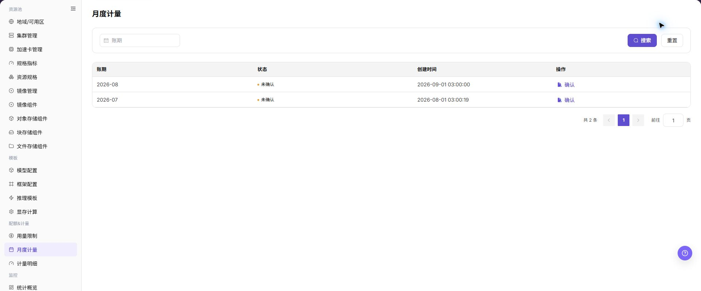

# 月度计量

## 功能概述

| 项目 | 内容 |
| --- | --- |
| 适用角色 | 运营管理员 |
| 导航路径 | AI基础设施 > On-Prem > 配额&计量 > 月度计量 |
| 页面路由 | `/powerone/quota-metric/month` |
| 管理对象 | 账期、状态、创建时间和月度汇总记录 |

#### 新手理解

月度用量像每月资源账单汇总，把分散的算力、存储和实例消费汇总到月份、租户和资源类型维度。

#### 术语表

| 术语 | 英文 | 说明 |
| --- | --- | --- |
| 账期 | Billing Period | Billing Period |
| 月度汇总 | Monthly Summary | Monthly Summary |

#### 推荐操作顺序

先确认账期、状态、创建时间和月度汇总记录的前置依赖，再按主要操作顺序处理，最后执行结果校验并进入后续页面。

#### 小白先看

先确认当前任务是否涉及账期、状态、创建时间和月度汇总记录，再按照推荐顺序操作。页面字段或状态与预期不符时，先回到前置对象页核对依赖，不要跳过结果校验直接进入下游流程。

## 前提条件

1. 当前账号具备运营管理员权限。
2. 目标地域已选择正确。
3. 相关资源、作业或计量任务已有数据上报。

## 页面说明

页面用于查看和处理账期、状态、创建时间和月度汇总记录。

上图保留左侧菜单和完整功能区；请先确认页面标题、筛选范围和主要操作入口。

月度计量用于按月份汇总租户资源消耗、Credits 折算和导出状态。运营管理员可以先看月度汇总，再下钻到计量明细核对异常增长、跨周期资源或延迟入账。

下图展示月度计量页面。

## 主要操作

### 查看计量汇总

1. 进入 `配额&计量 > 月度计量`，选择目标月份。
2. 按租户、项目、资源类型或集群筛选。
3. 核对总用量、单位、资源数量和更新时间。
4. 无数据时检查月份和计量任务状态；汇总数据外发前必须脱敏。

### 下钻月度计量差异

1. 点击异常汇总或明细入口，保持相同月份和对象条件。
2. 对照计量明细和资源事件核对差异。
3. 汇总应能由明细累加追溯；不一致时检查延迟、单位和补录状态。
4. 不直接修改计量或资源状态来验证差异。

### 查看月度计量

#### 操作步骤

1. 进入 `AI基础设施 > On-Prem > 配额&计量 > 月度计量`。
2. 按账期或状态筛选。
3. 查看列表中的账期状态和创建时间。
4. 如月度汇总异常，进入计量明细核对。

## 参数速查表

| 字段名称 | 是否必填 | 字段类型 | 示例 | 说明 |
| --- | --- | --- | --- | --- |
| 月份 | 必填 | 月份选择 | `2026-07` | 月度统计所属月份。 |
| 租户 | 条件必填 | 下拉选择 | `tenant-a` | 查看指定租户的月度用量。 |
| 资源类型 | 条件必填 | 枚举 | `GPU` | 按算力、存储、实例等类别汇总。 |
| 汇总用量 | 系统生成 | 数字 / 容量 | `960 卡时` | 该月份累计使用量。 |
| 费用 / Credits | 系统生成 | 数字 | `28800` | 按计量规则折算后的费用或 Credits。 |
| 导出状态 | 系统生成 | 状态 | `已生成` | 月度报表是否可下载或仍在生成中。 |

## 踩坑提示

- 月度用量是汇总口径，不能只凭月总量判断具体实例是否计量正确。
- 月末或补采期间数据可能变化，对账前确认账期是否已冻结或完成统计。
- 租户、资源类型和计费单位不一致时，月度汇总和计量明细会出现差异。

### 配置规则与影响

- **先汇总后明细**：月度异常应回到计量明细追溯。
- **账期不可混用**：核对时明确账期范围。

## 结果校验

| 检查项 | 成功表现 | 异常时处理 |
| --- | --- | --- |
| 页面入口 | 可进入月度计量并看到筛选或统计区域 | 检查菜单权限、当前业务身份和所属租户范围 |
| 数据范围 | 列表或统计与所选时间、地域和对象一致 | 重置筛选并核对时间边界、时区和统计口径 |
| 数据更新 | 更新时间或最新记录符合预期周期 | 到来源页核对任务、计量或配额记录是否已生成 |
| 交叉核对 | 账期、状态、创建时间和月度汇总记录可与详情、账单或监控记录对应 | 按对象标识和时间范围到对应详情页逐项比对 |

## 常见问题

#### 月度计量没有记录

**问题现象：**

页面正常打开，但列表或统计为空。

**可能原因：**

- 筛选范围过窄。
- 来源记录尚未生成。
- 当前角色不可见。

**处理方式：**

1. 重置筛选
2. 核对来源任务或计量周期
3. 检查当前业务身份和租户范围。

#### 月度计量范围不正确

**问题现象：**

显示的数据不属于预期时间、地域或对象。

**可能原因：**

- 时间边界不一致。
- 地域筛选未生效。
- 对象归属已变化。

**处理方式：**

1. 重新选择时间和地域
2. 核对对象标识
3. 到来源详情确认当前归属。

#### 月度计量更新延迟

**问题现象：**

来源操作已完成，但页面尚未出现最新记录。

**可能原因：**

- 统计任务尚未结束。
- 缓存未刷新。
- 来源状态仍在处理中。

**处理方式：**

1. 核对来源状态
2. 等待一个统计周期后刷新
3. 持续延迟时检查处理任务。

#### 详情或下载入口不可用

**问题现象：**

详情、展开或下载按钮不可点击。

**可能原因：**

- 当前记录不支持该操作。
- 角色权限不足。
- 文件尚未生成。

**处理方式：**

1. 选择可用记录
2. 检查角色权限
3. 确认对应统计或导出任务已经完成。

#### 汇总与明细不一致

**问题现象：**

汇总值与逐条明细相加结果不同。

**可能原因：**

- 统计周期不同。
- 存在舍入。
- 部分记录仍在处理。

**处理方式：**

1. 统一周期和时区
2. 按对象逐条核对
3. 等待未完成记录结算后复查。

## 注意事项

- 月度用量用于经营和结算参考，发布前应确认统计口径和最终入账状态。
- 导出报表可能包含租户名称、费用和用量明细，应限制分发范围。
- 跨月运行的资源可能按周期拆分，不要只用单日明细推断整月费用。

## 后续操作

1. 月度汇总异常时，下钻到计量明细核对资源和时间范围。
2. 结算前确认统计周期、延迟入账和修正记录是否处理完毕。
3. 导出报表后，按租户或业务线进行内部复核。
4. 发现费用异常增长时，结合监控和作业记录定位高消耗资源。
