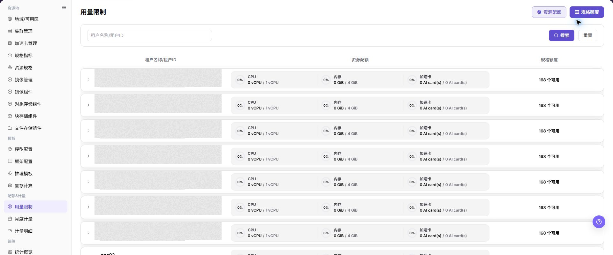

# 用量限制

## 功能概述

| 项目 | 内容 |
| --- | --- |
| 适用角色 | 运营管理员 |
| 导航路径 | AI基础设施 > On-Prem > 配额&计量 > 用量限制 |
| 页面路由 | `/powerone/quota-metric/credit` |
| 管理对象 | 租户、资源配额、规格额度、资源项、资源 ID 和额度配置 |

#### 新手理解

用量限制像租户的资源上限表。资源规格决定一次实例或作业使用多少资源，用量限制决定某个租户总体可以使用多少资源，以及某些规格或资源项是否有额度限制。

#### 术语表

| 术语 | 英文 | 说明 |
| --- | --- | --- |
| 资源配额 | Resource Limits | Resource Limits |
| 规格额度 | Spec Credits | Spec Credits |
| 不限制 | Unlimited | Unlimited |

#### 推荐操作顺序

先确认租户、资源配额、规格额度、资源项、资源 ID 和额度配置的前置依赖，再按主要操作顺序处理，最后执行结果校验并进入后续页面。

#### 小白先看

先确认当前任务是否涉及租户、资源配额、规格额度、资源项、资源 ID 和额度配置，再按照推荐顺序操作。页面字段或状态与预期不符时，先回到前置对象页核对依赖，不要跳过结果校验直接进入下游流程。

## 前提条件

1. 当前账号具备运营管理员权限。
2. 已选择正确地域，例如页面顶部地域选择器显示目标地域且状态正常。
3. 已确认目标租户、资源类型和规格范围。

## 页面说明

页面用于查看和处理租户、资源配额、规格额度、资源项、资源 ID 和额度配置。

上图保留左侧菜单和完整功能区；请先确认页面标题、筛选范围和主要操作入口。

进入 `配额&计量 > 用量限制` 后，页面顶部提供 `资源配额` 和 `规格额度` 两个切换入口。页面支持按 `租户名称/租户ID` 搜索，并在主表中展示 `租户名称/租户ID`、`资源配额` 和 `规格额度`。

展开租户行后，可以查看或维护对应的限制配置。`资源配额` 展开区用于维护资源类别和分配资源；`规格额度` 展开区用于维护资源 ID 和额度。展开区中出现的 `删除`、`不限制` 和 `确认` 会影响租户可用资源范围。

## 主要操作

### 查看用量限制

1. 进入 `配额&计量 > 用量限制`。
2. 按租户、项目、资源类型、状态或更新时间筛选。
3. 打开详情，核对限制值、已用量、剩余量和生效范围。
4. 无结果时重置筛选；额度和租户信息外发前必须脱敏。

### 核验限制变更效果

1. 获批修改后重新打开目标限制，核对新值和更新时间。
2. 在相同租户或项目上下文查看可用额度和告警状态。
3. 未生效时检查保存提示、同步延迟和上级限制。
4. 不通过创建真实资源或重复调整额度验证限制。

### 查看和维护用量限制

#### 操作前确认

1. 确认当前地域为目标地域。
2. 确认目标租户、资源类型和额度调整范围已经过内部审批或验证。

#### 操作步骤

1. 进入 `AI基础设施 > On-Prem > 配额&计量 > 用量限制`。
2. 根据核对目标点击 **"资源配额"** 或 **"规格额度"**。
3. 在搜索框输入 `租户名称/租户ID`，或保持为空查看列表。
4. 点击 **"搜索"** 查看匹配租户；如需恢复条件，点击 **"重置"**。
5. 展开目标租户行，查看当前资源配额或规格额度配置。
6. 在 `资源配额` 展开区查看 `类别`、`分配资源` 和 `操作`。
7. 在 `规格额度` 展开区查看 `资源ID`、`额度` 和 `操作`。

8. 如需要维护配置，先核对是否存在 `不限制`、`删除`、`新增行`、`取消`、`确认` 等动作。
9. 点击最终 **"确认"** 前，再次核对租户、资源类别、资源 ID、额度、是否不限制和删除影响。

## 参数速查表

| 字段名称 | 是否必填 | 字段类型 | 示例 | 说明 |
| --- | --- | --- | --- | --- |
| 租户名称/租户ID | 视操作而定 | 文本 / 系统生成 | `tenant-demo` | 用于定位目标租户。文档中不要写真实租户名或租户 ID。 所在区域：搜索框、主表。 |
| 资源配额 | 视操作而定 | 切换入口 / 汇总列 | `CPU 100 核` | 查看或维护租户在 CPU、内存、加速卡等资源类别上的限制。 所在区域：顶部切换、主表。 |
| 规格额度 | 视操作而定 | 切换入口 / 汇总列 | `gpu-a100-1card: 10` | 查看或维护租户在资源 ID 或规格维度上的额度限制。 所在区域：顶部切换、主表。 |
| 类别 | 视操作而定 | 系统字段 | `CPU` | 资源类别，例如 CPU、内存或加速卡类别。 所在区域：资源配额展开区。 |
| 分配资源 | 视操作而定 | 数量 / 容量 | `100 核` | 当前类别允许分配的资源额度。 所在区域：资源配额展开区。 |
| 资源ID | 视操作而定 | 系统字段 | `gpu-a100-1card` | 规格或资源项标识。文档中不要写真实资源 ID。 所在区域：规格额度展开区。 |
| 额度 | 视操作而定 | 数量 / 容量 | `10` | 当前资源 ID 对应的可用额度。 所在区域：规格额度展开区。 |
| 不限制 | 视操作而定 | 快捷动作 | `不限制` | 将对应资源项设置为不限制，可能扩大租户可用范围。 所在区域：展开区动作。 |
| 删除 | 视操作而定 | 高风险动作 | `删除` | 删除当前配置项。 所在区域：展开区动作。 |
| 新增行 | 视操作而定 | 配置动作 | `新增行` | 添加新的资源项或额度配置行。 所在区域：展开区动作。 |
| 取消 | 视操作而定 | 安全退出 | `取消` | 放弃当前展开区未提交修改。 所在区域：展开区动作。 |
| 确认 | 视操作而定 | 高风险最终动作 | `确认` | 提交当前配置调整。 所在区域：展开区动作。 |

## 踩坑提示

- `确认` 是高风险最终动作，点击后可能立即改变租户可用资源范围。
- `删除` 会移除配置项，可能导致对应资源或规格限制缺失。
- `不限制` 会扩大资源可用范围，不能在未审批情况下用于真实租户。
- 资源配额充足不代表底层集群一定有空闲资源，还需要结合资源规格、集群容量和调度状态判断。
- 规格额度或资源 ID 配置错误，可能导致用户侧规格不可用或超出预期范围。
- 不写真实租户 ID、租户名、资源 ID、内部资源 key、账号、密钥、Token 或内部测试参数。

## 结果校验

| 检查项 | 成功表现 | 异常时处理 |
| --- | --- | --- |
| 页面入口 | 可进入用量限制并看到筛选或统计区域 | 检查菜单权限、当前业务身份和所属租户范围 |
| 数据范围 | 列表或统计与所选时间、地域和对象一致 | 重置筛选并核对时间边界、时区和统计口径 |
| 数据更新 | 更新时间或最新记录符合预期周期 | 到来源页核对任务、计量或配额记录是否已生成 |
| 交叉核对 | 租户、资源配额、规格额度、资源项、资源 ID 和额度配置可与详情、账单或监控记录对应 | 按对象标识和时间范围到对应详情页逐项比对 |

## 常见问题

#### 用量限制没有记录

**问题现象：**

页面正常打开，但列表或统计为空。

**可能原因：**

- 筛选范围过窄。
- 来源记录尚未生成。
- 当前角色不可见。

**处理方式：**

1. 重置筛选
2. 核对来源任务或计量周期
3. 检查当前业务身份和租户范围。

#### 用量限制范围不正确

**问题现象：**

显示的数据不属于预期时间、地域或对象。

**可能原因：**

- 时间边界不一致。
- 地域筛选未生效。
- 对象归属已变化。

**处理方式：**

1. 重新选择时间和地域
2. 核对对象标识
3. 到来源详情确认当前归属。

#### 用量限制更新延迟

**问题现象：**

来源操作已完成，但页面尚未出现最新记录。

**可能原因：**

- 统计任务尚未结束。
- 缓存未刷新。
- 来源状态仍在处理中。

**处理方式：**

1. 核对来源状态
2. 等待一个统计周期后刷新
3. 持续延迟时检查处理任务。

#### 详情或下载入口不可用

**问题现象：**

详情、展开或下载按钮不可点击。

**可能原因：**

- 当前记录不支持该操作。
- 角色权限不足。
- 文件尚未生成。

**处理方式：**

1. 选择可用记录
2. 检查角色权限
3. 确认对应统计或导出任务已经完成。

#### 汇总与明细不一致

**问题现象：**

汇总值与逐条明细相加结果不同。

**可能原因：**

- 统计周期不同。
- 存在舍入。
- 部分记录仍在处理。

**处理方式：**

1. 统一周期和时区
2. 按对象逐条核对
3. 等待未完成记录结算后复查。

## 注意事项

- 用量限制直接影响租户可用资源范围，正式变更前必须确认租户、地域和资源范围。
- `确认`、`删除`、`不限制` 都需要重点提示风险。
- 不在文档、截图或工单中写真实租户 ID、租户名、资源 ID、内部资源 key、测试参数、账号、密钥或 Token。
- 导出或复制页面信息前，应对租户和资源标识做脱敏处理。

## 后续操作

1. 调整真实限制后，回到用户侧验证目标规格是否可选。
2. 结合 `计量明细` 查看后续资源使用是否符合预期。
3. 结合资源池、监控和作业页面排查资源不足或排队问题。
4. 将额度变更记录纳入内部变更或审计流程。
