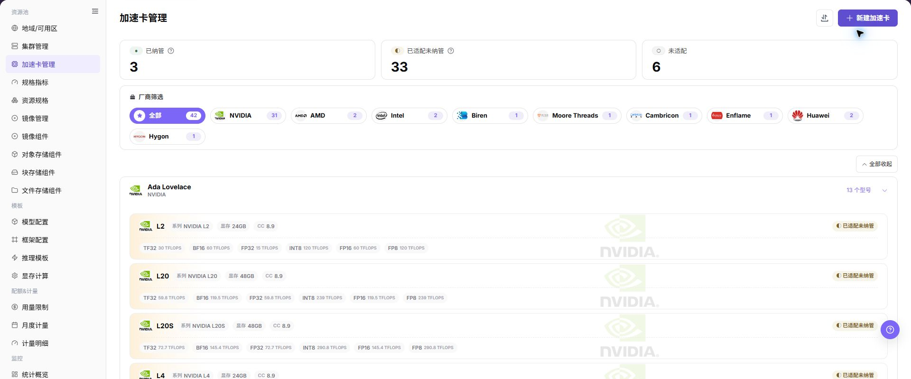
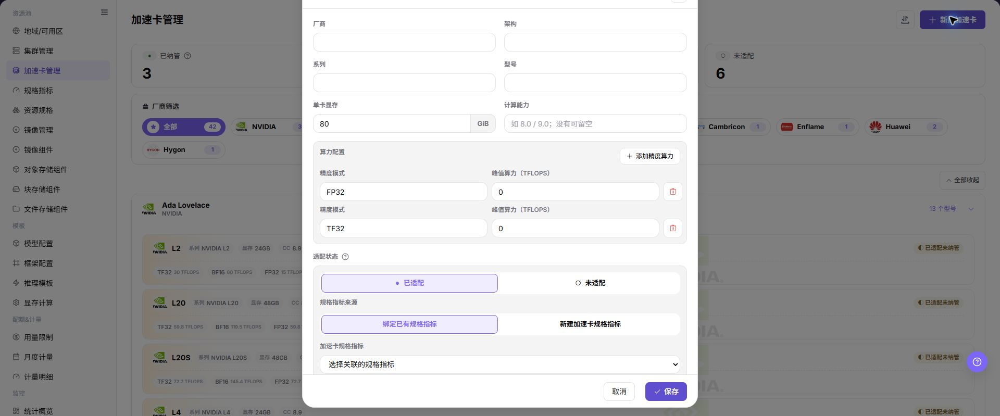

# 加速卡管理

## 功能概述

| 项目 | 内容 |
| --- | --- |
| 适用角色 | 运营管理员 |
| 导航路径 | AI基础设施 > On-Prem > 资源池 > 加速卡管理 |
| 页面路由 | `/powerone/resourcepool/accelerators` |
| 管理对象 | AI 加速卡厂商、架构、系列、型号、显存、算力信息、规格指标和纳管状态 |

#### 新手理解

- **加速卡型号** 像硬件身份证，告诉平台这是 A100、H100、Ascend 910B 还是其他型号。
- **规格指标** 像调度标签，决定 Kubernetes 中使用哪个资源 key 申请对应加速卡。
- **selector-key** 用于辅助识别设备类型或节点标签，错误配置会影响调度和监控匹配。
- **已纳管** 表示平台已经可以把该型号纳入资源规格和作业调度口径。
- **未适配** 的型号可以先作为硬件信息维护，但不能直接作为稳定调度能力对外开放。

#### 术语表

| 术语 | 英文 | 说明 |
| --- | --- | --- |
| 加速卡厂商 | Accelerator Vendor | Accelerator Vendor |
| 型号 | Model | Model |
| 架构 | Architecture | Architecture |

#### 推荐操作顺序

1. 确认集群中实际存在的加速卡厂商、型号、显存和 Kubernetes 资源 key。
2. 在 `资源池管理 > 规格指标` 中准备对应 AI 加速卡指标。
3. 进入 `资源池管理 > 加速卡管理` 新建或维护加速卡型号。
4. 把加速卡型号关联到正确的规格指标。
5. 在资源规格中引用该指标，并通过测试作业验证调度、监控和模板推荐结果。

#### 小白先看

先确认当前任务是否涉及AI 加速卡厂商、架构、系列、型号、显存、算力信息、规格指标和纳管状态，再按照推荐顺序操作。页面字段或状态与预期不符时，先回到前置对象页核对依赖，不要跳过结果校验直接进入下游流程。

## 前提条件

1. 当前账号具备运营管理员权限，并能进入 `AI Infra > On-Prem > 资源池管理 > 加速卡管理`。
2. 已确认目标加速卡厂商、型号、架构、系列、显存容量和算力信息。
3. 已确认 Kubernetes 资源 key、selector-key 或监控识别字段与集群实际上报信息一致。
4. 如需纳管到作业调度，已在 `资源池管理 > 规格指标` 中准备对应指标。

## 页面说明

页面用于查看和处理AI 加速卡厂商、架构、系列、型号、显存、算力信息、规格指标和纳管状态。

上图保留左侧菜单和完整功能区；请先确认页面标题、筛选范围和主要操作入口。

页面按厂商和架构组织加速卡型号，顶部展示纳管状态统计，左侧可按厂商筛选，卡片中展示型号、显存、算力和适配状态。

下图展示加速卡管理列表，可按厂商和纳管状态查看硬件型号。

#### 厂商与状态筛选

| 区域 | 说明 |
| --- | --- |
| 状态统计 | 展示已纳管、已适配未纳管、未适配数量。 |
| 厂商筛选 | 按 NVIDIA、AMD、Intel、Huawei 等厂商缩小范围。 |
| 型号卡片 | 展示系列、型号、显存、计算能力和不同精度下的峰值算力。 |
| 操作入口 | 进入新建、编辑、查看或其他页面真实操作入口。 |

## 主要操作

### 查看加速卡

1. 进入 `资源池 > 加速卡管理`。
2. 按厂商、型号、架构、状态或更新时间筛选。
3. 打开详情，核对显存、算力、驱动要求、支持框架和启用状态。
4. 无结果时重置筛选；型号不匹配时检查命名和驱动兼容性。

### 新增加速卡

#### 适用场景

新增硬件型号接入平台前，需要先维护加速卡基础信息；已有加速卡型号需要补充适配状态或规格指标时，也可通过该入口维护。

#### 操作步骤

1. 进入 `AI基础设施 > On-Prem > 资源池 > 加速卡管理`。
2. 点击 **"新建加速卡"** 或页面真实新增入口。
3. 按页面字段填写厂商、架构、系列、型号、单卡显存 GiB、计算能力、精度模式和峰值算力（TFLOPS）。
4. 根据页面要求选择或关联规格指标，核对 Kubernetes 资源 key、selector-key 或监控识别字段。
5. 点击最终 **"保存"**、**"提交"** 或 **"确定"** 前，再次核对硬件型号、资源指标和集群实际上报信息是否一致。

下图展示新建加速卡信息弹窗，重点填写硬件基础信息和规格指标关联。

### 导入或导出加速卡

#### 适用场景

当需要批量维护加速卡基础数据，或将当前加速卡清单用于受控环境间迁移和核对时，使用 **"导入/导出"** 菜单。

#### 操作步骤

1. 进入 `AI基础设施 > On-Prem > 资源池 > 加速卡管理`。
2. 点击 **"导入/导出"**，按业务目的选择 **"导入"** 或 **"导出"**。
3. 导入时按页面要求上传受控数据文件，并核对厂商、架构、型号、显存和规格指标字段。
4. 导出时先确认当前筛选范围，再按页面提示生成并下载加速卡清单。
5. 导入前确认不会覆盖错误型号，导出后将文件保存到受控目录。

#### 结果校验

- 导入成功后，加速卡列表显示新增或更新的型号及其适配状态。
- 导出成功后，下载文件的记录范围与页面筛选范围一致。
- 导入后的型号可以在资源规格或集群规格关联页面中被正确识别。

#### 注意事项

- 导入文件中的型号、资源 key、selector-key 和显存口径必须与实际硬件上报信息一致。
- 导入可能覆盖同标识对象的字段，执行前先备份并核对文件范围；导出文件也可能包含资源配置，不要外发。

#### 导入后加速卡没有出现在列表

**问题现象：**

导入提示完成，但目标加速卡在列表中不可见或状态没有更新。

**可能原因：**

- 当前筛选条件隐藏了目标记录。
- 文件中的唯一标识、必填列或枚举值不符合页面要求。
- 导入记录与已有型号冲突，或后台校验尚未完成。

**处理方式：**

1. 重置筛选并按型号或厂商重新搜索。
2. 对照页面要求核对文件列名、唯一标识和指标值。
3. 查看页面提示和更新时间，确认校验完成后再处理冲突记录。

#### 操作截图

上图展示操作入口打开后的字段和确认区域；提交前应核对必填项、所属范围和影响。

## 参数速查表

| 字段名称 | 是否必填 | 字段类型 | 示例 | 说明 |
| --- | --- | --- | --- | --- |
| 厂商 | 必填 | 下拉 / 枚举 | `NVIDIA` | 加速卡厂商。 与真实硬件厂商保持一致。 |
| 架构 | 必填 | 下拉 / 枚举 | `Ampere` | 加速卡架构。 按页面下拉或真实硬件架构选择。 |
| 系列 | 必填 | 下拉 / 枚举 | `A100` | 加速卡所属系列。 与型号、厂商保持一致。 |
| 型号 | 必填 | 下拉 / 枚举 | `A100-SXM4-80GB` | 加速卡型号。 与集群节点实际上报设备型号保持一致。 |
| 单卡显存 GiB | 必填 | 数值 / 容量 | `80` | 单卡显存容量。 按页面单位填写，避免 GiB/GB 混用。 |
| 计算能力 | 可选 | 文本 | `8.0` | CUDA 或硬件能力版本。 没有明确值时不要臆造。 |
| 精度模式 | 条件必填 | 数值 / 容量 | `FP16` | 算力配置对应的精度模式。 与页面支持项和硬件能力一致。 |
| 峰值算力（TFLOPS） | 条件必填 | 数值 / 容量 | `312` | 对应精度模式下的峰值算力。 只填写已确认的公开或硬件上报数据。 |
| 加速卡规格指标 | 条件必填 | 文本 | `gpu-a100-80g` | 绑定已有规格指标或新建加速卡规格指标。 核对 k8s-key、selector-key 与节点实际上报标签。 |
| 适配状态 | 必填 | 状态 | `已适配` | 是否已适配平台资源识别和调度。 未适配时不要对用户侧开放。 |

## 踩坑提示

- 新增加速卡会影响资源规格、调度识别、监控展示和推理模板推荐。
- 型号、显存容量、资源 key 或 selector-key 配置错误，可能导致规格不可选、调度失败或监控无法匹配设备。
- 不要把显示名称相近但 Kubernetes 资源 key 不同的卡混成同一个型号。
- 显存容量会影响推理模板和显存测算结果，提交前应与硬件信息核对。

### 配置规则与影响

- **资源 key 一致性**：加速卡指标中的 Kubernetes 资源 key 必须与集群实际上报的资源 key 一致。
- **selector-key 一致性**：selector-key 应与节点标签、规格指标或监控识别字段保持一致。
- **命名稳定性**：厂商、系列和型号应与硬件采购、驱动识别和监控采集口径一致。
- **纳管前验证**：纳管前先用测试作业验证资源申请、调度和监控展示。
- **模板影响**：显存容量、算力信息和适配状态会影响推理模板推荐和资源规格选择。

## 结果校验

| 检查项 | 成功表现 | 异常时处理 |
| --- | --- | --- |
| 页面入口 | 可进入加速卡管理并看到目标操作入口 | 检查运营管理员权限和对应菜单是否已开放 |
| 对象记录 | AI 加速卡厂商、架构、系列、型号、显存、算力信息、规格指标和纳管状态在列表或详情中可见 | 重置筛选并核对名称、所属范围和创建结果 |
| 状态结果 | 新增或变更后的状态符合页面提示 | 查看操作提示、依赖对象状态和最近更新时间 |
| 下游使用 | 后续页面能够选择或关联目标对象 | 回到前置配置核对启用状态、归属关系和可见范围 |

## 常见问题

#### 加速卡管理中找不到目标对象

**问题现象：**

页面可进入，但没有看到预期的AI 加速卡厂商、架构、系列、型号、显存、算力信息、规格指标和纳管状态。

**可能原因：**

- 筛选条件仍生效。
- 对象属于其他范围。
- 前置配置未完成。

**处理方式：**

1. 重置筛选
2. 核对所属地域或租户
3. 返回前置页面确认对象状态。

#### 加速卡管理的操作入口不可用

**问题现象：**

新增、注册或维护入口不可见或不可点击。

**可能原因：**

- 当前角色权限不足。
- 页面处于只读状态。
- 依赖对象不满足条件。

**处理方式：**

1. 检查运营管理员权限
2. 核对页面提示
3. 先完成依赖对象配置。

#### 加速卡管理的必填项没有可选值

**问题现象：**

表单能打开，但下拉框为空。

**可能原因：**

- 候选对象未启用。
- 所属范围不一致。
- 当前账号不可见。

**处理方式：**

1. 到候选对象页面核对状态
2. 确认归属关系
3. 检查可见范围后刷新表单。

#### 加速卡管理操作后状态异常

**问题现象：**

提交后记录存在，但状态不是预期值。

**可能原因：**

- 连通性或校验失败。
- 关联对象异常。
- 后台处理尚未完成。

**处理方式：**

1. 查看页面提示和更新时间
2. 检查关联对象
3. 按状态阶段排查处理任务。

#### 下游页面无法使用加速卡管理

**问题现象：**

当前页状态正常，但下游页面无法选择或关联AI 加速卡厂商、架构、系列、型号、显存、算力信息、规格指标和纳管状态。

**可能原因：**

- 可见范围不匹配。
- 对象未启用。
- 下游缓存未刷新。

**处理方式：**

1. 核对启用状态和归属
2. 检查角色可见范围
3. 刷新下游页面并重新选择。

## 注意事项

- 加速卡型号、厂商、架构、显存容量和算力信息应与硬件清单、驱动识别和监控采集保持一致。
- 型号纳管前要确认设备插件能上报资源，规格指标能识别资源 key，监控能采集利用率和显存。
- 不同驱动或固件版本可能影响资源识别和稳定性，生产接入前先提交测试作业验证。
- 不写真实内部资源 key 映射、节点标签、集群 ID、资源池 ID、内网地址、账号、密钥、Token、AK/SK 或内部测试参数。

## 后续操作

1. 进入 `资源池管理 > 规格指标` 维护或确认对应指标。
2. 进入 `资源池管理 > 资源规格` 创建包含该加速卡的规格。
3. 在推理模板或测试作业中验证该型号能被正确选择。
4. 回到加速卡管理列表，确认状态统计、厂商筛选和型号卡片信息符合预期。
