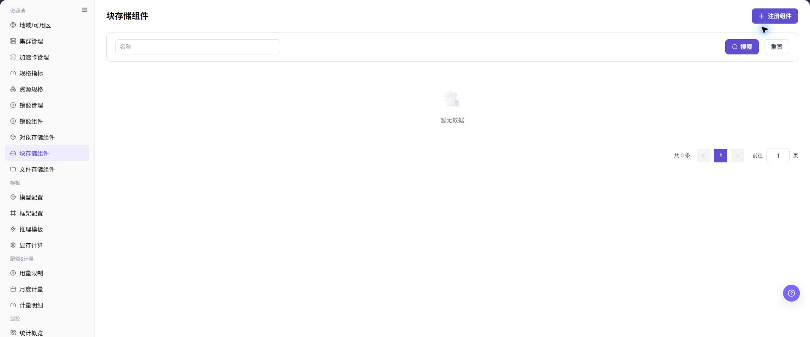
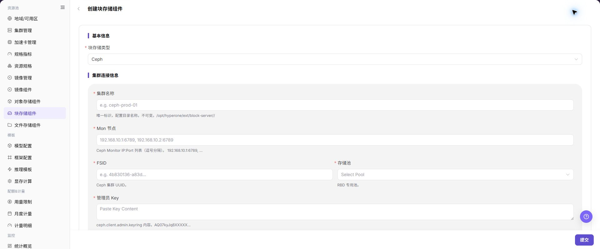

# 块存储组件

## 功能概述

| 项目 | 内容 |
| --- | --- |
| 适用角色 | 运营管理员 |
| 导航路径 | AI基础设施 > On-Prem > 资源池 > 块存储组件 |
| 页面路由 | `/powerone/resourcepool/block` |
| 管理对象 | 块存储类型、集群名称、Mon 节点、FSID、存储池、管理员 Key、超配比例、租户配额限制、阈值和描述 |

#### 新手理解

块存储组件像给实例挂载的独立硬盘供应入口，负责把 Ceph RBD 或兼容块设备能力接入平台。用户创建需要持久化卷的实例时，平台会按这里的存储池、容量阈值和 CSI 配置去申请并挂载块卷。

#### 术语表

| 术语 | 英文 | 说明 |
| --- | --- | --- |
| Ceph | Ceph | Ceph |
| Mon 地址 | Mon Addresses | Mon Addresses |
| FSID | FSID | FSID |

#### 推荐操作顺序

先确认块存储类型、集群名称、Mon 节点、FSID、存储池、管理员 Key、超配比例、租户配额限制、阈值和描述的前置依赖，再按主要操作顺序处理，最后执行结果校验并进入后续页面。

#### 小白先看

先确认当前任务是否涉及块存储类型、集群名称、Mon 节点、FSID、存储池、管理员 Key、超配比例、租户配额限制、阈值和描述，再按照推荐顺序操作。页面字段或状态与预期不符时，先回到前置对象页核对依赖，不要跳过结果校验直接进入下游流程。

## 前提条件

1. Ceph 或等效块存储服务已部署完成。
2. 已准备 Mon 节点、FSID、存储池、认证用户、Keyring 或 Secret 等连接材料。
3. 目标 Kubernetes 集群已具备对应 CSI 或卷插件能力。
4. 已确认存储池、容量阈值、性能、租户隔离和 CSI 策略。

## 页面说明

页面用于查看和处理块存储类型、集群名称、Mon 节点、FSID、存储池、管理员 Key、超配比例、租户配额限制、阈值和描述。

上图保留左侧菜单和完整功能区；请先确认页面标题、筛选范围和主要操作入口。

页面展示已接入的块存储组件、状态、容量、连接信息摘要和关联地域。

下图展示块存储组件列表，可查看组件状态、容量和连接信息摘要。

## 主要操作

### 查看块存储组件

1. 进入对应资源池组件页面，按名称、集群、状态或更新时间筛选。
2. 打开详情，核对 Endpoint 的脱敏信息、能力、关联集群、容量和健康状态。
3. 无结果时重置筛选并检查集群状态；不得复制凭据、内部地址或完整配置。
4. 健康状态异常时先查看连接和事件，不重复注册组件。

### 创建块存储组件

#### 适用场景

当需要接入新的 Ceph RBD 或兼容块存储服务，并为工作负载提供 PVC 创建、卷挂载、容量展示和资源调度能力时，创建块存储组件。当前 UI 在列表页使用 `注册组件`，并进入 `创建块存储组件 - 块存储组件` 页面。

#### 操作步骤

1. 进入 `AI基础设施 > On-Prem > 资源池 > 块存储组件`。
2. 点击 **"注册组件"**，进入 **"创建块存储组件 - 块存储组件"** 页面。
3. 按页面字段填写 `块存储类型`、`集群名称`、`Mon 节点`、`FSID`、`存储池`、`管理员 Key`、`超配比例`、`租户配额限制`、`物理阈值`、`逻辑阈值`、`每卷快照限制` 和 `描述`。
4. 如页面提供 `测试连接`，先执行只读连通性检查并确认返回结果。
6. 点击最终 **"保存"**、**"提交"** 或 **"确定"** 前，再次核对Mon 节点、FSID、存储池、管理员 Key、阈值和容量影响。

下图展示创建块存储组件表单，用于填写组件基础信息和连接参数。

#### 操作截图

上图展示操作入口打开后的字段和确认区域；提交前应核对必填项、所属范围和影响。

## 参数速查表

| 字段名称 | 是否必填 | 字段类型 | 示例 | 说明 |
| --- | --- | --- | --- | --- |
| 块存储类型 | 必填 | 下拉 / 枚举 | `Ceph RBD` | 块存储后端类型。 按页面实际支持类型选择。 |
| 集群名称 | 必填 | 文本 | `cluster-a` | 块存储所属或连接的集群名称。 与实际存储集群保持一致。 |
| Mon 节点 | 必填 | 地址 / 路径 | `<mon-host>:6789` | Ceph Monitor 节点地址列表。 文档中只使用占位符，不写真实地址。 |
| FSID | 必填 | 标识 / 文本 | `<fsid>` | Ceph 集群唯一标识。 与目标存储集群一致。 |
| 存储池 | 必填 | 文本 | `rbd-pool` | 承载块卷的存储池。 确认容量、配额和权限。 |
| 管理员 Key | 必填 | 凭据 / 敏感文本 | `<PERSONAL_KEY>` | 管理员 Key 内容或凭据材料。 只在系统表单中填写，不写入文档、截图或工单。 |
| 超配比例 | 必填 | 数值 / 容量 | `1.5` | 逻辑容量和物理容量的超分比例。 按容量规划谨慎填写。 |
| 租户配额限制 | 必填 | 数值 / 容量 | `10 TiB` | 租户可用容量限制。 与租户容量策略一致。 |
| 物理阈值 | 必填 | 数值 / 容量 | `80%` | 物理容量告警或限制阈值。 不要超过实际容量安全边界。 |
| 逻辑阈值 | 必填 | 数值 / 容量 | `90%` | 逻辑容量告警或限制阈值。 与超配比例联动核对。 |
| 每卷快照限制 | 必填 | 数值 / 容量 | `16` | 单个卷可保留的快照数量。 结合容量和备份策略配置。 |
| 描述 | 否 | 多行文本 | `示例说明` | 组件用途、边界或维护说明。 只记录非敏感说明。 |

## 踩坑提示

- 创建块存储组件可能影响工作负载 PVC 创建、卷挂载、容量展示和资源调度。
- 错误的 Mon 节点、FSID、存储池、CSI 配置或管理员 Key 可能导致卷创建失败、挂载失败或数据不可用。
- 存储池和 CSI 配置要与目标集群 CSI 能力一致，否则卷能创建但可能挂载失败。
- 块卷扩容前先确认底层存储、文件系统和工作负载都支持在线扩容。
- 卸载或删除块卷前确认实例已经停止写入，避免文件系统损坏或数据丢失。
- `保存 / Save`、`提交 / Submit`、`确定 / OK` 属于高风险最终动作。
- 不写真实 Mon 节点、FSID、存储池名称、管理员 Key、Secret、kubeconfig、集群 ID、资源池 ID、账号、密钥、Token 或内部测试参数。

## 结果校验

| 检查项 | 成功表现 | 异常时处理 |
| --- | --- | --- |
| 页面入口 | 可进入块存储组件并看到目标操作入口 | 检查运营管理员权限和对应菜单是否已开放 |
| 对象记录 | 块存储类型、集群名称、Mon 节点、FSID、存储池、管理员 Key、超配比例、租户配额限制、阈值和描述在列表或详情中可见 | 重置筛选并核对名称、所属范围和创建结果 |
| 状态结果 | 新增或变更后的状态符合页面提示 | 查看操作提示、依赖对象状态和最近更新时间 |
| 下游使用 | 后续页面能够选择或关联目标对象 | 回到前置配置核对启用状态、归属关系和可见范围 |

## 常见问题

#### 块存储组件中找不到目标对象

**问题现象：**

页面可进入，但没有看到预期的块存储类型、集群名称、Mon 节点、FSID、存储池、管理员 Key、超配比例、租户配额限制、阈值和描述。

**可能原因：**

- 筛选条件仍生效。
- 对象属于其他范围。
- 前置配置未完成。

**处理方式：**

1. 重置筛选
2. 核对所属地域或租户
3. 返回前置页面确认对象状态。

#### 块存储组件的操作入口不可用

**问题现象：**

新增、注册或维护入口不可见或不可点击。

**可能原因：**

- 当前角色权限不足。
- 页面处于只读状态。
- 依赖对象不满足条件。

**处理方式：**

1. 检查运营管理员权限
2. 核对页面提示
3. 先完成依赖对象配置。

#### 块存储组件的必填项没有可选值

**问题现象：**

表单能打开，但下拉框为空。

**可能原因：**

- 候选对象未启用。
- 所属范围不一致。
- 当前账号不可见。

**处理方式：**

1. 到候选对象页面核对状态
2. 确认归属关系
3. 检查可见范围后刷新表单。

#### 块存储组件操作后状态异常

**问题现象：**

提交后记录存在，但状态不是预期值。

**可能原因：**

- 连通性或校验失败。
- 关联对象异常。
- 后台处理尚未完成。

**处理方式：**

1. 查看页面提示和更新时间
2. 检查关联对象
3. 按状态阶段排查处理任务。

#### 下游页面无法使用块存储组件

**问题现象：**

当前页状态正常，但下游页面无法选择或关联块存储类型、集群名称、Mon 节点、FSID、存储池、管理员 Key、超配比例、租户配额限制、阈值和描述。

**可能原因：**

- 可见范围不匹配。
- 对象未启用。
- 下游缓存未刷新。

**处理方式：**

1. 核对启用状态和归属
2. 检查角色可见范围
3. 刷新下游页面并重新选择。

## 注意事项

- 创建块存储组件可能影响工作负载 PVC 创建、卷挂载、容量展示和资源调度。
- keyring、Ceph 用户密钥、Secret 和 kubeconfig 都属于敏感材料。
- 删除块存储组件前，先确认没有运行中实例、PVC、PV 或业务数据依赖。

- 不写真实 Mon 节点、FSID、存储池名称、管理员 Key、Secret、kubeconfig、集群 ID、资源池 ID、账号、密钥、Token 或内部测试参数。

## 后续操作

1. 在地域或目标集群中绑定块存储组件。
2. 使用测试工作负载验证创建、挂载、卸载和容量释放。
3. 将 Ceph、存储池、CSI 状态和回收策略纳入运维巡检。
4. 定期核对容量统计、Pool 配额和异常事件。
