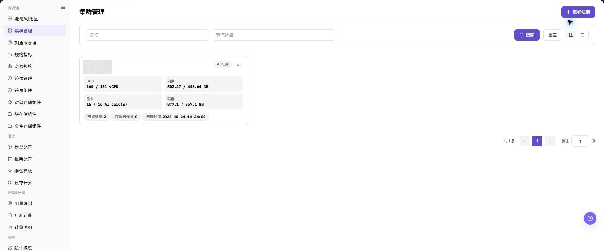
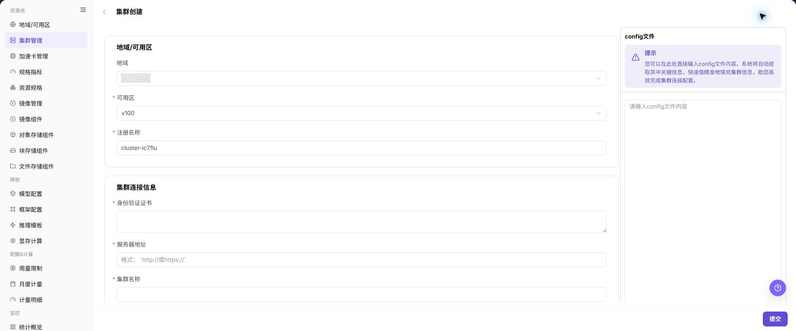

# 集群管理

## 功能概述

| 项目 | 内容 |
| --- | --- |
| 适用角色 | 运营管理员 |
| 导航路径 | AI基础设施 > On-Prem > 资源池 > 集群管理 |
| 页面路由 | `/powerone/resourcepool/cluster` |
| 管理对象 | Kubernetes 集群、地域、可用区、节点、规格、存储、作业和资源监控 |

#### 新手理解

On-Prem 资源池像一套本地算力管理体系：

- **地域/可用区** 表示算力资源所在的站点、机房或资源分组。
- **集群** 是真正提供算力的 Kubernetes 环境，平台通过集群接入后才能调度作业。
- **节点** 是集群中的具体服务器，提供 CPU、GPU、内存、磁盘等资源。
- **规格** 定义用户作业可申请的资源套餐。
- **存储** 为作业提供模型、数据集、代码仓库或输出目录。

集群创建的核心目的，是把真实 Kubernetes 集群纳入平台的调度、监控和资源管理范围。

#### 术语表

| 术语 | 英文 | 说明 |
| --- | --- | --- |
| Kubernetes | Kubernetes | Kubernetes |
| kubeconfig | kubeconfig | kubeconfig |
| 服务器地址 | Server Address | Server Address |

#### 推荐操作顺序

先确认Kubernetes 集群、地域、可用区、节点、规格、存储、作业和资源监控的前置依赖，再按主要操作顺序处理，最后执行结果校验并进入后续页面。

#### 小白先看

先确认当前任务是否涉及Kubernetes 集群、地域、可用区、节点、规格、存储、作业和资源监控，再按照推荐顺序操作。页面字段或状态与预期不符时，先回到前置对象页核对依赖，不要跳过结果校验直接进入下游流程。

## 前提条件

创建集群前，请确认以下条件已满足：

1. 当前账号具备运营管理员权限，并能进入 `AI Infra > On-Prem > 资源池管理 > 集群管理`。
2. 目标地域和可用区已在 `资源池管理 > 地域/可用区` 中创建。
3. Kubernetes 服务器地址 可从平台管理侧访问。
4. 已准备 kubeconfig、身份验证证书、服务器地址、集群名称和认证材料。
5. 已确认 cluster CIDR、service CIDR、NodePort 与现有网络不冲突。
6. 如需监控、JupyterLab 或 RDMA 能力，相关服务、端口、硬件和网络规划已提前确认。

## 页面说明

页面用于查看和处理Kubernetes 集群、地域、可用区、节点、规格、存储、作业和资源监控。

上图保留左侧菜单和完整功能区；请先确认页面标题、筛选范围和主要操作入口。

集群管理页面主要包含集群列表、集群详情和集群节点信息。

下图展示集群列表入口、集群卡片、资源用量和集群操作入口。

#### 集群列表

| 区域 | 说明 |
| --- | --- |
| 状态筛选 | 按 `全部`、`可用`、`不可用`、`接入中`、`失败`、`待审批` 等状态筛选集群。 |
| 地域/可用区筛选 | 按集群所属地域和可用区筛选。 |
| 搜索区 | 支持按集群名称、节点数量等条件搜索。 |
| 视图切换 | 支持网格视图和列表视图。 |
| 集群卡片 | 展示集群名称、状态、地域/可用区、规格、节点数量和资源用量。 |
| 操作入口 | 进入集群详情、集群节点，或执行禁用、启用等集群级操作。 |

#### 集群详情

集群详情用于查看单个集群的设备信息、基本信息、已关联规格和存储配置。排查集群状态、资源容量、规格可用性或存储挂载问题时，优先进入该区域确认。

#### 集群节点

集群节点页用于查看节点状态、资源用量、作业信息和节点详情。节点详情通常包含硬件、网络、运行时、标签、污点和监控图表。

## 主要操作

### 创建集群

#### 适用场景

当需要把新的 Kubernetes 集群纳入平台统一调度、监控和资源管理时，执行集群创建。常见场景包括首次接入算力资源、新增机房或资源组、扩容 GPU/CPU 节点，以及为后续作业提供可调度节点。

#### 操作前检查

1. 目标地域和可用区已创建并可用于集群接入。
2. kubeconfig 或等价认证材料来自可信集群管理员。
3. 服务器地址、证书、认证方式和 context名称已完成核对。
4. cluster CIDR、service CIDR、NodePort 已通过网络规划确认。
5. 监控服务、JupyterLab 地址、RDMA 等高级项已确认是否需要启用。

#### 操作步骤

1. 进入 `AI基础设施 > On-Prem > 资源池 > 集群管理`。
2. 点击页面右上角的 **"集群注册"**，进入 **"集群创建"** 页面。
3. 在 `config 文件` 区域粘贴 kubeconfig，或按页面要求核对自动解析出的连接信息。

下图展示 `集群创建` 页面，可用于定位 kubeconfig、地域/可用区、连接信息、认证类型、context 和高级配置区域。

4. 选择 `地域` 和 `可用区`，填写 `注册名称`。
5. 核对或填写 `身份验证证书`、`服务器地址` 和 `集群名称`。
6. 选择 `认证类型`，按页面字段填写对应认证材料，并核对 `context名称`。
7. 配置 `cluster CIDR`、`service CIDR`、`NodePort`、监控服务、JupyterLab 地址、`支持 RDMA 网络` 和描述等高级项。
8. 点击最终 **"提交"** 前，再次核对敏感信息、地域/可用区、网络配置和调度影响。

### 关联集群规格

#### 适用场景

当目标集群需要承载特定 CPU、内存、GPU 或其他加速卡规格的作业时，为集群关联规格。关联后，用户创建作业时才可能在对应地域、可用区或集群范围内选择这些规格。

#### 操作步骤

1. 进入 `AI基础设施 > On-Prem > 资源池 > 集群管理`。
2. 在集群列表中找到目标集群，确认集群状态、地域、可用区和资源容量。
3. 点击目标集群操作区的 **"..."**，选择 **"集群详情"**。
4. 在弹出的 `集群详情` 页面左侧菜单中选择规格相关入口。
5. 点击 **"关联规格"** 或页面真实关联入口。
6. 选择需要关联到该集群的规格，核对规格名称、规格类型、CPU、内存、GPU 或其他加速卡配置。
7. 点击最终 **"保存"**、**"提交"** 或 **"确定"** 前，再次核对规格与集群资源能力是否匹配。

### 添加集群存储

#### 适用场景

当作业需要共享目录、模型仓库、本地 Git 仓库、NFS 目录或宿主机路径时，为集群添加存储。存储配置会影响作业启动、文件读写、模型加载和租户访问范围。

#### 操作步骤

1. 进入 `AI基础设施 > On-Prem > 资源池 > 集群管理`。
2. 在集群列表中找到目标集群，确认集群状态、地域、可用区和资源容量。
3. 点击目标集群操作区的 **"..."**，选择 **"集群详情"**。
4. 在弹出的 `集群详情` 页面左侧菜单中选择存储相关入口。
5. 点击 **"添加存储"** 或页面真实新增入口。
6. 按页面字段配置存储名称、存储类型、共享路径、容器挂载路径、访问模式、租户范围和描述。
7. 点击最终 **"保存"**、**"提交"** 或 **"确定"** 前，再次核对存储路径、挂载策略、权限范围和对运行中作业的影响。

### 查看集群详情

#### 适用场景

当需要核对单个集群的基本信息、设备信息、关联规格或存储配置时，查看集群详情。该入口也是后续维护规格和存储的对象级入口。

#### 操作步骤

1. 进入 `AI基础设施 > On-Prem > 资源池 > 集群管理`。
2. 在集群列表中定位目标集群，核对状态、地域、可用区和资源用量。
3. 打开目标集群操作区的 **"..."** 菜单，点击 **"集群详情"**。
4. 在详情页查看基本信息、设备信息、关联规格和存储配置。

#### 结果校验

- 详情页展示的集群名称、地域、可用区和状态与列表记录一致。
- 设备、规格和存储信息能够与后续排障或配置任务对应。

#### 注意事项

- 详情页中的地址、认证材料和集群标识可能属于敏感信息，文档、截图和工单中只保留脱敏内容。
- 详情页的查看结果不能替代节点和作业监控，资源异常时继续核对监控页面。

#### 集群详情入口不可见

**问题现象：**

目标集群列表可见，但操作菜单中没有 **"集群详情"**。

**可能原因：**

- 当前账号只有列表查看权限。
- 集群记录处于异常处理中，页面暂不开放详情。
- 当前页面视图没有展开操作菜单。

**处理方式：**

1. 检查运营管理员权限和集群状态。
2. 切换到支持集群操作的列表或卡片视图。
3. 仍不可见时，根据页面提示联系权限或集群维护人员。

### 查看集群节点

#### 适用场景

当需要核对集群下的节点状态、资源用量、作业信息或节点详情时，查看集群节点。

#### 操作步骤

1. 进入 `AI基础设施 > On-Prem > 资源池 > 集群管理`。
2. 在集群列表中定位目标集群，打开操作区的 **"..."** 菜单。
3. 点击 **"集群节点"**，查看节点状态、资源用量和作业信息。
4. 选择需要排查的节点，查看硬件、网络、运行时、标签、污点和监控信息。

#### 结果校验

- 集群节点页面只展示目标集群下的节点。
- 节点状态、资源用量和监控时间范围可以与集群详情相互印证。

#### 注意事项

- 节点资源异常时先核对采集时间和监控范围，不要仅凭单个瞬时指标判断集群不可用。
- 节点详情可能包含内部地址、标签或运行环境信息，外发前必须脱敏。

#### 集群节点页面没有数据

**问题现象：**

打开 **"集群节点"** 后，节点列表为空或资源指标没有更新。

**可能原因：**

- 集群尚未完成纳管或节点尚未上报。
- 监控采集服务、网络或时间范围异常。
- 当前集群筛选范围与目标集群不一致。

**处理方式：**

1. 返回集群详情确认纳管状态和节点数量。
2. 检查监控采集状态、更新时间和网络配置。
3. 重新选择目标集群并刷新节点页面。

### 禁用或启用集群

#### 适用场景

当集群需要暂时停止新作业调度，或维护完成后恢复可调度状态时，按当前状态禁用或启用集群。

#### 操作步骤

1. 进入 `AI基础设施 > On-Prem > 资源池 > 集群管理`，定位目标集群。
2. 打开目标集群操作区的 **"..."** 菜单，按页面当前状态选择 **"禁用集群"** 或对应的启用入口。
3. 阅读确认提示，核对运行中作业、节点、规格关联和存储配置的影响。
4. 确认维护窗口和影响范围后，点击确认按钮完成状态变更。
5. 刷新集群列表和节点页面，核对集群状态及调度可用范围。

#### 结果校验

- 集群状态变为页面提示的禁用或可用状态。
- 新作业创建或资源选择页面按集群状态限制可选范围。
- 已有关联规格和存储记录仍显示其关联关系，未被误删除。

#### 注意事项

- 禁用集群可能阻止新作业调度，但不代表运行中的作业会自动迁移或停止；操作前必须确认实际影响。
- 启用前确认节点健康、监控数据、规格关联和存储挂载均已恢复。

#### 集群禁用后仍出现在可选列表

**问题现象：**

集群状态已显示禁用，但下游资源选择页面仍能看到该集群。

**可能原因：**

- 下游页面使用了旧缓存或筛选条件。
- 页面展示的是已有资源关系，而不是新作业可调度范围。
- 状态变更仍在后台处理中。

**处理方式：**

1. 刷新下游页面并重置筛选。
2. 区分已有资源关联和新作业可选范围。
3. 查看集群更新时间和页面提示，确认状态处理已完成。

### 编辑集群存储

#### 适用场景

当集群已有存储配置，但共享路径、挂载路径、访问模式、租户范围或描述需要调整时，编辑集群存储。

#### 操作步骤

1. 进入 `AI基础设施 > On-Prem > 资源池 > 集群管理`，打开目标集群的 **"集群详情"**。
2. 进入存储配置区域，找到目标存储行，点击 **"编辑"**。
3. 核对存储名称和类型，按页面提供的字段修改共享路径、容器挂载路径、访问模式、租户范围或描述。
4. 点击 **"保存"** 或页面提供的最终确认按钮前，确认不会影响运行中作业的数据访问。
5. 返回存储列表，核对更新后的配置和状态。

#### 结果校验

- 存储列表显示更新后的路径、访问模式、租户范围或描述。
- 集群详情仍显示该存储与目标集群的关联关系。
- 新创建的作业能够按更新后的挂载策略使用存储。

#### 注意事项

- 修改共享路径或容器挂载路径可能导致作业无法启动或读写原有数据，先确认路径存在和权限有效。
- 缩小租户范围或改为只读可能影响已有作业，变更前应确认业务影响和回滚方式。

#### 编辑存储后作业无法访问数据

**问题现象：**

存储配置保存成功，但新作业或已有作业无法读取原路径或写入挂载目录。

**可能原因：**

- 共享路径或容器挂载路径填写错误。
- 访问模式、租户范围或底层权限发生变化。
- 节点无法访问存储服务。

**处理方式：**

1. 在集群详情核对路径、访问模式和租户范围。
2. 检查目标节点的网络连通性和底层存储权限。
3. 根据变更审批恢复已验证的配置，并重新执行挂载验证。

### 移除集群存储

#### 适用场景

当集群不再需要某个存储配置，或需要先移除错误挂载后重新配置时，移除集群存储。

#### 操作步骤

1. 进入 `AI基础设施 > On-Prem > 资源池 > 集群管理`，打开目标集群的 **"集群详情"**。
2. 在存储配置区域找到目标存储行，点击 **"删除"**。
3. 阅读确认提示，核对存储名称、挂载路径、访问范围以及关联作业。
4. 确认数据保留和作业影响后，点击确认按钮完成移除。
5. 返回存储列表，确认目标配置已不再显示，并检查下游作业的存储选择范围。

#### 结果校验

- 目标存储配置从集群详情的存储列表中移除。
- 新作业创建页面不再提供该集群存储配置。
- 其他存储配置、集群状态和已有数据未被误删。

#### 注意事项

- 移除配置不等于删除底层存储数据，但会取消平台侧关联和挂载入口；执行前必须确认数据保留策略。
- 有运行中作业或后续任务依赖该挂载时，不要直接移除，应先安排迁移或停机窗口。

#### 为什么删除后仍能看到存储

**问题现象：**

存储移除后，列表或作业页面仍显示旧存储配置。

**可能原因：**

- 页面缓存或详情数据尚未刷新。
- 其他集群仍关联同名存储。
- 移除请求尚在处理中。

**处理方式：**

1. 刷新集群详情并核对目标集群和存储 ID。
2. 检查其他集群的关联关系，避免把同名记录误认为目标记录。
3. 查看页面提示和更新时间，确认后台处理状态。

#### 操作截图

上图展示操作入口打开后的字段和确认区域；提交前应核对必填项、所属范围和影响。

## 参数速查表

| 字段名称 | 是否必填 | 字段类型 | 示例 | 说明 |
| --- | --- | --- | --- | --- |
| 注册名称 | 必填 | 文本 | `cluster-wuhan-gpu` | 平台内识别该集群的名称。 建议体现环境、地域、用途和资源类型；创建后通常不建议变更。 |
| 地域 | 必填 | 文本 | `wuhan` | 集群所属地域。 必须选择已创建且可用的地域，影响资源池归属和调度范围。 |
| 可用区 | 必填 | 文本 | `wuhan-1` | 集群所属可用区。 必须与地域匹配，选错会影响节点归属和作业调度。 |
| config 文件 | 条件必填 | 文件 / 配置文本 | `受控配置文件` | kubeconfig 内容或连接配置来源。 可用于自动填充部分字段，但必须人工核对解析结果。 |
| 身份验证证书 | 必填 | 凭据 / 敏感文本 | `受控证书` | 校验 服务器地址 身份的证书。 属于敏感材料，不要写入文档或截图。 |
| 服务器地址 | 必填 | 地址 / 路径 | `<BASE_URL>:<PORT>` | Kubernetes API 访问入口。 需从平台侧可达；不要在文档中记录真实地址。 |
| 集群名称 | 必填 | 文本 | `cluster-a` | Kubernetes 集群名称或页面识别名称。 与 kubeconfig 或集群实际信息保持一致。 |
| 认证类型 | 必填 | 下拉 / 枚举 | `Bearer Token` | 访问集群的认证方式。 按 kubeconfig 或管理员提供的材料选择，避免认证方式不一致。 |
| context名称 | 条件必填 | 文件 / 配置文本 | `cluster-a-context` | kubeconfig 中的连接上下文。 通常自动生成或自动带入，提交前仍需核对。 |
| cluster CIDR | 条件必填 | 标识 / 文本 | `<POD_CIDR>` | Pod 网段配置。 必须与网络规划一致，避免与平台、节点或其他集群冲突。 |
| service CIDR | 条件必填 | 标识 / 文本 | `<SERVICE_CIDR>` | Service 网段配置。 必须与网络规划一致，避免影响服务访问。 |
| NodePort | 条件必填 | 端口 / 数值 | `30000-32767` | Kubernetes NodePort 端口范围。 按页面支持范围和网络策略填写。 |
| 监控服务端口 | 可选 | 端口 / 数值 | `9100` | 集群资源监控服务配置。 需确认监控采集能力、端口和网络可达性。 |
| jupyterlab地址 | 可选 | 地址 / 路径 | `<BASE_URL>` | 在线开发相关服务地址。 仅在需要在线 IDE 能力时配置。 |
| 支持rdma网络 | 可选 | 开关 | `关闭` | 是否启用 RDMA 相关能力。 仅在硬件、驱动、网络和调度策略明确支持时开启。 |
| 规格名称 | 必填 | 文本 | `gpu-a100-1card` | 需要关联到集群的规格名称。 应与集群实际 CPU、内存、GPU 或其他加速卡能力匹配。 |
| 规格类型 | 条件必填 | 下拉 / 枚举 | `推理` | 规格所属资源类型或作业类型。 选择前确认该规格适用于目标集群和业务场景。 |
| CPU | 条件必填 | 数值 / 容量 | `16 vCPU` | 规格中的 CPU 配置。 不能超过集群可承载能力或调度策略限制。 |
| 内存 | 条件必填 | 数值 / 容量 | `128 GiB` | 规格中的内存配置。 与 CPU、GPU 或加速卡配置一起核对。 |
| GPU/加速卡 | 条件必填 | 文本 | `1 x A100` | 规格中的 GPU、NPU 或其他加速卡配置。 应与目标集群节点硬件和驱动能力一致。 |
| 启用状态 | 系统生成或可选 | 状态 | `启用` | 规格或存储配置是否可用。 未启用时，用户侧通常无法选择或使用。 |
| 关联状态 | 系统生成 | 状态 | `已关联` | 规格是否已关联到目标集群。 保存后回到列表或详情页确认状态。 |
| 存储名称 | 必填 | 文本 | `shared-data` | 集群存储配置名称。 建议体现用途、环境和访问范围。 |
| 存储类型 | 必填 | 下拉 / 枚举 | `nfs` | 存储来源或挂载类型。 常见类型包括 `nfs`、`hostpath` 或页面实际支持类型。 |
| 共享路径 | 必填 | 地址 / 路径 | `/data/share` | 宿主机或共享存储侧路径。 不在文档中记录真实路径；提交前确认路径存在且权限正确。 |
| 容器挂载路径 | 必填 | 地址 / 路径 | `/mnt/data` | 作业容器内访问该存储的路径。 避免与系统目录、应用目录或其他挂载路径冲突。 |
| 访问模式 | 必填 | 下拉 / 枚举 | `ReadWriteMany` | 存储读写权限或访问策略。 按最小权限原则配置，避免误授写权限。 |
| 租户范围 | 条件必填 | 下拉 / 枚举 | `示例租户 A` | 存储对租户的可见或隔离范围。 避免多个租户误读写同一目录。 |
| 描述 | 可选 | 多行文本 | `示例说明` | 集群用途、边界或维护说明。 记录非敏感运维说明，不写内部测试参数。 |
| 操作 | 系统生成 | 操作入口 | `编辑` | 页面提供的查看、编辑、禁用、启用等入口。 高风险操作前确认影响范围和回退方案。 |

## 踩坑提示

- 集群创建/注册会把真实 Kubernetes 集群接入平台调度、监控和资源管理，不能当作普通页面演示操作处理。
- kubeconfig、证书、私钥、token、密码都属于敏感材料，不能写入文档、截图、工单、提交记录或聊天消息。
- 服务器地址 不可达时，即使表单字段格式正确，平台也无法完成接入。
- 错误的地域/可用区会导致资源归属、规格关联、存储配置和作业调度异常。
- 错误的认证类型、CIDR 或 NodePort 可能导致接入失败、网络冲突或服务访问异常。
- 关联规格会影响用户创建作业时可选择的资源规格。错误规格关联可能导致作业调度失败、资源申请不匹配或容量误判。
- 添加存储会影响作业挂载路径、读写权限、数据访问范围和运行稳定性。错误共享路径、挂载路径或权限范围可能导致作业启动失败、数据不可访问或越权访问。

### 配置规则与影响

- **配置顺序**：先创建地域和可用区，再在对应可用区下创建集群。
- **接入依赖**：服务器地址 可达、认证材料有效、CIDR 和端口规划正确，是集群可接入的基础条件。
- **自动解析**：粘贴 kubeconfig 可提升填写效率，但自动解析结果仍需人工核对。
- **网络影响**：cluster CIDR、service CIDR 和 NodePort 会影响 Pod、Service 和平台访问路径。
- **调度影响**：集群创建后会进入平台调度范围，后续规格、存储和授权配置都会引用该集群。
- **规格影响**：关联规格会改变用户创建作业时可选择的资源规格，配置错误可能造成调度失败或资源申请不匹配。
- **存储影响**：添加存储会改变作业可挂载路径、读写权限和租户访问范围，配置错误可能造成数据不可访问或越权访问。
- **监控影响**：监控数据用于容量判断和排障，数据缺失时需同步检查采集组件、端口和时间范围。
- **运维影响**：禁用、启用或删除集群可能影响作业调度和业务可用性，需提前确认维护窗口和回退方案。

## 结果校验

| 检查项 | 成功表现 | 异常时处理 |
| --- | --- | --- |
| 页面入口 | 可进入集群管理并看到目标操作入口 | 检查运营管理员权限和对应菜单是否已开放 |
| 对象记录 | Kubernetes 集群、地域、可用区、节点、规格、存储、作业和资源监控在列表或详情中可见 | 重置筛选并核对名称、所属范围和创建结果 |
| 状态结果 | 新增或变更后的状态符合页面提示 | 查看操作提示、依赖对象状态和最近更新时间 |
| 下游使用 | 后续页面能够选择或关联目标对象 | 回到前置配置核对启用状态、归属关系和可见范围 |

## 常见问题

#### 集群管理中找不到目标对象

**问题现象：**

页面可进入，但没有看到预期的Kubernetes 集群、地域、可用区、节点、规格、存储、作业和资源监控。

**可能原因：**

- 筛选条件仍生效。
- 对象属于其他范围。
- 前置配置未完成。

**处理方式：**

1. 重置筛选
2. 核对所属地域或租户
3. 返回前置页面确认对象状态。

#### 集群管理的操作入口不可用

**问题现象：**

新增、注册或维护入口不可见或不可点击。

**可能原因：**

- 当前角色权限不足。
- 页面处于只读状态。
- 依赖对象不满足条件。

**处理方式：**

1. 检查运营管理员权限
2. 核对页面提示
3. 先完成依赖对象配置。

#### 集群管理的必填项没有可选值

**问题现象：**

表单能打开，但下拉框为空。

**可能原因：**

- 候选对象未启用。
- 所属范围不一致。
- 当前账号不可见。

**处理方式：**

1. 到候选对象页面核对状态
2. 确认归属关系
3. 检查可见范围后刷新表单。

#### 集群管理操作后状态异常

**问题现象：**

提交后记录存在，但状态不是预期值。

**可能原因：**

- 连通性或校验失败。
- 关联对象异常。
- 后台处理尚未完成。

**处理方式：**

1. 查看页面提示和更新时间
2. 检查关联对象
3. 按状态阶段排查处理任务。

#### 下游页面无法使用集群管理

**问题现象：**

当前页状态正常，但下游页面无法选择或关联Kubernetes 集群、地域、可用区、节点、规格、存储、作业和资源监控。

**可能原因：**

- 可见范围不匹配。
- 对象未启用。
- 下游缓存未刷新。

**处理方式：**

1. 核对启用状态和归属
2. 检查角色可见范围
3. 刷新下游页面并重新选择。

## 注意事项

- 集群创建/注册会把真实 Kubernetes 集群接入平台调度、监控和资源管理。
- kubeconfig、证书、私钥、token、密码属于敏感材料，不得写入文档、截图、工单或提交记录。
- 错误的地域/可用区、服务器地址、认证类型、CIDR、NodePort 可能导致接入失败、网络冲突或调度异常。
- 关联规格和添加存储会影响真实作业可选规格、挂载路径、读写权限和数据访问范围。
- `保存`、`提交`、`确定` 属于高风险最终动作。
- 不写真实 kubeconfig、证书、私钥、token、密码、共享路径、内网地址、服务器地址、账号、密钥、AK/SK、集群 ID、资源池 ID 或内部测试参数。

## 后续操作

1. 返回 `集群管理` 列表，确认集群状态、地域/可用区和资源用量。
2. 进入集群详情，确认设备信息、基本信息、已关联规格和存储配置。
3. 按需为集群关联规格，确保用户创建作业时能选择目标规格。
4. 按需配置共享存储，并使用测试作业验证挂载、读写和路径隔离。
5. 查看节点资源监控，确认监控数据、时间范围和监控类型可正常切换。
